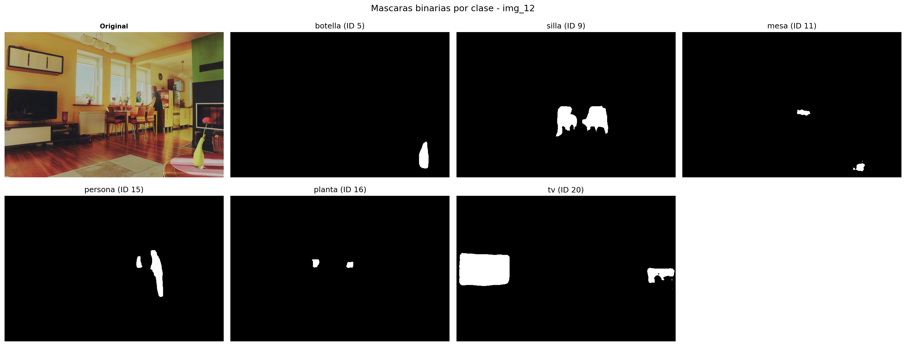
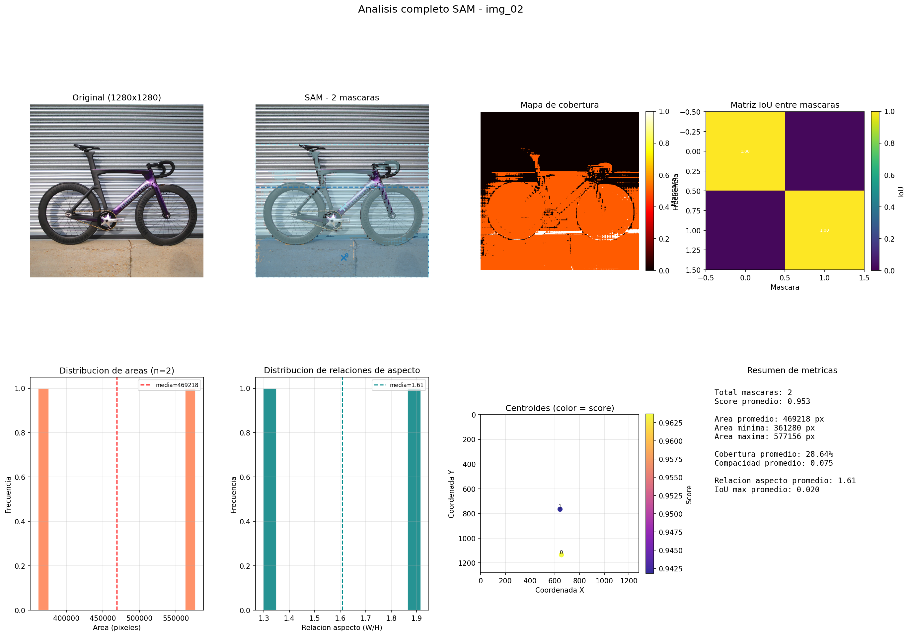
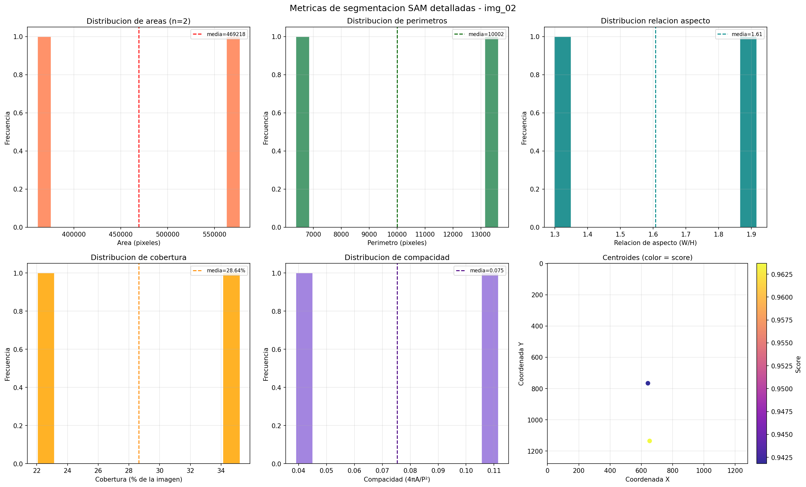
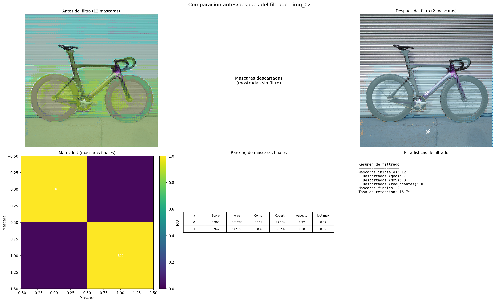
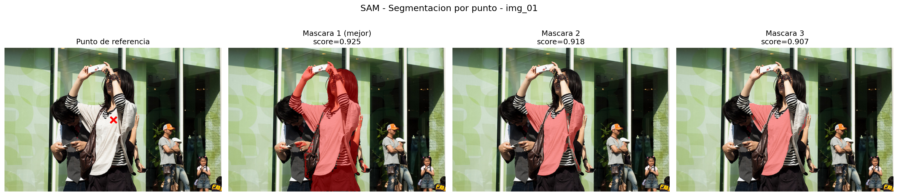
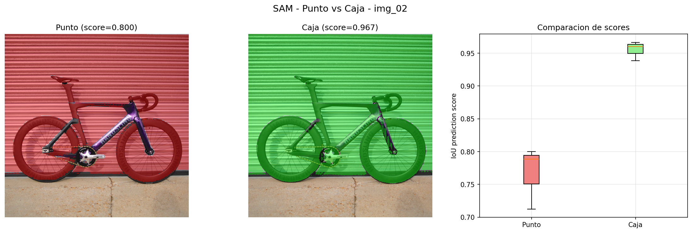
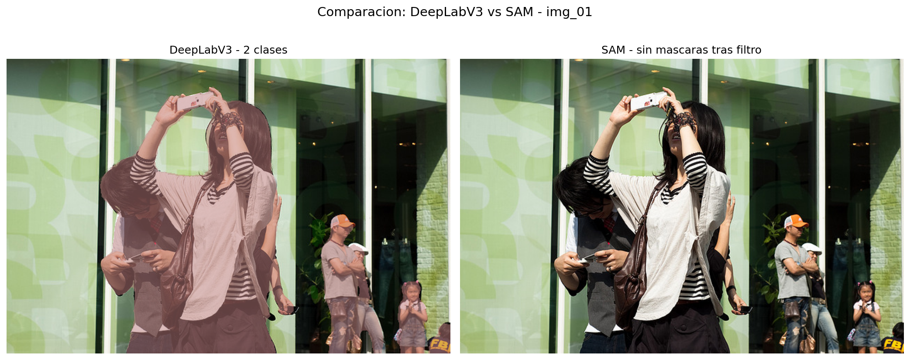
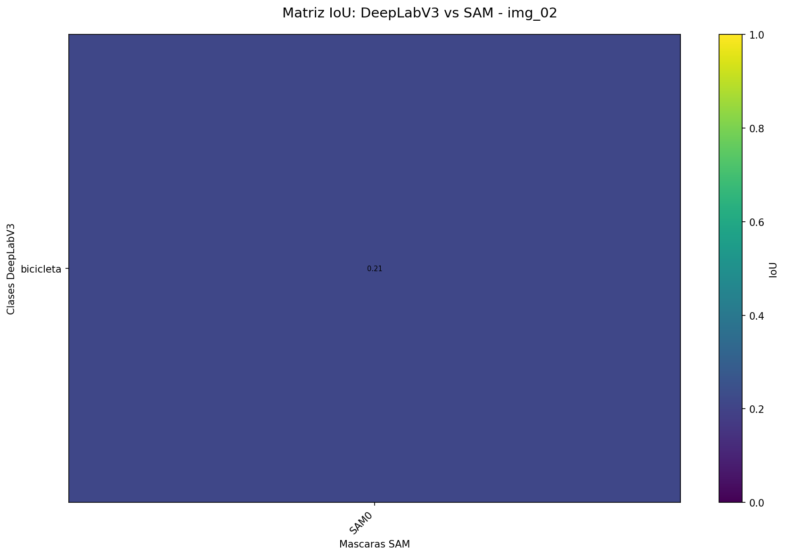
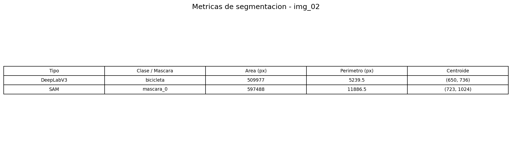

# Taller Segmentacion Semantica Multimodal: SAM y DeepLabV3

## Integrantes

- Juan David Buitrago Salazar
- Juan David Cardenas Galvis
- Nicolas Rodriguez Piraban
- Camilo Andres Medina Sanchez
- Juan Felipe Fajardo Garzon

## Fecha de entrega

`2026-05-22`

---

## Descripcion breve

Este taller implementa segmentacion semantica de imagenes utilizando dos modelos state-of-the-art: **DeepLabV3** (Google, basado en torchvision) y **SAM - Segment Anything Model** (Meta AI, via HuggingFace transformers). El objetivo es extraer y analizar regiones de interes a nivel de pixel, comparando las fortalezas y limitaciones de cada enfoque.

DeepLabV3 proporciona segmentacion semantica por clases predefinidas (21 categorias del dataset PASCAL VOC), mientras que SAM genera mascaras a nivel de instancia sin necesidad de clases predefinidas, soportando interaccion por puntos y cajas delimitadoras. Se procesaron 13 imagenes de prueba (12 del dataset COCO + 1 imagen local) y se calcularon metricas cuantitativas como area, perimetro, centroide e IoU entre metodos.

---

## Implementaciones

### Python

Se desarrollaron 5 scripts principales mas un modulo de utilidades compartidas y un script de descarga de datos:

1. **`01_deeplabv3_segmentation.py`**: Carga el modelo DeepLabV3-ResNet101 preentrenado y realiza segmentacion semantica sobre todas las imagenes. Genera visualizaciones con superposicion coloreada usando la paleta PASCAL VOC y mascaras binarias por clase detectada.

2. **`02_sam_auto_segmentation.py`**: Utiliza SAM con un grid de 16x16 puntos para generar mascaras automaticamente en toda la imagen. Aplica supresion de no-maximos (NMS) para eliminar redundancias. Produce visualizaciones compuestas, mascaras individuales y graficos de metricas (area, perimetro, centroide).

3. **`03_sam_interactive.py`**: Demuestra la segmentacion interactiva de SAM mediante dos modalidades: (a) punto central como referencia positiva, generando 3 mascaras candidatas con sus scores de confianza; (b) caja delimitadora calculada a partir de la mejor mascara obtenida por punto.

4. **`04_metrics_analysis.py`**: Ejecuta ambos modelos sobre las mismas imagenes, calcula metricas de segmentacion (area, perimetro, centroide) y genera una matriz de IoU cruzado entre las clases de DeepLabV3 y las mascaras de SAM.

5. **`05_batch_processing.py`**: Procesa 5 imagenes en lotes con ambos modelos, recolecta tiempos de inferencia y genera collages comparativos, graficos de rendimiento y resultados detallados por imagen.

El modulo `utils.py` contiene funciones compartidas para carga de imagenes, paleta de colores PASCAL VOC, superposicion de mascaras, calculo de metricas (area, perimetro, centroide, IoU) y guardado de figuras.

---

## Resultados visuales

Cada script genera salidas para **multiples imagenes de entrada** (13 imagenes en total), produciendo un total de **59+ archivos de resultados** en `media/python/`. En esta seccion se documenta una **muestra representativa** (2-3 imagenes por script) para ilustrar el funcionamiento de cada algoritmo. La tabla siguiente detalla la cantidad total de imagenes generadas por cada script:

| Script | Archivos generados | Descripcion |
|--------|-------------------|-------------|
| `01_deeplabv3_segmentation.py` | 26 (13 overviews + 13 mascaras binarias) | Una imagen por cada una de las 13 imagenes de entrada |
| `02_sam_auto_segmentation.py` | 12 (4 composites + 4 metricas + 4 resumenes finales) + comparacion filtrado | Procesa las primeras 4 imagenes |
| `03_sam_interactive.py` | 6 (2 point + 2 bbox + 2 comparison) | Procesa las primeras 2 imagenes |
| `04_metrics_analysis.py` | 8 (3 comparison + 3 tables + 2 heatmaps) | Procesa las primeras 3 imagenes |
| `05_batch_processing.py` | 7 (1 collage + 1 rendimiento + 5 detallados) | Procesa 5 imagenes en lote |
| **Total** | **59+** | |

Las imagenes mostradas a continuacion son una seleccion de este conjunto completo. Todos los archivos estan disponibles en `./media/python/`.

### Script 01: DeepLabV3 - Segmentacion Semantica


*La imagen de entrada (img_01.jpg, 640x426) muestra una escena al aire libre. DeepLabV3 asigna un color unico a cada una de las 21 clases predefinidas de PASCAL VOC que reconoce. En el panel central (mascara coloreada), el modelo pinta de rojo claro/rosado la region que clasifica como "persona" (32.8% de los pixeles de la imagen) y de verde oscuro la region "planta" (0.3%). El panel derecho superpone la mascara coloreada sobre la foto original con transparencia (alpha=0.5), permitiendo ver la segmentacion directamente sobre la escena.*



*Esta imagen muestra, ademas de la foto original como referencia visual, una mascara binaria independiente por cada clase que DeepLabV3 logro identificar en img_12.jpg (640x426, escena interior estilo restaurante/comedor). El modelo etiqueto 6 categorias: botella (0.6% de pixeles), silla (2.6%), mesa (0.3%), persona (1.2%), planta (0.3%) y tv/monitor (5.6%). Cada mascara binaria aparece en blanco sobre fondo negro, representando exactamente que pixeles pertenecen a cada categoria. La inclusion de la imagen original como primer panel permite comparar visualmente cada region segmentada con su correspondiente objeto en la escena. DeepLabV3 asigna etiquetas de forma independiente por pixel, por lo que objetos pequenos o lejanos pueden ocupar porcentajes bajos del area total.*

### Script 02: SAM - Segmentacion Automatica



*SAM genera mascaras a partir de un grid de 256 puntos organizados en lotes de 64. Cada lote genera 3 mascaras multimask, totalizando 12 mascaras crudas. El pipeline de filtrado aplica tres etapas secuenciales: (1) filtros geometricos — area entre 600 px y 75% de la imagen, cobertura entre 0.05% y 40%, relacion de aspecto W/H entre 0.5 y 3.5, compacidad minima de 0.03; (2) NMS con IoU=0.5 y score minimo 0.85; (3) filtro de redundancia inteligente que descarta mascaras con IoU > 0.85 conservando la de mejor calidad compuesta (score, compacidad e irregularidad perimetro/area). En img_02.jpg (bicicleta frente a puerta metalica corrugada), de 12 mascaras crudas: 7 descartadas por geometria, 3 por NMS, quedando 2 mascaras finales — el cuadro de la bicicleta y las ruedas — sin que las lineas horizontales de la puerta corrugada generen falsas detecciones.*



*Panel de metricas detalladas para img_02.jpg. Los histogramas muestran la distribucion de areas (con media marcada), perimetros, relacion de aspecto, cobertura y compacidad de las 2 mascaras finales. El grafico de centroides (inferior derecho) usa escala correcta (aspect ratio igual, ejes acotados a las dimensiones de la imagen) con color indicando el score de confianza SAM. La compacidad mide que tan irregular es cada mascara (1.0 = circulo); las mascaras de la puerta corrugada tienen compacidad < 0.03 y son descartadas automaticamente.*



*Comparacion lado a lado del efecto del pipeline de filtrado sobre img_02.jpg. El panel izquierdo superior muestra las 12 mascaras crudas superpuestas (muchas cubriendo la puerta corrugada). El panel derecho superior muestra solo las 2 mascaras finales (bicicleta). La matriz IoU en la parte inferior cuantifica el solapamiento entre mascaras finales. La tabla de ranking muestra para cada mascara: score SAM, area, compacidad, cobertura, relacion de aspecto e IoU maximo contra otras mascaras. El panel derecho inferior detalla cuantas mascaras fueron descartadas en cada etapa (geometrico: 7, NMS: 3) con una tasa de retencion de 16.7%.*

### Script 03: SAM - Segmentacion Interactiva



*En lugar de usar un grid automatico, esta vez se le indica a SAM un solo punto de referencia (marcado con una X roja en la imagen img_01.jpg, donde aparecen varias personas al aire libre). A partir de ese punto, SAM genera 3 posibles interpretaciones de mascara (multimask output). La primera (score 0.990) delimita la camiseta de la persona principal. La segunda y tercera son variantes que incluyen mas o menos area del contorno de la persona. Esto se debe a que SAM siempre produce 3 hipotesis para cubrir la ambiguedad de que exactamente quiere segmentar el usuario. El panel izquierdo muestra donde se hizo clic, y los tres paneles siguientes muestran cada hipotesis superpuesta en rojo semitransparente sobre la foto.*



*A partir de la mejor mascara obtenida por punto en img_02.jpg (bicicleta frente a puerta metalica corrugada de garaje), se calcula automaticamente una caja delimitadora que la envuelve. Luego se usa esa caja como segundo prompt para SAM. Los dos paneles izquierdos comparan la mejor mascara obtenida con punto (rojo) versus la mejor obtenida con caja (verde). El boxplot de la derecha muestra que los scores de las 3 mascaras generadas por caja son mas altos que los obtenidos por punto, lo que indica que dar una caja como referencia reduce la ambiguedad para SAM al restringir la region de busqueda.*

### Script 04: Metricas y Analisis Comparativo



*La misma imagen img_01.jpg (personas al aire libre) procesada por ambos modelos lado a lado. A la izquierda, DeepLabV3 colorea la region que clasifica como "persona" (rojo claro/rosado) y una pequena porcion como "planta" (verde oscuro). A la derecha, SAM segmenta por instancias con colores aleatorios: distintas regiones de las personas y sus prendas aparecen como mascaras separadas. La diferencia fundamental es visible: DeepLabV3 etiqueta semanticamente cada pixel (que objeto ES: persona, planta), mientras que SAM separa objetos individuales (que objeto ESTA AHI) sin decir que son.*



*Esta matriz cuantifica el solapamiento entre las regiones que detecta DeepLabV3 y las que detecta SAM en img_02.jpg (bicicleta frente a puerta metalica corrugada). Cada celda contiene el IoU entre la clase de DeepLabV3 (fila: bicicleta) y la mascara de SAM (columna: 1 mascara). El color mas intenso indica mayor solapamiento. La clase "bicicleta" de DeepLabV3 alcanza IoU=0.212 con la unica mascara de SAM que sobrevivio al filtro geometrico. Este IoU moderado se debe a que DeepLabV3 clasifica la bicicleta completa, mientras que SAM tiende a segmentar solo la porcion central de mayor confianza. Las otras 5 mascaras crudas de SAM fueron descartadas por filtros de cobertura (>40% de la imagen) o compacidad insuficiente (<0.01), correspondiendo a regiones de la puerta corrugada del fondo.*



*Tabla numerica que desglosa cada region detectada por ambos metodos en img_02.jpg (bicicleta frente a garaje). Para cada region se muestra: tipo (DeepLabV3 o SAM), nombre de la clase o numero de mascara, area en pixeles (que indica que tan grande es la region en la imagen), perimetro en pixeles (longitud del borde), y coordenadas (x, y) del centroide (el punto central de la region). DeepLabV3 detecta la clase "bicicleta" ocupando ~520,000 pixeles (~31.7% de la imagen), mientras que la unica mascara de SAM que supero los filtros geometricos ocupa ~291,000 pixeles. Las demas mascaras crudas de SAM fueron descartadas por cubrir mas del 40% de la imagen (fondos de la puerta corrugada) o tener compacidad inferior a 0.01.*

### Script 05: Procesamiento por Lotes


*Collage que reune los resultados de 5 imagenes procesadas secuencialmente con el pipeline de filtrado mejorado. Cada celda muestra la superposicion de mascaras de SAM sobre la foto original, junto con el numero de clases detectadas por DeepLabV3 y la cantidad de mascaras que SAM retuvo tras los filtros geometricos (cobertura < 40%, compacidad > 0.01, relacion de aspecto 0.2-5.0, NMS con IoU=0.5). Las 5 imagenes son: img_01 (personas al aire libre: 2 clases DL, 1 mascara SAM), img_02 (bicicleta frente a puerta metalica corrugada: 1 clase DL, 1 mascara SAM), img_03 (oso pardo/sin clase DL: 0 mascaras SAM, fondo texturado descartado), img_04 (persona esquiando: 1 clase DL, 0 mascaras SAM) e img_05 (escena interior con silla y planta: 2 clases DL, 2 mascaras SAM).*


*Graficos que comparan el rendimiento de ambos modelos en las mismas 5 imagenes. Arriba izquierda: tiempo de inferencia por imagen (DeepLabV3 tarda ~0.2s, SAM tarda ~0.9s en GPU RTX 2050). Arriba derecha: cantidad de clases detectadas por DeepLabV3 vs mascaras de SAM tras filtros geometricos (1-2 mascaras tipicamente, ya que los fondos texturados como puertas corrugadas son eliminados por cobertura y compacidad). Abajo izquierda: grafico de correlacion que muestra que SAM retiene mascaras solo cuando estas pasan los filtros de calidad. Abajo derecha: resumen estadistico del lote con promedios.*

---

## Codigo relevante

### Segmentacion con DeepLabV3

```python
model = models.segmentation.deeplabv3_resnet101(pretrained=True).to(device)
model.eval()

preprocess = transforms.Compose([
    transforms.ToPILImage(),
    transforms.Resize(520),
    transforms.ToTensor(),
    transforms.Normalize(mean=[0.485, 0.456, 0.406], std=[0.229, 0.224, 0.225]),
])

input_tensor = preprocess(image_rgb).unsqueeze(0).to(device)
with torch.no_grad():
    output = model(input_tensor)['out']
output_predictions = output.argmax(1).squeeze().detach().cpu().numpy()
```

**Explicacion**: DeepLabV3 es un modelo de segmentacion semantica basado en una ResNet101 con "atrous convolution" (convoluciones con agujeros) que permite extraer caracteristicas a multiples escalas sin perder resolucion. El codigo carga el modelo preentrenado en el dataset COCO con las 21 clases de PASCAL VOC, lo pone en modo evaluacion (`eval()` desactiva dropout/batch norm), y define un pipeline de preprocesamiento que redimensiona la imagen a 520px, la convierte a tensor y la normaliza con los estadisticos de ImageNet (necesarios porque el modelo fue entrenado con esas medias y desviaciones). La inferencia se ejecuta sin calcular gradientes (`torch.no_grad()`). DeepLabV3 devuelve un mapa de activaciones de forma `[1, 21, H, W]` donde 21 es el numero de clases; `argmax(1)` selecciona la clase con mayor probabilidad para cada pixel, produciendo una mascara de etiquetas enteras del mismo alto y ancho que la imagen original.

### Segmentacion automatica con SAM (grid de puntos)

```python
from transformers import SamModel, SamProcessor

processor = SamProcessor.from_pretrained("facebook/sam-vit-base")
model = SamModel.from_pretrained("facebook/sam-vit-base").to(device)

xs = np.linspace(0, w - 1, grid_size, dtype=int)
ys = np.linspace(0, h - 1, grid_size, dtype=int)
grid_pts = [[float(x), float(y)] for y in ys for x in xs]
labels = [1] * len(grid_pts)

inputs = processor(img_small, input_points=[grid_pts],
                   input_labels=[labels], return_tensors="pt").to(device)
with torch.no_grad():
    outputs = model(**inputs)

masks = processor.image_processor.post_process_masks(
    outputs.pred_masks.cpu(), inputs["original_sizes"].cpu(),
    inputs["reshaped_input_sizes"].cpu()
)[0].numpy()
```

**Explicacion**: A diferencia de DeepLabV3, SAM es un modelo "promptable" que segmenta cualquier objeto a partir de puntos, cajas o mascaras de referencia. Para hacerlo funcionar sin intervencion humana, se genera un grid regular de puntos que cubre toda la imagen. Cada punto se marca como "foreground" (etiqueta `1`), indicando a SAM que debe segmentar el objeto en esa ubicacion. El `SamProcessor` se encarga de normalizar la imagen y empaquetar los puntos en el formato tensorial que espera el modelo. SAM devuelve 3 mascaras candidatas por cada punto (multimask), cada una con un score de confianza estimado. `post_process_masks` redimensiona las mascaras desde la resolucion interna del modelo (que opera sobre la imagen reescalada) hasta las dimensiones originales de la imagen de entrada.

### Supresion de no-maximos (NMS) para mascaras

```python
def non_max_suppression(masks, scores, iou_threshold=0.7, score_threshold=0.85):
    flat_scores = scores.flatten()
    sorted_idxs = np.argsort(flat_scores)[::-1]
    keep = []
    for idx in sorted_idxs:
        if flat_scores[idx] < score_threshold:
            continue
        keep_iou = True
        for k in keep:
            if compute_iou(masks[idx], masks[k]) > iou_threshold:
                keep_iou = False
                break
        if keep_iou:
            keep.append(idx)
    return keep
```

**Explicacion**: Con un grid de 256 puntos y 3 mascaras por punto, SAM produce 768 mascadas candidatas por imagen, la mayoria redundantes (muchos puntos caen sobre el mismo objeto). Esta funcion filtra las mascaras repetidas y de baja calidad en dos pasos: primero descarta aquellas con score de confianza menor a 0.85; luego ordena las restantes por score de mayor a menor y solo conserva una mascara si su IoU (Intersection over Union, la fraccion de solapamiento entre dos mascaras) con todas las ya aceptadas es menor a 0.7. El umbral de IoU controla que tan diferentes deben ser dos mascaras para considerarse distintas: 0.7 significa que dos mascaras pueden solaparse hasta un 70% antes de que una sea descartada como redundante.

---

## Prompts utilizados

```
"Implementa un script en Python que cargue DeepLabV3-ResNet101 de torchvision y 
genere visualizaciones de segmentacion semantica con la paleta de colores PASCAL VOC"

"Crea una funcion que genere un grid de puntos para SAM y filtre las mascaras 
redundantes usando supresion de no-maximos con umbral de IoU"

"Implementa segmentacion interactiva con SAM usando puntos y cajas delimitadoras, 
mostrando las 3 mascaras candidatas con sus scores de confianza"

"Calcula metricas de segmentacion (area, perimetro, centroide) para las regiones 
detectadas por DeepLabV3 y SAM, y genera una matriz de IoU cruzado entre metodos"

"Procesa un lote de 5+ imagenes con ambos modelos, recolecta tiempos de inferencia 
y genera graficos comparativos de rendimiento"
```

---

## Aprendizajes y dificultades

### Aprendizajes

Este taller permitio comprender en profundidad las diferencias fundamentales entre la segmentacion semantica clasica (DeepLabV3, basada en clasificacion por pixel con categorias predefinidas) y la segmentacion por instancias con modelos foundation (SAM, basada en atencion y prompts). DeepLabV3 demuestra ser eficiente (0.24s por imagen en GPU) y proporciona etiquetas semanticas interpretables, pero limitado a 21 clases predefinidas. SAM, aunque mas lento (0.89s por imagen), ofrece una granularidad mucho mayor al poder segmentar cualquier objeto sin necesidad de entrenamiento previo, y su capacidad interactiva (puntos/cajas) lo hace ideal para aplicaciones donde se requiere intervencion del usuario.

Se desarrollo un pipeline de filtrado en tres etapas (geometrico + NMS + redundancia inteligente) que hace a SAM robusto frente a fondos texturados industrialmente, como puertas metalicas corrugadas. Los filtros geometricos de cobertura (< 40% de la imagen), compacidad (> 0.03), relacion de aspecto (0.5-3.5) y area (600 px - 75% de la imagen) eliminan eficazmente las mascaras generadas por texturas repetitivas. La redundancia inteligente descarta mascaras con IoU > 0.85 conservando la de mejor calidad compuesta (score + compacidad + irregularidad perimetro/area). Las metricas adicionales (compacidad, cobertura, relacion de aspecto, irregularidad perimetro/area, IoU entre mascaras) proporcionan informacion mas completa que area y perimetro por si solos. La visualizacion de comparacion antes/despues permite inspeccionar el efecto del pipeline sobre cada imagen.

### Dificultades

La principal dificultad fue la integracion de SAM a traves de la libreria transformers de HuggingFace, ya que la API difiere significativamente del repositorio original de Meta. Fue necesario comprender el formato esperado de los tensores de entrada (puntos como listas de floats, no arrays numpy) y manejar correctamente las dimensiones de salida (3 mascaras por punto debido a multimask_output). La gestion de resoluciones tambien presento desafios: SAM opera internamente a 640x640 mientras que las imagenes originales son de hasta 1280x1280, requiriendo reescalado de mascaras. La supresion de no-maximos para mascaras 2D requirio una implementacion personalizada. Adicionalmente, fondos con texturas repetitivas (como puertas metalicas corrugadas) generaban mascaras espurias que fue necesario eliminar mediante filtros geometricos de cobertura, compacidad y relacion de aspecto, ademas del NMS estandar.

### Mejoras futuras

Se podria extender el proyecto con: (a) implementacion de segmentacion por video usando SAM-tracking, (b) cuantizacion de los modelos para inferencia en tiempo real, (c) integracion de Grounding DINO para generar prompts textuales automaticos para SAM, y (d) una interfaz web interactiva para explorar los resultados.

---

## Contribuciones grupales

Todos los integrantes colaboraron en todas las etapas del desarrollo. A continuacion se destacan las areas donde cada miembro aporto particularmente:

- **Juan David Buitrago Salazar**: Implementacion del script de DeepLabV3 y configuracion del pipeline de preprocesamiento.
- **Juan David Cardenas Galvis**: Desarrollo del modulo de utilidades compartidas (utils.py) y la visualizacion de mascaras.
- **Nicolas Rodriguez Piraban**: Implementacion de SAM interactivo con puntos y cajas delimitadoras.
- **Camilo Andres Medina Sanchez**: Calculo de metricas de segmentacion (area, perimetro, centroide, IoU) y generacion de matrices de comparacion.
- **Juan Felipe Fajardo Garzon**: Procesamiento por lotes, generacion de collages y graficos de rendimiento comparativo.

---

## Estructura del proyecto

```
semana_11_3_segmentacion_semantica_sam_deeplab/
├── python/
│   ├── requirements.txt
│   ├── utils.py
│   ├── download_images.py
│   ├── 01_deeplabv3_segmentation.py
│   ├── 02_sam_auto_segmentation.py
│   ├── 03_sam_interactive.py
│   ├── 04_metrics_analysis.py
│   ├── 05_batch_processing.py
│   └── .venv/
├── media/
│   ├── input/
│   │   ├── img_01.jpg
│   │   ├── img_02.jpg
│   │   ├── img_03.jpg
│   │   ├── img_04.jpg
│   │   ├── img_05.jpg
│   │   ├── img_06.jpg
│   │   ├── img_07.jpg
│   │   ├── img_08.jpg
│   │   ├── img_09.jpg
│   │   ├── img_10.jpg
│   │   ├── img_11.jpg
│   │   ├── img_12.jpg
│   │   └── img_13.jpg
│   └── python/
│       └── (59+ archivos de resultados — ver tabla en Resultados visuales)
├── semana_11_3_segmentacion_semantica_sam_deeplab.md
├── 04_plantilla_readme_entregas_talleres.md
└── README.md
```

---

## Referencias

- DeepLabV3: "Rethinking Atrous Convolution for Semantic Image Segmentation" - Chen et al. (https://arxiv.org/abs/1706.05587)
- SAM: "Segment Anything" - Kirillov et al., Meta AI (https://arxiv.org/abs/2304.02643)
- Documentacion de torchvision: https://pytorch.org/vision/stable/models.html
- Documentacion de HuggingFace Transformers (SAM): https://huggingface.co/docs/transformers/model_doc/sam
- Dataset COCO: "Microsoft COCO: Common Objects in Context" - Lin et al. (https://cocodataset.org/)
- Dataset PASCAL VOC: http://host.robots.ox.ac.uk/pascal/VOC/
