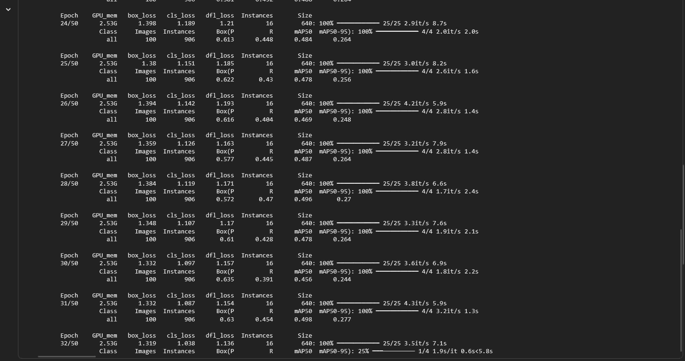
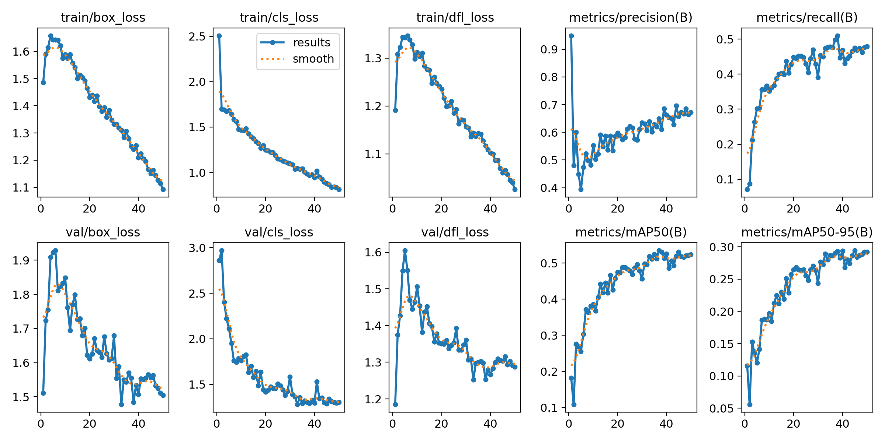
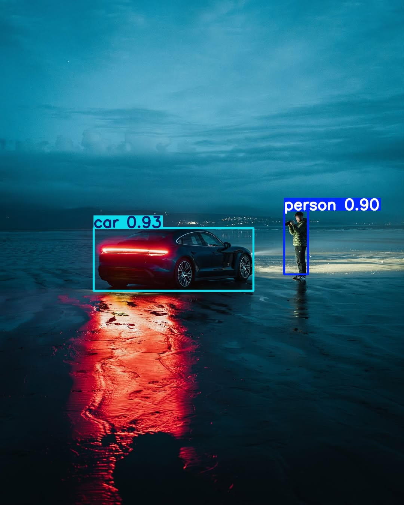

# Transfer Learning con YOLO: Detección de Objetos Personalizada

## Integrantes

- Juan David Buitrago Salazar
- Juan David Cardenas Galvis
- Nicolas Rodriguez Piraban
- Camilo Andres Medina Sanchez
- Juan Felipe Fajardo Garzon

## Fecha de Entrega
`2026-05-25`

---

## Descripcion Breve

En este taller se implementó un sistema de detección de objetos personalizado utilizando
transfer learning con el modelo YOLOv8. Se desarrollo todo el pipeline desde la
preparación del dataset hasta el entrenamiento, evaluación, uso y exportación
del modelo entrenado para detectar las clases especificas de carro y persona.

---

## Implementaciones

### Python / Ultralytics YOLOv8

El flujo de trabajo completo incluye:

1. **Preparacion del dataset personalizado**:
   - Organización en formato YOLO (images/train, images/val, labels/train, labels/val)
   - Etiquetado de 500 imágenes del set público COCO
   - Creación del archivo data.yaml con configuración de clases y paths

2. **Carga de modelo preentrenado y transfer learning**:
   - Inicializacion de YOLOv8n 
   - Entrenamiento con fine-tuning de capas finales usando el dataset personalizado
   - Configuracion de hiperparametros: epochs=50, imgsz=640, batch=16

3. **Evaluacion del modelo entrenado**:
   - Ejecucion de validacion para obtener metricas (mAP, Precision, Recall)
   - Visualizacion de curvas de entrenamiento y resultados

4. **Inferencia y predicciones**:
   - Carga del mejor modelo entrenado (best.pt)
   - Predicciones en imagenes de prueba nuevas

---

## Resultados visuales

### Python - Implementacion



El entrenamiento del modelo, como ya se mencionó, usa los hiperparametros: epochs=50, 
imgsz=640, batch=16. Esto implica que se realizan 50 generaciones, usando las imágenes
con un tamaño de 640, y lotes de 16 imágenes. El gif muestra el progreso de algunas
de las épocas de entrenamiento.



Al finalizar el entrenamiento del modelo, se muestran las gráficas del proceso, incluyendo
loss, mAP, y precisión del modelo a lo largo de las 50 epocas.

Para probar el modelo se usó la siguiente imágen:

- [`Test.jpg`](./media/Test.jpg)



El resultado fue que logra detectar correctamente a la persona y el carro en la imágen.
Muestra las bounding boxes respectivas y las etiquetas de clases detectadas.

---

## Codigo relevante

### Ejemplo de carga y entrenamiento del modelo

```python
# Cargar modelo preentrenado YOLOv8
model = YOLO('yolov8n.pt')  # puede ser yolov8s.pt o yolov8m.pt

# Entrenar con transfer learning usando nuestro dataset
model.train(
    data='data.yaml',      # archivo de configuracion del dataset
    epochs=50,             # numero de epocas de entrenamiento
    imgsz=640,             # tamaño de imagen de entrada
    batch=16               # tamaño del batch
)
```

### Ejemplo de evaluacion y predicciones

```python
model = YOLO('runs/detect/train-2/weights/best.pt')
results = model('/content/Test.jpg', save=True)
display(Image.open('/content/runs/detect/predict/Test.jpg'))
```

### Ejemplo del archivo data.yaml

```yaml
names:
   0: person 
   1: car 

path: /content/coco_dataset 
train: ./images/train/ 
val: ./images/val/
```

---

## Prompts utilizados

No se utilizó inteligencia artificial para la realización de este taller.

---

## Aprendizajes y dificultades

Este taller permitió entender de manera práctica cómo funciona el proceso
de transfer learning utilizando YOLOv8 para detección de objetos. Se trabajó
con un subconjunto del dataset COCO, enfocado en las clases person y car,
preparando el dataset en formato YOLO para poder entrenar el modelo correctamente
en Google Colab.

Durante el desarrollo se aprendió cómo organizar datasets para entrenamiento y
validación, exportarlos al formato esperado por YOLO y utilizar modelos preentrenados
para acelerar el entrenamiento. También se comprendió cómo realizar inferencias sobre
nuevas imágenes y visualizar las bounding boxes generadas por el modelo.

Una de las principales dificultades fue la preparación del dataset y la configuración
inicial del entorno, especialmente al exportar los splits de entrenamiento y validación
con FiftyOne y asegurarse de que ambos utilizaran la misma lista de clases. También hubo
algunos problemas al visualizar las predicciones en Colab, ya que funciones como show=True
no funcionan igual que en un entorno local.