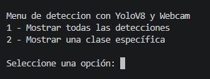
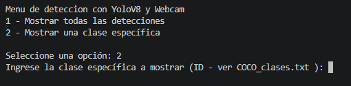

# Taller - Detección de Objetos en Tiempo Real con YOLOv8 y Webcam
## Nombres: 

- Juan David Buitrago Salazar
- Juan David Cardenas Galvis
- Nicolás Rodríguez Piraban
- Camilo Andres Medina Sanchez
- Juan Felipe Fajardo Garzón

## Fecha de entrega: 22/05/2026

## Descripción breve:
Este taller consistió en implementar un sistema de detección de objetos en tiempo real utilizando YOLOv8 (modelo preentrenado nano) y la webcam del computador. Se creó un menú interactivo que permite visualizar todas las detecciones o filtrar por una clase específica de interés.

## Implementaciones:

### Python:
Se desarrolló un script que captura video de la webcam, lo procesa con el modelo YOLOv8n preentrenado y muestra las detecciones en tiempo real con bounding boxes y etiquetas. Se implementó un menú que permite elegir entre ver todas las detecciones o una clase específica. También se calculó y mostró los FPS en pantalla para monitorear el rendimiento. 

## Resultados Visuales
Apenas se inicia el programa se tiene el menu de "selección de modo", el cual permite filtrar las detecciones de yolo, con el objetivo de poder decidir entre mostrar todas las detecciones, o solo las de clases específicas



En caso de elegir la segunda opción, se le solicitará al ususario que ingrese el ID de la clase que desea ver, para los IDs de las clases, ver el archivo [coco_clases.txt](python/coco_clases.txt)



Luego de digitar el ID de la clase o elegir la opción 1, se desplega una ventana con el video de la webcam en tiempo real, además de las detecciones realizadas por YoloV8

A continuacion se presenta en ejemplo de la detección filtrando por el ID de clase 1 (bicicleta)


Ahora se presentan todas las detecciones realizadas por YOLO en la webcam


Se puede evidenciar que el cálculo de FPS ronda los 20 +- 2 FPS, lo que significa que la visualización de las detecciones se presenta de manera fluida


## Código relevante:

Primeramente se tiene el fragmento de código que genera un menú simple por consola

```python
print("\nMenu de deteccion con YoloV8 y Webcam")
print("1 - Mostrar todas las detecciones")
print("2 - Mostrar una clase específica")
opcion = int(input("\nSeleccione una opción: "))
```

Luego de esto se carga el modelo de YOLO, se inicia la captura de la webcam (verificando que se haya iniciado correctamente)

```python
model = YOLO('yolov8n.pt')
# Iniciar la captura de la webcam
cap = cv2.VideoCapture(0)

# verificar si la cámara se abrió correctamente
if not cap.isOpened():
    print("No se pudo abrir la cámara o el video.")
    raise SystemExit
```

Se inicia un ciclo `while True` el cual únicamente finaliza cuando que el usuario presione la telcla q
```python
if cv2.waitKey(1) & 0xFF == ord('q'):
        break
```
Durante este ciclo se realiza la obtención del frame, se calcula los FPS y se realiza la detección según la opción elegida por el usuario
```python
ret, frame = cap.read()
```
El núcleo del sistema de detección utiliza el método `predict()` de  para procesar cada frame y luego `plot()` para dibujar las detecciones:

```python
# Realizar la detección de objetos utilizando el modelo YOLOv8
results = model.predict(frame, imgsz=640)

# Dibujar los bounding boxes y etiquetas en la imagen
test_image = results[0].plot(line_width=2)
```

Para filtrar por clase específica, se pasa el parámetro `classes` con el ID deseado:

```python
results = model.predict(frame, imgsz=640, classes=[int(clase_especifica)])
```

## Prompts utilizados:

No se hizo uso de IA generativa

## Aprendizajes y dificultades:
Este taller permitió comprender cómo funcionan los modelos de detección de objetos preentrenados y su aplicación en tiempo real. Fue clave entender cómo filtrar detecciones por clase específica, lo cual es útil para aplicaciones como seguimiento de personas o vehículos en específico.

La principal dificultad fue ajustar el rendimiento para lograr una detección fluida, ya que el procesamiento de video en tiempo real puede ser demandante dependiendo del hardware disponible.