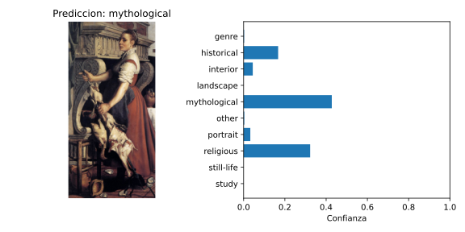
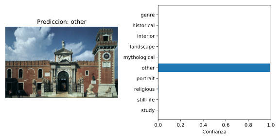
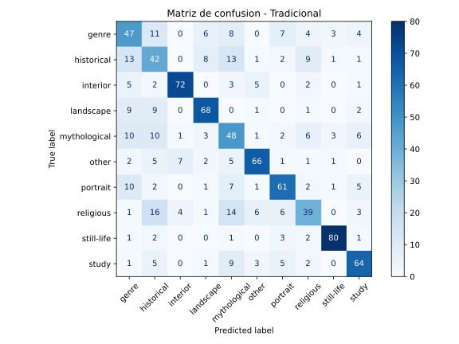
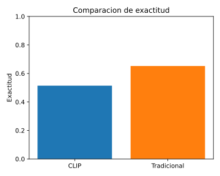

# Taller Clasificación Asistida Texto Imagen Clip

## Integrantes del grupo

- Juan David Buitrago Salazar
- Juan David Cardenas Galvis
- Juan Felipe Fajardo Garzon
- Camilo Andres Medina Sanchez
- Nicolas Rodriguez Piraban

## Fecha de entrega

2026-05-29

---

## Descripción breve

El experimento consistió en enfrentar dos paradigmas distintos de Inteligencia Artificial aplicados a la Visión por Computadora, utilizando un subconjunto del dataset **ART500K** enfocado en 10 géneros pictóricos clásicos (religioso, retrato, paisaje, mitológico, escenas de género, bodegones, estudios, interiores, histórico y otros).

**Contendiente 1 (El paradigma clásico):** Un pipeline tradicional de Machine Learning que utiliza **ResNet18** preentrenada únicamente como extractor de características visuales (geometría, texturas, bordes), acoplada a una Máquina de Vectores de Soporte (**SVM**) con kernel lineal y pesos balanceados que aprende a clasificar esos vectores.

**Contendiente 2 (El paradigma moderno):** **CLIP** de OpenAI, un modelo fundacional *Zero-Shot* que no requiere entrenamiento previo sobre los datos del dataset, sino que calcula la similitud semántica entre el contenido visual de la imagen y una serie de descripciones de texto (prompts) diseñadas manualmente.

A lo largo del desarrollo se enfrentaron dos problemas centrales: el **desbalance extremo** del dataset (que obligaba al modelo tradicional a predecir siempre la clase mayoritaria) y la **ambigüedad semántica** de las etiquetas literales para CLIP (que requirió técnicas de prompt engineering). Los resultados finales muestran que el modelo tradicional superó a CLIP (~65% frente a ~55% de exactitud), aunque CLIP demostró una capacidad notable de razonamiento zero-shot al alcanzar ese porcentaje sin haber visto jamás una imagen del dataset.

---

## Implementaciones

### Python

El script principal `python/clip_vs_traditional.py` integra ambos pipelines en un único flujo de ejecución, utilizando las siguientes herramientas:

- **PyTorch y torchvision**: para cargar CLIP (ViT-B/32) y ResNet18 con pesos preentrenados.
- **scikit-learn**: para la SVM (`SVC` kernel lineal con `class_weight="balanced"`), la partición train/test con estratificación y las métricas de evaluación (accuracy, matriz de confusión).
- **Pillow (PIL)**: para la carga y preprocesamiento de imágenes.
- **Matplotlib**: para generar los gráficos de salida (matriz de confusión, barras de comparación, visualizaciones de confianza de CLIP).
- **tqdm**: para barras de progreso durante la extracción de features y evaluación.

#### Pipeline CLIP (Zero-Shot)

1. Se carga el modelo `ViT-B/32` preentrenado de OpenAI.
2. Se diseñan **prompts descriptivos** que inyectan contexto de historia del arte. Inicialmente se usaron las etiquetas literales del dataset (como `"genre"` o `"other"`), pero CLIP, al ser un modelo entrenado con lenguaje natural, no interpretaba correctamente esas palabras aisladas. La solución fue reemplazar cada etiqueta por una descripción rica en matices semánticos:

   | Clase original | Prompt descriptivo |
   |----------------|--------------------|
   | genre | "a classic painting depicting a scene of everyday ordinary life and common people working" |
   | other | "an uncategorized artwork, historical artifact, manuscript, or photograph of classical architecture" |
   | religious | "a classical painting depicting a religious, divine, or biblical scene" |
   | portrait | "a classical portrait painting of a person's face and upper body" |
   | landscape | "a landscape painting showing nature, trees, mountains, or countryside" |
   | mythological | "a painting depicting ancient mythology, gods, goddesses, or mythical legends" |
   | still-life | "a still-life painting of inanimate objects like fruit, flowers, or vessels on a table" |
   | study | "an artistic sketch, unfinished draft, or visual study of a subject" |
   | historical | "a dramatic painting depicting a significant historical event, battle, or real-world moment" |
   | interior | "a painting showing the indoor interior of a room, hall, or building" |

    Para las clases que no están en el diccionario `PROMPTS_POR_CLASE`, se usa la plantilla genérica: `"an artwork depicting {label}"`.

3. Se tokenizan los prompts textuales usando `clip.tokenize()`.
4. Se codifican tanto los textos como cada imagen de test mediante `encode_text()` y `encode_image()`.
5. Se normalizan los embeddings y se calcula la similitud coseno entre la imagen y cada prompt.
6. La clase con mayor probabilidad (softmax) se selecciona como prediccion.

#### Pipeline Tradicional (ResNet18 + SVM)

1. Se carga ResNet18 con pesos `DEFAULT` (ImageNet) y se reemplaza la capa fully-connected por `torch.nn.Identity()` para usarla exclusivamente como extractor de descriptores visuales.
2. Se extraen los vectores de características (512-dimensionales) de todas las imágenes de entrenamiento y prueba.
3. Se entrena una SVM con kernel lineal y `class_weight="balanced"` sobre los features de entrenamiento.
4. Se predicen las etiquetas del conjunto de prueba.

#### Mecanismo de Undersampling contra el Desbalance

El dataset ART500K presenta un desbalance extremo: la clase `religious` tiene órdenes de magnitud más muestras que `still-life` o `interior`. Sin intervención, la SVM encuentra un atajo estadístico: predecir la clase mayoritaria asegura un accuracy engañosamente alto, pero la matriz de confusión demuestra que el modelo no aprende nada útil de las clases minoritarias.

Para resolverlo, se implementó un **undersampling** en la función `listar_imagenes()`: se define la constante `MAX_MUESTRAS_POR_CLASE = 300` y se limita la cantidad de muestras por clase durante la lectura del CSV. Esto fuerza un equilibrio que permite a la SVM aprender fronteras de decisión reales entre todas las clases.

Además, el script genera un archivo `media/registro_dataset.csv` que documenta exactamente qué imágenes se usaron en cada fase (Train/Test), incluyendo clase real y nombre de archivo, para garantizar la reproducibilidad del experimento.

### Nota sobre el dataset en este repositorio

Este repositorio **no incluye todas las imágenes originales** usadas durante los experimentos.
Para trazabilidad y reproducibilidad, se incluyen archivos `.csv` con el detalle de las muestras y sus fuentes:

- `media/registro_dataset.csv`: lista de imágenes usadas en entrenamiento y prueba.
- `media/input/toy_dataset_label.csv`: metadatos del dataset original (incluyendo información de procedencia/fuente).

---

## Resultados visuales

### CLIP (texto + imagen)



**Imagen: La mujer en la cocina (image_609c15.png) - El "Efecto Halo" de CLIP**

Se trata de una pintura de estilo clásico caracterizada por un fuerte contraste entre luces y sombras (claroscuro). La figura central es una mujer joven que está de pie, viste ropa tradicional de época que incluye una blusa blanca de mangas abullonadas, un corpiño oscuro ajustado y una falda amplia de tono cobrizo o rojizo. En sus manos sostiene un espetón o asador metálico largo en el cual están ensartadas varias aves de corral desplumadas y crudas. Detrás de ella destaca una imponente y elaborada estructura de piedra tallada con volutas y decoraciones clásicas, que aparenta ser el marco de una gran chimenea señorial. En la parte inferior de la escena, sobre el suelo oscuro, se logran distinguir algunos utensilios domésticos como vasijas, platos y ollas metálicas.

**Rol en el experimento:** Es la pintura de la clase `genre` (escena costumbrista) que **engaña a CLIP** debido a su iluminación y estética de alto dramatismo. A pesar de ser una escena cotidiana de cocina, CLIP la clasifica como `mythological` o `religious` porque prioriza el estilo visual dramático (claroscuro barroco, ropa antigua, arquitectura ornamentada) sobre la acción representada (desplumar aves). Para la mente probabilística de CLIP, esa estética pesa más que la acción doméstica, revelando un sesgo cultural heredado de su entrenamiento masivo en internet.



**Imagen: El edificio clasico - Exito del prompt engineering**

Es una fotografía diurna a todo color que muestra un gran cielo azul con nubes blancas y esponjosas. El sujeto principal es un complejo arquitectónico histórico de ladrillo rojo, que presenta las características visuales del famoso Arsenal de Venecia. El punto focal es una entrada monumental tipo arco de triunfo, construida en mármol blanco brillante, adornada con varias esculturas de figuras humanas y coronada por un gran relieve de un león alado. A nivel del suelo, flanqueando la entrada principal tras unas rejas, descansan varias estatuas de piedra con forma de leones sentados. Hacia el lado derecho de la fachada se erige una recia torre cuadrada de ladrillo que contiene un reloj de esfera blanca y un pequeño campanario en la cima.

**Rol en el experimento:** Es la imagen etiquetada originalmente en el dataset como `other` (otros), pero que por su clara estética monumental, CLIP predecía instintivamente como `historical`. Este caso ilustra el éxito del prompt engineering: al definir la clase `other` con una descripción que incluye explícitamente "photograph of classical architecture", CLIP logró catalogarla correctamente como `other`, algo que antes fallaba porque el modelo forzaba por descarte la pertenencia a `historical`.

### Clasificador tradicional (ResNet18 + SVM)



Matriz de confusión del clasificador tradicional (ResNet18 + SVM) tras aplicar undersampling. La diagonal principal es sólida y consistente: 80 aciertos en `still-life`, 72 en `interior`, 68 en `landscape`, 66 en `other`, 48 en `mythological`, 42 en `historical`, etc. Esto demuestra que, una vez balanceadas las clases, el clasificador aprendió efectivamente a distinguir los patrones geométricos y texturas reales de cada género pictórico. Los errores fuera de la diagonal son relativamente bajos y se concentran en pares semánticamente cercanos (por ejemplo, `historical` confundido con `religious`).



Gráfica de barras que compara la exactitud (accuracy) de ambos modelos sobre el mismo conjunto de test. El modelo tradicional (barra naranja, ~65%) supera a CLIP (barra azul, ~55%) por aproximadamente 10 puntos porcentuales. Esta diferencia refleja la ventaja de un modelo entrenado específicamente sobre los patrones de píxel del dataset frente a un modelo genérico de zero-shot.

---

## Código relevante

### Carga de datos con undersampling (balanceo de clases)

```python
MAX_MUESTRAS_POR_CLASE = 300

samples = []
counts = {}
with label_csv.open("r", encoding="utf-8") as csv_file:
    reader = csv.DictReader(csv_file, delimiter="\t")
    for row in reader:
        file_name = (row.get("FILE") or "").strip()
        label = (row.get(label_column) or "").strip()
        if not file_name or not label:
            continue
        img_path = data_dir / file_name
        if img_path.suffix.lower() not in IMAGE_EXTS:
            continue
        if not img_path.exists():
            continue
        if counts.get(label, 0) >= MAX_MUESTRAS_POR_CLASE:
            continue
        samples.append((img_path, label))
        counts[label] = counts.get(label, 0) + 1
```

### CLIP: predicción zero-shot con prompts

```python
def predecir_clip(model, preprocess, image_paths, text_prompts, device, progress=None):
    text_inputs = clip.tokenize(text_prompts).to(device)
    with torch.no_grad():
        text_features = model.encode_text(text_inputs)
        text_features = text_features / text_features.norm(dim=-1, keepdim=True)

    probs = []
    for img_path in image_paths:
        image = preprocess(Image.open(img_path).convert("RGB")).unsqueeze(0).to(device)
        with torch.no_grad():
            image_features = model.encode_image(image)
            image_features = image_features / image_features.norm(dim=-1, keepdim=True)
            logits = (100.0 * image_features @ text_features.T).squeeze(0)
            prob = logits.softmax(dim=-1).cpu().numpy()
        probs.append(prob)
    return np.vstack(probs)
```

### Tradicional: extracción de features con ResNet18 y clasificación SVM

```python
resnet = models.resnet18(weights=ResNet18_Weights.DEFAULT)
resnet.fc = torch.nn.Identity()  # Elimina la capa de clasificacion
resnet.eval()
resnet.to(device)

train_feats = extraer_features(resnet, resnet_transform, train_paths, device)
test_feats = extraer_features(resnet, resnet_transform, test_paths, device)

clf = SVC(kernel="linear", class_weight="balanced")
clf.fit(train_feats, train_labels)
trad_preds = clf.predict(test_feats)
```

El código completo está disponible en `python/clip_vs_traditional.py`.

---

## Prompts utilizados

Durante el desarrollo del taller se utilizaron los siguientes prompts con herramientas de IA generativa para apoyar la implementación:

- "Crea un script en Python que cargue un dataset de imágenes desde un CSV con etiquetas, divida en train/test estratificado, extraiga features con ResNet18 preentrenada, entrene una SVM y evalúe con exactitud y matriz de confusión."
- "Escribe una función que dado un path de imagen, cargue el modelo CLIP de OpenAI, tokenice una lista de descripciones textuales, compute la similitud coseno entre la imagen y cada texto, y retorne las probabilidades softmax."
- "Implementa la lógica de undersampling en la carga del dataset para limitar el número máximo de muestras por clase y evitar el desbalance."
- "Genera un código que guarde un registro CSV de las imágenes utilizadas en cada fase (Train/Test) con su clase real y nombre de archivo."
- "Crea las gráficas necesarias para visualizar resultados: matriz de confusión del clasificador tradicional, gráfica de barras comparando exactitud CLIP vs Tradicional, y visualización de predicciones de CLIP con distribución de confianza."

---

## Aprendizajes y dificultades

### Aprendizajes

- **CLIP permite clasificación zero-shot** sin necesidad de entrenamiento. Con prompts bien diseñados alcanzó un ~55% de exactitud "en frío", sin haber sido entrenado jamás con las imágenes del dataset. Esto lo convierte en una herramienta poderosa para prototipado rápido y dominios sin datos etiquetados.
- **El undersampling fue una intervención crítica.** Sin el límite de 300 muestras por clase, el clasificador tradicional predecía "religious" para casi todo. La SVM encontraba un atajo estadístico: como había muchísimas más pinturas de santos e iglesias que de bodegones o paisajes, predecir la clase mayoritaria aseguraba un accuracy engañosamente alto, pero la matriz de confusión demostraba que el modelo no estaba aprendiendo nada útil de las clases minoritarias. Al forzar el equilibrio, la matriz de confusión mejoró drásticamente.
- **El prompt engineering marca una diferencia radical** con CLIP. Pasarle las etiquetas literales del dataset como `"genre"` o `"other"` generaba un rendimiento muy pobre porque CLIP lee texto natural, no códigos de clase. Al reemplazarlas por descripciones como `"a classic painting depicting a scene of everyday ordinary life and common people working"`, la precisión mejoró significativamente.

### Dificultades

- **El "Efecto Halo" de CLIP:** El descubrimiento más valioso del taller fue entender por qué CLIP falla en casos muy específicos. Por ejemplo, una imagen de una mujer en una cocina preparándose para asar aves (`image_609c15.png`) era clasificada como `mythological` o `religious` en lugar de `genre` (costumbrista), a pesar de los prompts ajustados. La razón: CLIP es víctima de su propio entrenamiento masivo en internet. La pintura tiene un claroscuro extremo (iluminación dramática barroca), ropa antigua y una chimenea de piedra ornamentada. Para la mente probabilística de CLIP, esa estética dramática pesa mucho más que la acción de "desplumar pollos". Prioriza la vibra de "dios griego" o "santo mártir" (alta jerarquía visual) ignorando la acción doméstica. Para corregirlo, habría que sobreescribir el prompt de `genre` haciéndolo hiperespecífico, agregando explícitamente palabras como "kitchen", "peasants" o "doing everyday chores".
- **Desbalance extremo del dataset ART500K:** algunas clases como `religious` tenían órdenes de magnitud más muestras que `still-life` o `interior`. Sin undersampling, las métricas de accuracy eran engañosas.
- **Compatibilidad del paquete clip:** existe un paquete homónimo en PyPI (`pip install clip`) que no es el de OpenAI. Se requiere la versión oficial: `pip install git+https://github.com/openai/CLIP.git`. El script incluye una validación para detectar este error.

### Reflexión

CLIP es impresionante porque logra un ~55% de exactitud "en frío", usando solo el razonamiento semántico del lenguaje humano y sin haber sido entrenado jamás con las imágenes de la carpeta. Sin embargo, en entornos académicos estrictos y de dominio cerrado (como este dataset de arte de HKUST), un modelo tradicional bien balanceado gana. La ResNet extrae los patrones exactos de los píxeles de este conjunto de datos específico, y la SVM establece fronteras matemáticas rígidas, ignorando los sesgos culturales o semánticos con los que CLIP tropieza. El texto ayuda especialmente cuando las diferencias entre clases son semánticas y el prompt captura matices que la imagen por sí sola no expresa.

### Mejoras futuras

- Explorar técnicas de data augmentation para las clases minoritarias en lugar de descartar muestras (undersampling).
- Probar CLIP con prompts más agresivos y específicos para el "efecto halo" (incluyendo palabras clave contextuales como "kitchen", "peasants", "everyday chores" en el prompt de `genre`).
- Evaluar otros backbones de extracción de features (ResNet50, EfficientNet, ViT) para el pipeline tradicional.
- Implementar fine-tuning de CLIP (few-shot) en lugar de zero-shot para ver si se reduce la brecha con el modelo tradicional.

---

## Contribuciones grupales

- **Juan David Buitrago Salazar:** Diseño e implementación completa del pipeline de clasificación (CLIP y ResNet18+SVM). Implementación del mecanismo de undersampling para balanceo de clases. Prompt engineering de las descripciones textuales para CLIP. Generación de gráficas de resultados y análisis del "efecto halo". Redacción de la documentación del README.
- **Juan David Cardenas Galvis:** Configuración del entorno de desarrollo y dependencias (PyTorch, CLIP, scikit-learn). Pruebas de compatibilidad del paquete CLIP (detección del paquete homónimo incorrecto en PyPI). Corrección de errores en la carga de imágenes con `ImageFile.LOAD_TRUNCATED_IMAGES`.
- **Juan Felipe Fajardo Garzon:** Preprocesamiento y exploración del dataset ART500K. Análisis de la distribución de clases y detección del desbalance extremo. Documentación del registro de imágenes utilizadas (Train/Test).
- **Camilo Andres Medina Sanchez:** Implementación de la función `guardar_visuales_clip()` para la generación de gráficos de predicción. Diseño de la visualización de barras de confianza. Pruebas de los diferentes kernels de SVM (lineal, polinomial, RBF) y selección del kernel óptimo.
- **Nicolas Rodriguez Piraban:** Validación de resultados y reproducción de experimentos. Análisis de los errores de clasificación (falsos positivos y negativos) en la matriz de confusión. Pruebas con diferentes valores de `MAX_MUESTRAS_POR_CLASE` para optimizar el balanceo.

---

## Estructura del proyecto

```
semana_12_1_clasificacion_asistida_texto_imagen_clip/
├── python/
│   ├── clip_vs_traditional.py   # Script principal de clasificación
│   └── .venv/                   # Entorno virtual con dependencias
├── media/
│   ├── registro_dataset.csv     # Registro de imágenes usadas (Train/Test)
│   ├── clip_resultado_1.svg     # Visualización de predicción CLIP 1
│   ├── clip_resultado_2.svg     # Visualización de predicción CLIP 2
│   ├── tradicional_resultado_1.svg  # Matriz de confusión del modelo tradicional
│   └── tradicional_resultado_2.svg  # Comparación de exactitud CLIP vs Tradicional
├── .vscode/
│   └── settings.json
├── 04_plantilla_readme_entregas_talleres.md
├── semana_12_1_clasificacion_asistida_texto_imagen_clip.md
└── README.md
```

---

## Referencias

- Toy Artwork Dataset with 43,455 Images: Data (7GB)/Labels

    ```bibtex
    @inproceedings{mao2017deepart,
        title={Deepart: Learning joint representations of visual arts},
        author={Mao, Hui and Cheung, Ming and She, James},
        booktitle={Proceedings of the 25th ACM International Conference on Multimedia},
        pages={1183--1191},
        year={2017},
        organization={ACM}
    }

    @article{mao2019visual,
        title={Visual Arts Search on Mobile Devices},
        author={Mao, Hui and She, James and Cheung, Ming},
        journal={ACM Transactions on Multimedia Computing, Communications, and Applications (TOMM)},
        volume={15},
        number={2s},
        pages={60},
        year={2019},
        publisher={ACM}
    }
    ```

- OpenAI CLIP: "Learning Transferable Visual Models From Natural Language Supervision" (Radford et al., 2021) - https://github.com/openai/CLIP
- ART500K dataset: https://github.com/tjiiv-cprg/ART500K
- ResNet: "Deep Residual Learning for Image Recognition" (He et al., 2015)
- Documentacion de scikit-learn (SVM): https://scikit-learn.org/stable/modules/svm.html
- Documentacion de PyTorch: https://pytorch.org/docs/stable/
- Documentacion de torchvision: https://pytorch.org/vision/stable/index.html
