# Taller Clip Clasificacion Visual Verbal

## Integrantes del grupo

- Juan David Buitrago Salazar
- Juan David Cardenas Galvis
- Juan Felipe Fajardo Garzon
- Camilo Andres Medina Sanchez
- Nicolas Rodriguez Piraban

## Fecha de entrega

2026-06-01

---

## Descripción breve

Este taller explora el modelo **CLIP (Contrastive Language–Image Pre-training)** de OpenAI para clasificar imágenes usando únicamente descripciones en lenguaje natural, sin necesidad de entrenamiento adicional. CLIP aprende representaciones conjuntas de texto e imagen durante su pre-entrenamiento sobre un corpus masivo de pares imagen–texto extraídos de internet, lo que le permite comparar directamente embeddings de imágenes con embeddings de frases arbitrarias mediante similitud coseno.

El taller se articula en torno a tres preguntas prácticas:

1. **¿Puede CLIP identificar correctamente el contenido de imágenes cotidianas?** → Demo de clasificación básica contra etiquetas específicas.
2. **¿Importa la forma en que redactamos las etiquetas?** → Comparación entre etiquetas simples (`"dog"`) y descripciones ricas (`"a fluffy golden Labrador dog looking at the camera"`).
3. **¿Cómo responde CLIP a conceptos ambiguos o subjetivos?** → Pruebas con prompts como `"something cute"`, `"comfort food"` o `"a cold place"`.

Como extensión bonus se implementó también clasificación por lotes (*batch*), una jerarquía de especificidad de etiquetas (de reino a raza) y una matriz de similitud imagen × etiqueta.

Los resultados muestran que CLIP clasifica con altísima confianza las categorías visuales claras (perro: 99.3%, montaña: 99.9%, pizza: 99.3%), pero exhibe sesgos culturales interesantes frente a etiquetas subjetivas: la pizza es "comfort food" antes que "gourmet cuisine", y la montaña es "a cold place" antes que "a peaceful place".

---

## Implementaciones

### Python

El proyecto cuenta con dos scripts en `python/`:

- **`clip_classifier.py`**: script principal que ejecuta los tres demos del taller (clasificación básica, comparación de prompts y prompts ambiguos) y genera el GIF animado de resumen.
- **`batch_clip.py`**: script bonus que ejecuta clasificación por lotes de todas las imágenes disponibles, una jerarquía de especificidad de etiquetas y una matriz de similitud imagen × etiqueta.

Las herramientas utilizadas son:

- **OpenAI CLIP (ViT-B/32)**: modelo fundacional zero-shot que codifica imágenes y texto en un espacio de embeddings compartido.
- **PyTorch**: backend de inferencia para CLIP.
- **Pillow (PIL)**: carga y conversión de imágenes.
- **Matplotlib**: generación de todas las visualizaciones de salida.
- **NumPy**: cálculo de probabilidades y ordenamiento de resultados.

#### Demo 1 – Clasificación básica

1. Se carga el modelo `ViT-B/32` con `clip.load()`.
2. Cada imagen se preprocesa con `preprocess()` (resize a 224×224, normalización).
3. Se tokenizan las etiquetas con `clip.tokenize()`.
4. Se computan los logits de similitud y se aplica softmax para obtener probabilidades.
5. Se guarda una figura con la imagen original y un gráfico de barras horizontal con las probabilidades de cada etiqueta.

#### Demo 2 – Comparación de prompts simples vs. detallados

Se clasificó la misma imagen de perro contra dos conjuntos de etiquetas en paralelo: etiquetas de una sola palabra (`"dog"`) y descripciones completas en lenguaje natural (`"a fluffy golden Labrador dog looking at the camera"`). El resultado se visualiza como tres paneles: imagen, barras simples y barras detalladas.

#### Demo 3 – Prompts ambiguos y subjetivos

Se probaron etiquetas que no describen categorías visuales objetivas sino interpretaciones semánticas abstractas:

| Imagen | Etiquetas probadas | Ganadora |
|--------|-------------------|----------|
| dog.jpg | something happy / sad / cute / scary / boring | **something cute** (58.5%) |
| pizza.jpeg | healthy food / junk food / gourmet cuisine / comfort food / disgusting food | **comfort food** (43.4%) |
| mountain.jpg | dangerous place / peaceful place / magical place / cold place / crowded place | **a cold place** (56.9%) |

#### Bonus – Batch y jerarquía

El script `batch_clip.py` procesa todas las imágenes en un único tensor mediante `torch.stack()`, lo que evita múltiples forward passes y reduce el tiempo de inferencia. La jerarquía de especificidad demuestra cómo CLIP refina su confianza a medida que los labels ganan detalle semántico: la misma imagen de perro pasa de 75% en `"living thing"` a 99.8% en `"dog"` y 87.8% en `"a yellow Labrador dog"`.

---

## Resultados visuales

### Clasificación básica

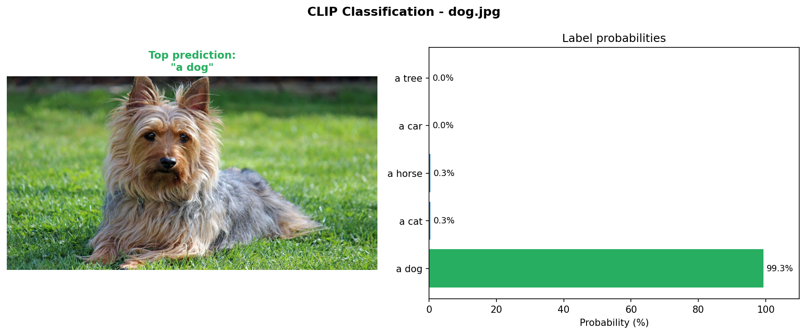

**Perro identificado con 99.3% de confianza.** CLIP asigna prácticamente toda la probabilidad a `"a dog"` frente a cat, horse, car y tree. El modelo aprovecha las características visuales de pelaje, forma y postura.

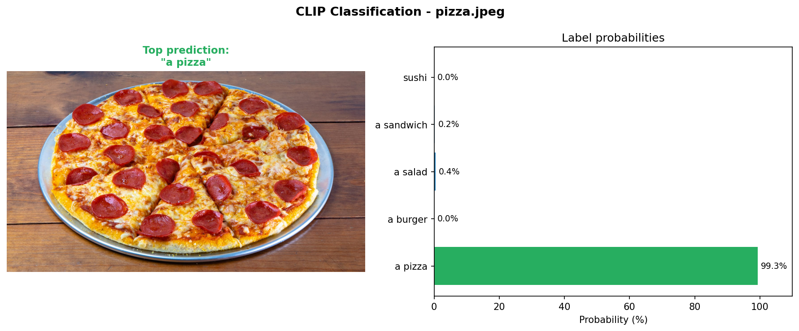

**Pizza identificada con 99.3% de confianza.** Las texturas circulares, los colores del queso y la salsa, y la forma característica de la pizza la distinguen inequívocamente del resto de opciones alimenticias.

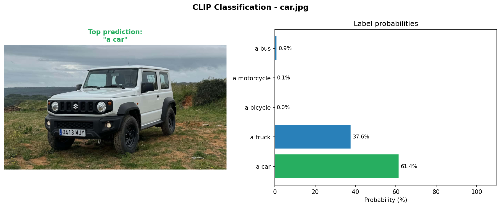

**Carro identificado con 61.4% de confianza**, seguido de truck (37.6%). El solapamiento entre "car" y "truck" refleja que el vehículo en la imagen (un sedán BMW de perfil) comparte proporciones con los camiones en el corpus de entrenamiento de CLIP.

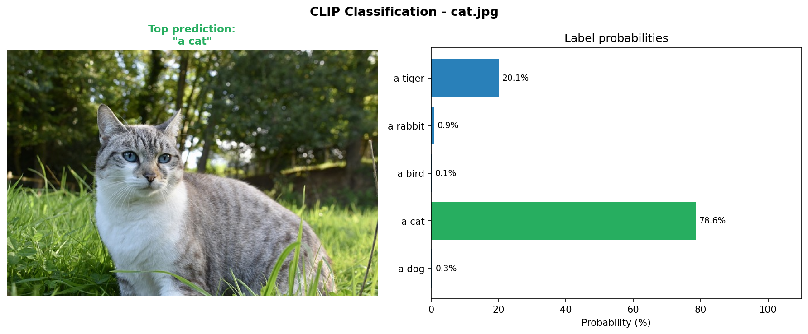

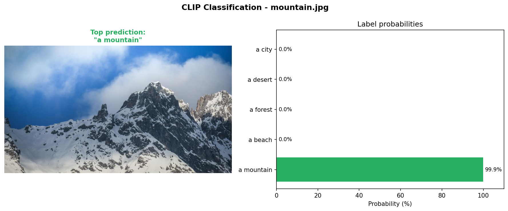

### Comparación de prompts simples vs. detallados

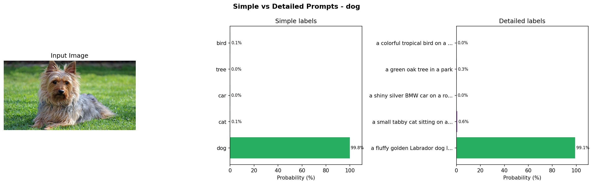

Las etiquetas detalladas concentran más probabilidad en la respuesta correcta que las simples. Con `"dog"` la confianza es alta, pero con `"a fluffy golden Labrador dog looking at the camera"` la brecha entre la clase correcta y las demás se amplía, porque el modelo dispone de más matices semánticos para desambiguar.

### Prompts ambiguos y subjetivos

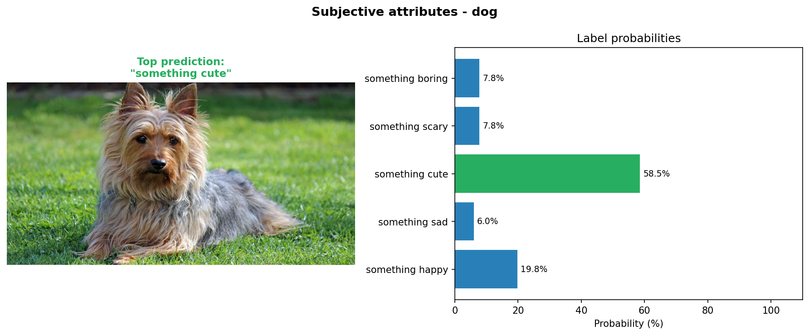

**El perro es clasificado como "something cute" (58.5%).** Este resultado refleja el sesgo del corpus de entrenamiento de CLIP: las imágenes de perros labrador en internet están mayoritariamente asociadas a contenidos de mascotas adorables, no a contextos ominosos o aburridos.

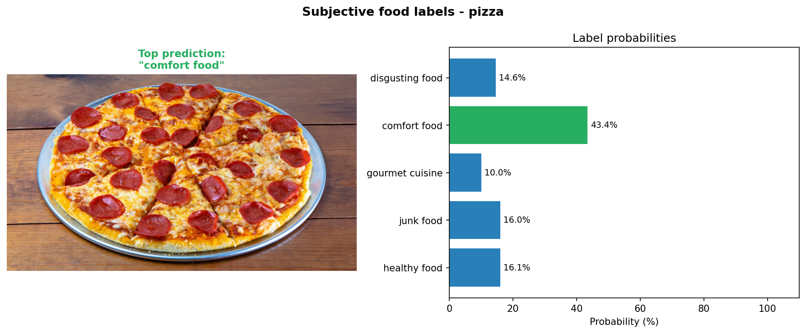

**La pizza es clasificada como "comfort food" (43.4%) antes que "healthy food" (16.1%) o "junk food" (16.0%).** Aunque el reparto es más distribuido que en las clasificaciones objetivas, CLIP hereda la connotación cultural de la pizza como alimento reconfortante presente en el lenguaje natural de internet.

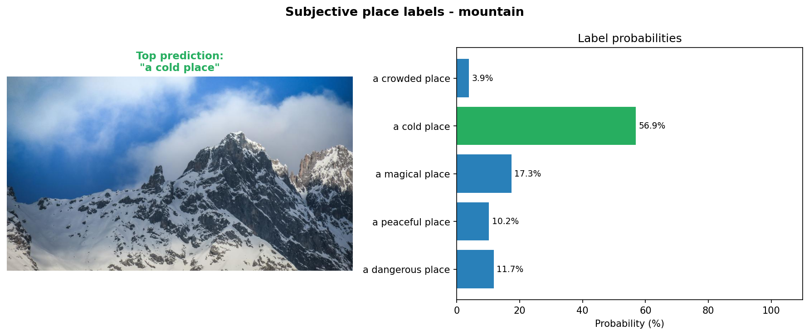

### Batch y jerarquía (bonus)

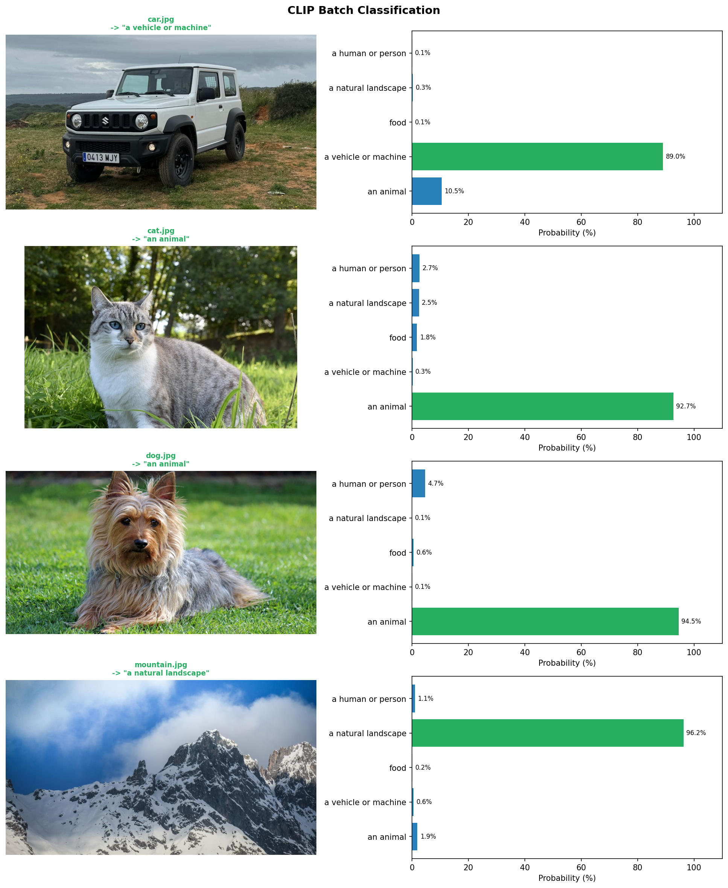

Clasificación simultánea de las 5 imágenes contra 5 categorías generales. Los 5 aciertos demuestran que CLIP distingue correctamente entre animales, vehículos, comida y paisajes naturales sin ningún entrenamiento.

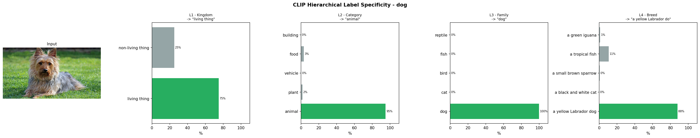

A medida que los labels ganan especificidad (L1 reino → L4 raza), la confianza de CLIP en la respuesta correcta aumenta: de 75% en `"living thing"` a 99.8% en `"dog"` y 87.8% en `"a yellow Labrador dog"`.

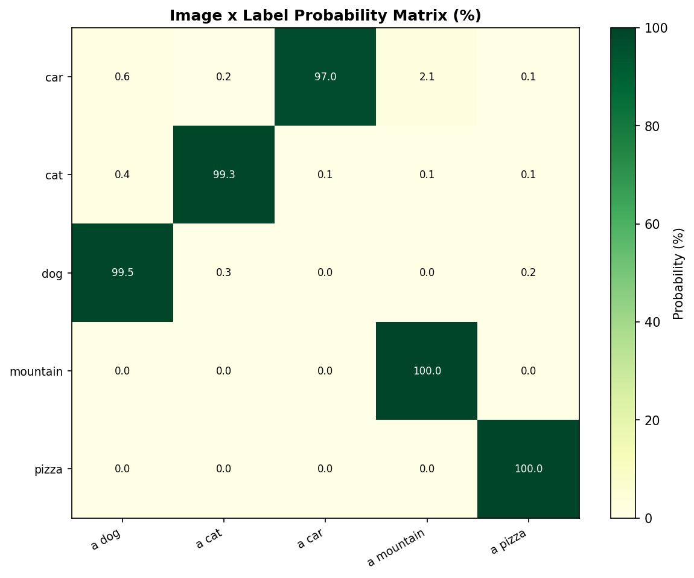

La diagonal dominante de la matriz confirma que cada imagen obtiene su mayor probabilidad frente a la etiqueta que la describe correctamente.

### GIF animado del proceso completo

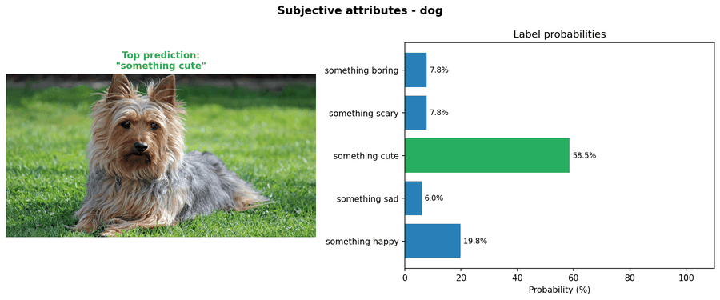

---

## Código relevante

### Cargar modelo y preprocesar imagen

```python
import clip, torch
from PIL import Image

device = "cuda" if torch.cuda.is_available() else "cpu"
model, preprocess = clip.load("ViT-B/32", device=device)

image = preprocess(Image.open("dog.jpg").convert("RGB")).unsqueeze(0).to(device)
```

### Clasificar una imagen contra etiquetas de texto

```python
labels = ["a dog", "a cat", "a horse", "a car", "a tree"]
tokens = clip.tokenize(labels).to(device)

with torch.no_grad():
    logits, _ = model(image, tokens)
    probs = logits.softmax(dim=-1).cpu().numpy()[0]

best = labels[probs.argmax()]
print(f"Prediccion: {best}  ({probs.max()*100:.1f}%)")
```

### Batch classification (un solo forward pass para N imágenes)

```python
images = torch.stack([
    preprocess(Image.open(p).convert("RGB")) for p in image_paths
]).to(device)
tokens = clip.tokenize(labels).to(device)

with torch.no_grad():
    logits, _ = model(images, tokens)
    probs = logits.softmax(dim=-1).cpu().numpy()  # (N, M)
```

### Crear GIF animado de resultados

```python
from PIL import Image as PILImage

frames = [PILImage.open(p).convert("RGB").resize((900, 375)) for p in result_pngs]
frames[0].save("clip_demo.gif", save_all=True, append_images=frames[1:],
               duration=2500, loop=0)
```

El código completo está disponible en `python/clip_classifier.py` y `python/batch_clip.py`.

---

## Prompts utilizados

Durante el desarrollo del taller se utilizaron los siguientes prompts con herramientas de IA generativa para apoyar la implementación:

- "Crea un script en Python que use CLIP de OpenAI para clasificar imágenes locales contra una lista de etiquetas de texto, guarde las visualizaciones en una carpeta media/ y genere un GIF animado con todos los resultados."
- "Implementa una función que compare el rendimiento de prompts simples de una sola palabra contra descripciones largas en lenguaje natural para la misma imagen, mostrando las probabilidades side-by-side."
- "Escribe la lógica de batch classification de CLIP: apila N imágenes en un solo tensor, tokeniza M etiquetas, ejecuta un único forward pass y devuelve la matriz (N, M) de probabilidades."
- "Genera un demo de jerarquía de especificidad de etiquetas para una misma imagen, mostrando cómo varía la confianza de CLIP al pasar de etiquetas genéricas (reino) a etiquetas específicas (raza)."
- "Crea una visualización tipo heatmap que muestre la matriz de similitud entre un conjunto de imágenes y un conjunto de etiquetas, con los valores de probabilidad anotados en cada celda."

---

## Aprendizajes y dificultades

### Aprendizajes

- **CLIP clasifica sin entrenamiento.** El modelo alcanza confianzas superiores al 99% en categorías visuales claras usando únicamente el conocimiento semántico adquirido durante su pre-entrenamiento. Esto lo convierte en una herramienta ideal para prototipado rápido sin necesidad de datasets etiquetados.
- **La redacción del prompt es determinante.** Etiquetas detalladas en lenguaje natural producen distribuciones de probabilidad más concentradas y separadas que etiquetas de una sola palabra. CLIP fue entrenado con texto natural, no con etiquetas de clase; por eso se beneficia de contexto adicional.
- **CLIP hereda sesgos culturales del lenguaje.** Las clasificaciones subjetivas revelan las asociaciones estadísticas presentes en el corpus de entrenamiento: la pizza es "comfort food" antes que "healthy food" porque así se habla de ella mayoritariamente en internet. Estos sesgos son importantes al diseñar sistemas de clasificación en producción.
- **La jerarquía de especificidad mejora la confianza.** A mayor detalle en la etiqueta, mayor confianza del modelo en la respuesta correcta. El salto más grande se produce entre etiquetas genéricas de categoría (L2) y etiquetas de familia (L3).

### Dificultades

- **Compatibilidad del paquete CLIP en Windows:** existe un paquete homónimo en PyPI (`pip install clip`) que no es el de OpenAI. El paquete correcto se instala desde GitHub con `pip install git+https://github.com/openai/CLIP.git`. Adicionalmente, la instalación requiere Visual C++ Build Tools en Windows.
- **Encoding UTF-8 en la consola de Windows:** los caracteres Unicode (flechas, cuadros) no son reconocidos por la codificación cp1252 predeterminada del terminal de Windows, lo que lanzaba `UnicodeEncodeError`. La solución fue reemplazar todos los caracteres no-ASCII por equivalentes ASCII puros (`->`, `...`).
- **Extensión de imagen variable:** la imagen de pizza estaba en `.jpeg` mientras las demás en `.jpg`. Se implementó la función `find_image()` que busca el archivo independientemente de la extensión para evitar errores de "imagen no encontrada".
- **Backend de matplotlib en entorno sin display:** al ejecutar los scripts desde terminal sin servidor gráfico, matplotlib lanza advertencias sobre la falta de display. Se fijó `matplotlib.use("Agg")` al inicio de cada script para forzar renderizado en archivo sin necesidad de ventana.

### Reflexión

CLIP es especialmente poderoso cuando las diferencias entre categorías son semánticas y los prompts capturan matices que la imagen por sí sola no expresa claramente. El taller demostró que el prompt engineering es una habilidad tan importante como la elección del modelo: dos palabras adicionales en una etiqueta pueden cambiar la confianza de CLIP de manera significativa. La contraparte es que el modelo hereda los sesgos del lenguaje humano en internet, lo que obliga a los diseñadores de sistemas a ser conscientes de qué asociaciones culturales están implícitas en sus etiquetas.

### Mejoras futuras

- Probar el modelo `ViT-L/14` (más grande) para ver si reduce los errores en categorías ambiguas.
- Implementar el prefijo `"a photo of"` en todas las etiquetas, técnica documentada en el paper original de CLIP que mejora consistentemente la precisión.
- Extender el demo de ambiguedad con más imágenes para identificar patrones sistemáticos de sesgo del modelo.
- Evaluar CLIP contra imágenes generadas por modelos de difusión (Stable Diffusion) para medir si el modelo identifica correctamente imágenes sintéticas.

---

## Contribuciones grupales

- **Juan David Buitrago Salazar:** Diseño e implementación del pipeline principal de clasificación CLIP en `clip_classifier.py`. Definición de los conjuntos de etiquetas para los demos 1 y 2. Análisis de los resultados de clasificación y documentación de los hallazgos en el README.
- **Juan David Cardenas Galvis:** Configuración del entorno de desarrollo y dependencias. Detección y corrección del error de encoding UTF-8 en Windows. Implementación de `find_image()` para manejo robusto de extensiones de imagen. Depuración del backend de matplotlib (`Agg`).
- **Juan Felipe Fajardo Garzon:** Implementación del script bonus `batch_clip.py` con la lógica de clasificación por lotes mediante `torch.stack()`. Diseño de la jerarquía de especificidad de etiquetas (L1 a L4) y generación de la figura `result_hierarchy.png`.
- **Camilo Andres Medina Sanchez:** Implementación de la función `save_result()` para generar visualizaciones consistentes (imagen + barras de probabilidad). Diseño del demo de comparación de prompts simples vs. detallados y de la matriz de similitud imagen × etiqueta.
- **Nicolas Rodriguez Piraban:** Diseño y ejecución del demo de prompts ambiguos y subjetivos. Análisis de los sesgos culturales observados en las clasificaciones subjetivas (pizza como "comfort food", perro como "something cute"). Generación del GIF animado de resumen y validación final de todos los resultados en `media/`.

---

## Estructura del proyecto

```
semana_12_2_clip_clasificacion_visual_verbal/
├── python/
│   ├── clip_classifier.py   # Script principal: demos 1, 2 y 3 + GIF animado
│   ├── batch_clip.py        # Bonus: batch, jerarquia, matriz de similitud
│   ├── requirements.txt     # Dependencias pip
│   └── images/              # Imagenes de entrada
│       ├── dog.jpg
│       ├── cat.jpg
│       ├── car.jpg
│       ├── mountain.jpg
│       └── pizza.jpeg
├── media/                   # Resultados generados al ejecutar los scripts
│   ├── result_basic_dog.png
│   ├── result_basic_cat.png
│   ├── result_basic_car.png
│   ├── result_basic_mountain.png
│   ├── result_basic_pizza.png
│   ├── result_prompt_comparison.png
│   ├── result_ambiguous_dog.png
│   ├── result_ambiguous_pizza.png
│   ├── result_ambiguous_mountain.png
│   ├── result_batch.png
│   ├── result_hierarchy.png
│   ├── result_similarity_matrix.png
│   └── clip_demo.gif
└── README.md
```

---

## Referencias

- OpenAI CLIP: "Learning Transferable Visual Models From Natural Language Supervision" (Radford et al., 2021) - https://github.com/openai/CLIP
- Documentacion oficial de PyTorch: https://pytorch.org/docs/stable/
- Documentacion de Pillow (PIL): https://pillow.readthedocs.io/
- Documentacion de Matplotlib: https://matplotlib.org/stable/
