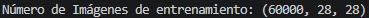
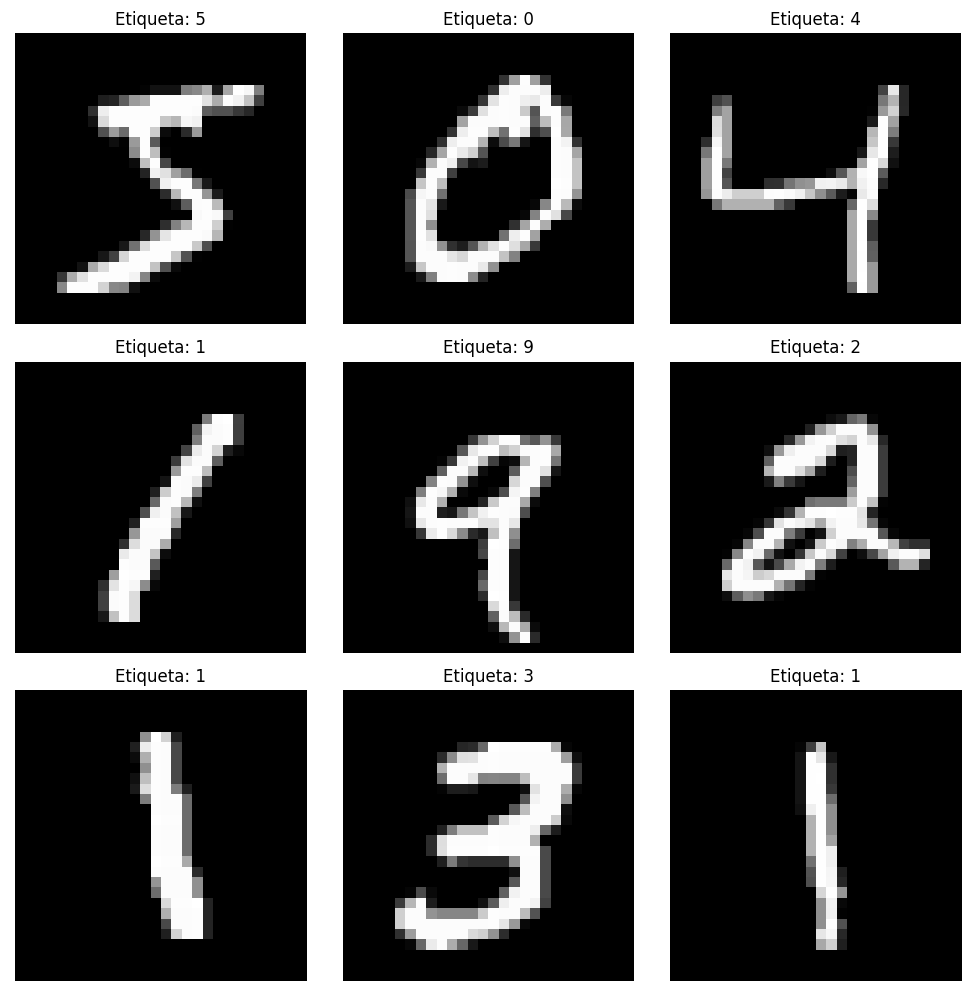
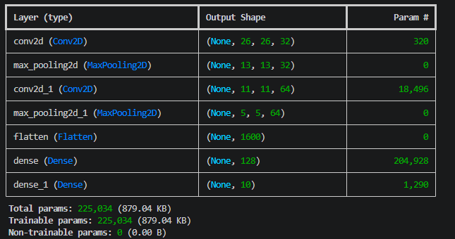
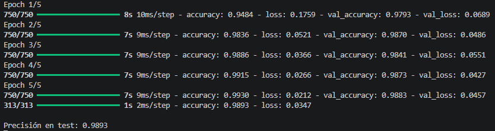
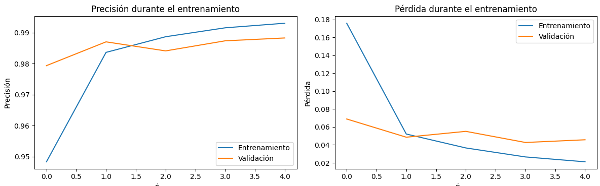
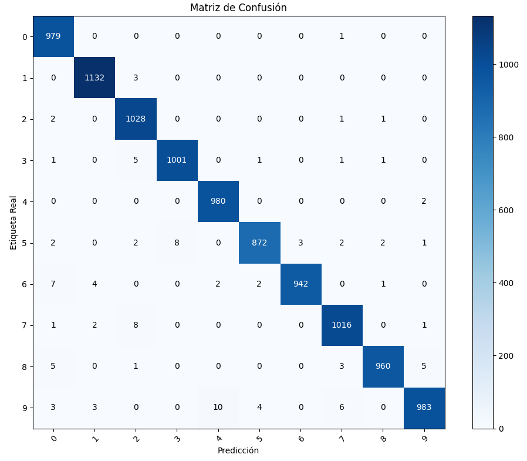
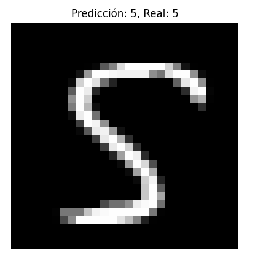
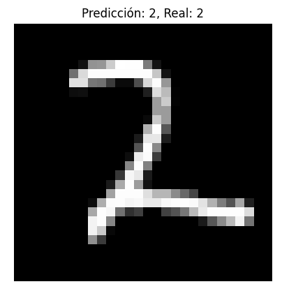
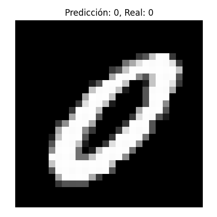

# Taller - CNN Básico con Keras para MNIST
## Nombre:

- Juan David Buitrago Salazar
- Juan David Cardenas Galvis
- Nicolás Rodríguez Piraban
- Camilo Andres Medina Sanchez
- Juan Felipe Fajardo Garzón

## Fecha de entrega: 01/06/2026

## Descripción breve:
Este taller consiste en implementar una red neuronal convolucional (CNN) básica utilizando TensorFlow y Keras para la clasificación de dígitos del dataset MNIST. Se visualizan las imágenes, se entrena el modelo y se evalúa mediante matriz de confusión.

## Implementaciones:

### Python:
Se implementó una CNN con dos capas convolucionales (32 y 64 filtros), capas de MaxPooling, una capa densamente conectada de 128 neuronas y capa de salida con 10 clases. El modelo se entrena durante 5 épocas y se evalúa en el set de prueba. Se incluye visualización del dataset, gráficos de precisión y pérdida durante el entrenamiento, y matriz de confusión para analizar los resultados por clase.

**Explicación de parámetros clave:**

- **Conv2D(32, 3x3)**: Se utilizan 32 filtros de 3x3 para detectar características básicas como bordes y esquinas. El número 32 es un balance entre capacidad del modelo y eficiencia computacional para un dataset sencillo como MNIST.

- **Conv2D(64, 3x3)**: El número de filtros se duplica (64) en la segunda capa para detectar características más complejas. Aumentar filtros progresivamente permite capturar mayor cantidad de patrones.

- **MaxPooling2D**: Reduce la dimensionalidad de los feature maps a la mitad (2x2), lo que ayuda a que el modelo sea más invariante a translaciones pequeñas y reduce el sobreajuste.

- **Dense(128)**: Capa oculta con 128 neuronas suficiente para MNIST. Es un valor estándar que evita underfitting sin ser excesivo para este problema simple.

- **Dense(10, softmax)**: Capa de salida con 10 neuronas (una por dígito) y activación softmax para obtener probabilidades normalizadas entre todas las clases.

- **Optimizer Adam**: Optimizador adaptativo que ajusta la tasa de aprendizaje automáticamente por parámetro. Es el más usado por su robustez y convergencia rápida.

- **Loss sparse_categorical_crossentropy**: Función de pérdida ideal para clasificación multiclase con etiquetas enteras (0-9). Calcula la entropía cruzada entre la distribución predicha y la real.

- **Activation ReLU**: Función de activación que introduce no linealidad, permitiendo que la red aprenda patrones complejos. Es computacionalmente eficiente y evita el problema del gradiente desvaneciente en capas profundas.

- **epochs=5**: Cantidad de épocas balanceada para obtener buenos resultados en tiempo razonable. MNIST converge rápidamente con CNNs.

## Resultados visuales

Inicialmente se importa el dataset mnist y se imprime las dimensiones de la parte train



Mostramos algunas imágenes con su etiqueta de clasificación 



Posteriormente se realiza el preprocesamiento (normalizado y reshape de las imágenes) y se constuyr la arquitectura de la CNN, la imprimimos en consola con .sumary()



Luego se realiza el entrenamiento, obteniendo las siguientes métricas 



Aparte de esto, se muestran las siguiente gráficas de accuracy y loss vs epochs



Se puede evidenciar que la arquitectura presentada es más que suficiente para el problema de clasificación con el dataset MNIST, sin embargo, se construye la matríz de confusión con el fin de evaluar cuales son las detecciones en las cuales el modelo presenta más fallos



Observando la matriz de confusión se puede evidenciar que el modelo presenta pequeños fallos al detectar el número 9 ya que lo confunde con el número 4, lo mismo ocurre para diferenciar el 7 del 2; esto se debe principalmente a que estos símbolos son muy parecidos entre sí, por lo que se puede requerir de otra capa de convolución 2D que detecte detalles más pequeños en los símbolos

Finalmente relizamos algunas predicciones individuales








## Código relevante:
La arquitectura de la CNN se define utilizando la API Sequential de Keras, con capas Conv2D para detección de características, MaxPooling2D para reducción de dimensionalidad, Flatten para aplanar la salida, y capas Dense para la clasificación final.
```python
simple_CNN = keras.Sequential([
    keras.Input(shape=(28, 28, 1)),
    layers.Conv2D(32, (3, 3), activation='relu'),
    layers.MaxPooling2D(),
    layers.Conv2D(64, (3, 3), activation='relu'),
    layers.MaxPooling2D(),
    layers.Flatten(),
    layers.Dense(128, activation='relu'),
    layers.Dense(10, activation='softmax')
])
```
El preprocesamiento es esencial para que las imágenes sean compatibles con la CNN. MNIST originalmente viene en formato (60000, 28, 28) -sin dimensión de canal-, por lo que debe reshapearse a (60000, 28, 28, 1) para indicar explícitamente que es escala de grises. La normalización divide los pixeles por 255 para convertir el rango [0, 255] a [0, 1], lo que acelera la convergencia del modelo.
```python
x_train = x_train.reshape(-1, 28, 28, 1).astype('float32') / 255.0
x_test = x_test.reshape(-1, 28, 28, 1).astype('float32') / 255.0
```
La compilación del modelo configura el proceso de entrenamiento especificando el optimizador (Adam), la función de pérdida (sparse_categorical_crossentropy para etiquetas enteras), y las métricas a monitorear (accuracy).
```python
simple_CNN.compile(
    optimizer='adam',
    loss='sparse_categorical_crossentropy',
    metrics=['accuracy']
)
```
El entrenamiento se realiza con fit(), donde epochs define cuántas veces se procesa todo el dataset, batch_size determina cuántas imágenes se procesan antes de actualizar pesos, y validation_split reserva el 20% de datos para validación.
```python
history = simple_CNN.fit(
    x_train, y_train,
    epochs=5,
    batch_size=64,
    validation_split=0.2,
    verbose=1
)
```
La matriz de confusión permite analizar qué dígitos el modelo confunde con mayor frecuencia. Se calculan las predicciones con predict(), se obtiene la clase con mayor probabilidad con argmax(), y se compara con las etiquetas reales.
```python
y_pred = simple_CNN.predict(x_test)
y_pred_classes = np.argmax(y_pred, axis=1)
cm = confusion_matrix(y_test, y_pred_classes)
```

## Prompts utilizados:
Genera un script usando sklearn y matplotlib para construir la matriz de confusión de un modelo entrenado utilizando Keras

## Aprendizajes y dificultades:
Este taller permite entender los fundamentos de las redes neuronales convolucionales, desde el preprocesamiento de imágenes (reshaping y normalización) hasta la evaluación del modelo. La matriz de confusión es especialmente útil para identificar qué dígitos el modelo confunde con mayor frecuencia, lo cual es crucial para mejorar el rendimiento.

La principal dificultad fue ajustar los shapes de entrada correctamente, ya que MNIST viene en formato (60000, 28, 28) y debe convertirse a (60000, 28, 28, 1) para ser compatible con las capas Conv2D de Keras.