# Control Visual: Manipulacion Dirigida con ControlNet

## Integrantes

- Juan David Buitrago Salazar
- Juan David Cardenas Galvis
- Nicolas Rodriguez Piraban
- Camilo Andres Medina Sanchez
- Juan Felipe Fajardo Garzon

## Fecha de Entrega

`2026-06-01`

---

## Descripcion Breve

En este taller se exploró el uso de ControlNet junto con Stable Diffusion para guiar
la generación de imágenes mediante entradas condicionales. Se experimentó con tres
tipos de condiciones visuales: bordes (Canny), mapas de profundidad (Depth) y poses
humanes (OpenPose), comparando los resultados generados con y sin condiciones para
entender como cada tipo de condicion afecta la estructura de la imagen final.

---

## Implementaciones

### Python / Google Colab

El flujo de trabajo incluye:

1. **Condicion por bordes (Canny)**:
   - Se carga el modelo `lllyasviel/sd-controlnet-canny` junto con Stable Diffusion v1.5.
   - Se aplica el detector Canny sobre una imagen base para extraer los bordes.
   - Se genera una imagen condicionada por esos bordes con el prompt "A cyberpunk city
     skyline at night".
   - Tambien se genera una imagen solo con el prompt (sin condicion) para comparar.

2. **Condicion por profundidad (Depth)**:
   - Se carga el modelo `lllyasviel/sd-controlnet-depth` con el detector Midas.
   - Se extrae el mapa de profundidad de una imagen base.
   - Se genera una imagen condicionada por la profundidad con el prompt
     "Mistic Temple".

3. **Condicion por pose (OpenPose)**:
   - Se carga el modelo `lllyasviel/sd-controlnet-openpose` con el detector OpenPose.
   - Se extrae la pose esqueletica de una imagen base.
   - Se genera una imagen condicionada por la pose con el prompt
     "A samurai paying respect in the temple".

---

## Resultados visuales

### Condicion Canny (Bordes)

<table>
<tr>
<td align="center"><b>Imagen Original</b></td>
<td align="center"><b>Bordes Canny</b></td>
<td align="center"><b>Resultado ControlNet</b></td>
</tr>
<tr>
<td>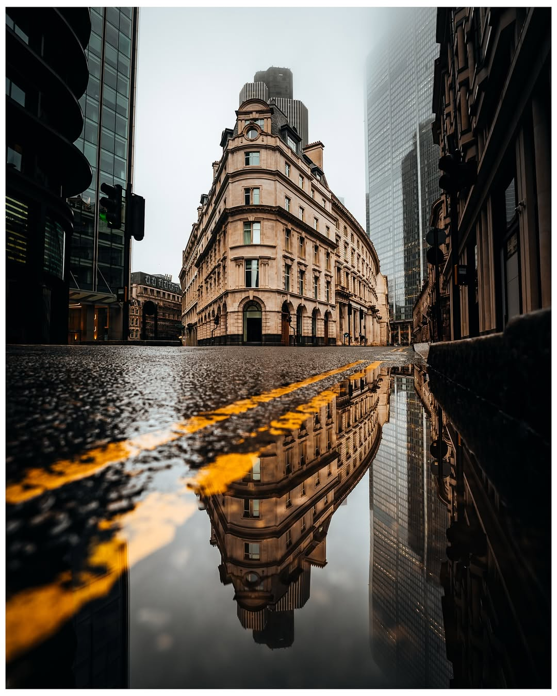</td>
<td>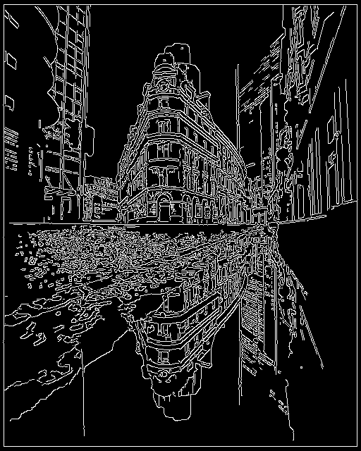</td>
<td>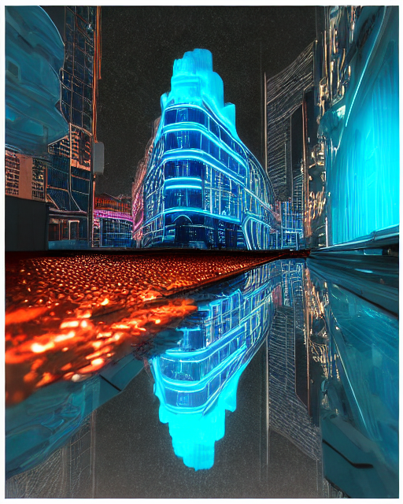</td>
</tr>
<tr>
<td align="center">Foto de entrada utilizada para extraer los bordes con el detector Canny.</td>
<td align="center">Mapa de bordes generado a partir de la imagen original. Los bordes definen la estructura que ControlNet respetara.</td>
<td align="center">Imagen generada por Stable Diffusion condicionada por los bordes Canny. Se conserva la estructura de la imagen original.</td>
</tr>
</table>

### Condicion Depth (Profundidad)

<table>
<tr>
<td align="center"><b>Imagen Original</b></td>
<td align="center"><b>Mapa de Profundidad</b></td>
<td align="center"><b>Resultado ControlNet</b></td>
</tr>
<tr>
<td>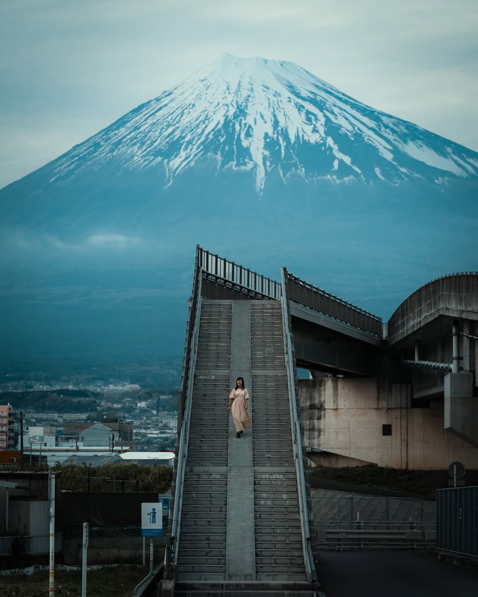</td>
<td>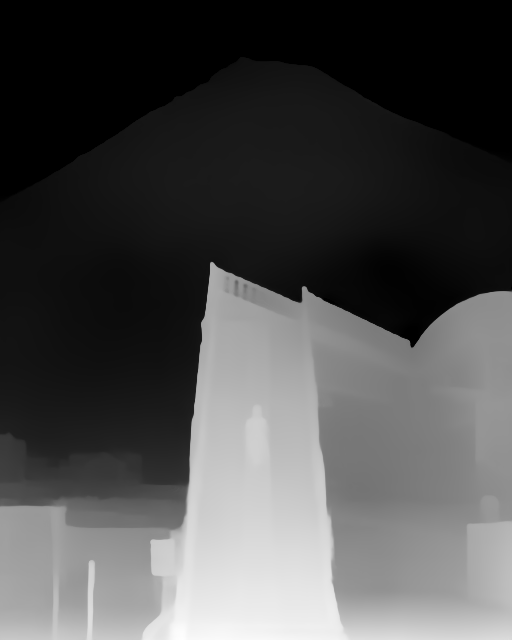</td>
<td>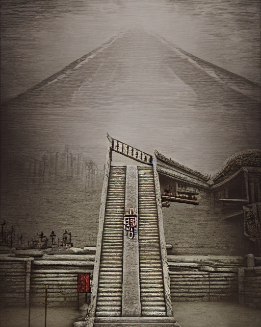</td>
</tr>
<tr>
<td align="center">Foto de entrada utilizada para extraer el mapa de profundidad con Midas.</td>
<td align="center">Mapa de profundidad donde los tonos claros indican objetos cercanos y los oscuros indican objetos lejanos.</td>
<td align="center">Imagen generada condicionada por la profundidad. La distribucion espacial de la escena se mantiene fiel al original.</td>
</tr>
</table>

### Condicion OpenPose (Pose Humana)

<table>
<tr>
<td align="center"><b>Imagen Original</b></td>
<td align="center"><b>Mapa de Pose</b></td>
<td align="center"><b>Resultado ControlNet</b></td>
</tr>
<tr>
<td>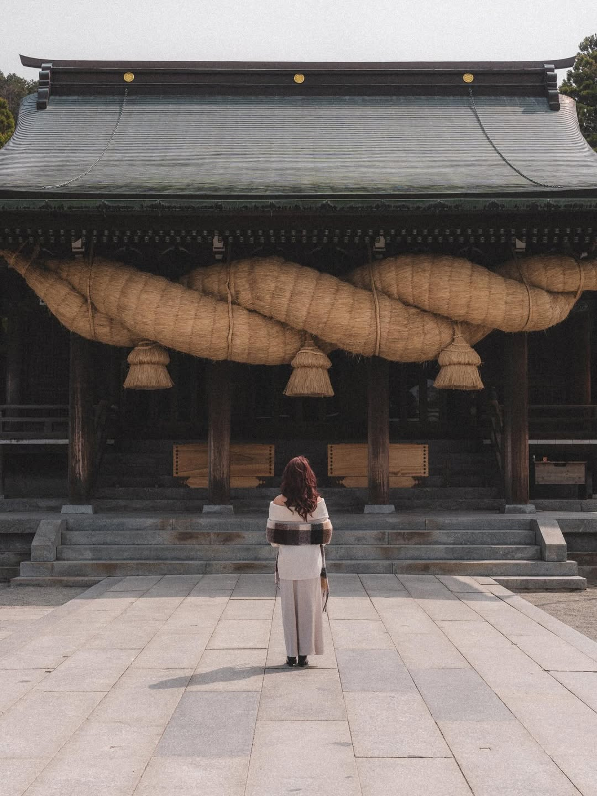</td>
<td>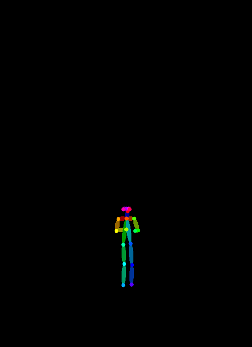</td>
<td>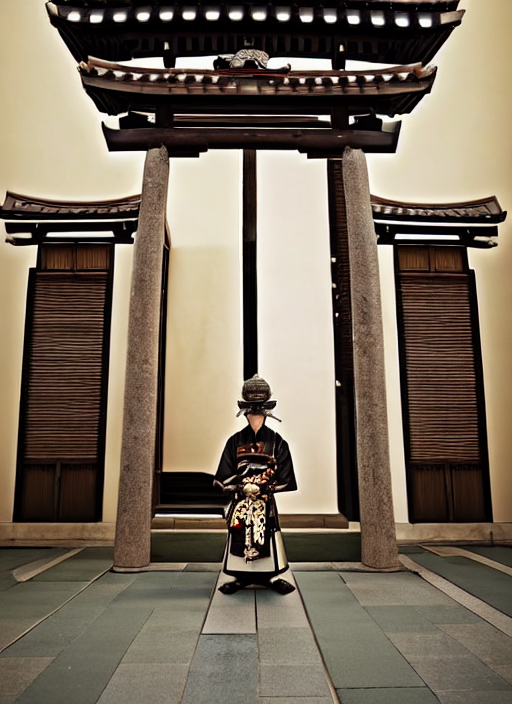</td>
</tr>
<tr>
<td align="center">Foto de entrada con una persona en posture especifica.</td>
<td align="center">Esqueleto extraido por OpenPose que representa las articulaciones y extremidades de la persona.</td>
<td align="center">Imagen generada donde la persona reproducc la misma pose, pero con estilo y contexto completamente diferentes.</td>
</tr>
</table>

### Generacion sin imagen base

<table>
<tr>
<td align="center"><b>Solo Prompt - Canny</b></td>
<td align="center"><b>Solo Prompt - Mistic</b></td>
<td align="center"><b>Solo Prompt - Samurai</b></td>
</tr>
<tr>
<td>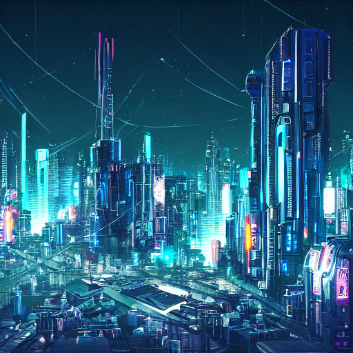</td>
<td></td>
<td>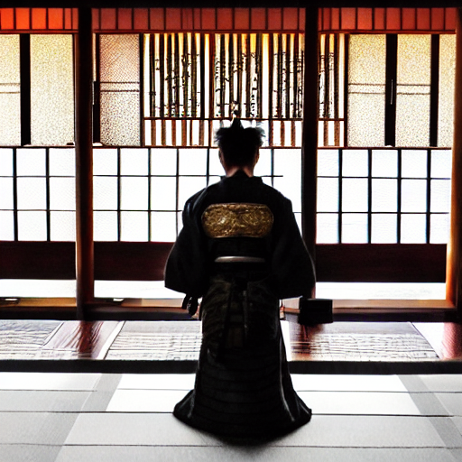</td>
</tr>
<tr>
<td align="center">Imagen generada unicamente con el prompt "A cyberpunk city skyline at night", sin imagen de referencia.</td>
<td align="center">Imagen generada solo con el prompt "Mistic Temple", sin condicion visual que respetar.</td>
<td align="center">Imagen generada solo con el prompt "A samurai paying respect in the temple". Demuestra como el modelo interpreta el texto de forma autonoma.</td>
</tr>
</table>

---

## Codigo relevante

### Carga de ControlNet y generacion con condicion Canny

```python
from diffusers import ControlNetModel, StableDiffusionControlNetPipeline
from controlnet_aux import CannyDetector

controlnet = ControlNetModel.from_pretrained(
    "lllyasviel/sd-controlnet-canny",
    torch_dtype=torch.float16
)

pipe = StableDiffusionControlNetPipeline.from_pretrained(
    "runwayml/stable-diffusion-v1-5",
    controlnet=controlnet,
    torch_dtype=torch.float16
).to("cuda")

image = Image.open("Canny_Base.jpg")
detector = CannyDetector()
condition_image = detector(image)

result = pipe(
    prompt="A cyberpunk city skyline at night",
    image=condition_image,
    num_inference_steps=30
).images[0]
```

### Condicion por profundidad con Midas

```python
from controlnet_aux import MidasDetector

controlnet = ControlNetModel.from_pretrained(
    "lllyasviel/sd-controlnet-depth",
    torch_dtype=torch.float16
)

midas = MidasDetector.from_pretrained("lllyasviel/Annotators")
image = Image.open("Depth_Base.jpg")
depth_image = midas(image)

result = pipe(
    prompt="Ancient mexican temple in the Background",
    image=depth_image,
    num_inference_steps=30
).images[0]
```

### Condicion por pose con OpenPose

```python
from controlnet_aux import OpenposeDetector

controlnet = ControlNetModel.from_pretrained(
    "lllyasviel/sd-controlnet-openpose",
    torch_dtype=torch.float16
)

pose_detector = OpenposeDetector.from_pretrained("lllyasviel/Annotators")
image = Image.open("Pose_Base.jpg")
pose_image = pose_detector(image)

result = pipe(
    prompt="A samurai paying respect in the temple",
    image=pose_image,
    num_inference_steps=30
).images[0]
```

---

## Prompts utilizados

```text
Crea un notebook en Google Colab que use la libreria diffusers de HuggingFace para
cargar un modelo ControlNet junto con Stable Diffusion v1.5. El notebook debe incluir
tres secciones: una que use ControlNet Canny para condicionar la generacion con bordes
de una imagen, otra que use ControlNet Depth con el detector Midas para condicionar
con mapas de profundidad, y una tercera que use ControlNet OpenPose para condicionar
con poses humanas. Cada seccion debe cargar la imagen base, extraer la condicion,
generar la imagen resultado y guardar las imagenes.
```

---

## Aprendizajes y dificultades

En este taller aprendi como funciona ControlNet y como permite guiar la generacion
de imagenes de Stable Diffusion usando entradas visuales como bordes, profundidad o
poses. Cada tipo de condicion aporta un nivel de control diferente sobre la estructura
de la imagen generada, lo cual es muy util para aplicaciones donde se requiere
mantener la forma o disposicion de la escena original.

Para la realización de este taller no hubo mayores dificultades. Principalmente, el
proceso que se debía realizar con cada uno de los modelos eran muy similares, lo único
diferente fue la carga del modelo.

En este caso estoy satisfecho con los resultados obtenidos. Las tres condiciones
(Canny, Depth y OpenPose) funcionan correctamente y se puede observar claramente
como cada una afecta la imagen generada. Comparar las versiones condicionadas con las
generadas solo con prompt permite entender mejor el impacto de cada tipo de condicion.
