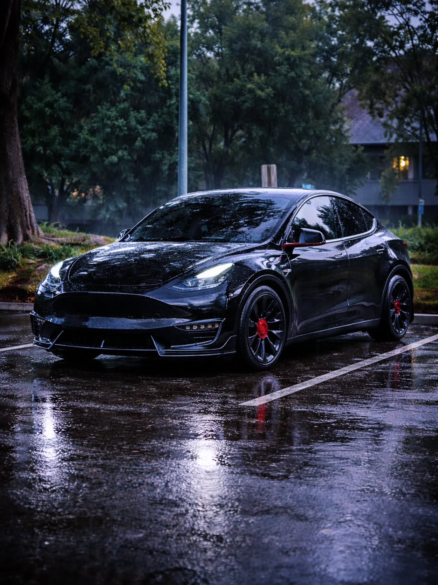
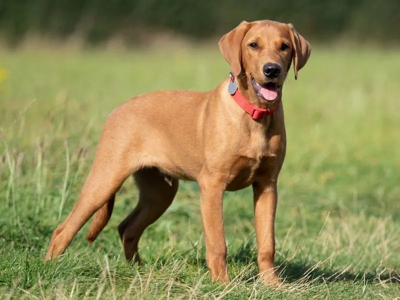

# Taller - Embeddings Visuales: Proyectando Significados con CLIP y PCA
## Nombre:

- Juan David Buitrago Salazar
- Juan David Cardenas Galvis
- Nicolás Rodríguez Piraban
- Camilo Andres Medina Sanchez
- Juan Felipe Fajardo Garzón

## Fecha de entrega: 01/06/2026

## Descripción breve:
Este taller consiste en generar **embeddings visuales** de un conjunto de 12 imágenes (3 gatos, 3 perros, 3 carros y 3 árboles) usando el modelo **CLIP (ViT-B/32)** de OpenAI, y luego proyectarlos a 2D mediante **PCA** para visualizar las relaciones semánticas entre las imágenes. Adicionalmente, se aplica **KMeans** para identificar agrupamientos sin etiquetas (unsupervised learning) y se realiza **clasificación zero-shot** comparando los embeddings de las imágenes con embeddings de texto generados a partir de prompts descriptivos.

## Implementaciones:

### Python:
Se implementó un pipeline completo en Google Colab que carga el modelo CLIP preentrenado ViT-B/32, procesa 12 imágenes locales, genera embeddings de 512 dimensiones, los reduce a 2D con PCA, aplica KMeans para clustering y realiza clasificación zero-shot mediante similitud coseno entre embeddings de imagen y texto.

**Explicación de parámetros clave:**

- **CLIP ViT-B/32**: Variante del modelo CLIP de OpenAI que usa un Vision Transformer (ViT) con patches de 32x32 como encoder visual. Es un balance entre calidad de embeddings y eficiencia computacional para tareas de análisis semántico.

- **encode_image()**: Función de CLIP que convierte una imagen preprocesada en un vector de 512 dimensiones que captura su contenido semántico en el espacio compartido imagen-texto.

- **PCA(n_components=2)**: Reduce las 512 dimensiones originales a 2 componentes principales para poder visualizar los embeddings en un plano. PCA preserva la mayor varianza posible en las direcciones de máxima dispersión.

- **L2 normalization**: Dividir cada vector por su norma para que tengan longitud unitaria. Esto es esencial para que el producto punto entre embeddings equivalga a la similitud coseno, que es la métrica usada por CLIP.

- **KMeans(n_clusters=4)**: Algoritmo de clustering no supervisado que agrupa los embeddings en 4 clusters basándose en la distancia euclidiana. Se eligió n_clusters=4 porque coincide exactamente con el número de categorías semánticas presentes en el dataset (gatos, perros, carros, árboles), permitiendo verificar si el modelo CLIP separa correctamente las clases sin supervisión.

- **similarity = image_features @ text_features.T**: Producto matricial que produce una matriz de 12x4 con las similitudes coseno entre cada imagen y cada prompt textual. El índice del valor máximo en cada fila indica la clase predicha.

- **argmax()**: Función que retorna el índice del valor máximo en un array. Se usa para seleccionar el prompt con mayor similitud para cada imagen (clasificación zero-shot).

- **torch.no_grad()**: Desactiva el cálculo de gradientes durante la inferencia, reduciendo el uso de memoria y acelerando el procesamiento cuando no se está entrenando el modelo.

## Resultados visuales

Inicialmente se cargan las 12 imágenes (3 gatos, 3 perros, 3 carros y 3 árboles) desde archivos locales subidos a Colab. Se imprime la cantidad de imágenes encontradas:






Se genera el embedding de cada imagen con CLIP ViT-B/32, produciendo un vector de 512 dimensiones por imagen. Se aplica PCA para reducir a 2D y se grafica el resultado:


En la proyección PCA se observan 3 agrupamientos claros: los **carros** se concentran en la parte superior derecha, los **gatos** en la parte superior izquierda, y los **árboles** en la parte inferior. Los **perros** aparecen dispersos entre los grupos de gatos y el centro, Esto puede ocasionarse por el contenido de las imágenes, no solo por el perro en sí, si no por el fondo de la imágen.

Se aplica KMeans con k=4 sobre los embeddings originales (sin PCA) para detectar agrupamientos no supervisados:


KMeans produce una separación perfecta por categoría: cluster amarillo (gatos), cluster azul oscuro (perros), cluster morado oscuro (carros), cluster verde-azulado (árboles). Cada categoría semántica del dataset queda asignada a un cluster distinto, confirmando que los embeddings de CLIP codifican la información visual de forma discriminable incluso sin etiquetas.

Se proyectan también los embeddings de texto (prompts "a cat", "a dog", "a car", "a tree") junto con los embeddings de imagen usando PCA combinada:


Se observa que los prompts de "a cat" y "a dog" quedan cercanos entre sí (ambos son animales), y "a tree" y "a car" también se agrupan (objetos de contexto exterior). Los embeddings de texto aparecen separados de los de imagen en la proyección PCA, lo que indica que ocupan regiones distintas del espacio latente antes del alineamiento imagen-texto de CLIP.

Finalmente, se realiza clasificación zero-shot calculando la similitud coseno entre cada imagen y cada prompt, asignando la etiqueta del prompt con mayor similitud:


El modelo clasifica correctamente las 12 imágenes con similitudes entre 0.232 y 0.283, demostrando que CLIP puede reconocer las categorías sin haber sido entrenado explícitamente para esta tarea de 4 clases.

## Código relevante:
La carga del modelo CLIP se realiza usando la función `clip.load()` de la librería de OpenAI, que descarga automáticamente los pesos del modelo preentrenado ViT-B/32 y configura el preprocesamiento de imágenes necesario.

```python
import clip
import torch

device = "cuda" if torch.cuda.is_available() else "cpu"
model, preprocess = clip.load("ViT-B/32", device=device)
```

La generación de embeddings de imagen se hace con `model.encode_image()`, que convierte cada imagen preprocesada en un vector de 512 dimensiones. Se itera sobre todas las rutas de imagen y se apilan los vectores en una matriz `X` de tamaño (12, 512).

```python
image_features = []
with torch.no_grad():
    for path in image_paths:
        image = preprocess(Image.open(path)).unsqueeze(0).to(device)
        features = model.encode_image(image)
        image_features.append(features.cpu().numpy())
X = np.vstack(image_features)
```

La reducción de dimensionalidad con PCA permite visualizar los embeddings en un plano 2D. Se ajusta el modelo PCA con 2 componentes y se transforman los datos originales.

```python
from sklearn.decomposition import PCA
pca = PCA(n_components=2)
X_pca = pca.fit_transform(X)
```

El clustering con KMeans agrupa los embeddings en 4 clusters basándose en similitud euclidiana. El parámetro `random_state=42` garantiza reproducibilidad de los resultados, y `n_clusters=4` coincide con el número real de categorías del dataset.

```python
from sklearn.cluster import KMeans
kmeans = KMeans(n_clusters=4, random_state=42)
clusters = kmeans.fit_predict(X)
```

La clasificación zero-shot compara los embeddings de imagen con embeddings de texto usando similitud coseno. Se normalizan ambos conjuntos de features y se calcula el producto punto, que equivale a coseno cuando los vectores tienen norma unitaria.

```python
image_features = image_features / np.linalg.norm(image_features, axis=1, keepdims=True)
text_features = text_features / np.linalg.norm(text_features, axis=1, keepdims=True)
similarity = image_features @ text_features.T
```

La asignación de la clase predicha se hace con `argmax()`, que retorna el índice del prompt con mayor similitud para cada imagen. Adicionalmente, se construye un DataFrame de pandas con la matriz de similitud completa, usando los nombres de archivo como índice y los prompts como columnas, lo que facilita el análisis tabular de los resultados.

```python
import pandas as pd
from pathlib import Path

similarity = image_features @ text_features.T

image_names = [Path(path).stem for path in image_paths]

df_similarity = pd.DataFrame(
    similarity,
    index=image_names,
    columns=prompts
)

for i, image_name in enumerate(image_names):
    best_prompt = prompts[np.argmax(similarity[i])]
    score = np.max(similarity[i])
    print(f"{image_name:15} -> {best_prompt:10} ({score:.3f})")
```

## Prompts utilizados:
Genera un script en Python que use el modelo CLIP de OpenAI (ViT-B/32) para cargar un conjunto de imágenes locales, generar embeddings visuales de 512 dimensiones, reducirlos a 2D con PCA, aplicar KMeans para clustering no supervisado, proyectar también los embeddings de texto a partir de prompts descriptivos, y realizar clasificación zero-shot comparando la similitud coseno entre embeddings de imagen y texto.

## Aprendizajes y dificultades:
Este taller permitió comprender cómo los modelos multimodales como CLIP representan imágenes y texto en un **espacio latente compartido**, donde la distancia entre embeddings refleja similitud semántica. La visualización con PCA reveló que las imágenes de la misma categoría se agrupan naturalmente sin necesidad de etiquetas, validando la capacidad de CLIP para capturar características visuales de alto nivel.

La **clasificación zero-shot** demostró que CLIP puede reconocer categorías sin entrenamiento adicional, simplemente comparando la imagen con descripciones textuales. Las similitudes obtenidas (0.23-0.28) son típicas para embeddings normalizados de CLIP en tareas define-grained.

La principal dificultad fue entender por qué los embeddings de texto aparecían tan alejados de los de imagen en la proyección PCA combinada. Esto se debe a que PCA es una técnica lineal que no preserva necesariamente las relaciones de similitud coseno del espacio original de CLIP, que fue entrenado para que imágenes y textos estuvieran alineados.
