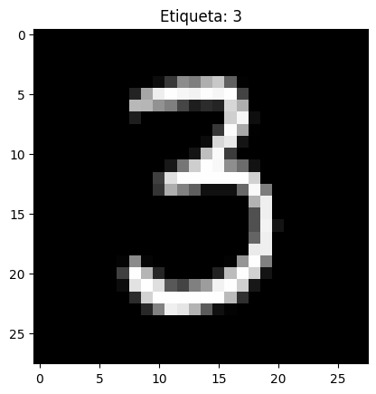
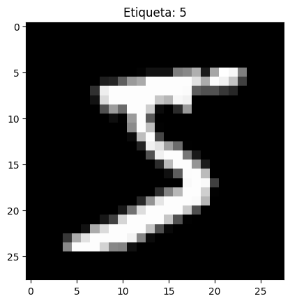
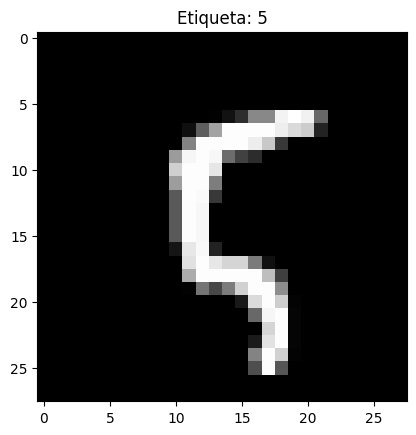
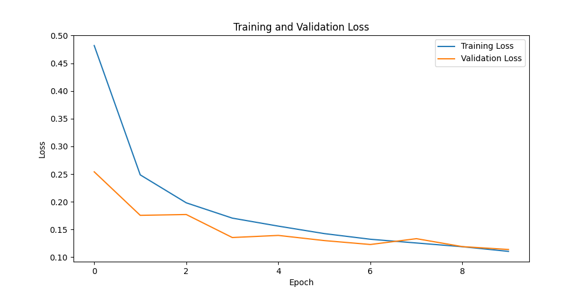
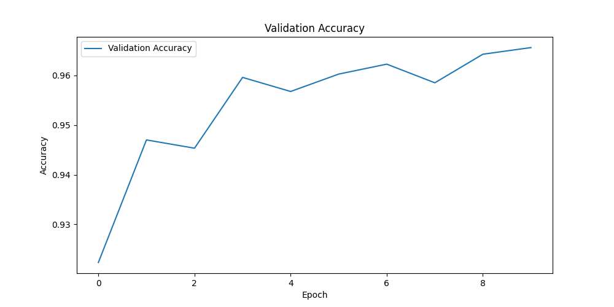
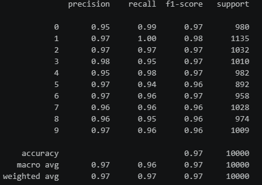
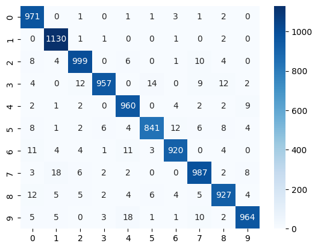
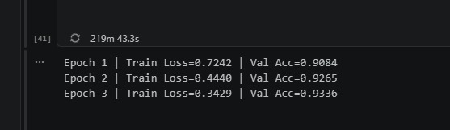
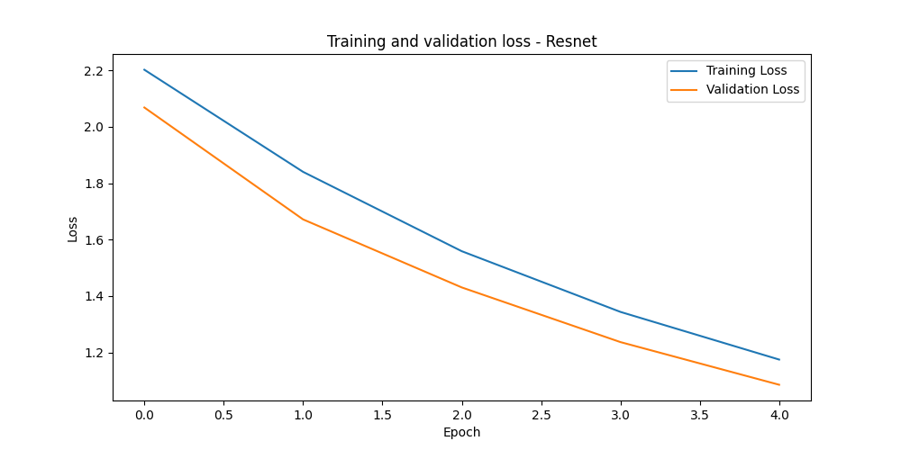
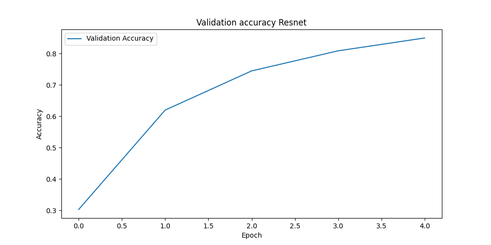

# Entrenamiento de un Modelo de Deep Learning de Inicio a Fin

## Autores del Proyecto

- Juan David Buitrago Salazar
- Juan David Cardenas Galvis
- Nicolás Rodríguez Piraban
- Camilo Andres Medina Sanchez
- Juan Felipe Fajardo Garzón

**Fecha de Entrega:** 01 de junio de 2026

---

## Objetivo

Comprensión del flujo completo de deep learning de inicio a fin con el fin de adquirir las competencias necesarias para implementar estos flujos en otros proyectos de la materia y de la vida profesional.

---

## Implementaciones

### Cargado de los datos

Como primera acción, se debe desarrollar el cargado de los datos. Tanto los de entrenamiento como los datos que van a ser probados posteriormente.
Este cargado de datos se hace con la libreria torchvision que ya tiene el dataset disponible para ser utilizado.
Antes de mostrar el proceso de cargado de los datasets, se considera importante profundizar un poco en la parte de transofmración a tensor.
```python
transform = transforms.Compose([
 transforms.ToTensor(),
 transforms.Normalize((0.5,), (0.5,))
])
```
Como ya es bien sabido las imagenes deben ser procesadas como objetos matemáticos, siendo estos tensores.
En el bloque de código anterior, se indica para comenzar un compose, la principal tarea de este es la agrupación de tareas, siendo estas:
- Convetir a tensor
- Normalizar

La primera tarea `ToTensor()`. Se enfoca en convetir a el formato estándar de pytorch, reordenando las dimensiones de la imagen (Canales, Alto, Ancho). Además, busca que todos los pixeles estén en el rango [0,1], esto se logra dividiendo cada uno de los valores por 255.
La srgunda y última tarea, busca ampliar un poco el rango previo para establecerlo entre [-1, 1], esto teniendo en cuenta que el primer valor es la media y el segundo la desviación estandar. 
$$\text{Componente normalizada} = \frac{\text{Valor} - \text{media}}{\text{desviación estándar}}$$
Además, al solor pasar el (0.5,) como argumento, se indica que la imagen proporcionada solo tiene un canal de color. Para este caso, el dataset MNIST solo tiene imagenes que están en formato de blanco y negro.

Teniendo lo anterior en mente, se puede proceder a mostrar el proceso de cargado de los datos desde el dataset MNIST. 

```python
train_data = datasets.MNIST(root='data', 
                            train=True, 
                            download=True,
                            transform=transform)
test_data = datasets.MNIST(root='data', 
                            train=False, 
                            download=True,
                            transform=transform)
```
Como se logra evidenciar en el bloque de código anterior, se hace los cargados independientes para los datos de entrenamiento y para los datos con los que se va a desarrollar las pruebas. A su vez, a cada uno de los conjuntos de datos se le desarrolla la transofrmación que fue predefinida y explicada en este mismo documento. 

Ahora bien, permitamonos visualizar algunas de las imagenes que han sido cargadas.




El tamaño del conjunto de datos de prueba es de 10 000. Mientras que, el tamaño del conjunto de datos de entrenamiento es de 60 000.

### Generación de batches

```python
train_size = int(0.8 * len(train_data))
val_size = len(train_data) - train_size
train_subset, val_subset = random_split(train_data, [train_size, val_size])

batch_size = 64

train_loader = DataLoader(train_subset, batch_size=batch_size, shuffle=True)
val_loader = DataLoader(val_subset, batch_size=batch_size)
test_loader = DataLoader(test_data, batch_size=batch_size)
```

Los batches son una parte crucial del proceso pues permiten agrupar las imágenes para ser pasadasa la red neuronal. 
En este caso, el tamaño del batch es de 64 imagenes que van a ser enviadas de forma aleatorias (shuffle).
Esto es importante pues no es posible por consumo de memoria el envío de todo el dataset de entrenamiento.

En el bloque de código anterior, se define un train size del ochenta por ciento, lo cual indica que no va a ser utilizado todo el conjunto de entrenamiento en el proceso. 

La variable `val_size` indica el tamaño del conjunto de datos de validación, valor que va a ser crucial para dividir el conjunto de la siguiente manera. 
- Conjunto de engtrenamiento: 80 %
- Conjunto de validación: 20 %

Ahora bien, el paso final en esta sección es crear cada uno de los loaders, que por supuesto, serán tres:
- Dataloader para entrenamiento.
- Dataloader para validación.
- Dataloader para pruebas.

### Declaración de la arquitectura de la red neuronal


Ahora, se define la estructura de la red neuronal y todas las etapas que la componen.

```python
model = nn.Sequential(
 nn.Flatten(),
 nn.Linear(28*28, 128),
 nn.ReLU(),
 nn.Dropout(0.2),
 nn.Linear(128, 64),
 nn.ReLU(),
 nn.Linear(64, 10)
)
```

La primera capa de la red neuronal hace un flatten, es decir, organiza de forma lineal todos los valores de entrada. 
La segunda capa, que es la primera de neuronas desarrolla cálculos tradicionales de la red.
$$ z = x_1w_1 + x_2w_2 + ... + x_nw_n $$

Siendo los $x_i$ los valores entrada y los $w_i$ los pesos de la red.
Por otro lado, la primera función de activación ReLU (Rectified Linear unit) el objetivo es introducir no linealidad. 
$$f(x) = max(0,x)$$
El dropout es una etapa crucial, pues evita el overfitting, en este caso, lo que hace es eliminar el 20% de las neuronas que están disponibles. 
Se procede a la última capa oculta de redes neuronales que pasan de nuevo por la función de activación ReLU.
Finalmente, la capa de salida que consta de 10 neuronas, las cuales según la activación indica si es el número de 0 - 9.

### Función de perdida y optimizador

Esta función es la que le indica a la red neuronal qué tan equivocada está. Esta función es crucial, pues si no existiera, la red neuronal no sabria si está mejorando o esta empeorando.
Para el caso de la practica la función de perdida está dada por:
```python
criterion = nn.CrossEntropyLoss()
```
#### Cross Entropy Loss

Como ya se expresó con anterioridad este es un mecanismo para identificar qué tan buena es la preduicción desarrollada por una red neuronal.
La regla general es: 
- Entre más confiable es el modelo en predecir la salida correcta, más bajo es el valor de la perdida.
- Entre más confiable es el modelo en predecir la salida incorrecta, más alto es el valor de la perdida.

La ecuación de la función de perdida de entropia cruzada, está dada por:
$$L = - \sum_{k=1}^{K}y_klog(p_k)$$
Donde:
- $y_k$ es la verdadera distribucion de probabilidad para la clase k, que de manera usual se identifica o plantea como 1 para el valor correcto y 0 para el resto de los valores.
- $p_k$ es el valor calculado por el modelo neuronal.

Un ejemplo aplicado a la practica es que si estamos dandole a la red un tres, el valor de y_k deberia ser: [0,0,0,1,0,0,0,0,0,0].

Usualmente, las salidas en las redes neuronales pueden llegar a ser valores dados por la combinación lineal que es craacterística de la arquitectura del perceptron (Ecuación que ya fue mostrada más arriba en el documento). 
Es bien sabido, además, que las distribuciones de probabilidad son valores que estan entre 0 y 1 (intervalo cerrado). Por tanto, a veces es posible que se vea involucrada la función de activación softmax con la entropia cruzada.
$$L = -\sum_{k=1}^Ky_klog\left(\frac{e^{zk}}{\sum_{j=1}^Ke^{zj}}\right)$$

Ahora bien, ya se indicó la función y la importancia de la función de perdida. Sin embargo, surge la duda, si ya tengo el valor de qué tan equivocada o acertada está mi red neuronal. ¿Cómo hago para corregir los pesos de las neuronas con el fin de disminuir la perdida?. Acá es donde el optimizador empieza a jugar un rol bastante importante.

```python
optimizer = optim.Adam(model.parameters(), lr=0.001)
```

El optimizador se devuelve en la red neuronal identificando cuales neuronas fueron las causantes del error y actuializando los pesos de estas, los modelos de optimizadores más conocidos son: 
- Gradiente descendiente estocástico - SGD
- Momentun 
- RMSProp 
- Adam

Una precisión importantes es que antes del desarrollo de la optimización se debe desarrollar un proceso de back propagation, en la cual se va recorriendo desde la capa de saliuda hacie atras los valores de las redes neuronales (pesos) y calculando sus gradientes por medio de la regla de la cadena(típica en el cálculo diferencial en una y varias variables). Esto es crucial, pues las derivadas son las que permitiran minimizar el valor de la perdida.

#### Adaptive moment estimation - ADAM

El algoritmo de optimización adam combina dos técnicas ampliamente conocidas, momentum y RMSProp.
La descripción matemática específica del algoritmo ADAM es compleja pues incluye bases matemáticas solidas, por tanto, no va a ser descrito de la misma manera que la función de perdida. No obstante, basta con saber que la idea principal es el uso de gradientes (derivadas parciales) para hallar mínimos. 
Es decir, se busca desarrollar una minimización de la función de perdida por medio de derivadas

### Entrenamiento de la red neuronal.

#### Definición del dispositivo

El primer paso acá es identificar si tenemos una GPU Nvidia disponible, si es así, se usará cuda para el proceso de entrenamiento y se hará por medio de la unidad de procesamiento de gráficos, en caso contrario, el entrenamiento se desarrollará haciendo uso de la unidad central de procesamiento de la máquina.

```python
device = torch.device("cuda" if torch.cuda.is_available() else "cpu")
```

#### Definición de épocas

Las épocas (epochs en inglés) indica el número de veces que se va a recorrer el conjunto de datos, para este caso el conjunto de imágenes. 

```python
epochs = 10
```

Es decir, el proceso de entrenamiento se hará recorriendo 10 veces el conjunto de datos de entrenamiento.

#### Comando de inicio del entrenamiento

Más arriba en el documento se habló del proceso de dropout del 20% de las neuronas que hay disponibles con el fin de evitar el overfitting. No obstante, para que estos procesos tengan efecto se le debe indicar al modelo que estamos en proceso de entrenarlo, para esto indicamos

```python
model.train()
```

#### Iteración por batches

En pasos previos se estableció un loader para los datos de entrenamiento con el fin de pasar al modelo las imagenes en grupos segmentados y no sobrecargar en memoria con un conjunto de datos excesivamente grande.
Se comienza a iterar por batches caracterizando las imagenes y los labels, estos se cargan al device (cpu o gpu) con `images.to(device)` y `labels.to(device)`, pues si no están en el mismo device el modelo y los datos surgirá un error. Por otro lado, se reinician los gradientes `optimizer.zero_grad`

#### Paso de las imagenes a la arquitectura de red

Ahora bien, el comando que indica que la "magia" va a comenzar, que le da el visto bueno al perceptrón para que empiece a comprender los datos. 

```python
outputs = model(images)
```

#### Función de perdida y backpropagation

Se desarrolla el cálculo de la Cross Entropy Loss y una back propagation, proceso que se indicó anteriormente con el fin de comprender el valor del error de la predicción dada por la red y a su vez para indicar cuáles fueron las neuronas que más error generaron.

```python
loss = criterion(outputs, labels)
loss.backward()
```

#### Optimización de pesos

Se desarrolla la actualización de los pesos en la red neuronal y se guarda el valor de la perdida de cada batch en un acumulador con el fin de analizarlo en cada uno de los epochs.

```python
optimizer.step()
running_loss += loss.item()
```

#### Evaluación del proceso de entrenamiento

Ahora bien, después de finalizar el pasado de los datos en batches, se debe identificar la efectividad del entrenamiento, para esto se inicia el modo `torch.no_grad()` para no calcular gradientes, pues en esta étapa no se va a generar entrenamiento sólo validaciones.


#### Recorrido del conjunto de validación

Al igual que durante el entrenamiento, las imágenes y etiquetas se recorren utilizando el val_loader y se transfieren al dispositivo seleccionado.

```python
for images, labels in val_loader:
    images = images.to(device)
    labels = labels.to(device)
```

Posteriormente, las imágenes son procesadas por la red neuronal para generar las predicciones correspondientes.

#### Cálculo de la pérdida de validación

Aunque no se actualizan los pesos del modelo, resulta útil medir qué tan bien se está desempeñando sobre datos que no fueron utilizados para el entrenamiento. Para ello se calcula nuevamente la función de pérdida:
 
```python
val_loss += criterion(
    outputs,
    labels
).item()
```

Este valor permite comparar la evolución del error tanto en entrenamiento como en validación y detectar posibles problemas de sobreajuste.

#### Obtención de las predicciones

La salida de la red neuronal contiene una puntuación para cada una de las diez clases posibles del conjunto MNIST. Para obtener la clase predicha se selecciona la posición con el valor más alto:

```python
_, predicted = outputs.max(1)
```

Por ejemplo, si la salida de una imagen es:

[0.2, 0.1, 0.3, 5.8, 0.4, 0.2, 0.1, 0.0, 0.5, 0.1]

la predicción corresponderá a la clase 3, ya que es la que posee la mayor activación.

#### Cálculo de la exactitud (Accuracy)

Finalmente se contabilizan las predicciones correctas y el número total de muestras evaluadas:

```python
total += labels.size(0)

correct += (
    predicted == labels
).sum().item()
```

Con estos valores se calcula la métrica de exactitud:

```python
accuracy = correct / total
```

La accuracy representa el porcentaje de imágenes clasificadas correctamente por el modelo sobre el conjunto de validación. Esta métrica permite evaluar el desempeño real de la red neuronal sobre datos no vistos durante el entrenamiento y monitorear su capacidad de generalización.

#### Almacenamiento de métricas

Para facilitar el análisis posterior y la generación de gráficas, tanto la pérdida de validación como la exactitud son almacenadas al finalizar cada época:

```python
val_losses.append(
    val_loss / len(val_loader)
)

val_accuracies.append(
    accuracy
)
```

Estas métricas permiten visualizar la evolución del aprendizaje del modelo y comparar el comportamiento entre entrenamiento y validación a lo largo de todo el proceso.

### K-fold

Con el objetivo de obtener una evaluación más robusta del modelo, se implementó la técnica de validación cruzada K-Fold utilizando 5 particiones (`n_splits=5`). Esta metodología divide el conjunto de entrenamiento en cinco subconjuntos de tamaño similar. En cada iteración, cuatro subconjuntos son utilizados para entrenar el modelo y el subconjunto restante se emplea para validación.

Para facilitar la generación de los folds, se construyeron dos tensores: `X`, que contiene todas las imágenes del dataset, y `y`, que contiene las etiquetas correspondientes. De esta manera, el algoritmo KFold puede generar automáticamente los índices necesarios para realizar las diferentes divisiones del conjunto de datos.

La principal ventaja de esta técnica es que permite evaluar el modelo sobre múltiples particiones del dataset, reduciendo la dependencia de una única división entrenamiento-validación y proporcionando una estimación más confiable de la capacidad de generalización 

### Validaciones con test-loader

Ya hemos logrado entrenar el modelo con imagenes que este ya conoce bastante bien. Ahora bien, si se retrocede un poco, a la sección de generación de loaders, creamos un dataset exclusivo para validación. Este es el momento de usarlo.

```python
model.eval()
all_preds, all_labels = [], []

with torch.no_grad():
    for images, labels in test_loader:
        images = images.to(device)
        output = model(images)
        _, preds = torch.max(output, 1)
        all_preds.extend(preds.cpu())
        all_labels.extend(labels)

print(classification_report(all_labels, all_preds))
```
El primer paso es indicar que el modelo está en modo evaluación, ya no está en proceso de entrenamiento. Por tanto, se desactiva el dropout. Además, como no necesitamos desarrollar backpropagation ni calculos de gradientes para optimizarlos con ADAM, iniciamos en modo `no_grad()`. 
Se pasan al modelo los datos y se guardan las predicciones hechas con los datos reales para compararlos con `classification_report()`.

### Fine tunning

Con el objetivo de comparar el desempeño de un modelo entrenado desde cero con un modelo preentrenado, se utilizó la arquitectura ResNet18 disponible en la librería TorchVision.

Inicialmente se cargó una versión preentrenada sobre el conjunto de datos ImageNet:

```python
model_ft = models.resnet18(pretrained=True)
```

Posteriormente se congelaron todos los parámetros de la red para conservar las características aprendidas previamente:

```python
for param in model_ft.parameters():
    param.requires_grad = False
```

Finalmente se reemplazó la capa de clasificación original por una nueva capa totalmente conectada con 10 neuronas, correspondientes a las diez clases del conjunto de datos MNIST:

```python
num_ftrs = model_ft.fc.in_features
model_ft.fc = nn.Linear(num_ftrs, 10)
```

Debido a que ResNet18 fue diseñada para trabajar con imágenes RGB de 224x224 píxeles, las imágenes del conjunto MNIST fueron redimensionadas y convertidas a tres canales antes de ser utilizadas durante el entrenamiento.

Para el proceso de optimización se utilizó el algoritmo Adam y la función de pérdida CrossEntropyLoss. Durante el entrenamiento únicamente se actualizaron los parámetros de la capa de clasificación final, mientras que el resto de la red permaneció congelado.

Este enfoque permite aprovechar características visuales aprendidas previamente por la red neuronal y adaptarlas al problema específico de reconocimiento de dígitos manuscritos.

El proceso de entrenamiento es muy similar al entrenamiento del primer modelo.
```python
for epoch in range(epochs):

    model_ft.train()

    for images, labels in train_loader_resnet:

        images = images.to(device)
        labels = labels.to(device)
        optimizer.zero_grad()
        outputs = model_ft(images)
        loss = criterion(outputs, labels)
        loss.backward()
        optimizer.step()
```
En el código presentado previemente, se suprimen las validaciones y los guardados de datos necesarios para las gráficas, se muestra el modelo general. 

## Resultados visuales e interpretación

### Modelo personalizado

#### Perdida - cross entropy validation

Como se explicó en la sección de implementación del modelo de red nueronal, la función de perdida indica que también está aprendiendo el modelo y se espera que a medida que pasen las épocas esta perdida disminuya, tanto en el proceso de entrenamiento como de validación. 



#### Accuracy 

Por otro lado, la gráfica de accuracy muestra el porcentaje de aciertos en cada una de las épocas.
Es decir, mide cuántas predicciones fueron correctas.



#### Classification report



El modelo obtuvo una exactitud general (accuracy) del 97%.

Los resultados muestran valores cercanos a 1.0 en precision, recall y F1-score para todas las clases, evidenciando un desempeño consistente y una buena capacidad de generalización. Destaca especialmente el dígito 1, que alcanzó un recall de 1.00, indicando que prácticamente todas las imágenes de esta categoría fueron identificadas correctamente.

En general, los resultados obtenidos demuestran que la red neuronal logró aprender adecuadamente los patrones presentes en el conjunto de datos MNIST y alcanzar un alto nivel de precisión en la clasificación de dígitos manuscritos.

#### Heatmap - matriz de confusión



La matriz de confusión muestra que la mayoría de las predicciones se concentran sobre la diagonal principal, indicando una alta tasa de clasificación correcta para todas las clases. Las principales confusiones se presentan entre dígitos visualmente similares, como 3 y 5, 7 y 1, o 9 y 4. En general, los resultados evidencian un buen desempeño del modelo, alcanzando una precisión cercana al 97% sobre el conjunto de prueba.

### Resnet

#### Restricciones

Al momento del entrenamiento de la renet se presentaron ciertas restricciones que es importante tenerlas en cuenta.
El conjunto de datos de entrenamiento es bastante grande y como se mencionó más arriba, para una resnet la cantidad de cálculos a realizar es mucho más elevado. Por tanto, se redujo a la mitad de forma aleatoria, esto tuvo como consecuencia directa afectaciones en el rendimiento del modelo.
A continuación, se muestra una prueba que se desarrolló con el conjunto de datos completo, aún teniendo en cuenta que el entrenamiento del modelo nunca terminó


#### Acurracy y perdida 
A continuación, se puede identificar las funciones de perdida y de accuracy que se lograron identificar durante el proceso de entrenamiento.



Al realizar la validación de la precisión de la red con los datos de validación (Que nunca fueron ingresados en el proceso de entrenamiento) se obtuvo que `Test Accuracy ResNet18: 0.8110`


## Referencias
- https://www.datacamp.com/es/tutorial/the-cross-entropy-loss-function-in-machine-learning
- https://en.wikipedia.org/wiki/Cross-entropy
- https://docs.pytorch.org/docs/2.12/generated/torch.nn.CrossEntropyLoss.html
- https://medium.com/@chris.p.hughes10/a-brief-overview-of-cross-entropy-loss-523aa56b75d5
- https://velascoluis.medium.com/optimizadores-en-redes-neuronales-profundas-un-enfoque-pr%C3%A1ctico-819b39a3eb5
- https://medium.com/@abhishek.jaiswaal1810/optimizers-in-neural-networks-4fb7adee4a63
- https://www.geeksforgeeks.org/deep-learning/adam-optimizer/
- https://es.wikipedia.org/wiki/Red_neuronal_residual
- https://www.ultralytics.com/es/glossary/residual-networks-resnet#variantes-clave-de-la-arquitectura