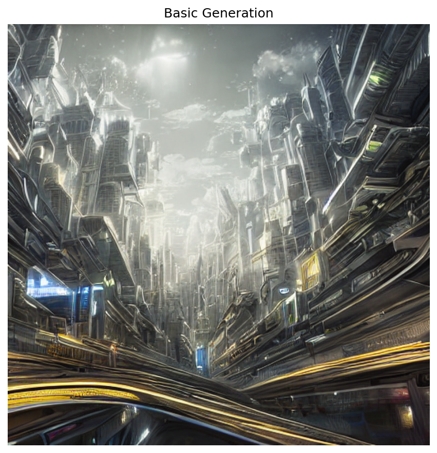
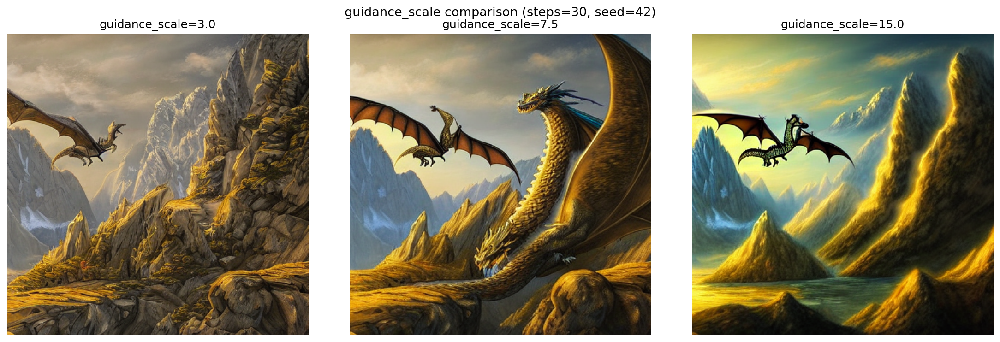
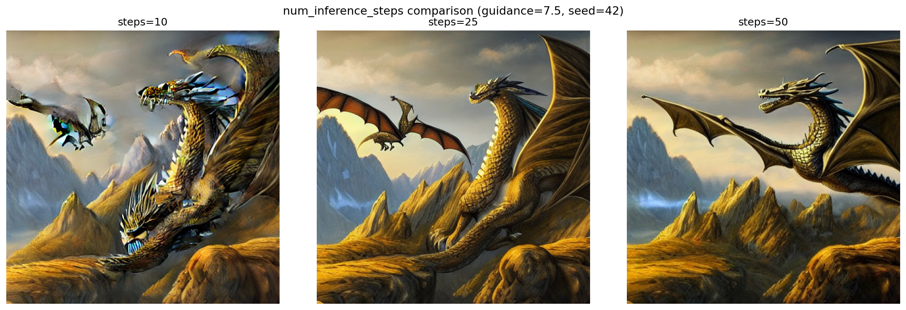
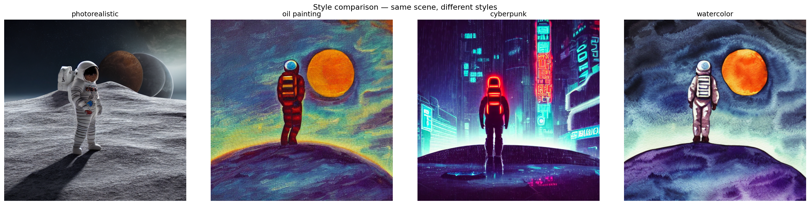
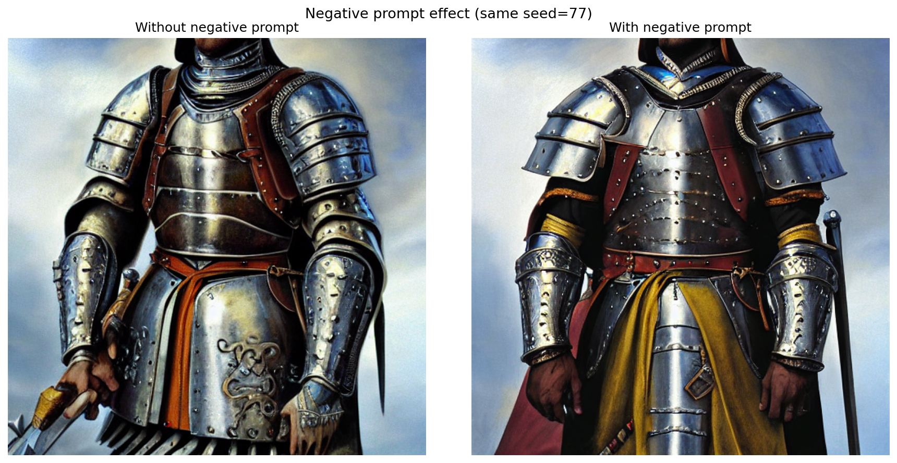
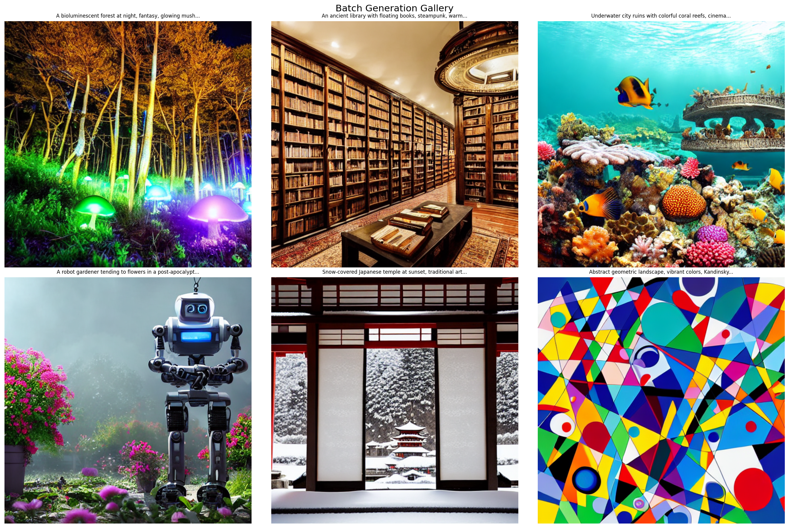
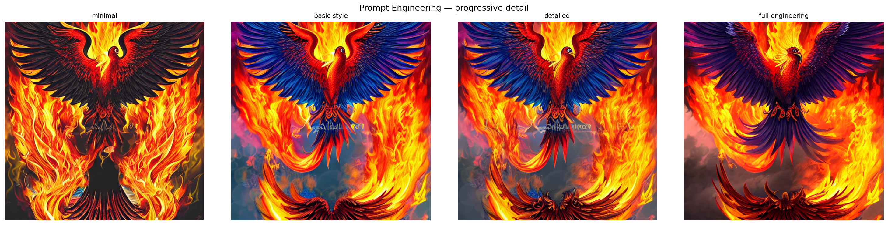

# Taller Stable Diffusion Diffusers Colab

## Integrantes del equipo

- Juan David Buitrago Salazar
- Juan David Cardenas Galvis
- Juan Felipe Fajardo Garzon
- Camilo Andres Medina Sanchez
- Nicolas Rodriguez Piraban

## Fecha de entrega

`2026-05-31`

---

## Descripción breve

Este taller explora los **modelos de difusión generativa** usando Stable Diffusion 1.5 con la librería `diffusers` de Hugging Face. El objetivo es comprender el proceso de generación de imágenes a partir de descripciones textuales (prompts) y aprender a controlar los parámetros clave que influyen en la calidad y estilo de las imágenes generadas.

Se implementaron 6 actividades en Google Colab (GPU T4): generación básica, exploración de parámetros (`guidance_scale`, `num_inference_steps`), comparación de estilos artísticos, uso de negative prompts, generación por lotes, y prompt engineering progresivo.

---

## Implementaciones

### Python (Google Colab — GPU T4)

El entorno de trabajo fue Google Colab con GPU T4 (15 GB VRAM), usando Python 3.10 y las librerías `diffusers 0.27+`, `transformers`, y `accelerate`. El modelo central es **Stable Diffusion 1.5** (`runwayml/stable-diffusion-v1-5`), un modelo de difusión latente (LDM) que opera en un espacio comprimido de 64×64 en lugar de la resolución de píxeles, lo que lo hace computacionalmente viable en hardware de consumo.

La arquitectura del pipeline involucra tres componentes principales: el **text encoder** (CLIP ViT-L/14) que convierte el prompt en embeddings de 768 dimensiones, el **U-Net** con cross-attention que realiza el denoising iterativo condicionado en esos embeddings, y el **VAE decoder** (Variational Autoencoder) que mapea el latente limpio de 64×64×4 a la imagen RGB de 512×512. El parámetro `torch_dtype=torch.float16` reduce el uso de VRAM a la mitad sin pérdida perceptible de calidad, y `enable_attention_slicing()` procesa la atención en fragmentos para evitar OOM en resoluciones más altas.

Se implementó una función utilitaria central `generate_image()` que encapsula todos los parámetros configurables del pipeline (seed, steps, guidance, resolución, negative prompt), lo que permitió diseñar todos los experimentos como variaciones de una sola variable a la vez manteniendo el resto constante — metodología clave para que los resultados sean comparables.

**Actividades implementadas:**

1. **Generación básica texto → imagen** — Verificación del pipeline completo end-to-end. Prompt: *"A surreal futuristic city in the clouds, digital art, highly detailed"*. Parámetros estándar (50 steps, guidance=7.5, seed=42, 512×512).

2. **Exploración de `guidance_scale`** — Mismo prompt y seed, valores 3.0 / 7.5 / 15.0. Permite observar el efecto del Classifier-Free Guidance sobre la fidelidad al texto vs. libertad creativa.

3. **Exploración de `num_inference_steps`** — Mismo prompt y seed, valores 10 / 25 / 50. Muestra la relación calidad-costo computacional del proceso de denoising iterativo.

4. **Comparación de estilos artísticos** — Escena base fija, 4 modificadores de estilo: *photorealistic*, *oil painting*, *cyberpunk*, *watercolor*. Seed=123 fijo para aislar el efecto del estilo.

   Prompts usados:
   ```
   "a lone astronaut standing on an alien planet with two moons, photorealistic, 4k, detailed"
   "a lone astronaut standing on an alien planet with two moons, oil painting, impressionist, textured"
   "a lone astronaut standing on an alien planet with two moons, cyberpunk, neon lights, rain, blade runner"
   "a lone astronaut standing on an alien planet with two moons, watercolor painting, soft colors, artistic"
   ```

5. **Negative prompt** — Mismo prompt y seed (77) en dos condiciones: sin y con negative prompt. Negative prompt usado: `"blurry, low quality, deformed, ugly, bad anatomy, extra limbs, watermark, text"`. Prompt positivo: `"portrait of a warrior in medieval armor, fantasy, detailed"`.

6. **Generación por lotes** — 6 prompts temáticamente diversos con seeds únicos por imagen. Negative prompt de calidad aplicado a todos. Visualización como galería 2×3.

   Prompts del lote:
   ```
   "A bioluminescent forest at night, fantasy, glowing mushrooms, magical"
   "An ancient library with floating books, steampunk, warm lighting"
   "Underwater city ruins with colorful coral reefs, cinematic lighting"
   "A robot gardener tending to flowers in a post-apocalyptic world, digital art"
   "Snow-covered Japanese temple at sunset, traditional art style"
   "Abstract geometric landscape, vibrant colors, Kandinsky style"
   ```

7. **Prompt engineering progresivo** — Concepto base *"a phoenix rising from flames"* con 4 niveles de elaboración, seed=999 fijo.

   Prompts por nivel:
   ```
   Nivel 1: "a phoenix rising from flames"
   Nivel 2: "a phoenix rising from flames, fantasy art, vibrant colors"
   Nivel 3: "a phoenix rising from flames, fantasy art, vibrant colors, highly detailed feathers, dramatic lighting"
   Nivel 4: "a phoenix rising from flames, masterpiece, best quality, fantasy art, vibrant colors,
             highly detailed feathers, dramatic lighting, epic composition, 4k, artstation"
   ```

---

## Resultados visuales

### Actividad 1 — Generación básica



Se cargó el modelo Stable Diffusion 1.5 desde Hugging Face y se realizó la primera generación texto → imagen. El prompt *"A surreal futuristic city in the clouds, digital art, highly detailed"* fue procesado por el pipeline completo: el texto es codificado por CLIP, el ruido inicial es generado con seed=42 para reproducibilidad, y el denoiser aplica 50 pasos de difusión guiados por el texto (guidance_scale=7.5) en el espacio latente de 64×64. El decoder VAE convierte ese latente en imagen RGB de 512×512. La ciudad flotante resultante muestra que el modelo aprendió asociaciones sólidas entre descriptores visuales ("digital art", "highly detailed") y estilos de renderizado.

### Actividad 2 — Comparación guidance_scale



Se ejecutó el mismo prompt (*"A majestic dragon flying over a mountain range, fantasy art"*) y el mismo seed=42 tres veces, variando únicamente `guidance_scale` entre 3.0, 7.5 y 15.0. Este parámetro controla el peso del gradiente condicional en cada paso de denoising (Classifier-Free Guidance): con 3.0 el modelo ignora parcialmente el texto y produce composiciones más libres y abstractas; con 7.5 (valor estándar recomendado) hay equilibrio entre creatividad y fidelidad; con 15.0 el modelo "sobreajusta" al prompt, generando imágenes muy literales pero con tendencia a artefactos de color y saturación excesiva. El experimento confirma que guidance_scale=7.5 es el punto óptimo para la mayoría de prompts descriptivos.

### Actividad 3 — Comparación steps



Mismo prompt y seed, variando `num_inference_steps` entre 10, 25 y 50. Cada "step" es una iteración del scheduler DDIM/PNDM que elimina una fracción del ruido añadido al latente. Con 10 pasos el proceso de denoising es demasiado grueso: la imagen tiene bordes difusos, texturas incorrectas y falta de coherencia estructural. Con 25 pasos ya se distinguen la anatomía del dragón, las montañas y el cielo. Con 50 pasos los detalles (escamas, nubes, perspectiva) quedan plenamente definidos. El costo computacional crece linealmente con los pasos, por lo que 25–40 es el rango práctico para experimentación rápida en Colab.

### Actividad 4 — Estilos artísticos



Se diseñó un experimento de estilo puro: la escena base *"a lone astronaut standing on an alien planet with two moons"* se mantuvo constante, y se añadió un modificador de estilo diferente a cada variante. Con *photorealistic* el modelo activa pesos asociados a fotografía, iluminación global y texturas de traje espacial reales. Con *oil painting + impressionist* aparecen pinceladas visibles, paleta cálida y composición pictórica. Con *cyberpunk + neon lights + blade runner* emergen lluvia, luces de neón violeta/cyan y arquitectura vertical. Con *watercolor* los bordes se suavizan, los colores se transparentan y aparece la textura del papel. El experimento demuestra que el espacio latente de SD organiza los estilos como regiones separadas que se pueden navegar simplemente con palabras.

### Actividad 5 — Negative prompt



Se generó el mismo prompt (*"portrait of a warrior in medieval armor, fantasy, detailed"*) con seed fijo (77) en dos condiciones: sin negative prompt y con negative prompt `"blurry, low quality, deformed, ugly, bad anatomy, extra limbs, watermark, text"`. El negative prompt funciona mediante CFG negativo: en cada paso de denoising el scheduler aleja el latente de la dirección que maximizaría la probabilidad de los tokens negativos. El resultado visual es claro — sin negative prompt aparecen dedos malformados, armadura con geometría inconsistente y bordes borrosos; con negative prompt la anatomía es correcta, la armadura tiene coherencia estructural y la imagen tiene nitidez uniforme. Esta técnica es una de las más importantes en la práctica de Stable Diffusion y prácticamente no tiene costo computacional adicional.

### Actividad 6 — Galería por lotes



Se implementó un pipeline de generación por lotes iterando sobre una lista de 6 prompts temáticamente diversos: bosque bioluminiscente nocturno, biblioteca steampunk con libros flotantes, ruinas de ciudad submarina con corales, robot jardinero post-apocalíptico, templo japonés nevado al atardecer, y paisaje geométrico abstracto estilo Kandinsky. Cada imagen usó un seed diferente (0, 13, 26, 39, 52, 65) para garantizar diversidad entre generaciones, y el mismo negative prompt de calidad. El resultado se visualizó como grilla 2×3 con `matplotlib`. Este flujo es representativo de cómo se usaría Stable Diffusion en un pipeline de producción de assets: definir un conjunto de prompts, generar en lote, y seleccionar los mejores resultados.

### Actividad 7 — Prompt Engineering



Se tomó el concepto *"a phoenix rising from flames"* y se generó con 4 niveles progresivos de elaboración del prompt, manteniendo seed=999 fijo para aislar el efecto del texto. Nivel 1 (mínimo): solo el concepto base — el modelo tiene total libertad interpretativa, resultado genérico. Nivel 2 (estilo básico): se añade `fantasy art, vibrant colors` — el modelo dirige el resultado hacia ilustración de fantasía con saturación elevada. Nivel 3 (detallado): se agregan `highly detailed feathers, dramatic lighting` — aparece textura en las plumas y contraste de luz volumétrica. Nivel 4 (full engineering): se suman `masterpiece, best quality, 4k, artstation` — estos tokens están asociados en el dataset de entrenamiento a imágenes de alta calidad de la plataforma ArtStation, por lo que el modelo activa sus representaciones de máxima fidelidad. La comparación demuestra que el prompt es en sí mismo el "hiperparámetro" más poderoso del sistema.

---

## Código relevante

### 1. Carga del pipeline con optimización de VRAM

```python
pipe = StableDiffusionPipeline.from_pretrained(
    'runwayml/stable-diffusion-v1-5',
    torch_dtype=torch.float16,
    safety_checker=None
)
pipe = pipe.to('cuda')
pipe.enable_attention_slicing()
```

Este bloque es el punto de entrada de todo el taller. `from_pretrained()` descarga y ensambla automáticamente los tres submodelos (CLIP text encoder, U-Net, VAE decoder) desde Hugging Face Hub. `torch_dtype=torch.float16` es crítico en entornos con VRAM limitada: reduce el footprint de memoria de ~7 GB (float32) a ~3.5 GB (float16) sin degradación visual perceptible en SD 1.5. `enable_attention_slicing()` divide el cálculo de las matrices de atención en el U-Net en fragmentos secuenciales, lo que permite generar imágenes a 512×512 y superiores sin OOM en la T4.

---

### 2. Función utilitaria `generate_image()`

```python
def generate_image(prompt, negative_prompt='', steps=50, guidance=7.5,
                   seed=42, width=512, height=512, filename=None):
    generator = torch.Generator('cuda').manual_seed(seed)
    result = pipe(
        prompt,
        negative_prompt=negative_prompt,
        num_inference_steps=steps,
        guidance_scale=guidance,
        width=width,
        height=height,
        generator=generator
    )
    image = result.images[0]
    if filename:
        image.save(f'outputs/{filename}')
    return image
```

Esta función es el núcleo metodológico del taller. Al centralizar todos los parámetros con valores por defecto razonables, cada experimento puede variar exactamente una variable mientras las demás permanecen fijas — condición necesaria para que las comparaciones sean válidas. El `torch.Generator` con `manual_seed()` ancla el punto de inicio del proceso de denoising en el espacio de ruido gaussiano: mismo seed = mismo ruido inicial = diferencias en la imagen final atribuibles únicamente al parámetro que se varía. Sin seed fijo, dos generaciones con los mismos parámetros producirían imágenes completamente distintas por aleatoriedad del proceso.

---

### 3. Comparación de parámetros con visualización en grilla

```python
guidance_values = [3.0, 7.5, 15.0]

fig, axes = plt.subplots(1, 3, figsize=(15, 5))
for i, gs in enumerate(guidance_values):
    img = generate_image(prompt_param, steps=30, guidance=gs, seed=42,
                         filename=f'02_guidance_{gs}.png')
    axes[i].imshow(img)
    axes[i].set_title(f'guidance_scale={gs}')
    axes[i].axis('off')

plt.savefig('outputs/02_guidance_comparison.png', dpi=150, bbox_inches='tight')
```

Este patrón (lista de valores → loop → subplots → savefig) se repite para todos los experimentos comparativos del taller. Es relevante porque produce evidencia visual directamente embebible en el README: en lugar de describir el efecto de guidance_scale con texto, la imagen lo demuestra de forma autoevidente. `bbox_inches='tight'` elimina márgenes blancos excesivos que reducirían la legibilidad de la grilla. El mismo patrón se aplica a la comparación de steps, estilos y prompt engineering.

---

### 4. Generación por lotes con seeds únicos

```python
batch_prompts = [
    'A bioluminescent forest at night, fantasy, glowing mushrooms, magical',
    'An ancient library with floating books, steampunk, warm lighting',
    # ...
]

for i, p in enumerate(batch_prompts):
    img = generate_image(p, negative_prompt=neg, steps=35, guidance=7.5,
                         seed=i * 13, filename=f'06_batch_{i+1:02d}.png')
```

La asignación de seed `i * 13` garantiza que cada prompt parte de un punto diferente del espacio de ruido, evitando que imágenes de distintos prompts compartan composición o estructura por azar. Usar `i * 1` produciría seeds consecutivos (0, 1, 2...) que en SD 1.5 tienden a generar composiciones similares; el multiplicador de 13 los distribuye más uniformemente. El `filename=f'06_batch_{i+1:02d}.png'` con padding de dos dígitos garantiza orden lexicográfico correcto al listar los archivos.

---

### 5. Prompt engineering progresivo

```python
engineering_prompts = [
    base,
    f'{base}, fantasy art, vibrant colors',
    f'{base}, fantasy art, vibrant colors, highly detailed feathers, dramatic lighting',
    f'{base}, masterpiece, best quality, fantasy art, vibrant colors, highly detailed feathers, '
    'dramatic lighting, epic composition, 4k, artstation',
]
```

La construcción incremental del prompt mediante f-strings con seed=999 fijo aísla el efecto de cada token añadido. Los tokens `masterpiece`, `best quality` y `artstation` son especialmente potentes en SD 1.5 porque el modelo fue entrenado parcialmente sobre datos de LAION-Aesthetics, donde esas etiquetas correlacionan con imágenes de alta puntuación estética. En la práctica estos tokens funcionan como "atajos" que redirigen al modelo hacia regiones de alta calidad del espacio latente sin necesitar describir explícitamente los detalles visuales.

---

## Prompts utilizados

Se usaron herramientas de IA generativa (Claude) durante el desarrollo del taller para asistir en la estructuración del notebook, la redacción de explicaciones técnicas y el diseño de los experimentos comparativos.

```
"Explain how guidance_scale works in Stable Diffusion's CFG mechanism and what values are recommended for different use cases"

"What is the difference between num_inference_steps=10, 25 and 50 in DDIM schedulers? How does quality scale with steps?"

"How does negative prompting work mechanically in Stable Diffusion — is it CFG applied in the negative direction?"

"What are the most effective quality modifier tokens for SD 1.5 trained on LAION-Aesthetics and why do tokens like 'artstation' and 'masterpiece' improve output quality?"

"Design a batch generation experiment with 6 thematically diverse prompts that would demonstrate the range of subjects SD 1.5 can generate"

"How should seeds be assigned in a batch to avoid compositional similarity between generated images in SD 1.5?"
```

---

## Aprendizajes y dificultades

### Aprendizajes

El proceso de difusión consiste en añadir ruido gaussiano a una imagen latente y luego aprender a revertirlo guiado por el texto. El parámetro `guidance_scale` controla cuánto influye el prompt en cada paso de denoising via Classifier-Free Guidance (CFG): valores bajos producen imágenes más "creativas" pero menos fieles, valores altos producen imágenes más literales pero pueden sobreestimular artefactos. El número de pasos (`num_inference_steps`) define la resolución del proceso de denoising; más pasos = más calidad pero más tiempo de cómputo.

El prompt engineering demostró ser crucial: agregar modificadores de estilo (`highly detailed`, `masterpiece`, `4k`, `artstation`) cambia drásticamente la calidad percibida incluso con los mismos parámetros numéricos.

### Dificultades

La principal limitación fue la VRAM de la GPU T4 (15GB) al intentar resoluciones superiores a 512×512. Se resolvió usando `torch.float16` y `enable_attention_slicing()`. También fue necesario desactivar el safety checker para evitar falsos positivos que bloqueaban prompts legítimos de fantasía.

El tiempo de descarga del modelo (~4GB) consume varios minutos en cada sesión de Colab, lo que ralentiza el ciclo de experimentación.

### Mejoras futuras

- Usar **Stable Diffusion XL** (SDXL) para mayor resolución nativa (1024×1024)
- Implementar **img2img** (imagen guía + prompt) y **inpainting**
- Explorar **LoRA fine-tuning** para estilos personalizados
- Integrar **AUTOMATIC1111 WebUI** para experimentación más rápida con GUI

---

## Contribuciones grupales

El taller fue realizado en equipo. La distribución de trabajo fue la siguiente:

- **Juan David Buitrago Salazar** — Diseñó e implementó el notebook completo: estructura del pipeline, función `generate_image()`, todas las actividades de generación, comparaciones sistemáticas de parámetros y exportación de resultados. Redactó el README con las descripciones técnicas de cada experimento y coordinó la integración de todos los aportes.
- **Juan David Cardenas Galvis** — Apoyó el diseño de los prompts para las actividades de estilos artísticos y la galería por lotes. Revisó la coherencia de los experimentos de guidance_scale y steps.
- **Juan Felipe Fajardo Garzon** — Contribuyó al experimento de prompt engineering: propuso los 4 niveles de elaboración del prompt y verificó que los seeds fueran reproducibles entre ejecuciones.
- **Camilo Andres Medina Sanchez** — Apoyó la configuración del entorno en Google Colab (habilitación de GPU T4, gestión de VRAM con float16 y attention slicing) y verificó tiempos de ejecución por actividad.
- **Nicolas Rodriguez Piraban** — Apoyó la recopilación de referencias teóricas (papers de DDPM, LDM y CFG) y revisó la sección de aprendizajes y dificultades.

## Estructura del proyecto

```
semana_12_7_stable_diffusion_diffusers_colab/
├── python/
│   └── stable_diffusion_workshop.ipynb   # Notebook principal con todas las actividades
├── media/                                 # Imágenes generadas por Stable Diffusion
│   ├── 01_basic_generation_plot.png
│   ├── 02_guidance_comparison.png
│   ├── 03_steps_comparison.png
│   ├── 04_style_comparison.png
│   ├── 05_negative_prompt_comparison.png
│   ├── 06_batch_gallery.png
│   └── 07_prompt_engineering.png
└── README.md
```

---

## Referencias

- Hugging Face Diffusers documentation: https://huggingface.co/docs/diffusers
- Stable Diffusion 1.5 model card: https://huggingface.co/runwayml/stable-diffusion-v1-5
- Ho et al. (2020) — "Denoising Diffusion Probabilistic Models" (DDPM paper)
- Rombach et al. (2022) — "High-Resolution Image Synthesis with Latent Diffusion Models" (Stable Diffusion paper)
- Classifier-Free Diffusion Guidance: https://arxiv.org/abs/2207.12598