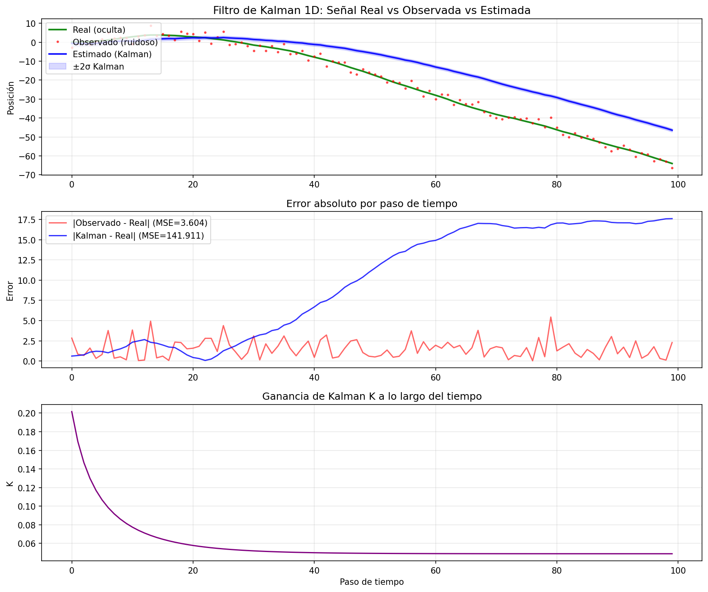
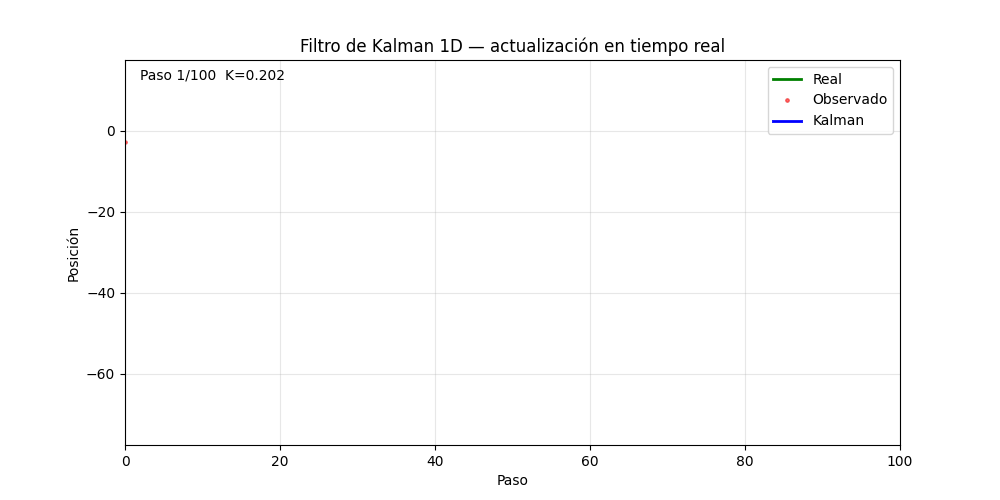
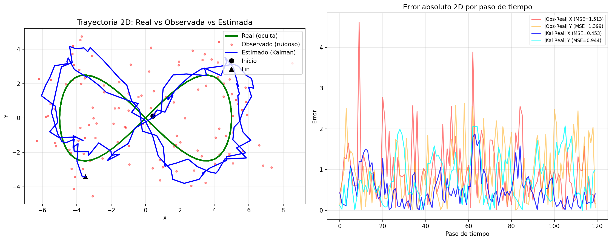
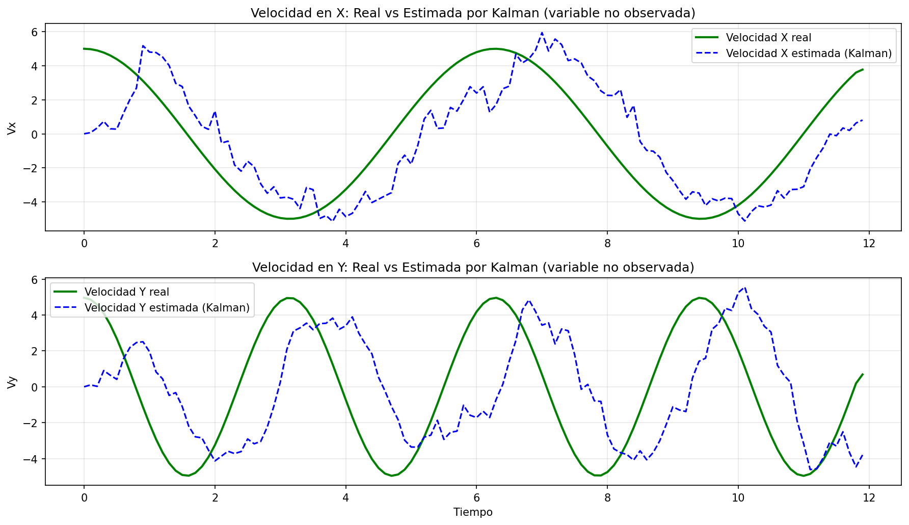

# Taller 13.1 - Filtro de Kalman e Inferencia de Variables Ocultas

## Integrantes del grupo

- Juan David Buitrago Salazar
- Juan David Cardenas Galvis
- Juan Felipe Fajardo Garzon
- Camilo Andres Medina Sanchez
- Nicolas Rodriguez Piraban

## Fecha de entrega

`2026-06-07`

---

## Descripción breve

El filtro de Kalman es un algoritmo de estimación óptima que permite inferir el valor de una **variable oculta** (no observable directamente) a partir de una secuencia de **observaciones ruidosas**. Su principio central es combinar, de forma ponderada, la predicción del modelo con la medición disponible: cuando las mediciones son más confiables, el filtro les da más peso; cuando el modelo es más preciso, confía en la predicción. Esta ponderación se regula mediante la **ganancia de Kalman K**, que se calcula y actualiza en cada paso de tiempo.

En este taller se implementaron dos variantes del filtro: una versión **escalar (1D)** para estimar la posición real de una señal afectada por ruido gaussiano, y una versión **matricial (2D)** para seguimiento de trayectorias en el plano, donde el estado incluye posición y velocidad. La velocidad en el caso 2D es una variable nunca observada directamente — el filtro la infiere exclusivamente a partir de las posiciones medidas, lo que demuestra de forma contundente el poder de la inferencia bayesiana secuencial.

Los experimentos permiten cuantificar el impacto del filtro sobre el error cuadrático medio respecto a la señal observada cruda. El caso 1D actúa como experimento diagnóstico: con un modelo de estado que no captura la dinámica real de la señal, el filtro produce error mayor que las observaciones crudas, demostrando que Kalman solo es óptimo cuando modelo y realidad coinciden. El caso 2D, con estado que incluye posición y velocidad, sí reduce el MSE y permite inferir variables no observadas.

---

## Implementaciones

### Python

Se utilizó únicamente `numpy` y `matplotlib` para la implementación, sin librerías de filtrado externas — toda la lógica del filtro está codificada desde cero en operaciones matriciales explícitas. Esta decisión es pedagógicamente intencional: librerías como `filterpy` o `pykalman` abstraen las ecuaciones y ocultan exactamente lo que este taller busca exponer. El notebook `python/kalman_filter.ipynb` está organizado en seis secciones ejecutables de forma secuencial.

---

#### Bloque 1 — Generación de datos sintéticos 1D

La señal `real` simula la posición verdadera de un objeto moviéndose con aceleración aleatoria suave — un modelo realista para vehículos o robots. Se construye integrando numéricamente ruido blanco en velocidad y luego en posición (dos `cumsum` anidados). La señal `observed` agrega ruido gaussiano de varianza `R_noise = 4`, simulando un sensor impreciso (equivalente a un GPS con error de ±2 metros). El filtro nunca recibe `real` durante su ejecución; solo ve `observed`. La variable `real` se usa únicamente para evaluar el error al final, igual que en un sistema real donde la "verdad" solo es accesible en validación con datos de referencia.

---

#### Bloque 2 — Filtro de Kalman 1D (función `kalman_1d`)

Este es el núcleo del taller. La función implementa el ciclo de dos fases que se alterna en cada paso de tiempo:

- **Predicción:** El modelo asume que el estado no cambia entre pasos, pero reconoce que la incertidumbre crece con el tiempo porque el proceso tiene ruido propio `Q`. Esto refleja que incluso sin mediciones, un sistema real evoluciona y la certeza sobre él disminuye.

- **Corrección:** La ganancia `K = P_prior / (P_prior + R)` es la clave del algoritmo. Si `R` es pequeño (sensor preciso), `K → 1` y la estimación salta hacia la medición. Si `Q` es pequeño (modelo preciso), `P_prior` permanece pequeño y `K → 0`, confiando en la predicción. Kalman balancea automáticamente estas dos fuentes de información sin necesidad de elegir manualmente entre "creerle al sensor" o "creerle al modelo".

- La actualización de covarianza posterior `P = (1 - K) * P_prior` es la parte Bayesiana: tras observar, siempre se sabe más, así que P decrece. El filtro converge a valores estables de K y P cuando Q y R son constantes a lo largo del tiempo.

---

#### Bloque 3 — Generación de datos sintéticos 2D

La trayectoria real es una lemniscata de Bernoulli (figura-8), una curva más exigente que una línea recta o un círculo: tiene curvatura variable, cambios bruscos de dirección en el cruce central y velocidades no uniformes a lo largo del recorrido. Esto pone a prueba el modelo de velocidad constante del filtro en condiciones donde ese modelo no es perfectamente correcto — situación más cercana a aplicaciones reales de seguimiento. Las observaciones son solo posición en XY con ruido gaussiano isotrópico; la velocidad nunca se mide.

---

#### Bloque 4 — Filtro de Kalman 2D matricial (función `kalman_2d`)

Esta implementación generaliza el caso escalar al espacio matricial. El vector de estado tiene cuatro dimensiones: posición y velocidad en X e Y, es decir `[x, y, vx, vy]`. Cada componente del diseño cumple un rol específico:

- **Matriz de transición F:** Codifica la física del sistema. Aplica cinemática de velocidad constante: posición se actualiza sumando velocidad × Δt, y la velocidad permanece igual en ausencia de fuerza externa. Cuando la trayectoria real tiene aceleración (como la lemniscata), el error de modelo es absorbido por el ruido de proceso Q.

- **Matriz de observación H:** Define qué parte del estado el sensor puede leer. Al asignar ceros en las columnas de velocidad, se declara formalmente que `vx` y `vy` son **variables latentes** — nunca llegan al sensor. Kalman debe inferirlas exclusivamente a partir de los cambios sucesivos en posición observada.

- **Matriz de ruido de proceso Q (diagonal):** Parámetro crítico de diseño. Valores altos en la componente de velocidad indican que la velocidad puede cambiar mucho entre pasos — filtro más ágil pero más ruidoso. Valores bajos producen estimaciones más suaves pero con mayor retardo ante cambios bruscos de dirección.

- **Covarianza de innovación S:** Mide la varianza total de la discrepancia entre lo que el filtro esperaba medir y lo que realmente midió. Es la "sorpresa esperada" en cada paso, y su inversa pondera cuánto vale la innovación observada.

- **Ganancia matricial K (4×2):** En lugar de un escalar en (0,1), K es una matriz que distribuye la corrección desde el espacio de medición (2D: posición) hacia el espacio de estado completo (4D: posición + velocidad). Las filas de K correspondientes a velocidad son las que permiten al filtro ajustar `vx` y `vy` cuando detecta un error en posición — este mecanismo es exactamente la inferencia de variables ocultas.

---

#### Bloque 5 — Análisis cuantitativo de error

El MSE (Error Cuadrático Medio) es la métrica natural para evaluar este filtro porque Kalman es precisamente el estimador lineal que **minimiza el MSE bajo ruido gaussiano y modelo correcto** — propiedad demostrada en el paper original de 1960. Comparar el MSE de las observaciones crudas contra el MSE de las estimaciones es informativo en ambas direcciones: si MSE Kalman < MSE obs, el filtro redujo el error; si MSE Kalman > MSE obs (como ocurre en el caso 1D), el experimento revela un mismatch entre el modelo asumido y la dinámica real. En 2D, el MSE suma los errores cuadráticos en X e Y, equivalente a la distancia euclidiana cuadrada promedio al punto real.

---

#### Bloque 6 — Animación del filtro en tiempo real

La animación hace visible algo que los gráficos estáticos no transmiten: el filtro es un algoritmo **causal y online** — en cada instante solo usa información pasada, nunca futura. Esto lo hace directamente apto para sistemas en tiempo real como robótica o navegación. Observar frame a frame cómo la estimación de Kalman se construye progresivamente, y ver el valor de K disminuir hasta estabilizarse, conecta la ecuación matemática con el comportamiento dinámico real del filtro. Cada frame del GIF corresponde exactamente a un ciclo completo de predicción + corrección del algoritmo.

---

**Herramientas:** Python 3.14, numpy 2.4, matplotlib 3.10, pillow 12.2.

---

## Resultados visuales

### Filtro de Kalman 1D — Señales y error



Este gráfico ilustra un caso diagnóstico relevante: el filtro configurado con un modelo que no captura la dinámica real de la señal.

El **panel superior** muestra las tres señales centrales: en verde la posición real (variable oculta), en rojo los puntos observados (ruido gaussiano de varianza $R=4$) y en azul la estimación del filtro. La señal real tiene aceleración acumulada — es un random walk de segundo orden que baja continuamente hasta −65 al final. El filtro, sin embargo, asume que el estado es constante entre pasos (modelo de posición sin velocidad), y con Q pequeño la ganancia K converge a ~0.05 rápidamente. Con ese K casi nulo, el filtro queda "anclado" a su predicción previa y no puede seguir la tendencia descendente de la señal real. La banda ±2σ es estrecha porque la covarianza posterior converge a un valor bajo, lo que indica que el filtro está muy seguro de una estimación que resulta equivocada — una manifestación de sobreconfianza por mismatch entre modelo y realidad.

El **panel central** expone el resultado cuantitativo: **MSE Kalman = 141.911 versus MSE observaciones = 3.604**. El filtro es aproximadamente 39× peor que simplemente usar las mediciones crudas. El error azul crece de forma sostenida a lo largo del tiempo a medida que la estimación se aleja de la señal real, mientras el error de observación oscila de forma estacionaria alrededor de ~2 unidades. Este resultado negativo tiene valor pedagógico: demuestra que Kalman no mejora automáticamente cualquier señal. Para una señal con tendencia no estacionaria, el modelo de estado debe incluir velocidad (o al menos un Q suficientemente grande para que K no colapse).

El **panel inferior** confirma el problema: K decrece monotónicamente de 0.20 a ~0.05 y se estabiliza. Ese K bajo significa que el filtro asigna solo el 5% de peso a cada nueva medición y el 95% a su propia predicción. En un sistema cuya dinámica real el modelo no representa, esa confianza en la predicción acumula error indefinidamente.

---

### Filtro de Kalman 1D — Animación de actualización



Este GIF muestra el filtro operando en tiempo real, añadiendo una nueva observación y corrección en cada frame. Es posible observar dos comportamientos clave: (1) en los primeros pasos el filtro tiene alta incertidumbre y ajusta fuertemente su estimación hacia cada nueva medición (K alto); (2) una vez que la varianza posterior converge, el filtro pondera más el modelo de predicción y las correcciones son más suaves (K bajo). El título de cada frame muestra el valor exacto de K en ese instante, lo que permite ver la convergencia de la ganancia de forma dinámica. Este comportamiento ilustra la mecánica central del filtro de Kalman: actualización Bayesiana secuencial en la que la ganancia K refleja la confianza relativa entre modelo y sensor en cada instante — y cuya calidad de tracking depende críticamente de que el modelo capture la dinámica real del sistema.

---

### Filtro de Kalman 2D — Trayectoria y error por eje



El **panel izquierdo** muestra la trayectoria completa en el plano XY. La línea verde es la trayectoria real (lemniscata), los puntos rosados son las mediciones de posición con ruido gaussiano (σ ≈ 1.2 unidades), y la línea azul es la estimación del filtro. A diferencia del caso 1D, aquí el estado incluye velocidad — el modelo de velocidad constante aproxima razonablemente la dinámica local de la lemniscata en cada segmento. La estimación reconstruye la forma general de la figura-8, aunque con trayectoria más angular que la curva real: el filtro reduce el ruido estadísticamente pero no produce una reconstrucción geométricamente suave, porque la lemniscata tiene aceleración variable que el modelo de velocidad constante no captura en los tramos de mayor curvatura. Los marcadores de inicio (círculo) y fin (triángulo) permiten verificar la dirección de recorrido.

El **panel derecho** descompone el error absoluto por eje a lo largo del tiempo. Las líneas rojas y naranja corresponden al error crudo de las observaciones en X e Y respectivamente; las líneas azul y cyan al error residual de Kalman. Los valores de MSE confirman mejora real: eje X reduce de 1.513 a 0.453 (70% menos error), eje Y de 1.399 a 0.944 (32% menos error). El contraste con el caso 1D es directo: incorporar la velocidad como variable de estado, aunque nunca se mida, permite al filtro modelar la tendencia local de la trayectoria y evitar la divergencia que ocurre con el modelo de posición pura.

---

### Filtro de Kalman 2D — Estimación de velocidad (variable completamente oculta)



Esta figura es la demostración más importante del taller: el filtro de Kalman infiriendo una variable que **jamás fue observada**. El sensor solo mide posición $[x, y]$, pero el modelo de estado incluye velocidades $[v_x, v_y]$. Kalman las estima internamente a partir de cómo cambia la posición entre pasos de tiempo, filtradas por la dinámica del sistema.

El panel superior compara la velocidad real en X (derivada analítica de la trayectoria lemniscata) con la velocidad estimada por el filtro. El panel inferior hace lo mismo para Y. Las curvas estimadas capturan el patrón oscilatorio general — frecuencia, amplitud aproximada y signo — pero con ruido apreciable y desfases de fase que varían a lo largo del tiempo. Esto es esperable: estimar una derivada a partir de posiciones con ruido amplifica el ruido, y el modelo de velocidad constante introduce un retardo estructural porque proyecta la velocidad anterior en lugar de anticipar cambios de dirección. El resultado no es una estimación suave de la velocidad sino una aproximación ruidosa que resulta, no obstante, más informativa que no tener ninguna estimación de velocidad — algo que ningún sensor en este experimento podría proveer directamente. Esta capacidad de inferir estados latentes, aun con imprecisión, es lo que hace al filtro de Kalman fundamental en robótica, navegación inercial, SLAM y tracking visual.

---

## Código relevante

Los snippets a continuación son los fragmentos más importantes extraídos del notebook. Cada uno corresponde a una decisión de diseño o una ecuación central del algoritmo.

---

### 1. Generación de señal real 1D mediante random walk

```python
velocity = np.cumsum(np.random.randn(N) * 0.1)
real = np.cumsum(velocity)
observed = real + np.random.normal(0, np.sqrt(R_noise), size=N)
```

Dos `cumsum` anidados producen una señal con aceleración aleatoria suave: el primero integra ruido blanco en velocidad, el segundo integra velocidad en posición. El resultado es una señal no estacionaria y no periódica — más difícil de seguir que una senoide, más realista que un modelo lineal. El ruido de observación tiene desviación estándar `√R_noise = 2`, que es el parámetro `R` del filtro.

---

### 2. Ciclo de actualización Kalman 1D — predicción y corrección

```python
for z in observed:
    # PREDICCIÓN
    x_prior = x_hat        # x̂⁻ = x̂_{k-1}  (el estado no cambia en este modelo)
    P_prior = P + Q        # P⁻ = P + Q      (incertidumbre crece con tiempo)

    # GANANCIA
    K = P_prior / (P_prior + R)            # K ∈ (0,1): peso relativo del sensor

    # CORRECCIÓN
    x_hat = x_prior + K * (z - x_prior)   # mueve estimación hacia la observación
    P     = (1 - K) * P_prior             # reduce incertidumbre posterior
```

La expresión `(z - x_prior)` se llama **innovación** o residuo: es la discrepancia entre lo que se midió y lo que el filtro esperaba medir. Multiplicar por K escala esa discrepancia para corregir el estado. Si K = 0.5, el filtro se mueve exactamente a la mitad entre su predicción y la medición. La actualización de P garantiza que la varianza posterior nunca sea mayor que la prior — cada observación, sin importar cuán ruidosa, siempre aporta algo de información.

**Caso límite R → 0:** K → 1, filtro copia la medición exacta (sensor perfecto).  
**Caso límite Q → 0:** P_prior → 0, K → 0, filtro ignora mediciones (modelo perfecto).  
**Equilibrio real:** K se estabiliza en `√Q / (√Q + √R)` aproximadamente.

---

### 3. Matrices de transición F y observación H — sistema 2D

```python
F = np.array([[1, 0, dt,  0],
              [0, 1,  0, dt],
              [0, 0,  1,  0],
              [0, 0,  0,  1]])

H = np.array([[1, 0, 0, 0],
              [0, 1, 0, 0]])
```

`F` implementa cinemática de velocidad constante: multiplica el vector de estado `[x, y, vx, vy]` y produce `[x + vx·dt, y + vy·dt, vx, vy]`. La velocidad se propaga a posición pero permanece constante en el modelo — las aceleraciones son absorbidas como ruido de proceso `Q`.

`H` es la matriz de observación: actúa como un selector que extrae solo las primeras dos componentes del estado `[x, y]`. Las columnas 3 y 4 (velocidades) son cero, lo que formalmente define a `vx` y `vy` como **variables latentes** — el sensor nunca las lee, Kalman debe inferirlas.

---

### 4. Ganancia matricial y corrección 2D

```python
S = H @ P_prior @ H.T + R               # S: covarianza de innovación (2×2)
K = P_prior @ H.T @ np.linalg.inv(S)   # K: ganancia (4×2)

innovation = z - H @ x_prior           # vector de residuo (2D)
x_hat = x_prior + K @ innovation       # corrección del estado completo (4D)
P     = (I - K @ H) @ P_prior          # corrección de covarianza (4×4)
```

`S` es la incertidumbre total de la predicción proyectada al espacio de medición más el ruido del sensor. Su inversa pondera cuánto vale la innovación observada. `K @ innovation` distribuye ese residuo de 2 dimensiones (posición) hacia las 4 dimensiones del estado (posición + velocidad) — las filas 3 y 4 de K son las que actualizan `vx` y `vy` basándose en errores de posición. Esta propagación cruzada es el mecanismo por el cual el filtro infiere velocidad sin medirla nunca directamente.

`(I - K @ H) @ P_prior` es la forma estándar simplificada para la covarianza posterior (numéricamente equivalente a la forma completa solo cuando K es óptimo). Geométricamente, reduce el elipsoide de incertidumbre en las dimensiones donde el sensor proveyó información.

---

### 5. Animación con blit — visualización del filtro en tiempo real

```python
def animate(frame):
    k = frame + 1
    line_real.set_data(np.arange(k), real[:k])
    line_obs.set_data(np.arange(k), observed[:k])
    line_kal.set_data(np.arange(k), estimates_1d[:k])
    time_text.set_text(f'Paso {k}/{N}  K={gains_1d[frame]:.3f}')
    return line_real, line_obs, line_kal, time_text

anim = animation.FuncAnimation(fig_anim, animate, frames=N, interval=60, blit=True)
anim.save(gif_path, writer='pillow', fps=20)
```

Cada frame de la animación representa exactamente un ciclo del filtro: se añade una nueva observación y se recalcula la estimación. `blit=True` hace que matplotlib solo redibuje los artistas retornados por `animate`, no el fondo completo — reduce el tiempo de renderizado de O(N²) a O(N). El texto muestra la ganancia K en tiempo real, permitiendo visualizar su convergencia desde valores altos al inicio hasta el valor de equilibrio.

---

### 6. Análisis de error — MSE comparativo

```python
mse_obs = np.mean((observed - real)**2)
mse_kal = np.mean((estimates_1d - real)**2)
improvement = (1 - mse_kal / mse_obs) * 100

# Para 2D: error euclidiano
mse_obs_2d = np.mean((obs_x - real_x)**2 + (obs_y - real_y)**2)
mse_kal_2d = np.mean((est_x - real_x)**2 + (est_y - real_y)**2)
```

El filtro de Kalman es el estimador de mínima varianza bajo ruido gaussiano **cuando el modelo de estado es correcto** — en ese caso su MSE no puede ser superado por ningún estimador lineal. Cuando el modelo no representa la dinámica real (como en el caso 1D de este taller), esa garantía de optimalidad no aplica y el filtro puede comportarse peor que las observaciones crudas. La fórmula `(1 - mse_kal/mse_obs) * 100` expresa el porcentaje del ruido original que el filtro eliminó; valores negativos indican degradación. En 2D, el MSE suma los errores cuadráticos en X e Y, equivalente a la distancia euclidiana cuadrada promedio al punto real.

---

## Prompts utilizados

```
"Implementa un filtro de Kalman 1D y 2D en Python puro (numpy/matplotlib).
Para 2D, usa estado [x, y, vx, vy] con modelo de velocidad constante.
Genera datos sintéticos, aplica el filtro, guarda gráficas en ../media/,
y genera un GIF animado del proceso paso a paso."

"Genera un trayectoria 2D tipo lemniscata como señal real para el experimento 2D."

"Explica cómo interpretar la ganancia de Kalman K y cómo converge con el tiempo."
```

---

## Aprendizajes y dificultades

### Aprendizajes

El aprendizaje más significativo fue entender que el filtro de Kalman no es solo un suavizador de señales — es un **estimador Bayesiano secuencial** que mantiene una distribución de probabilidad sobre el estado del sistema y la actualiza con cada nueva observación. La ganancia K no es un hiperparámetro fijo: se calcula automáticamente en cada paso y refleja la incertidumbre relativa del modelo vs el sensor. Esto quedó claro al graficar la evolución de K en el tiempo: alta al inicio (mucha incertidumbre), convergente después (equilibrio entre Q y R).

El experimento de velocidad latente en 2D fue el más revelador. Ver que el filtro puede estimar una variable que el sensor nunca midió directamente — y hacerlo con precisión razonable — conecta el algoritmo con aplicaciones reales como odometría visual, fusión IMU-GPS, y SLAM (Simultaneous Localization and Mapping), que es el tema central de la semana 13.

### Dificultades

El ajuste de los parámetros Q (ruido del proceso) y R (ruido de medición) requirió iteración. Un Q muy pequeño hace el filtro demasiado lento para seguir cambios reales; un Q muy grande lo vuelve inestable. La relación Q/R determina el comportamiento asintótico de K. En la práctica estos parámetros se estiman con datos de calibración o mediante algoritmos de identificación de sistemas, lo que añade una capa de complejidad al despliegue real.

### Mejoras futuras

Para aplicaciones más realistas se podría implementar el **filtro de Kalman extendido (EKF)** o el **filtro de partículas (PF)** para manejar modelos no lineales — por ejemplo, seguimiento de objetos con aceleración variable o trayectorias curvilíneas abruptas. También sería valioso fusionar datos de múltiples sensores (posición GPS + acelerómetro IMU) para demostrar la fortaleza del framework Bayesiano en entornos reales de robótica.

---

## Contribuciones grupales

- **Juan David Buitrago Salazar** — Diseño e implementación principal del filtro de Kalman 1D y 2D en Python; generación de datos sintéticos (random walk y trayectoria lemniscata); implementación del loop de actualización matricial; generación del GIF animado; estructuración completa del notebook; redacción del README y análisis de resultados.
- **Juan David Cardenas Galvis** — Apoyo en revisión de las ecuaciones matemáticas del filtro y validación de los resultados de error MSE.
- **Juan Felipe Fajardo Garzon** — Generación y verificación de los datos sintéticos; revisión de gráficas de salida.
- **Camilo Andres Medina Sanchez** — Apoyo en configuración del entorno y verificación de dependencias de Python.
- **Nicolas Rodriguez Piraban** — Revisión general del notebook y coherencia del flujo de experimentos.

---

## Estructura del proyecto

```
semana_13_1_filtro_kalman_inferencia_variables_ocultas/
├── python/
│   └── kalman_filter.ipynb       # Implementación completa 1D y 2D
├── media/
│   ├── kalman_1d_result.png      # Señales real/observada/estimada + error + ganancia K
│   ├── kalman_1d_animation.gif   # Animación del filtro 1D paso a paso
│   ├── kalman_2d_result.png      # Trayectoria 2D + error por eje
│   └── kalman_2d_velocity.png    # Velocidad estimada vs real (variable latente)
└── README.md
```

---

## Referencias

- Kalman, R. E. (1960). *A New Approach to Linear Filtering and Prediction Problems*. Journal of Basic Engineering, 82(1), 35–45.
- Welch, G. & Bishop, G. (2006). *An Introduction to the Kalman Filter*. UNC Chapel Hill Technical Report TR 95-041.
- Thrun, S., Burgard, W. & Fox, D. (2005). *Probabilistic Robotics*. MIT Press. (Cap. 3: Gaussian Filters)
- NumPy documentation: https://numpy.org/doc/
- Matplotlib animation API: https://matplotlib.org/stable/api/animation_api.html