# Taller 13.2 — Mapas Interactivos con Datos Satelitales

## Nombre de los estudiantes

- Juan David Buitrago Salazar
- Juan David Cardenas Galvis
- Juan Felipe Fajardo Garzon
- Camilo Andres Medina Sanchez
- Nicolas Rodriguez Piraban

## Fecha de entrega

`2026-06-03`

---

## Descripción breve

Este taller tiene como objetivo construir un **mapa web interactivo** que combine **datos satelitales reales** (Sentinel-2 L2A) con **capas vectoriales de OpenStreetMap**, permitiendo explorar visualmente la **Sabana de Bogotá** mediante zoom, paneo, control de capas y marcadores informativos.

El entregable principal es un archivo HTML autocontenido (`media/05_mapa_interactivo.html`) que embebe un mapa base OpenStreetMap, un overlay de **NDVI** calculado a partir de Sentinel-2, el polígono de la región de Bogotá, una muestra de vías (OSM), 5 puntos de interés turísticos y un plugin de HeatMap opcional. Todo el flujo de procesamiento — desde la descarga de los datos hasta la captura del GIF demostrativo — se ejecuta dentro de 7 notebooks Jupyter, cada uno enfocado en un componente específico (raster, folium, NDVI, vectores, mapa interactivo, captura).

---

## Implementaciones

### Python

Implementación completa del taller en Python 3.12, organizada en **7 notebooks Jupyter** ejecutados secuencialmente. El stack principal es:

- **`pystac-client` + `planetary-computer`** — búsqueda STAC y firmado de URLs para descargar Sentinel-2 L2A desde Microsoft Planetary Computer (sin autenticación).
- **`rioxarray` + `rasterio`** — lectura, recorte, reproyección y escritura de rasters GeoTIFF.
- **`folium`** — mapa interactivo sobre Leaflet con tiles OpenStreetMap, ImageOverlay georreferenciado, marcadores, GeoJson, PolyLines, MiniMap, MousePosition, Fullscreen y LayerControl.
- **`folium.plugins.HeatMap`** — capa de calor sobre los puntos de interés.
- **`geopandas`** — carga y manipulación de capas vectoriales GeoJSON.
- **`osmnx`** — descarga de la geometría de Bogotá, POIs turísticos (tag `tourism`) y grafo vial `drive` desde OpenStreetMap (Nominatim + Overpass API).
- **`matplotlib` + `numpy` + `PIL`** — cálculo de NDVI `(B08 − B04) / (B08 + B04)`, generación de imágenes y conversión a PNG base64 para embeber en el HTML.
- **`playwright` (async API)** — captura headless de Chromium para producir el PNG y el GIF demostrativos del mapa interactivo.

Notebooks (todos en `python/notebooks/`):

| # | Notebook | Descripción |
|---|----------|-------------|
| 00 | `00_download_data.ipynb` | Descarga Sentinel-2 L2A (B02, B03, B04, B08) y datos OSM (Bogotá, POIs, vías) → `python/data/` |
| 01 | `01_raster_basics.ipynb` | Inspección de metadatos, lectura de bandas, RGB stretch, histogramas con `rasterio` |
| 02 | `02_folium_basemap.ipynb` | Mapa base `folium` con tiles OSM, MiniMap, MousePosition, Fullscreen, marcador y buffer |
| 03 | `03_ndvi_calculation.ipynb` | Cálculo de NDVI, histograma, overlay sobre RGB, exportación a GeoTIFF y JSON de stats |
| 04 | `04_vector_overlay.ipynb` | Carga y visualización de las 3 capas vectoriales con `geopandas` sobre el RGB |
| 05 | `05_mapa_interactivo.ipynb` | **Entregable principal**: combina NDVI + regiones + vías + POIs + HeatMap en un único mapa folium |
| 06 | `06_capture_gif.ipynb` | Captura PNG estática y GIF animado (12 frames, zoom + drag) con Playwright headless |

---

## Resultados visuales

### Python — Datos satelitales

**Figura 1.** Bandas individuales del Sentinel-2 L2A (B02 Blue, B03 Green, B04 Red, B08 NIR) sobre la Sabana de Bogotá, con sus colorbars y bounds geográficos.

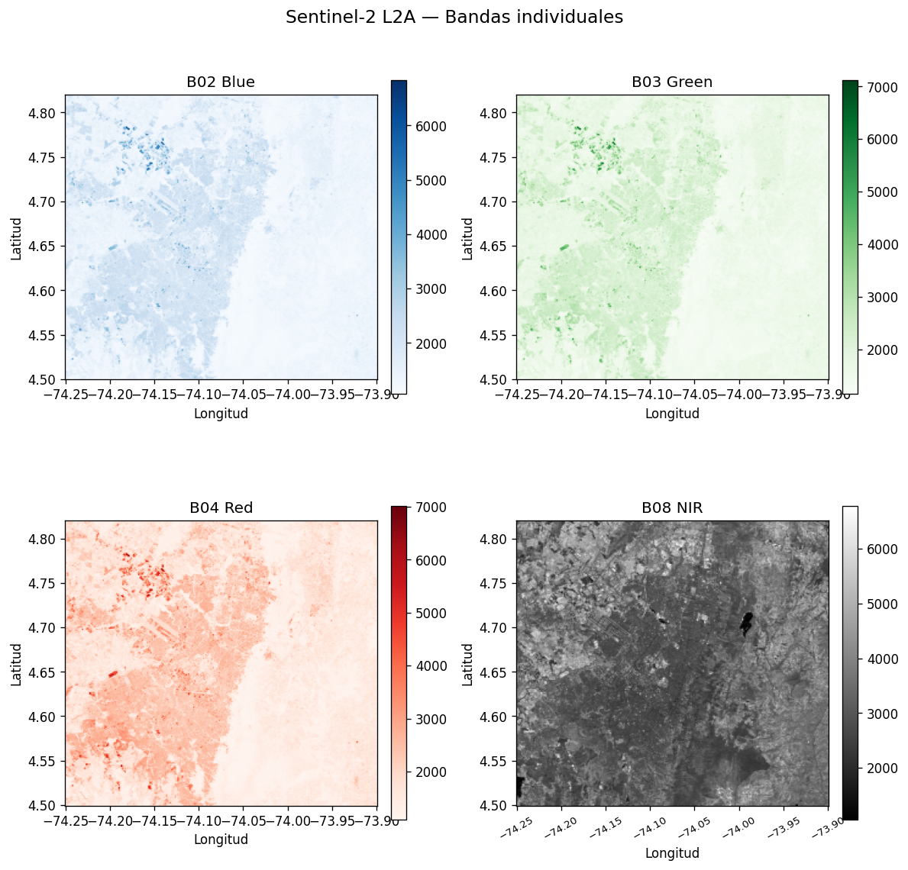

Cada subpanel de la **Figura 1** muestra la distribución espacial de reflectancia de una banda individual. Para las bandas del espectro visible (**B02 Blue**, **B03 Green** y **B04 Red**), representadas con colormaps secuenciales (Blues, Greens, Reds), la Sabana de Bogotá exhibe predominantemente valores bajos y uniformes de reflectancia, con valores más altos estructurados sobre el centro-occidente, que coinciden con el casco urbano consolidado. La dominancia de tonos oscuros en el rango bajo refleja la alta absorción de radiación fotosintéticamente activa (PAR) por la cobertura vegetal de los cerros orientales y la Sabana circundante. En contraste, el panel del infrarrojo cercano (**B08 NIR**) — visualizado en escala de grises — invierte el patrón: la huella urbana central aparece como una "mancha oscura" sobre un fondo más brillante de zonas montañosas, páramos y áreas rurales al sur y al oriente, consistente con la alta reflectancia NIR del mesófilo foliar de la vegetación densa y la baja reflectancia de las superficies construidas (concreto, asfalto).

**Figura 2.** Histogramas de las cuatro bandas del Sentinel-2 L2A. Los valores en `uint16` corresponden a reflectancia × 10000 según convención Sentinel-2 L2A.

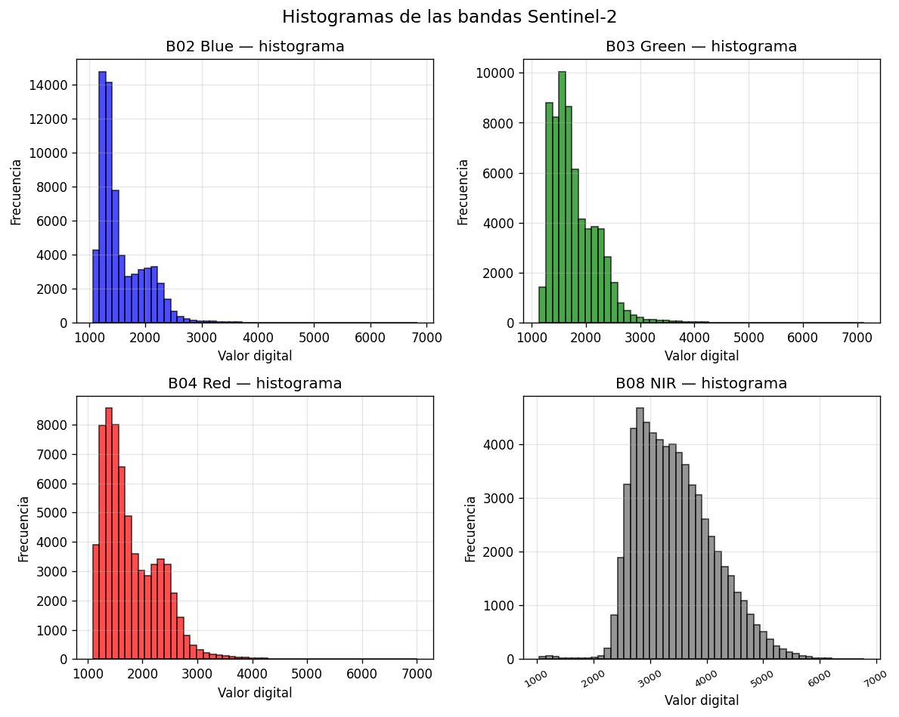

La **Figura 2** revela la estructura estadística de cada banda. Las tres bandas visibles (**B02**, **B03**, **B04**) presentan distribuciones marcadamente **asimétricas positivas** (*right-skewed*): un pico modal en el rango **1000–2000 DN** (reflectancia ≈ 0.10–0.20) que domina la composición del píxel mixto, y una cola larga hacia valores altos correspondiente a las superficies más reflectantes (nubes dispersas, suelo desnudo, techos claros, bordes urbanos brillantes). Por su parte, la banda **B08 NIR** exhibe una distribución **mesocúrtica más amplia** con un pico desplazado hacia reflectancias altas (~**3000 DN**, ≈ 0.30), lo que evidencia el contraste entre los píxeles vegetados (alta reflectancia NIR) y los píxeles urbanos/agua (baja reflectancia NIR) que se entremezclan en el AOI.

**Figura 3.** Composición RGB (B04, B03, B02) con stretch de percentiles 2-98 sobre la Sabana de Bogotá.

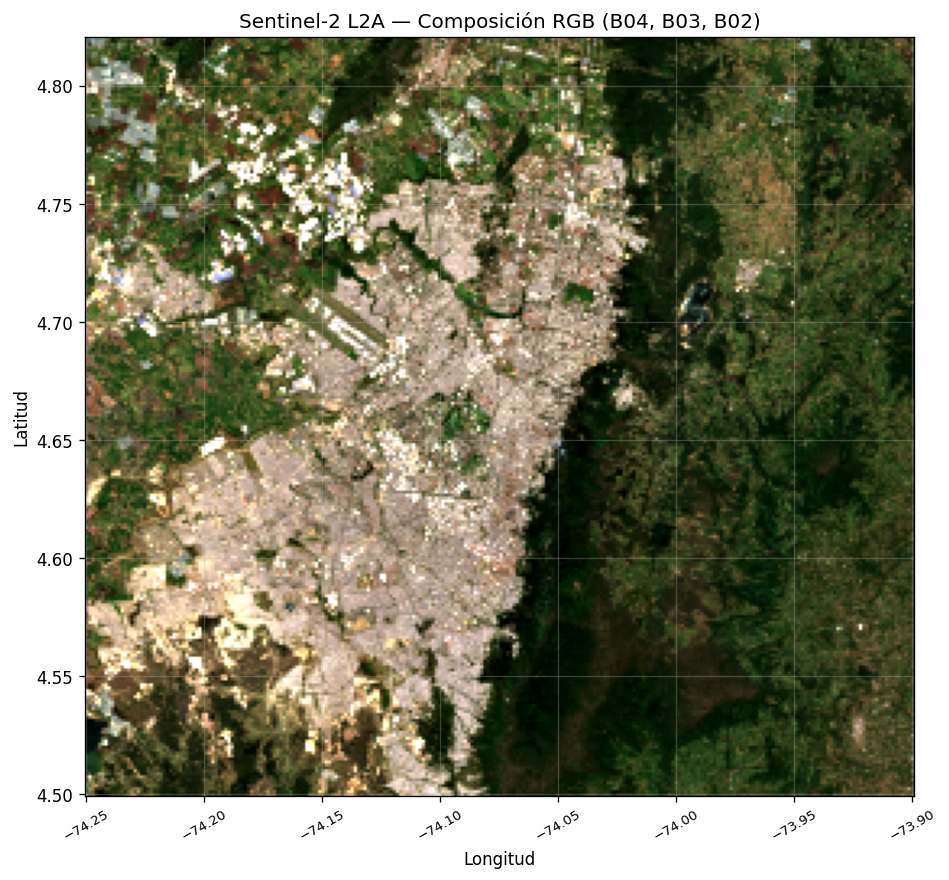

### Python — NDVI

**Figura 4.** NDVI calculado como `(B08 − B04) / (B08 + B04)` sobre la escena Sentinel-2 seleccionada. Las zonas verdes (NDVI > 0.6) corresponden a vegetación densa; las rojas (NDVI < 0.2) al casco urbano de Bogotá; la mancha roja hacia el nor-oriente es el **Embalse San Rafael**, un cuerpo de agua artificial con NDVI cercano a 0.

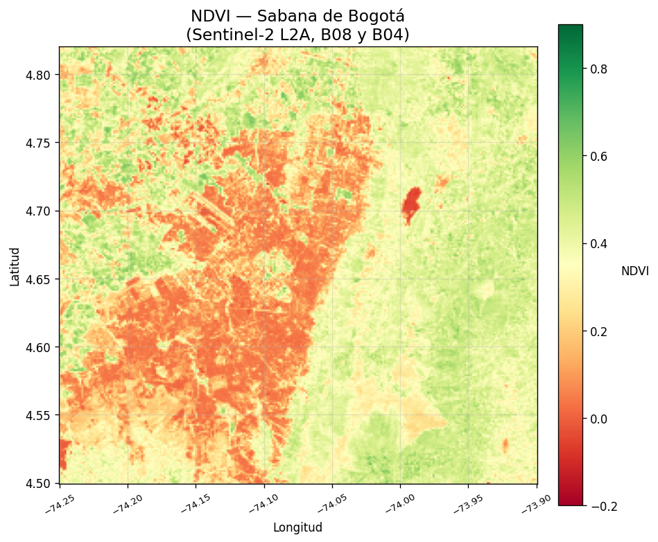

**Figura 5.** Histograma de NDVI (panel izquierdo) y mapa NDVI clippeado a [-0.2, 0.9] (panel derecho). La media de NDVI sobre el AOI es ≈ 0.35 con min −0.17 y max 0.68.

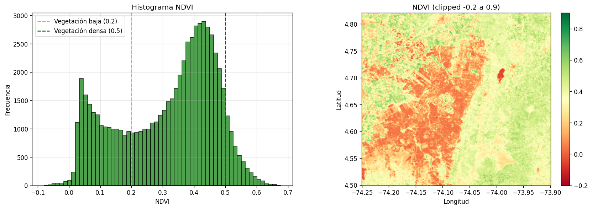

$$
NDVI = \frac{NIR - Red}{NIR + Red} = \frac{B_{08} - B_{04}}{B_{08} + B_{04}}
$$

El análisis de la **Figura 5** es el núcleo del taller. El histograma del NDVI (panel izquierdo) presenta una **distribución bimodal característica** del gradiente urbano–rural de la Sabana: un **primer pico en el rango 0.05–0.10** que agrupa los píxeles **no vegetados** (techos, vías, suelo desnudo y cuerpos de agua como el Embalse San Rafael con NDVI ≈ 0.05), y un **segundo pico más alto en el rango 0.40–0.50** que representa la **vegetación moderada a densa** (cerros orientales, áreas rurales y parques urbanos). Se han marcado dos **umbrales verticales** de referencia: **NDVI = 0.2** (separador entre suelo/suelo desnudo/urbano poco vegetado y cobertura herbácea dispersa) y **NDVI = 0.5** (umbral clásico de vegetación sana y bien hidratada). El mapa espacial (panel derecho), clippeado al rango **[-0.2, 0.9]** y renderizado con una paleta divergente **Rojo–Amarillo–Verde**, muestra un patrón geográfico nítido: el **centro-oeste** de la escena aparece en tonos rojos y naranjas (NDVI bajo, dominancia de concreto y asfalto), los **cerros orientales** y el **sur** de la Sabana en verdes intensos (NDVI > 0.6, bosques andinos y páramo), y la **mancha roja aislada al nor-oriente** correspondiente al Embalse Tominé / San Rafael. La media de NDVI sobre el AOI es ≈ **0.35** (mín −0.17, máx 0.68), consistente con un mosaico mixto urbano–rural.

**Figura 6.** NDVI superpuesto al RGB con alpha 0.55 — muestra cómo la vegetación (verde) se concentra en los cerros orientales y las áreas rurales al sur, mientras el centro urbano de Bogotá se mantiene con NDVI bajo.

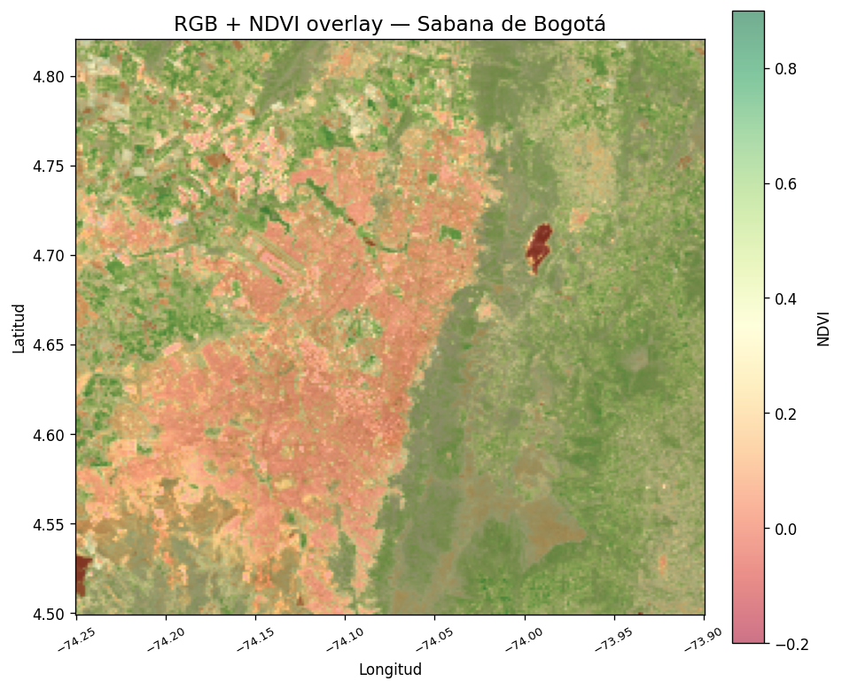

### Python — folium y capas vectoriales

**Figura 7.** Mapa folium centrado en la Sabana de Bogotá (4.66°N, 74.07°W) con tiles OpenStreetMap, marcador del centro, buffer circular de 5 km, MiniMap (esquina inferior derecha), MousePosition (esquina inferior izquierda) y botón de pantalla completa (esquina superior izquierda). HTML interactivo: [`media/02_folium_basemap.html`](./media/02_folium_basemap.html).

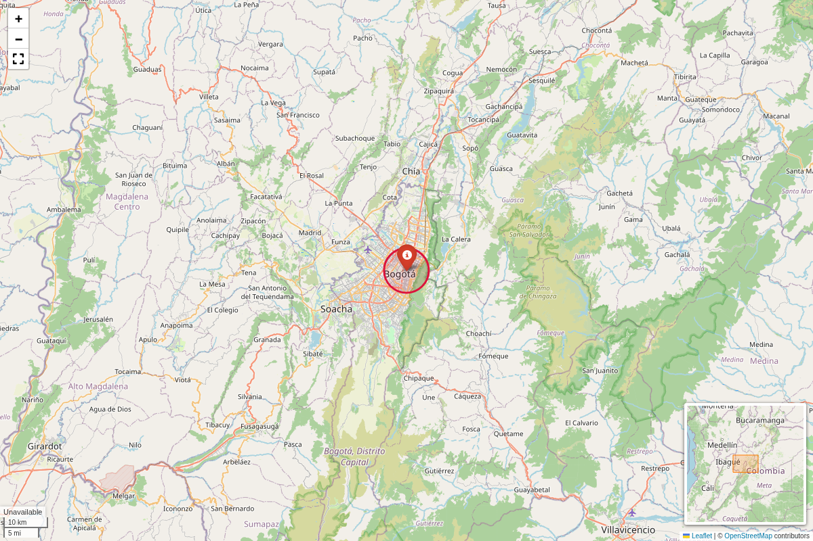

**Figura 8.** Las 3 capas vectoriales (región Bogotá D.C. en negro, vías OSM en amarillo, POIs turísticos como triángulos rojos con etiquetas) sobre la composición RGB de Sentinel-2. Se aprecia cómo las vías (Av. Caracas, Calle 26, Calle 85, etc.) siguen el patrón urbano del centro de la ciudad.

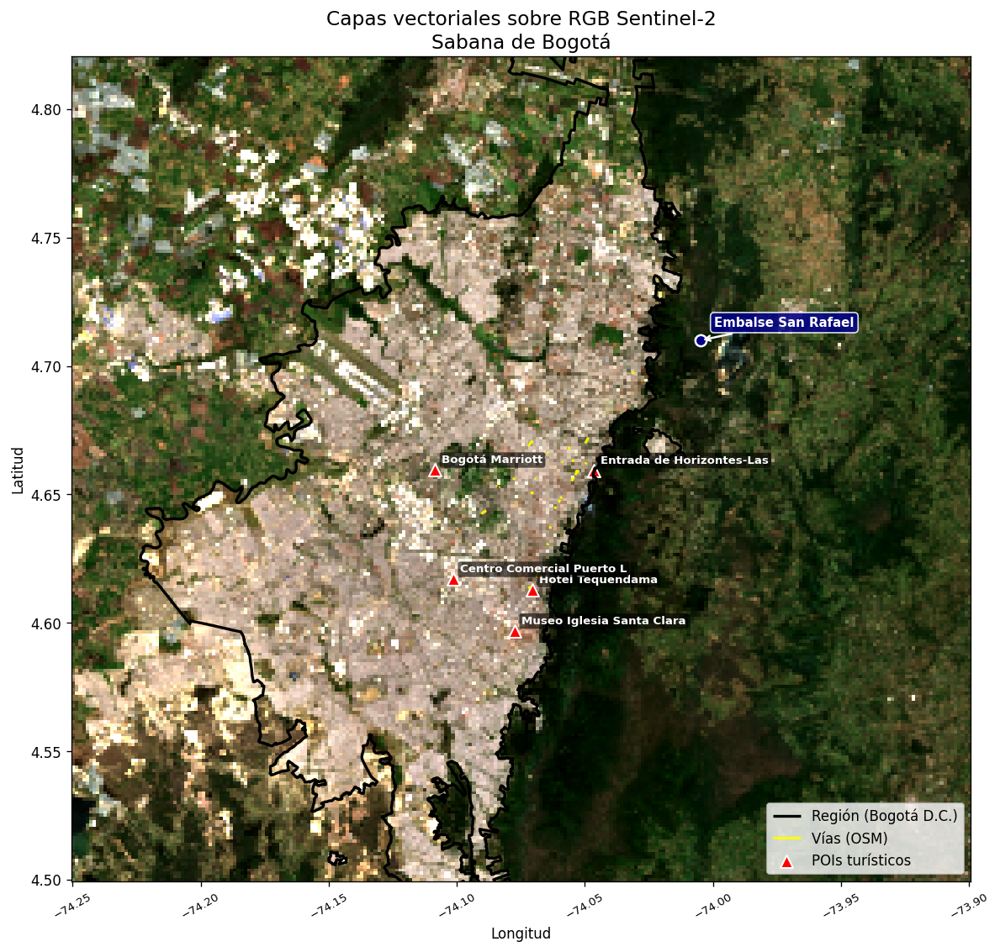

**Figura 9.** Cada capa vectorial por separado con su leyenda. Las vías se colorean por tipo (`highway`) y los POIs por categoría turística (`museum`, `attraction`, `hotel`, `information`).

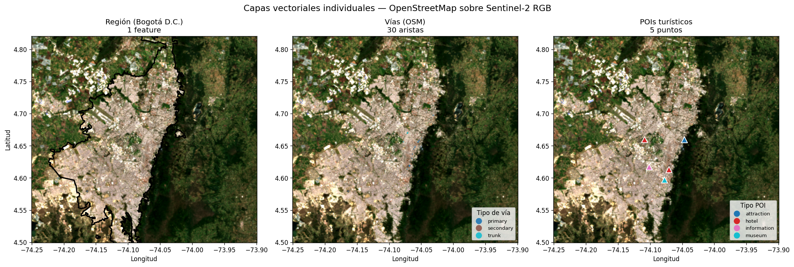

### Python — Mapa interactivo final (entregable principal)

**Figura 10.** Mapa folium final con:
- Selector de tiles base (OpenStreetMap, CartoDB Positron, CartoDB Dark) en el `LayerControl` superior derecho
- Overlay NDVI georreferenciado (toggle en LayerControl)
- Polígono de la región Bogotá D.C. (línea negra discontinua)
- Vías coloreadas por tipo (toggle)
- POIs turísticos agrupados en cluster (verde "5")
- HeatMap de POIs (desactivada por defecto)
- MiniMap, MousePosition, Fullscreen como plugins
- Leyenda NDVI personalizada (esquina inferior izquierda) con media, min, max
- Título personalizado (esquina superior izquierda)
- Marcador del Embalse San Rafael con icono azul claro y popup "Embalse San Rafael — NDVI ≈ 0.05"

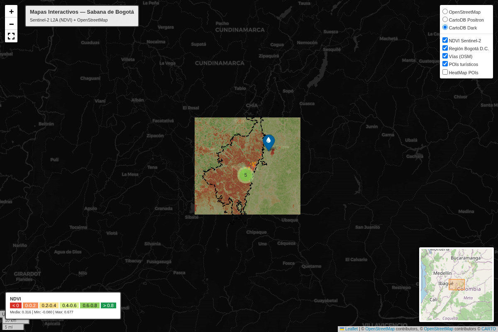

**Figura 11.** GIF animado (12 frames, 720×480) capturado con Playwright: zoom-in x3, paneos, zoom-out x3 y zoom-in x2 finales. Demuestra la fluidez de Leaflet sobre el overlay NDVI y las capas vectoriales. HTML completo: [`media/05_mapa_interactivo.html`](./media/05_mapa_interactivo.html).

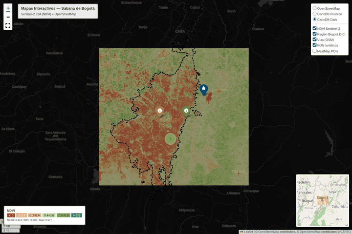

### Recorrido por el HTML (demo de uso)

**Figura 12.** Recorrido grabado (149 frames, 500×588) sobre el HTML `05_mapa_interactivo.html` abierto en el navegador: se hace click en cada POI del cluster para mostrar su popup, se enciende/apaga cada capa del `LayerControl` (NDVI Sentinel-2, Región Bogotá D.C., Vías OSM, POIs turísticos, HeatMap) y se prueban los selectores de tile base (OpenStreetMap, CartoDB Positron, CartoDB Dark).


---

## Fuentes de datos

### Raster — Sentinel-2 L2A
- **Catálogo**: [Microsoft Planetary Computer STAC](https://planetarycomputer.microsoft.com/)
- **Colección**: [`sentinel-2-l2a`](https://planetarycomputer.microsoft.com/datasets/sentinel-2-l2a) — reflectancia de superficie (BOA), corregida atmosféricamente.
- **Bandas**: B02 (Blue, 10 m), B03 (Green, 10 m), B04 (Red, 10 m), B08 (NIR, 10 m).
- **AOI**: bbox `[-74.25, 4.50, -73.90, 4.82]` (≈ 39 km × 36 km, centrado en el casco urbano de Bogotá con énfasis en la expansión occidental).
- **Mosaico multi-tile**: Bogotá cae sobre 4 tiles MGRS (18NWL, 18NXL, 18NXK, 18NWK). El notebook 00 selecciona el item con menor cobertura de nubes por tile y los mosaica con `rioxarray.merge.merge_arrays`. Resultado: el raster final cubre toda el área urbana de oriente a occidente (no sólo un cuarto de la ciudad como ocurre con un solo tile).
- **Filtros**: nubosidad `< 20%`, período 2024-01-01 / 2025-12-31, orden por menor cobertura de nubes.
- **Autenticación**: no requerida (URL firmada con SAS token vía `planetary_computer.sign`).

### Vector — OpenStreetMap
- **Geocodificación**: Nominatim (vía `osmnx.geocode_to_gdf("Bogotá, Colombia")`).
- **POIs**: features con tag `tourism` dentro del polígono de Bogotá (5 puntos: museo, atracción, hoteles, información).
- **Vías**: grafo `drive` reducido a 30 aristas principales (highway = primary/secondary/trunk/motorway).
- **API**: Overpass API pública vía `osmnx` (timeout 180 s, hasta 3 reintentos).

---

## Código relevante

### Búsqueda STAC y mosaico multi-tile (notebook 00)

```python
from pystac_client import Client
import planetary_computer as pc
from collections import defaultdict

catalog = Client.open("https://planetarycomputer.microsoft.com/api/stac/v1")
search = catalog.search(
    collections=["sentinel-2-l2a"],
    bbox=[-74.25, 4.50, -73.90, 4.82],
    datetime="2024-01-01/2025-12-31",
    query={"eo:cloud_cover": {"lt": 20}},
    sortby=[{"field": "eo:cloud_cover", "direction": "asc"}],
    max_items=30,
)
items = list(search.items())

# Bogotá cae en 4 tiles MGRS. Mejor item por tile.
by_tile = defaultdict(list)
for it in items:
    by_tile[it.properties.get("s2:mgrs_tile")].append(it)
selected = [min(lst, key=lambda x: x.properties["eo:cloud_cover"]) for lst in by_tile.values()]
selected_signed = [pc.sign(it) for it in selected]
```

### Lectura, mosaico y remuestreo del raster (notebooks 00 y 01)

```python
import rioxarray
from rioxarray.merge import merge_arrays

arrays = []
for code, name in BANDS.items():
    band_arrays = [
        rioxarray.open_rasterio(it.assets[code].href, masked=True).squeeze("band", drop=True)
        .rio.clip_box(*AOI_BBOX, crs="EPSG:4326")
        for it in selected_signed
    ]
    merged = merge_arrays(band_arrays, nodata=0) if len(band_arrays) > 1 else band_arrays[0]
    da_4326 = merged.rio.reproject("EPSG:4326")
    arrays.append(da_4326.assign_coords(band=code))
stack = xr.concat(arrays, dim="band")
stack.rio.reproject("EPSG:4326", shape=(256, 256), resampling=5).rio.to_raster(
    "python/data/bogota_sabana_sentinel2.tif", compress="lzw"
)
```

### Cálculo de NDVI (notebook 03)

```python
import numpy as np
import rasterio

with rasterio.open("python/data/bogota_sabana_sentinel2.tif") as src:
    b04 = src.read(3).astype(np.float32)  # Red
    b08 = src.read(4).astype(np.float32)  # NIR

np.seterr(divide="ignore", invalid="ignore")
ndvi = (b08 - b04) / (b08 + b04)
```

### Mapa folium interactivo con NDVI + capas (notebook 05)

```python
import folium
from folium.plugins import MiniMap, MousePosition, Fullscreen, HeatMap, MarkerCluster

m = folium.Map(location=[4.66, -74.07], zoom_start=10, tiles=None)
folium.TileLayer("OpenStreetMap", name="OpenStreetMap").add_to(m)

# NDVI embebido como base64
image_overlay = folium.raster_layers.ImageOverlay(
    image=f"data:image/png;base64,{ndvi_b64}",
    bounds=[[bounds.bottom, bounds.left], [bounds.top, bounds.right]],
    opacity=0.65,
    name="NDVI Sentinel-2",
).add_to(m)

# Vías, región, POIs, HeatMap, plugins y LayerControl
folium.LayerControl(collapsed=False, position="topright").add_to(m)
m.save("media/05_mapa_interactivo.html")
```

### Captura animada con Playwright (notebook 06)

```python
from playwright.async_api import async_playwright
from PIL import Image
from io import BytesIO

async with async_playwright() as p:
    browser = await p.chromium.launch(headless=True, args=["--no-sandbox"])
    page = await browser.new_context(viewport={"width": 1200, "height": 800}).new_page()
    await page.goto(f"file://{html_path.resolve()}")
    await page.wait_for_load_state("networkidle")
    await page.wait_for_timeout(4500)

    # Secuencia: zoom-in, drag, zoom-out
    for step in steps:
        if step[0] == "zoom_in": await page.locator("a.leaflet-control-zoom-in").click()
        elif step[0] == "drag": await page.mouse.move(...)
        await page.wait_for_timeout(900)
        frames.append(Image.open(BytesIO(await page.screenshot())).resize((720, 480)))

frames[0].save("media/05_mapa_interactivo.gif", save_all=True,
               append_images=frames[1:], duration=900, loop=0, optimize=True)
```

---

## Prompts utilizados

Lista de prompts empleados con herramientas de IA generativa durante el desarrollo:

```
"Cómo buscar escenas Sentinel-2 L2A con pystac-client sobre un AOI y filtrar por nubosidad"
"Cómo recortar y remuestrear un raster con rioxarray manteniendo EPSG:4326"
"Cómo embeber un PNG en un mapa folium usando ImageOverlay con base64"
"Diferencia entre ImageOverlay y raster_layers en folium para mostrar NDVI"
"Cómo capturar un GIF animado de un mapa folium con Playwright headless"
"Playwright Sync API no funciona dentro de Jupyter porque hay un event loop activo"
"Cómo usar folium.plugins.HeatMap con coordenadas extraídas de un GeoDataFrame"
"Cómo centrar y hacer zoom a un punto con flyTo en Leaflet desde Playwright"
"Cómo hacer que un mapa folium cargue sus tiles antes de capturar con Playwright"
"Cómo colorear líneas en folium.GeoJson según un atributo con style_function"
"Cómo agregar un cluster de marcadores con MarkerCluster en folium"
"Cómo anclar rutas en notebooks Jupyter usando os.chdir desde un archivo"
```

---

## Aprendizajes y dificultades

### Aprendizajes

- **STAC como estándar de facto** para descubrir y acceder a datos geoespaciales: una sola consulta devuelve escena + URLs firmadas + metadatos (CRS, bounds, cloud cover, plataforma). El `pystac-client` es la puerta de entrada y `planetary_computer.sign` resuelve la autenticación SAS de forma transparente.
- **Geometría del AOI vs. CRS del raster**: la escena Sentinel-2 viene en UTM, pero para folium necesitamos `EPSG:4326` (lon/lat). `rioxarray.rio.reproject` resuelve esto en una sola línea, encadenable con `rio.clip_box` y `rio.to_raster`.
- **NDVI no requiere calibración radiométrica** cuando los valores están en la convención de reflectancia × 10000 (uint16) — basta con aplicar la fórmula sobre los DN sin dividir por el factor de escala.
- **Embedibilidad del NDVI en folium**: al convertir el NDVI a PNG con colormap `RdYlGn` + alpha y embeberlo como `data:image/png;base64,...`, el HTML resultante es **autocontenido** (sin dependencias externas) y portable.
- **Playwright en Jupyter**: la Sync API choca con el event loop del kernel; se resuelve cambiando a Async API (`from playwright.async_api import async_playwright`) y usando `await` directamente.
- **Captura animada**: en lugar de `flyTo` (frágil, requiere conocer la variable global del mapa), los botones de zoom de Leaflet (`a.leaflet-control-zoom-in` / `-out`) son robustos y producen el mismo efecto visual.

### Dificultades

- **Cobertura limitada con un solo tile Sentinel-2**: un AOI de ~40 km cruza los 4 tiles MGRS que cubren Bogotá (18NWL, 18NXL, 18NXK, 18NWK). El STAC devuelve cada tile como un item separado, por lo que buscar con `max_items=1` sólo descargaba uno — usualmente T18NXL, que cubre la mitad oriental y dejaba la ciudad fuera de centro. Se resolvió buscando el mejor item por tile (`max_items=30`, agrupar por `s2:mgrs_tile`, seleccionar menor cc) y mosaicar con `rioxarray.merge.merge_arrays`. Resultado: raster casi cuadrado (≈ 39 × 36 km, aspect ratio 0.91) centrado en el casco histórico (4.66°N, 74.07°W).
- **Etiquetas del eje X superpuestas**: las longitudes con 3 decimales (~74.075, 74.050, ...) colisionaban en mapas pequeños. Se resolvió con `plt.gca().tick_params(axis="x", rotation=30, labelsize=8)` justo antes de `tight_layout`/`savefig` en cada plot.
- **Dependencias en Arch Linux con Python 3.14**: el sistema traía Python 3.14 sin pip, y muchas wheels (sobre todo GDAL/Fiona) no estaban disponibles. Se resolvió cambiando a Python 3.12 (que sí tiene wheels precompiladas para todas las dependencias del taller) en un `.venv` local.
- **OSMnx 2.1.0 + `ox.settings.requests_kwargs = {"timeout": 180}`** entraba en conflicto con el `timeout` interno de `requests.get` en Nominatim. Se resolvió eliminando el kwarg y usando sólo `ox.settings.timeout = 180`.
- **nbconvert y rutas relativas**: ejecutar `jupyter nbconvert --execute` desde un directorio distinto al raíz del taller hace fallar las rutas. Se resolvió con `find_taller_root()` al inicio de cada notebook — busca el archivo `bogota_sabana_sentinel2.tif` hacia arriba del cwd y hace `os.chdir` al directorio encontrado.
- **POI sin nombre en OSM**: uno de los 5 POIs seleccionados no tenía atributo `name` en OSM, lo que generaba la etiqueta "nan" en la visualización. Se resolvió con un fallback `"(sin nombre)"` cuando el valor es `None` o `NaN`.

### Mejoras futuras

- Calcular NDVI sobre **datos a resolución nativa** (10 m) y mostrar zoom a escala real sobre barrios específicos, en lugar del remuestreo a 256×256 px.
- Agregar una **línea de tiempo temporal** con `folium.plugins.TimestampedGeoJson` para visualizar el cambio del NDVI a lo largo de varias escenas (2024-2025).
- Incorporar **datos climáticos en tiempo real** desde la API de Open-Meteo (temperatura, precipitación) como una capa raster adicional.
- Desplegar el HTML resultante en **GitHub Pages** para hacerlo accesible públicamente sin necesidad de clonar el repositorio.
- Reemplazar la captura GIF con un **video MP4** usando `ffmpeg` sobre los frames PNG de Playwright, para mayor calidad y mejor compresión.

### Aplicaciones prácticas

- **Monitoreo de cobertura vegetal urbana**: identificar zonas de Bogotá donde la vegetación ha disminuido o aumentado entre escenas, útil para estudios de sostenibilidad y planificación territorial.
- **Inventario de puntos de interés turístico** combinado con índices de vegetación: detectar miradores o parques con alta cobertura verde circundante.
- **Educación**: el taller es 100% reproducible (notebooks + datos reales + scripts) y sirve como punto de partida para cursos de teledetección, SIG o visualización geoespacial.
- **Base para dashboards ambientales**: la misma arquitectura (folium + raster + capas) se puede extender a calidad del aire, ruido urbano, riesgo de inundación, etc.

---

## Contribuciones

Taller realizado de forma grupal. Las responsabilidades se distribuyeron de la siguiente manera:

- **Juan David Buitrago Salazar** — curación manual de los GeoJSON de OpenStreetMap (verificación de los POIs, corrección del atributo `name` del punto que la API devolvía sin nombre, etiquetado del Embalse San Rafael), ajuste iterativo del AOI para centrar la ciudad y reducir el Páramo de Sumapaz, y compilación del README con el análisis técnico de las figuras, snippets, fuentes, aprendizajes y dificultades.
- **Juan David Cardenas Galvis** — configuración de la búsqueda STAC sobre Microsoft Planetary Computer y depuración del mosaico multi-tile de Sentinel-2 L2A a partir de los 4 tiles MGRS que cubren Bogotá.
- **Juan Felipe Fajardo Garzon** — implementación del cálculo de NDVI con la fórmula estándar `(NIR − Red) / (NIR + Red)`, validación de los rangos y generación del histograma bimodal.
- **Camilo Andres Medina Sanchez** — construcción del mapa interactivo con `folium`: tiles base, `ImageOverlay` del NDVI, polígono de la región, `PolyLine`s de las vías, `MarkerCluster` de los POIs, `HeatMap` y los plugins `MiniMap`, `MousePosition`, `Fullscreen` y `LayerControl`.
- **Nicolas Rodriguez Piraban** — captura animada con Playwright (Chromium headless): configuración del viewport, la secuencia de zoom y drag, y ensamblado del GIF demostrativo del mapa.

---

## Estructura del proyecto

```
semana_13_2_mapas_interactivos_datos_satelitales/
├── python/
│   ├── data/                                   # generado por notebook 00
│   │   ├── bogota_sabana_sentinel2.tif         # Sentinel-2 L2A 256x256, 4 bandas
│   │   ├── ndvi_bogota_sabana.tif              # NDVI calculado en notebook 03
│   │   ├── ndvi_stats.json                     # estadísticas NDVI
│   │   ├── region.geojson                      # polígono Bogotá D.C. (OSM)
│   │   ├── puntos_interes.geojson              # 5 POIs turísticos (OSM)
│   │   └── rutas.geojson                       # 30 aristas de vías (OSM)
│   └── notebooks/
│       ├── 00_download_data.ipynb              # descarga Sentinel-2 + OSM
│       ├── 01_raster_basics.ipynb              # inspección rasterio
│       ├── 02_folium_basemap.ipynb             # mapa base folium
│       ├── 03_ndvi_calculation.ipynb           # cálculo NDVI
│       ├── 04_vector_overlay.ipynb             # capas geopandas
│       ├── 05_mapa_interactivo.ipynb           # entregable principal
│       └── 06_capture_gif.ipynb                # captura PNG + GIF con Playwright
├── media/                                      # OBLIGATORIO: capturas, GIFs, HTMLs
│   ├── 01_raster_basics.png                    # 4 bandas Sentinel-2
│   ├── 01_raster_basics_hist.png               # histogramas
│   ├── 01_raster_basics_rgb.png                # RGB stretch
│   ├── 02_folium_basemap.png                   # mapa base folium
│   ├── 02_folium_basemap.html                  # HTML del mapa base
│   ├── 03_ndvi.png                             # NDVI Sabana
│   ├── 03_ndvi_hist.png                        # histograma + NDVI clip
│   ├── 03_ndvi_overlay.png                     # NDVI sobre RGB
│   ├── 04_vectors.png                          # capas sobre RGB
│   ├── 04_vectors_separate.png                 # capas individuales
│   ├── 05_mapa_interactivo.png                 # mapa final estático
│   ├── 05_mapa_interactivo.gif                 # mapa final animado (zoom/pan, Playwright)
│   ├── 05_mapa_interactivo_demo.gif            # recorrido grabado en navegador (popups, LayerControl, tiles)
│   └── 05_mapa_interactivo.html                # HTML interactivo principal
└── README.md                                   # este archivo
```

---

## Referencias

- Microsoft Planetary Computer — [https://planetarycomputer.microsoft.com/](https://planetarycomputer.microsoft.com/)
- Sentinel-2 L2A dataset spec — [https://planetarycomputer.microsoft.com/datasets/sentinel-2-l2a](https://planetarycomputer.microsoft.com/datasets/sentinel-2-l2a)
- `pystac-client` documentation — [https://pystac-client.readthedocs.io/](https://pystac-client.readthedocs.io/)
- `rasterio` documentation — [https://rasterio.readthedocs.io/](https://rasterio.readthedocs.io/)
- `rioxarray` documentation — [https://corteva.github.io/rioxarray/](https://corteva.github.io/rioxarray/)
- `folium` documentation — [https://python-visualization.github.io/folium/](https://python-visualization.github.io/folium/)
- `osmnx` documentation — [https://osmnx.readthedocs.io/](https://osmnx.readthedocs.io/)
- `geopandas` documentation — [https://geopandas.org/](https://geopandas.org/)
- `playwright` documentation — [https://playwright.dev/python/](https://playwright.dev/python/)
- OpenStreetMap — [https://www.openstreetmap.org/](https://www.openstreetmap.org/)
- Leaflet.js — [https://leafletjs.com/](https://leafletjs.com/)