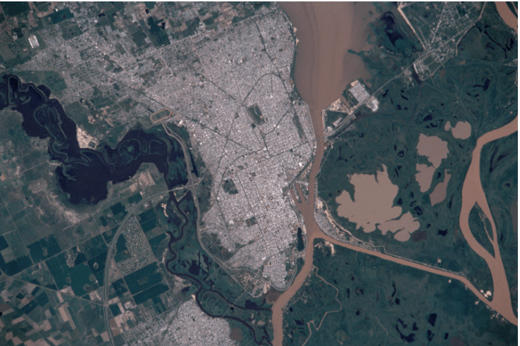
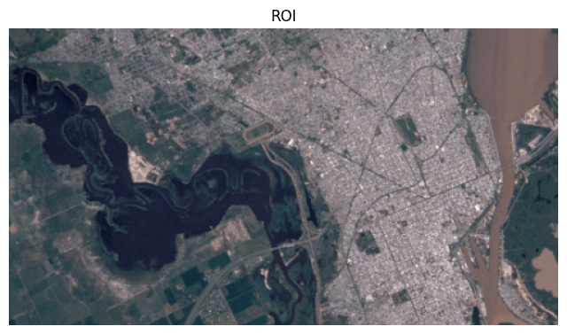
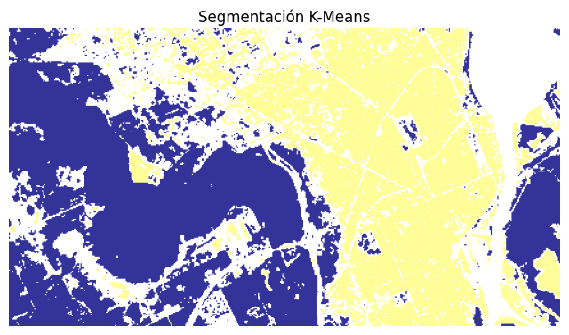
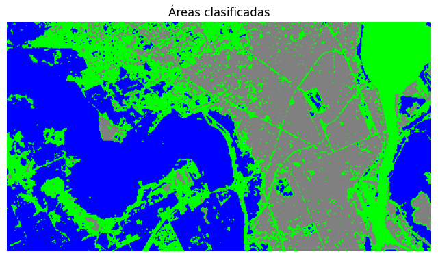
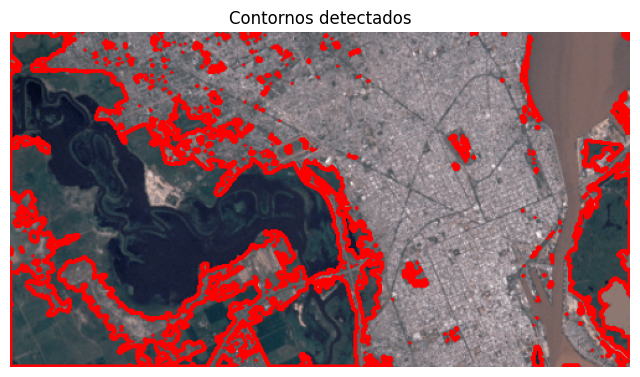
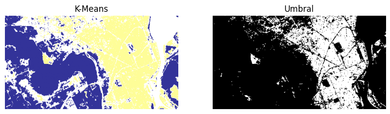

# Taller - Mini Radar Satelital Areas Interes
## Nombre:

- Juan David Buitrago Salazar
- Juan David Cardenas Galvis
- Nicolás Rodríguez Piraban
- Camilo Andres Medina Sanchez
- Juan Felipe Fajardo Garzón

## Fecha de entrega: 08/06/2026

## Descripción breve:
Este taller consiste en implementar un **mini radar satelital** mediante técnicas de segmentación basadas en color para clasificar visualmente las áreas de interés (bosques, cuerpos de agua y zonas urbanas) presentes en una imagen satelital. Se parte de una imagen satelital RGB, se selecciona manualmente una **Región de Interés (ROI)**, se aplica el algoritmo **K-Means** con `n_clusters=3` para agrupar los píxeles por similitud de color, se asignan colores semánticos a cada clúster (azul = agua, gris = urbano, verde = vegetación), se detectan contornos de las zonas clasificadas con `cv2.findContours()` y se comparan los resultados de K-Means con un método alternativo de **umbralización** sobre el canal verde.

**Enfoque:** K-Means agrupa los píxeles del ROI en 3 clústeres en el espacio de color RGB, asignando cada píxel a la clase cuyo centroide sea más cercano (en distancia euclidiana). Es un método no supervisado, rápido y sencillo, pero depende fuertemente de la elección de `k` y de la representatividad de los colores en la imagen.

## Implementaciones:

### Python:
Se implementó un pipeline completo en un Jupyter Notebook (`python/Visualizacion_Areas_Interes.ipynb`) que carga la imagen satelital, recorta una ROI, aplica segmentación por K-Means, asigna colores semánticos por clúster, detecta contornos de las zonas verdes y compara la segmentación con un umbral sobre el canal verde.

**Explicación de parámetros clave:**

- **ROI `[0, 70, 500, 270]`**: Recorte manual de la imagen original con formato `[x, y, ancho, alto]`. Se eligió esta zona porque contiene un mix representativo de los tres tipos de cobertura: cuerpo de agua oscuro (izquierda), zona urbana (centro/derecha) y vegetación (varios sectores).

- **K-Means `n_clusters=3`**: Se agrupan los píxeles en 3 clases que idealmente corresponden a agua, urbano y vegetación. La elección de `k=3` se hizo a priori según la cantidad de categorías de interés. En general, `k` podría optimizarse con el método del codo o el coeficiente de silueta.

- **K-Means `random_state=42`**: Fija la semilla del algoritmo para que la segmentación sea reproducible entre ejecuciones. Sin esto, K-Means inicializa los centroides aleatoriamente y los resultados variarían.

- **Reshape a `(-1, 3)`**: K-Means de sklearn requiere que cada muestra sea un vector 1D, por lo que se aplana la imagen de `(H, W, 3)` a `(H*W, 3)`. Luego `labels_.reshape(...)` recupera la forma espacial 2D.

- **Colormap `terrain`**: Se usa para visualizar la segmentación cruda (3 niveles) y apreciar la separación entre clases. La asignación final de colores semánticos (azul/gris/verde) se hace manualmente creando un array RGB y mapeando cada etiqueta a su color.

- **`cv2.findContours` con `RETR_EXTERNAL`**: Recupera únicamente los contornos externos de cada región (sin considerar "agujeros"), lo que es ideal para identificar zonas de una clase sin anidamientos.

- **`cv2.contourArea > 100`**: Filtro de área mínima para descartar ruido y fragmentos pequeños. Solo se etiquetan las regiones de vegetación con un área significativa.

- **Umbral sobre canal verde (`green > 120`)**: Método alternativo de segmentación basado en una observación: la vegetación tiene un canal verde alto. Se usa `cv2.threshold` con valor 120, 255 y `THRESH_BINARY` para obtener una máscara binaria de zonas verdes. Es mucho más simple que K-Means pero menos robusto (no distingue tipos de cobertura, solo "verde vs no verde").

## Resultados visuales

Se carga la imagen satelital completa, que muestra una ciudad junto a un río con zonas de humedales, áreas urbanas densas y vegetación.



Se define manualmente una Región de Interés (ROI) de 500x270 píxeles que contiene un mix representativo de los tres tipos de cobertura: cuerpo de agua oscuro (izquierda), zona urbana (centro/derecha) y vegetación (varios sectores).



Se aplica K-Means con `n_clusters=3` sobre los píxeles del ROI. La imagen segmentada con el colormap `terrain` muestra una separación clara en tres niveles: los cuerpos de agua quedan en azul oscuro, la zona urbana en amarillo/blanco, y la vegetación en amarillo claro.



Se asignan colores semánticos a cada clúster para facilitar la interpretación: azul para el cuerpo de agua, gris para la zona urbana y verde para la vegetación. Se observa que la asignación coincide bien con la cobertura esperada, aunque la clase "vegetación" incluye tanto áreas boscosas como zonas agrícolas o de suelo desnudo con tonos similares.



Se detectan los contornos de la clase "vegetación" usando `cv2.findContours` y se dibujan en rojo sobre la ROI original. Solo se etiquetan los contornos con un área mayor a 100 píxeles para evitar ruido. Se observa que la detección captura correctamente las principales zonas verdes de la imagen, aunque también incluye algunas áreas pequeñas dispersas que podrían corresponder a jardines urbanos o techos con tonos verdosos.



Finalmente, se compara el resultado de K-Means (izquierda) con un método de umbralización sobre el canal verde (derecha). El umbral (`green > 120`) produce una máscara binaria más simple que captura bien la vegetación densa pero pierde el contexto de las otras clases y no distingue entre tipos de cobertura verde.



## Código relevante:
La carga de la imagen y la selección de la ROI son los primeros pasos. Se convierte de BGR (formato de OpenCV) a RGB para visualizarla correctamente con matplotlib, y se define la ROI mediante coordenadas en código para garantizar reproducibilidad.
```python
image = cv2.imread('imagen_satelital.png')
image_rgb = cv2.cvtColor(image, cv2.COLOR_BGR2RGB)

r = [0, 70, 500, 270]  # x, y, ancho, alto
roi = image_rgb[int(r[1]):int(r[1]+r[3]), int(r[0]):int(r[0]+r[2])]
```
La segmentación con K-Means requiere aplanar la imagen de (H, W, 3) a (H*W, 3) para que cada píxel sea una muestra. El parámetro `n_clusters=3` define el número de clases y `random_state=42` garantiza reproducibilidad. Luego se reconstruye la forma 2D con `labels_.reshape()`.
```python
pixels = roi.reshape((-1, 3))
kmeans = KMeans(n_clusters=3, random_state=42).fit(pixels)
segmented = kmeans.labels_.reshape(roi.shape[:2])
```
La asignación de colores semánticos a cada clúster se hace creando un array RGB del mismo tamaño que la segmentación y mapeando cada etiqueta (0, 1, 2) a un color: azul para agua, gris para urbano y verde para vegetación.
```python
colored = np.zeros((segmented.shape[0], segmented.shape[1], 3), dtype=np.uint8)
colored[segmented == 0] = [0, 0, 255]     # agua
colored[segmented == 1] = [128, 128, 128] # urbano
colored[segmented == 2] = [0, 255, 0]     # vegetación
```
La detección de contornos usa `cv2.findContours` con `RETR_EXTERNAL` para obtener solo los contornos externos de cada región, y filtra los de área mayor a 100 píxeles para evitar ruido.
```python
mask = np.uint8(segmented == 0)
contours, _ = cv2.findContours(mask, cv2.RETR_EXTERNAL, cv2.CHAIN_APPROX_SIMPLE)

for cnt in contours:
    area = cv2.contourArea(cnt)
    if area > 100:
        x, y, w, h = cv2.boundingRect(cnt)
        cv2.putText(result, "Vegetación", (x, y-5), cv2.FONT_HERSHEY_SIMPLEX, 0.5, (255,0,0), 1)
```
La comparación con umbralización se hace sobre el canal verde del ROI, aprovechando que la vegetación tiene un valor alto en este canal. Se usa `cv2.threshold` con valor 120 y `THRESH_BINARY` para obtener una máscara binaria.
```python
green = roi[:,:,1]
_, threshold = cv2.threshold(green, 120, 255, cv2.THRESH_BINARY)
```

## Prompts utilizados:
Genera un script en Python con OpenCV y sklearn que cargue una imagen satelital, seleccione una región de interés, aplique segmentación por color con K-Means para clasificar bosques, agua y zonas urbanas, visualice los resultados con colores semánticos y compare con segmentación por umbral de color.

## Aprendizajes y dificultades:
Este taller permitió comprender cómo aplicar técnicas no supervisadas de segmentación (K-Means) sobre imágenes satelitales para clasificar coberturas de suelo de forma automática. Se evidenció que K-Means agrupa los píxeles por similitud de color en el espacio RGB, y que con `k=3` se obtiene una separación razonable entre agua, urbano y vegetación en la ROI seleccionada. También se comparó con un método más simple (umbral sobre el canal verde) y se concluyó que K-Means ofrece una mejor segmentación al distinguir tres clases, mientras que el umbral solo produce una máscara binaria de "zonas verdes".

La principal dificultad fue que K-Means asigna las etiquetas de los clústeres de forma arbitraria (0, 1, 2) sin relación semántica, por lo que fue necesario mapear manualmente cada etiqueta a un color interpretable. Además, en esta imagen particular, K-Means agrupó como "vegetación" (clase verde) tanto áreas boscosas como zonas agrícolas y de suelo con tonos verdosos, lo que muestra que la segmentación por color no es capaz de distinguir entre tipos de cobertura con espectros similares. Otro punto fue que el método de umbral sobre el canal verde es muy sensible al valor elegido (120) y pierde mucha información al ser binario.

Como mejora, para una clasificación más precisa se podría usar segmentación en el espacio de color HSV (que separa mejor tono y luminosidad), probar con `k` mayor (5–10 clústeres) y fusionar manualmente las clases resultantes, o aplicar modelos de deep learning pre-entrenados para segmentación semántica (DeepLab, U-Net, SAM de Meta) que distinguen múltiples categorías con mayor robustez. También sería interesante implementar post-procesado morfológico (apertura, cierre) para limpiar el ruido de las máscaras, calcular métricas de cobertura (% de área por clase) y exportar los resultados en un formato GeoTIFF georeferenciado para integrarlos con un SIG como QGIS.