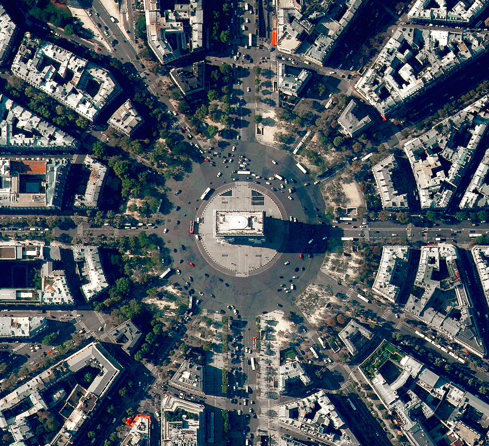
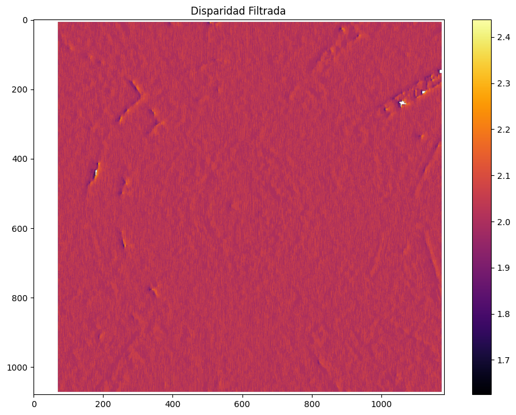
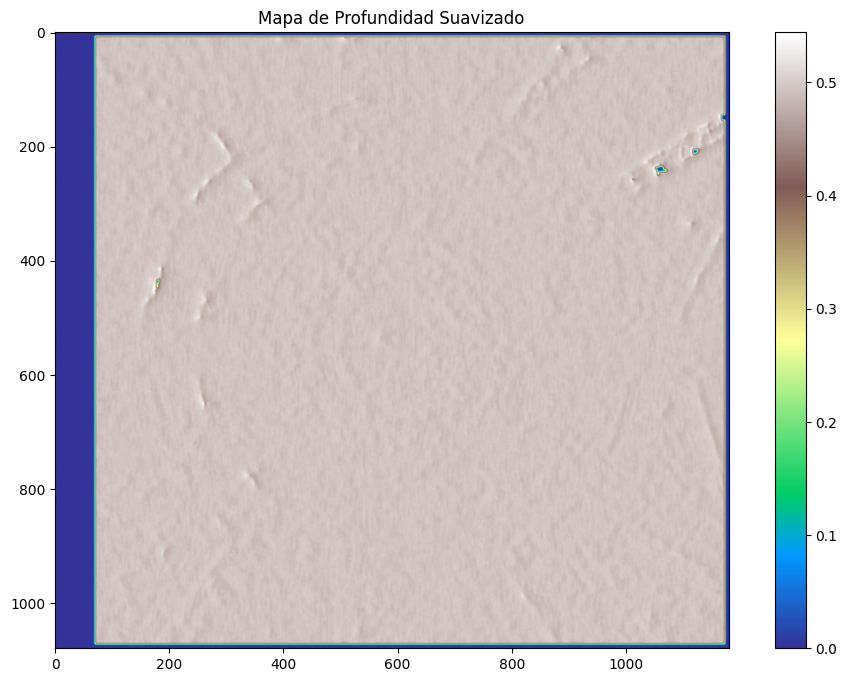

# Taller - Reconstrucción 3D Estéreo Satelital OpenCV
## Nombre:

- Juan David Buitrago Salazar
- Juan David Cardenas Galvis
- Nicolás Rodríguez Piraban
- Camilo Andres Medina Sanchez
- Juan Felipe Fajardo Garzón

## Fecha de entrega: 08/06/2026

## Descripción breve:
Este taller consiste en simular la **reconstrucción de un relieve 3D** a partir de imágenes satelitales utilizando técnicas de **visión estéreo** con OpenCV. Se parte de una única imagen satelital de la cual se genera un par estéreo artificial (mediante un desplazamiento horizontal de píxeles), se calcula el **mapa de disparidad** con el algoritmo `StereoBM`, se convierte a un **mapa de profundidad** (relación inversa a la disparidad) y finalmente se genera una **malla 3D texturizada** del terreno usando Plotly. El resultado es un DEM (Modelo de Elevación Digital) simulado a partir de un par estéreo.

**Proceso estéreo y obtención del mapa de elevación:**

El principio de la visión estéreo es la **triangulación**: si dos cámaras (o dos vistas) capturan la misma escena desde posiciones ligeramente distintas, un punto del terreno aparece desplazado horizontalmente entre las dos imágenes. Ese desplazamiento se llama **disparidad** y es inversamente proporcional a la profundidad (a mayor disparidad, más cerca está el punto del observador). A partir de la disparidad `d` se obtiene una profundidad estimada como `Z = f·B/d`, donde `f` es la distancia focal y `B` la línea base. En este taller, al no contar con parámetros calibrados de la cámara, se usa una aproximación `depth ≈ 1/disparity` para obtener un relieve relativo que permite visualizar la geometría del terreno.

## Implementaciones:

### Python:
Se implementó un pipeline completo en un Jupyter Notebook (`python/reconstruccion3Destereo.ipynb`) que recorre todas las etapas del flujo estéreo: carga de la imagen original, creación del par estéreo artificial, cálculo de disparidad con OpenCV, filtrado de valores inválidos, conversión a mapa de profundidad, suavizado y renderizado 3D con textura.

**Explicación de parámetros clave:**

- **Shift = 2 píxeles (par estéreo artificial)**: Se desplaza la imagen 2 píxeles a la derecha para simular la vista derecha (`imgR = img[:, 2:]`) y se toma el recorte correspondiente como vista izquierda (`imgL = img[:, :-2]`). Es un shift pequeño para que la disparidad resultante sea baja y representativa de un relieve "lejano".

- **StereoBM (Block Matching)**: Algoritmo clásico de OpenCV que busca correspondencias entre bloques de píxeles de ambas imágenes. Es rápido pero limitado en escenas con poca textura.

- **numDisparities=64**: Rango máximo de disparidad a buscar (en píxeles). Define la "ventana" de búsqueda entre la imagen izquierda y derecha. Un valor mayor detecta relieves más pronunciados, pero es más costoso computacionalmente.

- **blockSize=15**: Tamaño de la ventana de comparación (debe ser impar). Ventanas más grandes producen mapas más suaves pero pierden detalle fino; ventanas pequeñas preservan detalles pero generan más ruido.

- **División por 16 (`/ 16.0`)**: OpenCV almacena la disparidad en formato fijo Q4.12 (multiplicada por 16), por lo que se divide para obtener el valor real en píxeles.

- **Filtrado `disp[disp <= 0] = NaN`**: StereoBM devuelve valores negativos o cero en zonas sin correspondencia confiable (ocultaciones, bordes, zonas de baja textura). Se reemplazan por NaN para excluirlos de la visualización.

- **Profundidad `1.0 / (disp + 1e-6)`**: Relación inversa entre disparidad y profundidad. El `1e-6` evita división por cero.

- **`np.clip(depth, 0, 100)`**: Recorta valores extremos para que el rango de elevación sea visualmente interpretable.

- **`cv2.GaussianBlur(depth, (7,7), 0)`**: Suavizado gaussiano para reducir el ruido del mapa de profundidad y obtener una superficie 3D más continua.

- **Factor de submuestreo = 4**: Reduce la resolución de la malla 3D (`depth_small`) y de la textura (`texture_small`) para que Plotly pueda renderizar la superficie de forma fluida sin sacrificar la geometría general.

- **go.Surface con `surfacecolor`**: Malla 3D donde `z` es la profundidad y `surfacecolor` es la imagen original en escala de grises texturizando la superficie, lo que permite asociar visualmente el relieve con el contenido de la imagen.

## Resultados visuales

Se carga la imagen satelital original que será la base del proceso estéreo.



Para obtener un par estéreo a partir de una única imagen, se aplica un desplazamiento horizontal de 2 píxeles. Esto simula la captura desde dos puntos de vista ligeramente distintos.



Con el algoritmo `StereoBM` de OpenCV se calcula el mapa de disparidad. Las zonas con colores más cálidos (amarillo) indican mayor disparidad (más cercanas), mientras que las zonas oscuras indican menor disparidad o áreas sin correspondencia confiable.

Se filtran los valores inválidos (`<= 0`) reemplazándolos por `NaN`, y se aplica la relación inversa `1/disparidad` para obtener el mapa de profundidad. Adicionalmente, se aplica un suavizado gaussiano (7x7) para reducir ruido y obtener una superficie más continua.



Finalmente, se genera la malla 3D texturizada con Plotly, donde la altura `z` representa la profundidad estimada y la textura proviene de la imagen original. Esto permite visualizar el relieve simulado en un espacio tridimensional interactivo.


## Código relevante:
La carga de la imagen y la creación del par estéreo artificial son los primeros pasos. Se desplaza la imagen 2 píxeles para simular la vista derecha, mientras que el recorte correspondiente se usa como vista izquierda. Esto es necesario porque partimos de una única imagen en lugar de un par estéreo real.
```python
img = cv2.imread("base_image.png", cv2.IMREAD_GRAYSCALE)

shift = 2
imgL = img[:, :-shift]
imgR = img[:, shift:]
```
El cálculo de disparidad se realiza con el algoritmo Block Matching de OpenCV. `numDisparities` define el rango máximo de búsqueda y `blockSize` el tamaño de la ventana de comparación. La división por 16 es necesaria porque OpenCV almacena la disparidad en formato Q4.12.
```python
stereo = cv2.StereoBM_create(
    numDisparities=64,
    blockSize=15
)
disparity = stereo.compute(imgL, imgR).astype(np.float32) / 16.0
```
La conversión de disparidad a profundidad se basa en la relación inversa: a mayor disparidad, menor profundidad. Se filtran los valores inválidos (`<= 0`) reemplazándolos por NaN, y se recortan los valores extremos para que el rango sea visualmente interpretable.
```python
disp = disparity.copy()
disp[disp <= 0] = np.nan

depth_map = 1.0 / (disp + 1e-6)
depth_map = np.nan_to_num(depth_map)
depth_map = np.clip(depth_map, 0, 100)
depth_map = cv2.GaussianBlur(depth_map, (7,7), 0)
```
La generación de la malla 3D se hace con Plotly, donde `z` es el mapa de profundidad y `surfacecolor` es la imagen original que texturiza la superficie. El submuestreo por un factor de 4 reduce la resolución para que la renderización sea fluida sin perder la geometría general.
```python
factor = 4
depth_small = depth_map[::factor, ::factor]
texture_small = imgL[::factor, ::factor]

rows, cols = depth_small.shape
x, y = np.meshgrid(np.arange(cols), np.arange(rows))

fig = go.Figure(data=[
    go.Surface(
        z=depth_small,
        surfacecolor=texture_small,
        colorscale="Gray",
        showscale=False
    )
])
fig.update_layout(
    title="Reconstrucción 3D del Terreno",
    autosize=True,
    width=1000,
    height=800
)
fig.show()
```

## Prompts utilizados:
Genera un script en Python con OpenCV que tome una imagen satelital, genere un par estéreo artificial, calcule el mapa de disparidad con StereoBM, lo convierta a mapa de profundidad y finalmente genere una malla 3D texturizada con Plotly.

## Aprendizajes y dificultades:
Este taller permitió comprender el pipeline completo de la visión estéreo partiendo de una sola imagen satelital. Se evidenció cómo un par estéreo artificial con un desplazamiento pequeño de 2 píxeles genera un rango de disparidad muy estrecho (1.7–2.4), apenas visible en el mapa de disparidad, y cómo la inversión `1/disparity` amplifica ese rango reducido en el mapa de profundidad. La malla 3D final muestra la textura urbana original proyectada sobre una superficie con relieve, lo que demuestra que el flujo end-to-end funciona, aunque la elevación obtenida es solo cualitativa por no contar con parámetros calibrados (`f`, `B`).

La principal dificultad fue que el par estéreo sintético produce una disparidad casi constante en toda la imagen, por lo que el mapa de disparidad luce casi uniforme y la conversión `1/disparity` amplifica el ruido hasta convertir la malla 3D en un terreno muy "picudo" y poco fiel a la geometría real de la ciudad. Además, `StereoBM` generó valores inválidos en zonas de baja textura (calles asfaltadas, tejados uniformes, sombras), que hubo que filtrar como `NaN`, y aparecen como una franja azulada en el borde izquierdo producto del recorte del desplazamiento. Interpretar el formato Q4.12 de OpenCV y ajustar `blockSize=15` y `numDisparities=64` también requirió experimentación.

Como mejoras futuras, para obtener una reconstrucción fiel se debería usar un par estéreo satelital real con desplazamiento mayor y calibración conocida de la cámara, aplicar `StereoSGBM` o modelos de deep learning (HITNet, RAFT-Stereo) que manejen mejor oclusiones y bajas texturas, y normalizar la profundidad con `f` y `B` reales para obtener elevaciones métricas. Adicionalmente, se podría post-procesar la malla con un suavizado más fuerte (mediana bilateral), exportar a `.obj`/`.ply` para integrarla con herramientas GIS, y comparar cuantitativamente contra un DEM de referencia (ej. SRTM o Copernicus DEM) usando métricas como RMSE.
