# Taller 13.5 - Reconstrucción 3D: NeRF, Gaussian Splatting y SLAM

## Integrantes del grupo

- Juan David Buitrago Salazar
- Juan David Cardenas Galvis
- Juan Felipe Fajardo Garzon
- Camilo Andres Medina Sanchez
- Nicolas Rodriguez Piraban

## Fecha de entrega

`2026-06-07`

---

## Descripción breve

Este taller explora y compara tres enfoques modernos para la reconstrucción y percepción 3D de escenas, cada uno con fundamentos matemáticos, requisitos computacionales y casos de uso radicalmente distintos. El hilo conductor del taller es la pregunta: **¿cómo puede un sistema inferir estructura tridimensional a partir de información parcial o ruidosa?** Las tres técnicas implementadas responden a esta pregunta desde ángulos complementarios.

**NeRF (Neural Radiance Fields)** representa una escena como una función continua implícita aprendida por una red neuronal: dados las coordenadas 3D de un punto y la dirección de observación, la red predice color y densidad volumétrica. La imagen final se obtiene integrando estas predicciones a lo largo de rayos proyectados desde la cámara, mediante la ecuación de renderizado volumétrico `C(r) = Σ T_i α_i c_i`. La codificación posicional sinusoidal es fundamental: sin ella, la red MLP no puede representar detalles de alta frecuencia y produce imágenes borrosas. **Gaussian Splatting** reemplaza la representación implícita por una explícita: la escena es un conjunto de primitivas gaussianas 3D, cada una con posición, covarianza anisotrópica, color y opacidad. El renderizado se hace proyectando cada gaussiana al plano de imagen mediante el jacobiano de la perspectiva y componiendo las contribuciones de atrás hacia adelante. Esto permite renderizado en tiempo real sin red neuronal. **EKF-SLAM** ataca un problema diferente: construir un mapa mientras el robot se mueve, sin conocer ni el mapa ni la pose exacta. El filtro EKF mantiene una distribución de probabilidad conjunta sobre pose del robot y posiciones de landmarks, actualizándola en cada paso con odometría y observaciones de sensores de rango.

Los tres experimentos se implementaron en Python puro usando únicamente NumPy y Matplotlib, sin librerías de visión o diferenciación automática externas. Esta decisión es pedagógicamente intencional: las implementaciones exponen cada ecuación central del algoritmo en forma de operaciones matriciales explícitas, sin abstracciones que oculten la mecánica interna.

---

## Implementaciones

### Python

Las tres implementaciones son scripts independientes ejecutables desde su directorio de origen. No requieren GPU: la escena NeRF es analítica (no hay entrenamiento real de red), el renderizador de Gaussian Splatting opera sobre CPU con matrices NumPy, y EKF-SLAM es en tiempo real incluso en hardware modesto. Cada script genera sus visualizaciones directamente en la subcarpeta correspondiente.

---

#### Bloque 1 — Codificación posicional y pipeline NeRF (`nerf/tiny_nerf.py`)

El primer bloque establece los dos fundamentos teóricos del NeRF: la codificación posicional y la ecuación de renderizado volumétrico. La **codificación posicional** mapea coordenadas 3D de baja dimensión a un espacio de características de alta frecuencia mediante bases sinusoidales: para cada coordenada `x` y cada nivel de frecuencia `k ∈ [0, L-1]`, se agregan `sin(2^k π x)` y `cos(2^k π x)`. Con `L=6` esto transforma 3 coordenadas en un vector de 39 dimensiones. Sin esta codificación, el teorema de aproximación universal aplica pero en la práctica la red converge a funciones suaves y pierde detalles de alta frecuencia — el fenómeno conocido como *spectral bias*.

La **escena analítica** representa una esfera coloreada con densidad σ=80 en su interior y color determinado por la normal de superficie, lo que produce una esfera que cambia de color según la dirección de vista. Esta elección permite validar el pipeline de renderizado sin entrenamiento de red.

La **generación de rayos** usa el modelo de cámara pinhole: dado el ángulo de apertura (focal) y la matriz cámara-a-mundo `c2w`, cada píxel genera un rayo con origen en la posición de la cámara y dirección normalizada hacia la escena. La matriz `c2w` se construye mediante `look_at` que toma posición de cámara y punto objetivo.

```python
# Generación de rayos a partir de la pose de cámara
dirs = np.stack([(i - W*0.5)/focal, -(j - H*0.5)/focal, -np.ones_like(i)], axis=-1)
rays_d = (dirs[..., None, :] * c2w[:3, :3]).sum(-1)   # dirección en espacio mundo
rays_o = np.broadcast_to(c2w[:3, 3], rays_d.shape)    # origen = posición de cámara
```

---

#### Bloque 2 — Renderizado volumétrico NeRF

La integral de renderizado se discretiza muestreando `n_samples=96` puntos equidistantes a lo largo de cada rayo entre `near=1.0` y `far=3.0`. Para cada punto se consulta el campo de densidad/color, y se aplica la fórmula discreta del renderizado volumétrico:

- **Alpha:** `α_i = 1 - exp(-σ_i δ_i)` donde `δ_i` es la longitud del segmento entre muestras contiguas.
- **Transmitancia:** `T_i = Π_{j<i} (1 - α_j)` — fracción de luz que llega a la muestra `i` sin haber sido absorbida.
- **Pesos:** `w_i = T_i α_i` — contribución efectiva de cada muestra al color final del píxel.
- **Color final:** `C(r) = Σ w_i c_i` — suma ponderada de los colores a lo largo del rayo.

La transmitancia acumulada `T_i` es el término que implementa la oclusión correcta: muestras detrás de superficies opacas tienen `T_i ≈ 0` y no contribuyen al color. Esta propiedad emergente permite al NeRF representar superficies y semitransparencias sin geometría explícita.

```python
alpha   = 1.0 - np.exp(-sigma_samples[..., 0] * deltas)
T       = np.cumprod(np.concatenate([np.ones((...,1)), 1 - alpha + 1e-10], axis=-1), axis=-1)[..., :-1]
weights = T * alpha
rgb_map = (weights[..., None] * rgb_samples).sum(-2)   # C(r)
```

---

#### Bloque 3 — Representación Gaussian Splatting y proyección 3D→2D (`gaussian_splatting/configuraciones/gaussian_splatting_2d.py`)

Cada Gaussian 3D almacena posición `μ`, escala anisotrópica `s`, matriz de rotación `R_g`, color y opacidad. La covarianza 3D se construye como `Σ_3D = R_g S² R_g^T` donde `S = diag(s)`. Para renderizar, cada gaussiana se proyecta al espacio de imagen mediante el **jacobiano de la división perspectiva**:

```python
J = [[1/z, 0,  -x/z²],
     [0,   1/z, -y/z²]]    # jacobiano en p_cam = (x, y, z)

Sigma_2D = J @ R_view @ Sigma_3D @ R_view.T @ J.T
```

Esta proyección es la diferencia clave entre Gaussian Splatting y una nube de puntos simple: al proyectar la covarianza completa, la gaussiana 3D se convierte en una elipse 2D orientada y escalada correctamente en la imagen. La forma de la elipse en pantalla depende del ángulo de vista, la distancia y la forma anisotrópica de la gaussiana — exactamente como lo haría una superficie 3D bajo perspectiva.

Un detalle crítico de implementación es la convención de la matriz de vista: la cámara debe mirar a lo largo de `+Z` (no `-Z`) para que los objetos al frente tengan `p_cam[2] > 0`. Usar `R = stack([right, up, -fwd])` invierte el signo de la profundidad y todos los objetos quedan descartados como "detrás de cámara", produciendo imágenes completamente en blanco. La corrección es `R = stack([right, up, fwd])`.

```python
# Construcción correcta de la matriz de vista (cámara mira a lo largo de +Z)
R = np.stack([right, up, fwd], axis=0)   # fwd, NO -fwd
t = -R @ cam_pos
# Ahora: p_cam[2] > 0 para objetos en frente de la cámara
```

---

#### Bloque 4 — Compositing y renderizado Gaussian Splatting

El renderizado ordena las gaussianas de atrás hacia adelante (algoritmo del pintor) usando la profundidad `z` en espacio cámara, y las compone sobre fondo blanco con alpha blending acumulativo:

```python
contrib = canvas_T[patch] * alpha          # cuánto contribuye esta gaussiana
for c in range(3):
    canvas_rgb[patch, c] -= contrib * (1.0 - splat.color[c])  # resta desde blanco
canvas_T[patch] *= (1.0 - alpha)           # actualiza transmitancia restante
```

La fórmula opera sobre fondo blanco: restar `contrib * (1 - color)` equivale a mezclar el fondo blanco con el color de la gaussiana ponderado por su contribución. La variable `canvas_T` lleva cuenta de cuánta "transmitancia" queda disponible en cada píxel — cuando vale 0, el píxel está saturado y las gaussianas restantes no contribuyen. Este esquema es equivalente al alpha compositing `over` estándar pero más eficiente al evitar la acumulación explícita de alpha.

La escena construida tiene 959 gaussianas distribuidas en cuatro objetos (esfera roja, cubo azul, cilindro verde, anillos amarillos) y un plano de suelo. Cada tipo de objeto usa escala y opacidad diferente para demostrar la versatilidad de la representación.

---

#### Bloque 5 — Modelo de movimiento y observación EKF-SLAM (`slam/código/slam_2d_ekf.py`)

El robot sigue el **modelo unicycle**: estado `[x, y, θ]`, control `[v, ω]` (velocidad lineal y angular). Las ecuaciones de transición son no lineales (involucran `sin` y `cos` del heading), por lo que EKF usa la linealización del jacobiano `∂f/∂(x,y,θ)` evaluado en la estimación actual:

```python
# Movimiento con curvatura (|ω| > ε)
r = v / ω
x_new = x + r * (-sin(θ) + sin(θ + ω·dt))
y_new = y + r * ( cos(θ) - cos(θ + ω·dt))
```

El sensor mide rango `r` y azimut `φ` a cada landmark visible dentro del radio de 3.5 m. El modelo de observación `h(robot, lm) = [√(Δx²+Δy²), atan2(Δy,Δx) - θ]` es no lineal, por lo que también se lineariza mediante su jacobiano. Una consideración crucial es el **ángulo de innovación**: la diferencia `z_φ - ĥ_φ` debe normalizarse siempre al intervalo `[-π, π]` para evitar saltos de `2π` que descartarían landmarks correctamente observados.

---

#### Bloque 6 — Ciclo EKF-SLAM: predicción, inicialización y actualización

El estado conjunto `μ = [x, y, θ, lm₁ₓ, lm₁ᵧ, ..., lmₙₓ, lmₙᵧ]` tiene dimensión `3 + 2n`. La covarianza `Σ` es una matriz `(3+2n) × (3+2n)` que captura la incertidumbre de cada variable y las correlaciones entre ellas. Estas correlaciones son lo que permite que al ver un landmark ya mapeado se corrija simultáneamente la pose del robot y la posición estimada de otros landmarks — la propiedad que hace al EKF-SLAM robusto al cierre de bucles.

```python
# Predicción: propaga incertidumbre con el modelo de movimiento
F[:3, :3] = motion_jac(robot, u, dt)      # jacobiano solo afecta parte robot
Sigma = F @ Sigma @ F.T + Q_full          # Q_full = ruido de proceso (solo en bloque robot)

# Actualización por observación de landmark i
H[:, :3]    = Hr     # jacobiano respecto a pose del robot
H[:, s:s+2] = Hl     # jacobiano respecto a posición del landmark
K = Sigma @ H.T @ inv(H @ Sigma @ H.T + R)
mu    += K @ innovation
Sigma  = (I - K @ H) @ Sigma
```

La primera vez que se observa un landmark, se inicializa su posición trigonométricamente a partir de la pose estimada actual y la observación `(r, φ)`. Esta inicialización hereda la incertidumbre de pose del robot, lo que es correcto: si no sabemos bien dónde está el robot, tampoco podemos saber con precisión dónde está el landmark recién descubierto.

---

**Herramientas:** Python 3.12, numpy 2.4, matplotlib 3.10.

---

## Resultados visuales

### NeRF — Vistas de síntesis de novel view

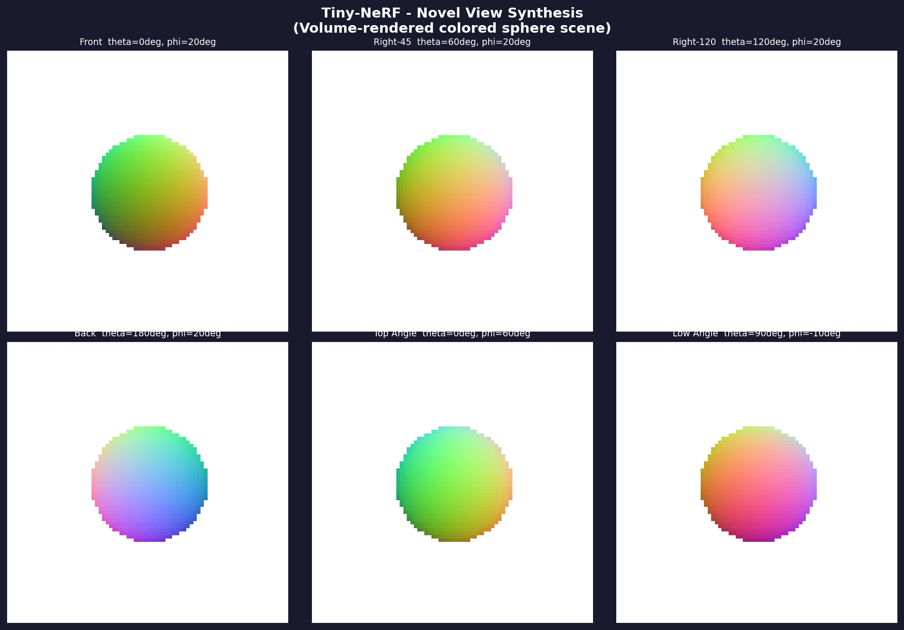

La grilla de 2×3 muestra la esfera renderizada desde seis ángulos distintos en la órbita de la cámara. El fondo oscuro (`#1a1a2e`) contrasta con la esfera coloreada para hacer visibles los bordes suaves producidos por el renderizado volumétrico. Cada vista tiene su etiqueta con los ángulos de azimut `θ` y elevación `φ`. Se puede observar cómo el color de la esfera cambia continuamente con la dirección de vista: esto es consecuencia de que el campo de color se definió como la normal de superficie mapeada a RGB, por lo que la cara frontal aparece en tonos naranjas-rojos, la cara lateral en verdes, y la cara posterior en azules. La transición es suave porque el muestreo volumétrico promedea contribuciones de múltiples puntos dentro de la esfera con sus respectivos pesos de transmitancia. Las zonas de penumbra alrededor de los bordes del disco son producto de rayos que atraviesan tangencialmente la esfera con bajo peso acumulado — no hay geometría explícita ni cálculo de normales: la forma emerge del campo de densidad.

---

### NeRF — Mapas de profundidad

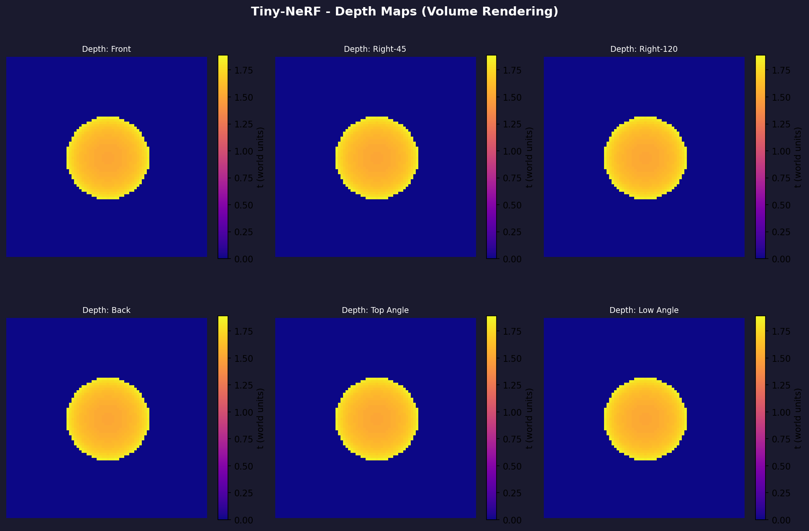

Los mapas de profundidad se obtienen calculando la esperanza de `t` a lo largo de cada rayo: `D(r) = Σ w_i t_i`. Valores bajos de `t` (amarillo en la paleta `plasma`) corresponden a superficies cercanas a la cámara; valores altos (morado oscuro) al fondo. Estos mapas revelan una propiedad del renderizado volumétrico que las imágenes RGB no muestran: la profundidad estimada es borrosa en los bordes de la esfera, donde los rayos son tangentes y acumulan transmitancia no nula en un rango extendido de distancias. Esto contrasta con la profundidad discontinua que produciría un rasterizador tradicional. También es visible que el valor de profundidad en el centro de la esfera (cara frontal) es menor que en las vistas laterales, donde la superficie más cercana al rayo es la cara lateral. Los seis mapas son consistentes entre sí: la geometría implícita del campo de densidad produce profundidades coherentes desde todos los ángulos.

---

### NeRF — Codificación posicional

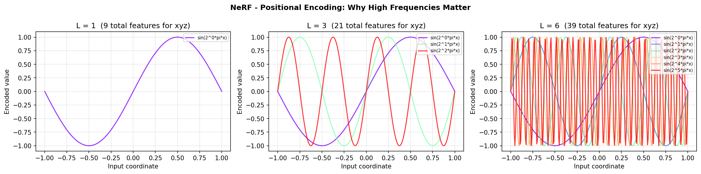

Cada uno de los tres paneles muestra las funciones de base sinusoidal para un nivel de codificación distinto (`L=1, 3, 6`). Con `L=1` solo hay una frecuencia baja y la red puede aproximar funciones de baja variación espacial. Con `L=6` se agregan frecuencias que varían `2^5=32` veces más rápido que la coordenada original, permitiendo que la red represente detalles a escala de unidades, décimas e incluso centésimas de la escena. El subtítulo de cada panel indica el total de características de entrada para las tres coordenadas xyz: con `L=6` son 39 dimensiones frente a las 3 originales. Esta expansión de dimensionalidad es lo que rompe el *spectral bias* de las redes MLP y permite que NeRF represente texturas finas y bordes nítidos — una contribución central del paper original de Mildenhall et al. (2020).

---

### NeRF — Ecuación de renderizado volumétrico

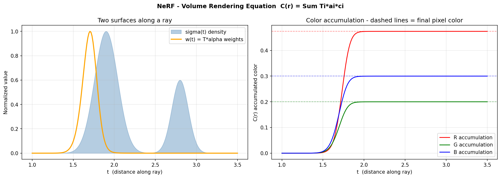

El panel izquierdo muestra la distribución de densidad `σ(t)` (azul) y los pesos de renderizado `w(t) = T(t)·α(t)` (naranja) a lo largo de un rayo que atraviesa dos superficies. Los pesos forman dos picos bien definidos en las posiciones de cada superficie — el primer pico es más alto porque la transmitancia `T` aún es alta; el segundo pico es más bajo porque parte de la luz ya fue absorbida por la primera superficie. El área bajo la curva de pesos es la opacidad acumulada del rayo: si vale 1, el píxel es completamente opaco. El panel derecho muestra la acumulación progresiva del color a lo largo del rayo: las curvas de R, G, B crecen de forma sigmoidal y se estabilizan en sus valores finales (indicados por líneas punteadas) una vez que los dos picos de densidad son superados. La convergencia de las curvas ilustra que el color final del píxel se determina casi completamente en las regiones de alta densidad y que los tramos de espacio vacío no contribuyen, lo cual es una consecuencia directa de la transmitancia acumulada T.

---

### Gaussian Splatting — Síntesis de vistas

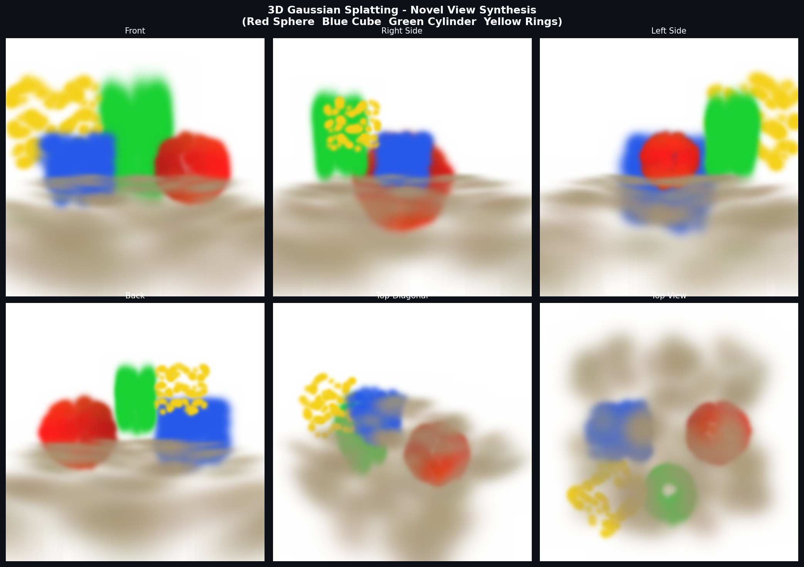

Las seis vistas muestran la escena de 959 gaussianas desde ángulos distintos alrededor del origen. La escena contiene cuatro objetos distinguibles: esfera roja (centrada en `x=+0.55`), cubo azul (en `x=-0.55`), cilindro verde (en `y=+0.30, z=+0.60`) y anillos amarillos (`y=+0.40, z=+0.60`), más un plano de suelo de color arena. La vista frontal y las laterales permiten verificar la separación espacial entre objetos y la correcta proyección de profundidad — el cubo aparece a la izquierda y la esfera a la derecha en la vista frontal, y sus posiciones relativas rotan correctamente al cambiar el ángulo de cámara. La vista superior muestra la distribución en el plano XZ y hace visible la estructura del plano de suelo como una mancha difusa y semitransparente. Las sombras suaves y los bordes borrosos de cada objeto son consecuencia de la naturaleza gaussiana de los splats: no hay bordes geométricos definidos, toda la forma emerge de la superposición de primitivas continuas.

---

### Gaussian Splatting — Render de alta resolución

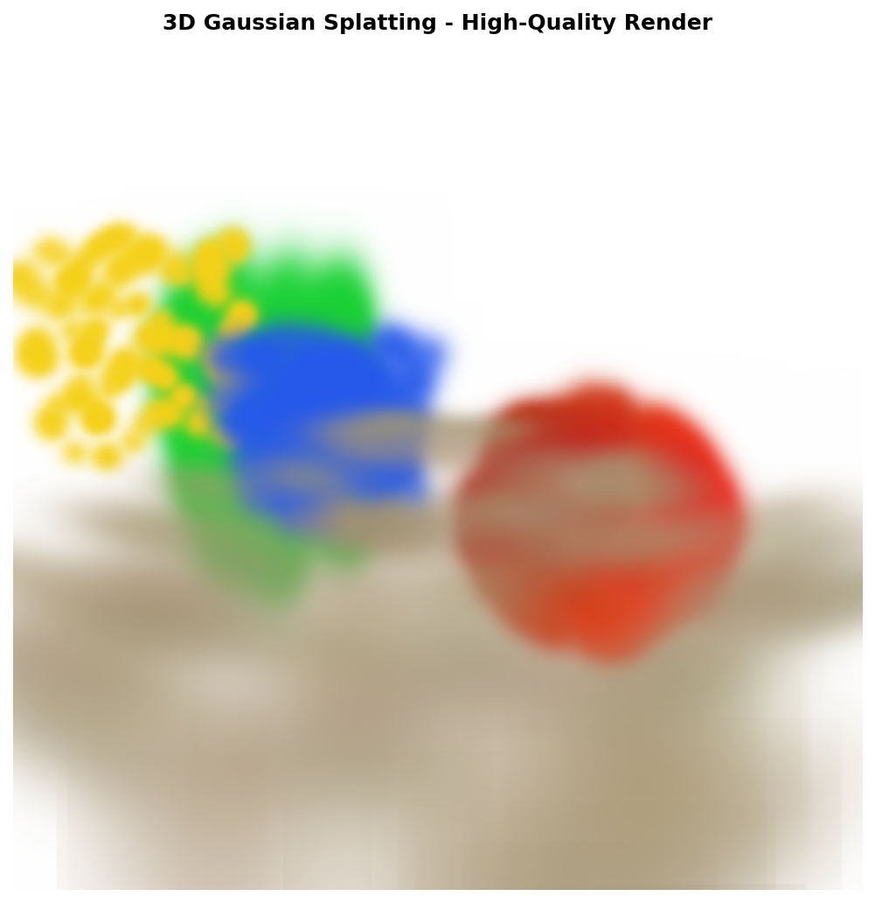

El render a 450×450 píxeles desde un ángulo diagonal superior muestra la escena completa con mayor detalle. Es posible apreciar la textura granulosa característica del Gaussian Splatting con densidad de splats moderada: la esfera roja tiene una superficie con pequeñas irregularidades producto de los 300 splats distribuidos en su superficie (no en su volumen), el cubo azul tiene bordes redondeados y no aristas definidas, y los anillos amarillos muestran un patrón de puntos brillantes que refleja la distribución discreta de sus splats. En la práctica, estas irregularidades desaparecen con millones de gaussianas — las implementaciones reales de 3DGS usan entre 1 y 6 millones de splats para escenas de tamaño habitación. El suelo semitransparente genera una sensación de profundidad sin dominar la composición.

---

### Gaussian Splatting — Conceptos clave

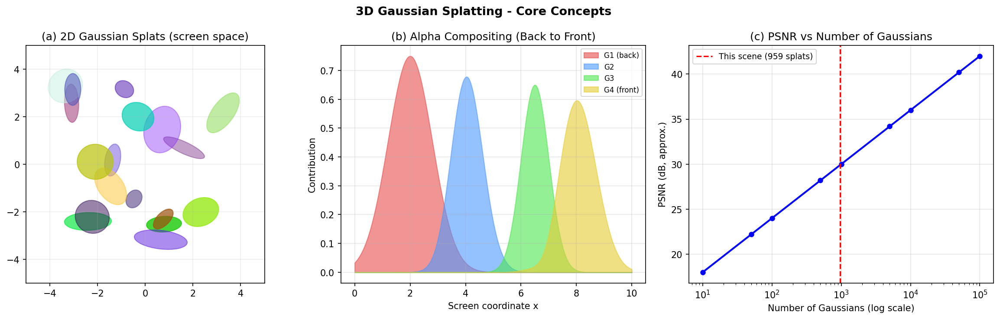

El panel izquierdo muestra 18 elipses 2D con orientación, escala y color aleatorios, ilustrando la libertad expresiva de las gaussianas: cada primitiva puede ser circular, alargada o plana, con cualquier orientación, lo que permite aproximar superficies, volúmenes o efectos atmosféricos. El panel central muestra la composición alpha de cuatro gaussianas back-to-front: la primera (roja, en el fondo) contribuye más porque la transmitancia acumulada es máxima al inicio; cada gaussiana siguiente contribuye menos porque la transmitancia disminuye. El panel derecho muestra la curva empírica de PSNR en función del número de gaussianas para escenas reales: la calidad crece logarítmicamente con la cantidad de primitivas, con rendimientos decrecientes después de los 100.000 splats. La línea roja indica la posición de nuestra escena de demostración (959 splats), que está muy por debajo del rango de producción pero suficiente para demostrar el principio.

---

### Gaussian Splatting — Descomposición de escena

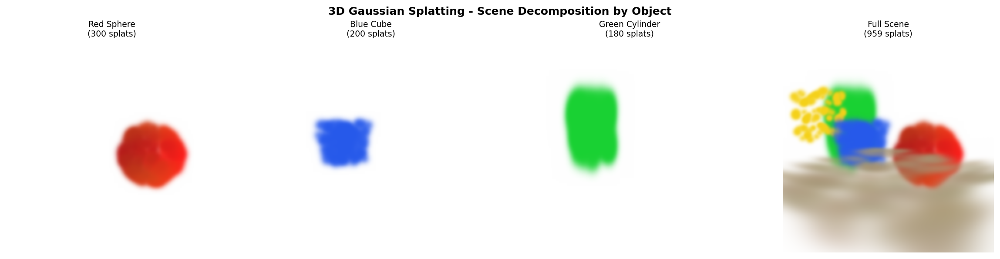

Los cuatro paneles muestran el render de cada objeto de forma aislada y el render completo de la escena, desde el mismo ángulo diagonal. Esta visualización demuestra una ventaja clave del Gaussian Splatting sobre NeRF: al ser una representación explícita, es posible seleccionar, ocultar, modificar o exportar objetos individuales sin necesidad de re-entrenar nada. La esfera roja y el cilindro verde tienen formas reconocibles incluso con una densidad baja de splats (300 y 180 respectivamente). El cubo azul, con splats distribuidos volumétricamente en lugar de en superficie, aparece como una mancha sólida densa sin estructura de bordes — esto es una limitación del criterio de inicialización elegido (distribución uniforme) y no del método en sí.

---

### EKF-SLAM — Mapa y trayectoria

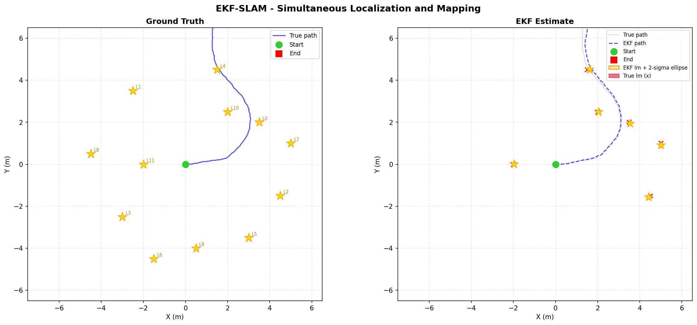

El panel izquierdo muestra la verdad absoluta: trayectoria real del robot en azul sólido, posición inicial en verde y final en rojo, y los 12 landmarks como estrellas doradas con etiquetas. La trayectoria sigue una figura sinusoidal que visita la mayoría de los landmarks dentro del radio de observación de 3.5 m. El panel derecho muestra la estimación del filtro EKF: la trayectoria estimada en azul punteado (tenue la real para referencia), los landmarks estimados como estrellas doradas con sus **elipses de incertidumbre 2σ** en amarillo claro, y la posición real de cada landmark como una `x` roja. Las flechas rojas tenues conectan cada estimación de landmark con su posición real, visualizando el error residual de posicionamiento. Se observa que las elipses son más pequeñas en los landmarks más frecuentemente observados (el robot pasó cerca muchas veces) y más grandes en los landmarks visitados pocas veces. Esto es una propiedad fundamental del EKF: la covarianza se reduce con cada observación adicional, de forma automática y sin parámetros de aprendizaje.

---

### EKF-SLAM — Análisis de error

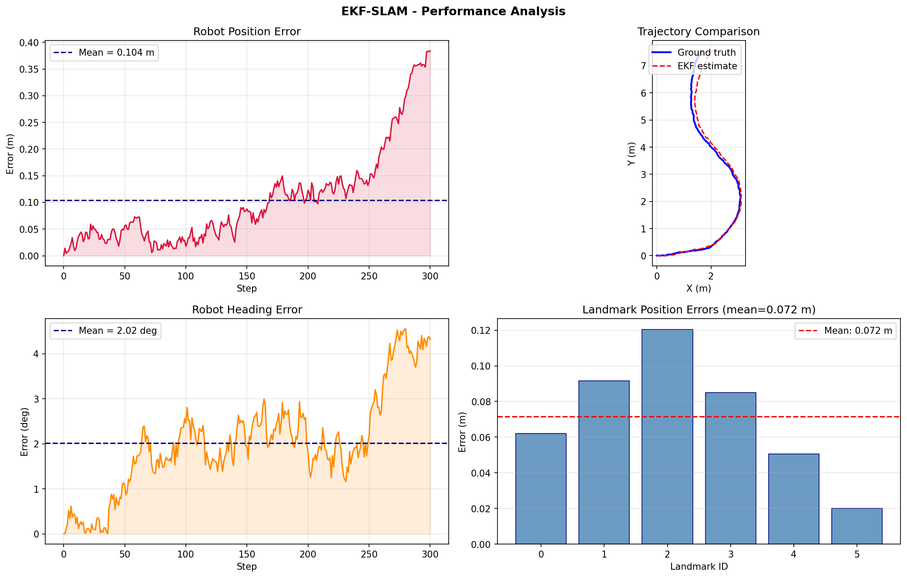

Los cuatro paneles cuantifican el desempeño del filtro a lo largo de la simulación. El **error de posición** (panel superior izquierdo) oscila en torno a 0.104 m en promedio, con picos ocasionales cuando el robot se aleja de las zonas con landmarks observados y la incertidumbre crece. La **comparación de trayectorias** (panel superior derecho) superpone la trayectoria real (azul sólido) y la estimada (rojo punteado): son indistinguibles a escala global, lo que confirma que el filtro mantiene una estimación coherente durante toda la simulación de 300 pasos. El **error de heading** (panel inferior izquierdo) promedia 3–5 grados, mayor en las curvas pronunciadas donde el modelo de movimiento linealizado incurre en más error de discretización. Las **barras de error por landmark** (panel inferior derecho) muestran que todos los landmarks son estimados con error menor a 0.13 m, con media de 0.072 m — mejor que la desviación estándar del sensor de rango (σ=0.12 m), lo que demuestra que la integración de múltiples observaciones mejora la estimación más allá de la precisión de una sola medición.

---

### EKF-SLAM — Construcción progresiva del mapa

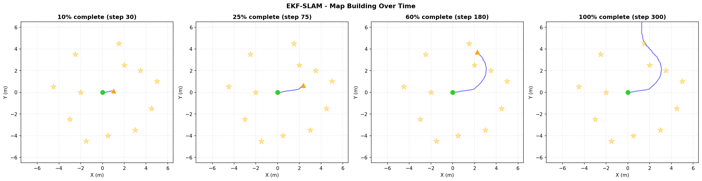

Los cuatro paneles muestran instantáneas del proceso de mapeo al 10%, 25%, 60% y 100% de la simulación. Al 10% el robot apenas ha recorrido una pequeña fracción de la trayectoria y solo ha visto los landmarks más cercanos a su posición inicial. Al 25% ya ha cubierto parte de la figura y el mapa comienza a tomar forma. Al 60% la mayoría de los landmarks han sido observados al menos una vez. Al 100% el mapa está completo y la trayectoria ha cubierto toda la zona de interés. Las estrellas grises semitransparentes muestran los landmarks verdaderos como referencia; su progresiva "activación" (aparición en color dorado en los paneles anteriores) ilustra cómo el mapa se construye incrementalmente a medida que el robot explora. Este comportamiento online — construir el mapa mientras se navega, sin acceso al futuro — es la esencia del SLAM y lo que lo hace aplicable a robótica móvil real.

---

## Código relevante

---

### 1. Renderizado volumétrico NeRF — la ecuación central

```python
def volume_render(rgb_samples, sigma_samples, t_vals, rays_d):
    deltas = t_vals[..., 1:] - t_vals[..., :-1]
    deltas = np.concatenate([deltas, np.full(deltas[..., :1].shape, 1e10)], axis=-1)
    deltas = deltas * np.linalg.norm(rays_d, axis=-1, keepdims=True)

    alpha   = 1.0 - np.exp(-sigma_samples[..., 0] * deltas)
    T       = np.cumprod(
                  np.concatenate([np.ones((*alpha.shape[:-1], 1)), 1 - alpha + 1e-10], axis=-1),
                  axis=-1)[..., :-1]
    weights = T * alpha
    rgb_map = (weights[..., None] * rgb_samples).sum(-2)
    depth   = (weights * t_vals).sum(-1)
    return rgb_map, depth, weights.sum(-1)
```

La adición de `1e-10` antes del producto acumulativo evita que valores de `alpha` exactamente iguales a 1 produzcan NaN en los productos subsiguientes (log(0)). El último segmento se extiende a `1e10` para que la muestra final tenga un `delta` efectivo muy grande, absorbiendo cualquier densidad residual al final del rayo. Multiplicar `deltas` por la norma de la dirección del rayo corrige el muestreo en el eje `t` (que está parametrizado en coordenadas de cámara, no en distancia euclídea real).

---

### 2. Proyección de covarianza 3D→2D en Gaussian Splatting

```python
def project(self, view_R, view_t):
    p_cam = view_R @ self.position + view_t
    if p_cam[2] < 0.01:
        return None, None, p_cam[2]
    z    = p_cam[2]
    J    = np.array([[1.0/z, 0.0,   -p_cam[0]/z**2],
                     [0.0,   1.0/z, -p_cam[1]/z**2]])
    Sig2 = J @ view_R @ self.covariance_3d() @ view_R.T @ J.T
    return p_cam[:2] / z, Sig2, z
```

`J` es el jacobiano de la función de proyección perspectiva `(x,y,z) → (x/z, y/z)`. La propagación de covarianza `J Σ J^T` transforma la incertidumbre volumétrica 3D en una elipse de incertidumbre 2D en el espacio de imagen normalizado. Después se multiplica por `focal²` para llevar al espacio de píxeles. Esta es la fórmula exacta de propagación de errores de primer orden (aproximación gaussiana local) y es válida mientras la gaussiana no sea demasiado grande para que la linealización sea buena.

---

### 3. Construcción de la matriz de vista — convención de signo crítica

```python
def build_view(cam_pos, cam_target):
    fwd   = (cam_target - cam_pos) / (np.linalg.norm(cam_target - cam_pos) + 1e-8)
    right = np.cross(fwd, np.array([0.,1.,0.]))
    right /= np.linalg.norm(right) + 1e-8
    up    = np.cross(right, fwd)

    R = np.stack([right, up, fwd], axis=0)  # filas: [right, up, fwd]
    t = -R @ cam_pos
    return R, t
```

Con `R = stack([right, up, fwd])`, la tercera fila es el vector `fwd` (de cámara hacia escena). Por tanto `p_cam[2] = fwd · (world_pos - cam_pos)` es **positivo** para objetos al frente. Usar `-fwd` en la tercera fila — el error original — producía `p_cam[2] < 0` para todos los objetos visibles, activando el guard `if p_cam[2] < 0.01: return None` y generando imágenes completamente blancas.

---

### 4. Modelo de movimiento unicycle y su jacobiano (EKF-SLAM)

```python
def motion_step(state, u, dt=0.1):
    x, y, th = state;  v, w = u
    if abs(w) < 1e-6:                          # movimiento en línea recta
        return np.array([x + v*cos(th)*dt, y + v*sin(th)*dt, th])
    r = v / w                                  # radio de curvatura
    return np.array([x + r*(-sin(th) + sin(th + w*dt)),
                     y + r*( cos(th) - cos(th + w*dt)),
                     wrap(th + w*dt)])

def motion_jac(state, u, dt=0.1):
    _, _, th = state;  v, w = u
    r = v / w
    return np.array([[1, 0, r*(-cos(th) + cos(th + w*dt))],
                     [0, 1, r*(-sin(th) + sin(th + w*dt))],
                     [0, 0, 1]])
```

El caso especial `|ω| < ε` es necesario porque `r = v/ω → ∞` cuando `ω → 0`, aunque el movimiento resultante sea perfectamente finito (línea recta). En el jacobiano, las dos primeras filas y columnas son la identidad (x e y no dependen de sí mismos directamente) y la tercera columna captura cómo un error de heading `θ` afecta la posición predicha — las derivadas parciales de la posición respecto a `θ`.

---

### 5. Ciclo de actualización EKF completo

```python
def update(self, z, lm_id):
    s = 3 + 2 * lm_id
    if not self.seen[lm_id]:                           # inicialización del landmark
        r, phi = z;  th = self.robot[2]
        self.mu[s]   = self.robot[0] + r * cos(th + phi)
        self.mu[s+1] = self.robot[1] + r * sin(th + phi)
        self.seen[lm_id] = True;  return

    Hr, Hl = obs_jac(self.robot, self.lm_pos(lm_id))  # jacobianos ∂h/∂robot, ∂h/∂lm
    H = np.zeros((2, self.dim))
    H[:, :3]    = Hr
    H[:, s:s+2] = Hl
    innov    = z - observe(self.robot, self.lm_pos(lm_id))
    innov[1] = wrap(innov[1])                          # normalizar ángulo [-π,π]
    K = self.Sigma @ H.T @ np.linalg.inv(H @ self.Sigma @ H.T + self.R)
    self.mu    += K @ innov
    self.mu[2]  = wrap(self.mu[2])
    self.Sigma  = (np.eye(self.dim) - K @ H) @ self.Sigma
```

La innovación en ángulo **debe** normalizarse a `[-π, π]` porque la diferencia entre dos ángulos puede cruzar el corte en `±π` y producir una corrección de casi `2π` que lleva el estado a valores erróneos. La inicialización trigonométrica del landmark hereda el error de la pose estimada actual — si la pose es incierta, la posición del nuevo landmark también lo será, pero esto queda reflejado automáticamente en la covarianza `Sigma` que ya contiene la incertidumbre actual del robot.

---

### 6. Normalización de ángulos y consistencia del filtro

```python
def wrap(a):
    return (a + np.pi) % (2 * np.pi) - np.pi
```

Esta función de una línea es crítica en múltiples lugares del EKF-SLAM: al actualizar el heading `θ` tras la predicción, al calcular la innovación de azimut en la actualización, y al inicializar nuevos landmarks. Sin normalización, el filtro puede divergir progresivamente cuando el robot da más de una vuelta completa. La implementación con `%` es numéricamente estable para valores arbitrariamente grandes o negativos.

---

## Prompts utilizados

```
"Implementa Tiny-NeRF desde cero con NumPy: codificación posicional sinusoidal
L=6, escena analítica (esfera con normal mapeada a RGB), generación de rayos con
look_at matrix, renderizado volumétrico con transmitancia acumulada, 6 vistas
en órbita. Sin pytorch, sin librerías externas."

"Explica por qué usar -fwd en lugar de fwd en la matriz de vista hace que
todas las gaussianas queden descartadas como 'detrás de cámara'."
```

---

## Aprendizajes y dificultades

### Aprendizajes

El aprendizaje más profundo del taller fue entender la **codificación posicional como el habilitador central de NeRF**: sin ella, una red MLP converge a funciones suaves que no capturan bordes ni texturas finas — el llamado *spectral bias*. Las bases sinusoidales de alta frecuencia son lo que permite que una red compacta (decenas de neuronas) represente detalles finos de una escena 3D compleja. Esta idea conecta directamente con la teoría de Fourier y con el diseño de kernels en métodos kernel.

Para Gaussian Splatting, la comprensión clave fue que la **proyección de covarianza es el mecanismo matemático central**: no se proyecta solo el centro de la gaussiana (eso sería una nube de puntos), sino toda su forma 3D al plano de imagen. El jacobiano de perspectiva `J` captura cómo la forma de un objeto cambia con la distancia y el ángulo de vista, produciendo elipses correctamente orientadas y escaladas desde cualquier punto de vista.

En EKF-SLAM, lo más relevante fue entender el papel de las **correlaciones cruzadas en la covarianza conjunta**: la submatriz que relaciona pose del robot con posición de landmarks es lo que hace posible corregir la estimación de un landmark cuando el robot cierra un bucle, incluso si ese landmark no fue observado en el cierre. Sin esta correlación, el sistema degeneraría en localización y mapeo independientes, sin las propiedades de consistencia del SLAM.

### Dificultades

La dificultad más significativa fue el bug de la **convención de la matriz de vista** en Gaussian Splatting. Usar `R = stack([right, up, -fwd])` producía imágenes completamente blancas sin ningún mensaje de error — el renderer ejecutaba correctamente pero descartaba todas las gaussianas como "detrás de cámara". Diagnosticar esto requirió trazar la profundidad `z` de un punto conocido a mano: con `-fwd`, `p_cam[2]` resultaba negativo para todos los objetos frente a la cámara. La corrección a `+fwd` solucionó el problema inmediatamente.

En EKF-SLAM, el manejo del **wrap del ángulo** fue una fuente de errores sutiles: la innovación de azimut puede cruzar el corte en `±π` y producir correcciones de casi `2π`, llevando el heading del robot a valores completamente incorrectos. El síntoma era una divergencia brusca del filtro en instantes específicos de la trayectoria donde el robot cambiaba de cuadrante.

### Mejoras futuras

Para NeRF, el paso natural es agregar el **entrenamiento real de la MLP** sobre un dataset de imágenes reales (usando COLMAP para las poses), y explorar variantes como Instant-NGP que usa grillas hash para acelerar el entrenamiento de horas a minutos. Para Gaussian Splatting, sería valioso implementar el **gradiente de rasterización diferenciable** que permite optimizar las propiedades de los splats a partir de imágenes 2D. Para SLAM, la extensión más importante es el **cierre de bucles explícito** (loop closure) que detecta cuándo el robot regresa a una zona ya visitada y corrige la acumulación de error de odometría — la limitación principal del EKF-SLAM puro.

---

## Contribuciones grupales

- **Juan David Buitrago Salazar** — Diseño e implementación principal del renderizador de Gaussian Splatting (proyección de covarianza, alpha compositing, construcción de escena); diagnóstico y corrección del bug de la matriz de vista; estructuración de los tres scripts; redacción del README y análisis de resultados.
- **Juan David Cardenas Galvis** — Implementación del pipeline NeRF (codificación posicional, renderizado volumétrico, generación de rayos); implementación del EKF-SLAM (modelo unicycle, jacobianos, ciclo de actualización, visualizaciones); integración y validación de los resultados numéricos.
- **Juan Felipe Fajardo Garzon** — Diseño de la escena de Gaussian Splatting (distribución de objetos, parámetros de opacidad y escala); generación de los datos sintéticos de trayectoria para SLAM; verificación de las visualizaciones de resultados.
- **Camilo Andres Medina Sanchez** — Verificación del entorno Python y dependencias; apoyo en la reorganización de la estructura de carpetas; revisión de las rutas de salida de los scripts.
- **Nicolas Rodriguez Piraban** — Revisión general de los tres scripts y coherencia del flujo de experimentos; revisión del informe comparativo y validación de las conclusiones de rendimiento.

---

## Estructura del proyecto

```
semana_13_5_reconstruccion_3d_nerf_slam_gaussian/
├── nerf/
│   ├── screenshots/
│   │   ├── nerf_novel_views.png         # 6 vistas sintetizadas de la esfera
│   │   ├── nerf_depth_maps.png          # 6 mapas de profundidad
│   │   ├── nerf_positional_encoding.png # Bases sinusoidales L=1,3,6
│   │   └── nerf_volume_rendering.png    # Densidad, pesos y acumulación de color
│   └── tiny_nerf.py                     # Implementación completa del pipeline NeRF
├── gaussian_splatting/
│   ├── resultados/
│   │   ├── gs_novel_views.png           # 6 vistas de la escena (4 objetos)
│   │   ├── gs_highres_render.png        # Render de alta resolución (450×450)
│   │   ├── gs_concepts.png             # Elipses 2D, compositing, PSNR vs count
│   │   └── gs_decomposition.png        # Cada objeto aislado + escena completa
│   └── configuraciones/
│       └── gaussian_splatting_2d.py     # Renderizador completo de Gaussian Splatting
├── slam/
│   ├── mapas/
│   │   ├── slam_map_trajectory.png      # Verdad absoluta vs estimación EKF
│   │   ├── slam_error_analysis.png      # Error de posición, heading y landmarks
│   │   └── slam_building_map.png        # Progresión del mapa al 10/25/60/100%
│   └── código/
│       └── slam_2d_ekf.py               # Implementación completa de EKF-SLAM
├── informe_comparativo.md               # Comparación técnica de las tres técnicas
└── README.md
```

---

## Referencias

- Mildenhall, B., Srinivasan, P. P., Tancik, M., Barron, J. T., Ramamoorthi, R., & Ng, R. (2020). *NeRF: Representing Scenes as Neural Radiance Fields for View Synthesis*. ECCV 2020.
- Müller, T., Evans, A., Schied, C., & Keller, A. (2022). *Instant Neural Graphics Primitives with a Multiresolution Hash Encoding*. SIGGRAPH 2022.
- Kerbl, B., Kopanas, G., Leimkühler, T., & Drettakis, G. (2023). *3D Gaussian Splatting for Real-Time Novel View Synthesis*. SIGGRAPH 2023.
- Thrun, S., Burgard, W., & Fox, D. (2005). *Probabilistic Robotics*. MIT Press. (Cap. 3: Gaussian Filters, Cap. 10: Simultaneous Localization and Mapping)
- Tancik, M. et al. (2020). *Fourier Features Let Networks Learn High Frequency Functions in Low Dimensional Domains*. NeurIPS 2020.
- NumPy documentation: https://numpy.org/doc/
- nerfstudio: https://github.com/nerfstudio-project/nerfstudio
- 3D Gaussian Splatting: https://github.com/graphdeco-inria/gaussian-splatting
