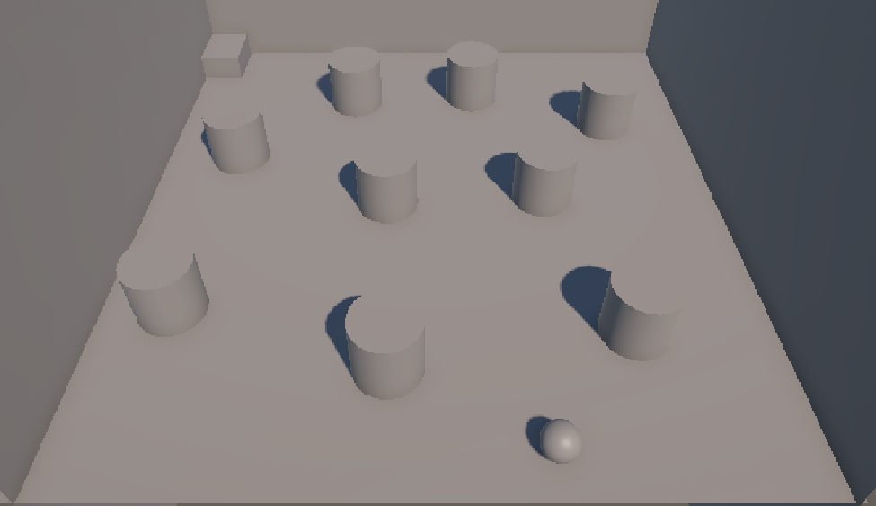
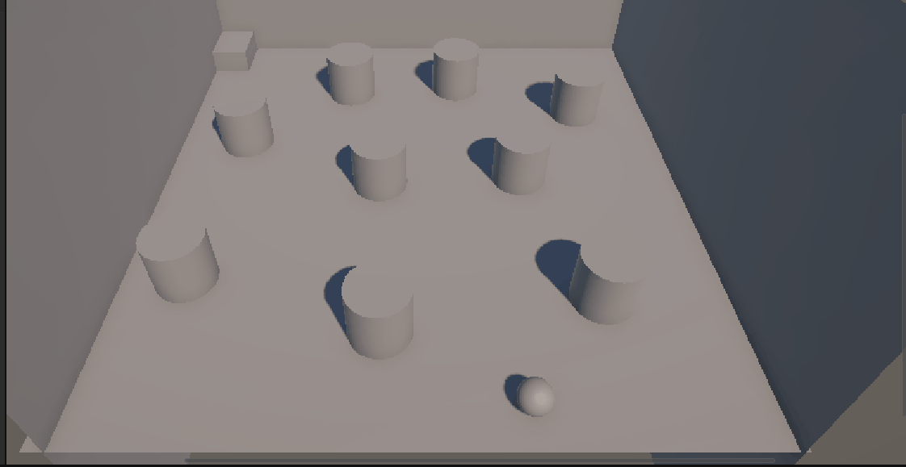
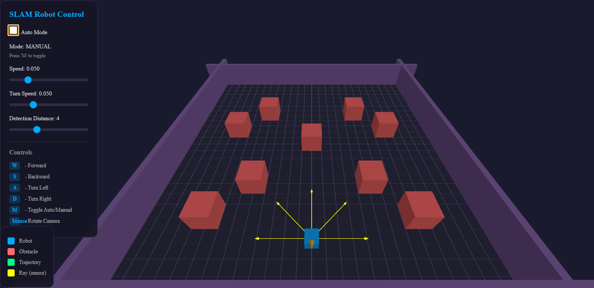
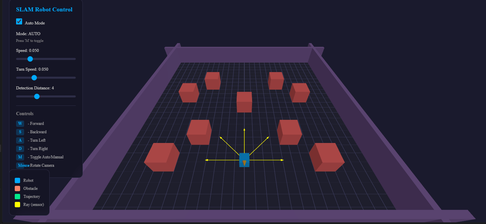
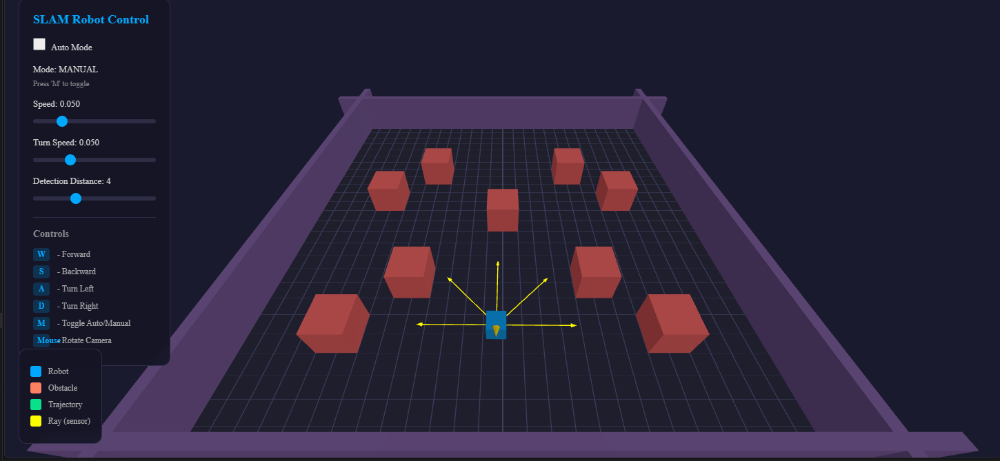
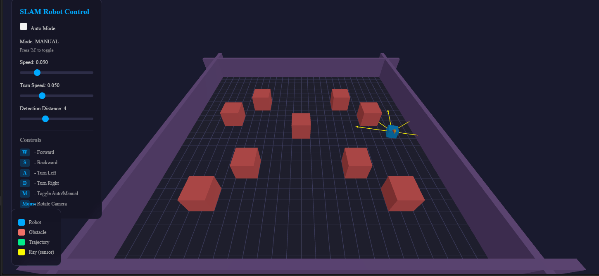

# Taller - Robótica Visual: Simulación de Mapa 3D
## Nombre: 

- Juan David Buitrago Salazar
- Juan David Cardenas Galvis
- Nicolás Rodríguez Piraban
- Camilo Andres Medina Sanchez
- Juan Felipe Fajardo Garzón

## Fecha de entrega: 08/06/2026

## Descripción breve:
Este taller consistió en implementar un sistema de navegación autónoma para un robot móvil utilizando técnicas de SLAM visual. Se crearon dos entornos: uno en Unity y otro en Three.js, donde el robot utiliza sensores de raycast para detectar obstáculos y navegar de forma autónoma evitando colisiones.

## Implementaciones:

### Unity:
Se implementó un script RobotAI.cs que controla el movimiento del robot mediante Physics.Raycast. El robot cuenta con configuración de velocidad, velocidad de giro y distancia de detección. Utiliza un LineRenderer para visualizar la trayectoria recorrida. Cuando detecta un obstáculo a menos de la distancia de seguridad, cambia su estado para comenzar a girar hasta encontrar un camino libre. Incluye también detección de meta mediante triggers.

### Three.js:
Se desarrolló un entorno 3D interactivo con Three.js que simula el mismo comportamiento de navegación. El robot (caja azul) se mueve por un área delimitada por paredes violetas y obstáculos rojos. Se implementó visualización de sensores mediante flechas amarillas que rotan con el robot (hijo del objeto). El sistema detecta obstáculos adelante (±45°) y gira automáticamente cuando detecta uno. Incluye controles manuales (W/A/S/D) y automáticos, además de panel de control para ajustar velocidad, velocidad de giro y distancia de detección en tiempo real.

## Resultados visuales

### Unity

Inicialmente se presenta la escena donde el robot es representado por una esfera, los obstacúlos son cilindros y la meta es el cubo



A continuación se presenta la ruta que realiza el robot desde su punto de partida hasta la meta, evitando los obstáculos (cilindros y paredes)




Finalmente cuando llega a la meta se obtiene una alerta en consola que indica que el robot ha alcanzado su destino


### ThreeJs

Se tiene la siguiente interfaz donde se presenta la escena, además de los controles del robot y la forma de cambiar su movimiento de automático a manual



Luego se presenta el movimiento automático del robot, el cual evita todos los obstáculos y paredes presentes en la escena



Finalmente se tiene el modo manual donde el robot es controlado usando las teclas WASD



También es posible cambiar entre modos en tiempo real, además de cambiar los parámetros del robot como lo son: velocidad, distancia de detección, y velocidad de rotación



## Código relevante:

### Unity (RobotAI.cs):
Este fragmento muestra la lógica principal de detección y evasión de obstáculos usando Raycast de Unity:
```cs
bool obstaculoDetectado = Physics.Raycast(rayOrigin, transform.forward, out RaycastHit hit, detectionDistance, capaObstaculos);

if (obstaculoDetectado)
{
    if (hit.distance < safetyMargin || estaGirando)
    {
        estaGirando = true;
        transform.Rotate(0, rotationSpeed * Time.deltaTime, 0);
    }
    else
    {
        transform.Translate(Vector3.forward * (speed * 0.5f) * Time.deltaTime);
    }
}
```

### Three.js (detección de obstáculos):
Lógica de detección usando Three.js Raycaster, rotando la dirección del rayo con la rotación del robot:
```js
const direction = new THREE.Vector3(
  Math.sin(angleOffset),
  0,
  -Math.cos(angleOffset)
).normalize();
direction.applyAxisAngle(new THREE.Vector3(0, 1, 0), robot.rotation.y);
rc.set(robot.position.clone(), direction);
const intersects = rc.intersectObjects(obstacles);
```

### Three.js (creación de obstáculos y paredes):
Creación del entorno con obstáculos y paredes delimitadoras:
```js
// Obstáculos rojos
const obstacleGeometry = new THREE.BoxGeometry(2, 2, 2);
const obstacleMaterial = new THREE.MeshStandardMaterial({ color: 0xff6b6b });
obstaclePositions.forEach((pos) => {
  const obstacle = new THREE.Mesh(obstacleGeometry, obstacleMaterial);
  obstacle.position.set(pos.x, 1, pos.z);
  scene.add(obstacle);
  obstacles.push(obstacle);
});

// Paredes como obstáculos
const walls = [
  { x: 0, z: wallDistance, w: wallLength, h: wallThickness },
  { x: 0, z: -wallDistance, w: wallLength, h: wallThickness },
  { x: wallDistance, z: 0, w: wallThickness, h: wallLength },
  { x: -wallDistance, z: 0, w: wallThickness, h: wallLength },
];
walls.forEach((wall) => {
  const wallGeo = new THREE.BoxGeometry(wall.w, wallHeight, wall.h);
  const wallMesh = new THREE.Mesh(wallGeo, wallMaterial);
  wallMesh.position.set(wall.x, wallHeight / 2, wall.z);
  scene.add(wallMesh);
  obstacles.push(wallMesh);
});
```

### Three.js (controles manuales):
Lógica de movimiento manual con teclado:
```js
if (keys.w) {
  robot.position.z -= config.speed * Math.cos(robot.rotation.y);
  robot.position.x -= config.speed * Math.sin(robot.rotation.y);
}
if (keys.s) {
  robot.position.z += config.speed * Math.cos(robot.rotation.y);
  robot.position.x += config.speed * Math.sin(robot.rotation.y);
}
if (keys.a) {
  robot.rotation.y += config.turnSpeed;
}
if (keys.d) {
  robot.rotation.y -= config.turnSpeed;
}
```

### Unity (actualización de trayectoria):
Visualización del rastro del robot usando LineRenderer:
```cs
private void ActualizarRastro()
{
    if (trailRenderer != null && trailRenderer.positionCount > 0)
    {
        if (Vector3.Distance(trailRenderer.GetPosition(trailRenderer.positionCount - 1), transform.position) > 0.1f)
        {
            trailRenderer.positionCount++;
            trailRenderer.SetPosition(trailRenderer.positionCount - 1, transform.position);
        }
    }
    else if (trailRenderer != null && trailRenderer.positionCount == 0)
    {
        trailRenderer.positionCount = 1;
        trailRenderer.SetPosition(0, transform.position);
    }
}
```


## Prompts utilizados:
A continuación se presentan los prompts utilizados durante el desarrollo del entorno Three.js:

 "Genera un script para crear un entorno 3D con Three.js donde se tenga un elemento azul que represente un robot y múltiples obstáculos dentro del escenario"

 "Genera un script que corrija el algoritmo de evasión para que el robot no quede trabado al detectar obstáculos"


 "Modifica el código para agregar las paredes delimitadoras como obstáculos detectables por los sensores"

"Modifica el script para que corrija la rotación de los sensores para que siempre apunten al frente del robot"


## Aprendizajes y dificultades:
La principal dificultad fue sincronizar la rotación de los sensores con la rotación del robot en Three.js. Inicialmente los arrows se actualizaban manualmente sumando ángulos, pero al ser hijos del robot ya rotaban automáticamente, causando "doble rotación". Se resolvió usando applyAxisAngle para aplicar la rotación del robot a la dirección base. También fue importante ajustar la distancia de detección y la velocidad de giro para que el robot tuviera tiempo suficiente de reacción ante las paredes.