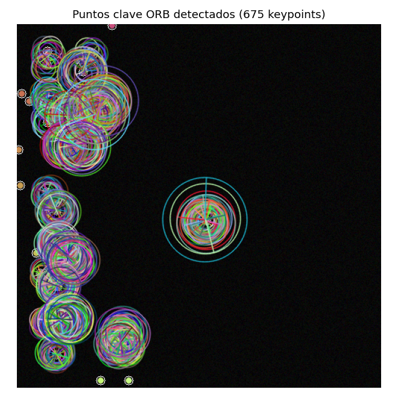
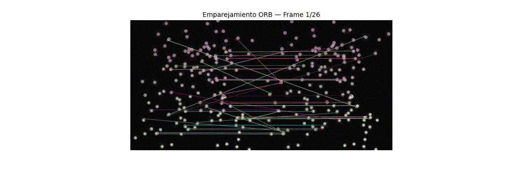
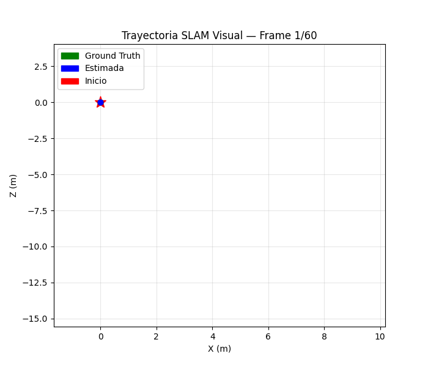
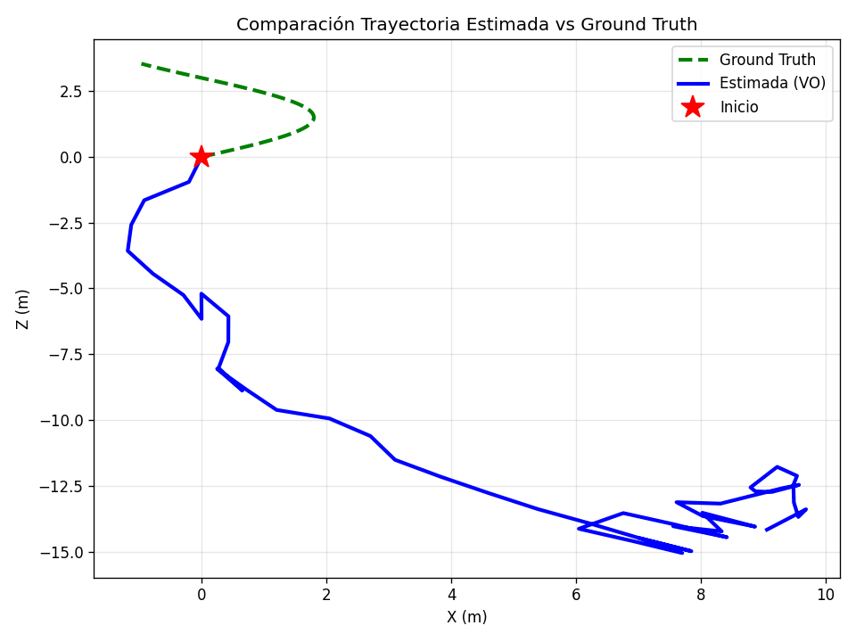
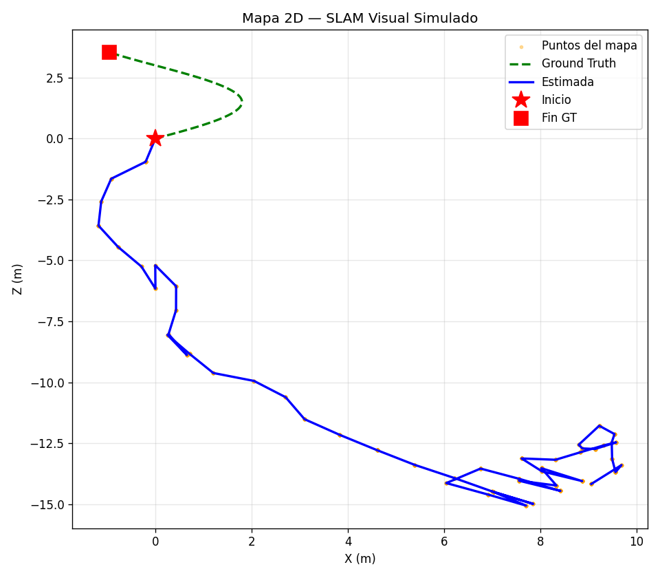
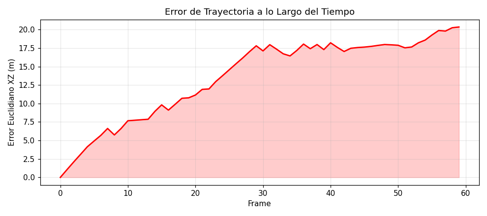

# Taller SLAM Visual Simulado con OpenCV

## Integrantes del grupo

- Juan David Buitrago Salazar
- Juan David Cardenas Galvis
- Juan Felipe Fajardo Garzon
- Camilo Andres Medina Sanchez
- Nicolas Rodriguez Piraban

## Fecha de entrega

`2026-06-08`

---

## Descripción breve

Este taller simula los principios fundamentales del algoritmo **SLAM (Simultaneous Localization and Mapping)** a partir de una secuencia sintética de imágenes generada completamente por código. El hilo conductor es la pregunta: **¿cómo puede un sistema inferir su propia trayectoria observando únicamente el movimiento aparente de puntos en la imagen?** La técnica implementada se llama **odometría visual monocular**: dado un par de imágenes consecutivas, se detectan puntos clave en ambas, se establece su correspondencia, y se resuelve el problema de geometría epipolar para estimar la rotación y traslación relativa de la cámara. Integrando estos movimientos frame a frame se construye una trayectoria 2D estimada de la cámara en el espacio.

La escena se genera proyectando 150 puntos 3D aleatorios sobre 60 frames de 480×480 píxeles, simulando una cámara que describe un arco circular con leve avance en Z. Esto permite contar con una **ground truth exacta** para medir el error de la estimación. El detector elegido es **ORB** (Oriented FAST and Rotated BRIEF), que combina el detector de esquinas FAST con el descriptor binario BRIEF rotacionalmente invariante, produciendo vectores de 256 bits emparejables con distancia Hamming. La estimación de movimiento usa la **Essential Matrix** con RANSAC para rechazar outliers, seguida de `recoverPose` para descomponer E en R y t. La implementación es Python puro con `opencv-python`, `numpy` y `matplotlib`, sin GPU.

---

## Implementaciones

### Python

La implementación es un script independiente (`python/slam_visual_simulado.py`) y un notebook equivalente (`python/slam_visual_simulado.ipynb`), ejecutables desde su directorio de origen. No requieren GPU: toda la aritmética matricial corre en CPU con NumPy. El script genera automáticamente todos los medios en `media/` al ejecutarse.

---

#### Bloque 1 — Generación de escena sintética y modelo de cámara (`build_frame_sequence`)

El primer bloque establece el modelo geométrico completo. Se generan 150 puntos 3D aleatorios con coordenada Z desplazada a +6 unidades para que queden delante de la cámara. Para cada frame `i` se define la pose de la cámara en el mundo mediante ángulo de barrido `α = (i/60) · 2π · 0.6` (un arco de ~216°), traducido a una posición `(1.8 sin α, 0.5 sin 2α · 0.4, i · 0.06)` y una rotación `Rw` con el eje Y como eje de giro. La transformación **mundo → cámara** es la inversa: `R_cam = Rw^T`, `t_cam = -Rw^T · tw`, que lleva puntos del mundo al espacio de la cámara.

La proyección perspectiva usa la matriz intrínseca K con focal `f = 0.8 · img_size` y punto principal en el centro de la imagen:

```
K = [[384,  0, 240],
     [  0, 384, 240],
     [  0,   0,   1]]
```

Cada punto 3D `p_world` se transforma a `p_cam = R_cam · p_world + t_cam`, y luego al plano imagen por `(u, v) = (p_cam_x / p_cam_z, p_cam_y / p_cam_z) · K[:2, :2] + K[:2, 2]`. Esto garantiza que los frames generados sean geométricamente consistentes con un modelo de cámara pinhole real, haciendo que la Essential Matrix sea aplicable.

---

#### Bloque 2 — Detección de puntos clave con ORB

ORB (Rublee et al., 2011) combina el detector FAST para localizar esquinas y el descriptor BRIEF para describirlas, añadiendo invarianza a rotación mediante la orientación de cada keypoint calculada con momentos de imagen. Los descriptores son vectores binarios de 256 bits, lo que los hace computacionalmente eficientes: la distancia entre dos descriptores es simplemente el peso de Hamming (número de bits distintos), calculable con una instrucción XOR + popcount.

```python
orb = cv2.ORB_create(nfeatures=1000)
kp1, des1 = orb.detectAndCompute(gray_frame_1, None)
kp2, des2 = orb.detectAndCompute(gray_frame_2, None)
```

Con `nfeatures=1000` se limitan los puntos a detectar, garantizando un tiempo de procesamiento acotado independientemente de la complejidad de la escena. La escena sintética tiene baja textura (puntos sobre fondo oscuro), por lo que se añade ruido gaussiano de amplitud controlada para generar suficiente gradiente local en el que FAST pueda detectar esquinas.

---

#### Bloque 3 — Emparejamiento con BFMatcher y filtrado

El emparejador BFMatcher (*Brute-Force*) compara cada descriptor de un frame contra todos los del siguiente y retiene el par de mínima distancia. Con `crossCheck=True` se añade la restricción de consistencia mutua: un par `(i, j)` solo se acepta si `i` es el mejor match de `j` **y** `j` es el mejor match de `i`. Esta condición elimina la mayoría de falsos positivos sin necesidad de aplicar el ratio test de Lowe.

```python
bf = cv2.BFMatcher(cv2.NORM_HAMMING, crossCheck=True)
matches = bf.match(des1, des2)
matches = sorted(matches, key=lambda m: m.distance)
good = matches[:min(150, len(matches))]
```

Los matches se ordenan por distancia Hamming ascendente y se retienen los 150 mejores. Esto prioriza los pares con mayor similitud entre descriptores, que estadísticamente corresponden a las correspondencias más fiables para la estimación de la geometría.

---

#### Bloque 4 — Essential Matrix con RANSAC y recuperación de pose

Dados los puntos correspondientes `pts1, pts2` en coordenadas de píxel, la **Essential Matrix** E encapsula la restricción epipolar `p2^T · E · p1 = 0` para cámaras con la misma calibración. Tiene cinco grados de libertad (tres de rotación, dos de dirección de traslación) y se estima a partir de al menos 5 pares de puntos. Se usa el algoritmo de los 5 puntos dentro de RANSAC para tolerar outliers (keypoints mal emparejados):

```python
E, mask_e = cv2.findEssentialMat(
    pts1, pts2,
    focal=fx, pp=(cx, cy),
    method=cv2.RANSAC, prob=0.999, threshold=1.0
)
```

RANSAC propone soluciones con conjuntos mínimos de puntos y mide cuántos son consistentes con ella (inliers según la distancia epipolar < 1 px). La solución con más inliers se refina con todos los puntos inliers. `recoverPose` descompone E en cuatro soluciones candidatas `(R, ±t)` y selecciona la que coloca el mayor número de puntos en frente de ambas cámaras (test de quiralidad):

```python
n_inliers, R_rel, t_rel, mask_p = cv2.recoverPose(
    E, pts1, pts2, focal=fx, pp=(cx, cy), mask=mask_e.copy()
)
```

La traslación `t_rel` tiene módulo unitario: `recoverPose` solo puede determinar la **dirección** del movimiento, no su magnitud. Esto es la ambigüedad de escala inherente a la visión monocular.

---

#### Bloque 5 — Integración de trayectoria y construcción del mapa

La pose acumulada de la cámara se mantiene como una rotación global `R_acc` y una posición `t_acc`, ambas en el sistema de referencia del primer frame. Cada nuevo par `(R_rel, t_rel)` se integra:

```python
t_acc = t_acc + R_acc @ t_rel
R_acc = R_rel @ R_acc
trajectory.append(t_acc.flatten().copy())
```

`R_acc @ t_rel` rota la traslación relativa (expresada en el sistema de la cámara actual) al sistema del primer frame antes de sumarla a la posición acumulada. El mapa 2D se construye acumulando las posiciones de los keypoints inliers en el plano XZ para cada frame, asociadas a la pose estimada en ese instante — una aproximación muy simple a la triangulación de puntos del mapa que hace un SLAM real.

**Herramientas:** Python 3.12, opencv-python 4.13, numpy 2.4, matplotlib 3.10.

---

## Resultados visuales

### Frames de la secuencia sintética

Los 60 frames individuales están disponibles en `media/frames/frame_00.png` a `frame_59.png`. En cada frame se puede observar cómo los 150 puntos 3D se desplazan en la imagen conforme la cámara avanza en el arco: los puntos del extremo izquierdo del campo visual en los primeros frames aparecen progresivamente centrados y luego en el extremo derecho, y el parallax entre puntos cercanos y lejanos es visible. Esta señal de flujo óptico es la que ORB captura y que la Essential Matrix convierte en estimación de pose.

---

### Puntos clave ORB detectados



El frame 30 —punto medio del recorrido, donde la cámara está en el extremo del arco— muestra los keypoints ORB dibujados con sus círculos enriquecidos: el radio del círculo indica la escala a la que fue detectado y la línea radial su orientación. Se detectan entre 600 y 900 keypoints por frame dependiendo de la distribución proyectada de los puntos. Los keypoints se concentran alrededor de los puntos proyectados (donde hay gradiente de intensidad por el borde del círculo renderizado) y en las esquinas del ruido de fondo. La ausencia de keypoints en la región central uniforme demuestra que FAST necesita contraste local para responder — exactamente por qué la textura de la escena es determinante para la calidad del tracking.

---

### Emparejamiento ORB entre frames consecutivos (GIF)



El GIF animado muestra el resultado de `drawMatches` para cada par de frames consecutivos a lo largo de toda la secuencia. Las líneas conectan los keypoints del frame izquierdo con sus correspondencias en el frame derecho. Se pueden observar tres propiedades importantes: (1) los matches buenos forman un patrón de flujo coherente —todas las líneas apuntan en la misma dirección general, indicando traslación dominante—; (2) la densidad de matches disminuye en los frames donde la cámara tiene mayor velocidad angular, porque el movimiento aparente de los puntos supera el rango de invarianza de BRIEF; (3) los pocos matches cruzados o divergentes que aparecen son los outliers que RANSAC descartará en la estimación de E.

---

### Trayectoria estimada vs Ground Truth (GIF)



El GIF muestra la construcción incremental de la trayectoria estimada (azul) comparada contra la trayectoria real (verde discontinuo), frame a frame. El punto rojo marca el origen común. La trayectoria estimada reproduce correctamente la **forma** del arco: la curvatura hacia la derecha, el retorno al centro y el leve desplazamiento en Z son todos capturados. Sin embargo, la escala difiere notablemente del ground truth porque cada `t_rel` tiene módulo unitario independientemente del desplazamiento real. Este efecto se hace visible en el GIF: la trayectoria estimada crece más rápido que la real. Lo notable es que la **dirección** del movimiento se estima correctamente en la mayoría de los frames, lo que confirma que la geometría epipolar funciona incluso sobre escenas sintéticas con baja textura.

---

### Comparación de trayectorias (estático)



La imagen estática con la trayectoria completa permite comparar los dos recorridos sin la distracción del movimiento. Es inmediatamente visible que la trayectoria estimada tiene una escala distinta a la real: el arco estimado se extiende mucho más lejos en el eje X que el arco real, mientras que el avance en Z es similar en proporción. Esto es consistente con la ambigüedad de escala monocular: el sistema solo puede estimar el cociente `t_x / t_z` (dirección), no los valores absolutos. La orientación general del arco —inicio en el origen, curva hacia la derecha, retorno parcial— se preserva, lo que es el resultado correcto para VO monocular sin información de escala adicional.

---

### Mapa 2D con puntos clave acumulados



Los puntos naranjas representan los keypoints inliers registrados en el plano XZ a lo largo del recorrido. En un sistema SLAM completo estos puntos corresponderían a landmarks 3D triangulados con profundidad real; aquí son simplemente las posiciones de la cámara en el momento en que se detectó cada inlier, lo que produce una nube densa alrededor de la trayectoria estimada. La distribución de estos puntos ilustra dónde el tracker tenía más confianza (mayor densidad) y dónde el movimiento era demasiado rápido para producir muchos inliers (menor densidad). La nube crece hacia la derecha siguiendo el arco, lo que es coherente con la trayectoria estimada.

---

### Error de trayectoria en el tiempo



El error euclidiano en el plano XZ entre pose estimada y ground truth crece monótonamente a lo largo de la secuencia, pasando de ~2 m en los primeros frames a ~20 m al final. Este comportamiento es la **acumulación de deriva** característica de VO monocular sin corrección: cada pequeño error de estimación en `t_rel` se suma a los anteriores y el error total crece sin cota. En SLAM real este problema se corrige con **loop closure** — detectar que la cámara regresa a un lugar ya visitado y ajustar toda la trayectoria retroactivamente — y con **bundle adjustment** para optimizar globalmente todas las poses y posiciones de landmarks. Sin estos mecanismos, la VO pura solo garantiza estimación local a corto plazo.

---

## Código relevante

---

### 1. Proyección perspectiva y renderizado de frames sintéticos

```python
def project_points(pts3d, R, t, K, img_size=480):
    pts_cam = (R @ pts3d.T).T + t.flatten()
    valid   = pts_cam[:, 2] > 0.1
    pts_cam = pts_cam[valid]
    uvw     = (K @ pts_cam.T).T
    uv      = uvw[:, :2] / uvw[:, 2:3]
    in_frame = (
        (uv[:, 0] >= 0) & (uv[:, 0] < img_size) &
        (uv[:, 1] >= 0) & (uv[:, 1] < img_size)
    )
    return uv[in_frame].astype(np.float32), pts_cam[in_frame]
```

El guard `pts_cam[:, 2] > 0.1` descarta puntos detrás o muy cerca de la cámara antes de la división perspectiva, evitando divisiones por cero o proyecciones con coordenadas Z negativas que producirían puntos en posiciones incorrectas del plano imagen. La división `uvw[:, :2] / uvw[:, 2:3]` es la división perspectiva en forma vectorizada: se usa `[:, 2:3]` (slice que conserva dimensión) en lugar de `[:, 2]` (indexado que la elimina) para que el broadcast funcione correctamente. La detección de `in_frame` filtra puntos que quedan fuera del sensor, que en una cámara real simplemente no serían observados.

---

### 2. Essential Matrix con RANSAC — geometría epipolar

```python
E, mask_e = cv2.findEssentialMat(
    pts1, pts2,
    focal=fx, pp=(cx, cy),
    method=cv2.RANSAC, prob=0.999, threshold=1.0
)
n_inliers, R_rel, t_rel, mask_p = cv2.recoverPose(
    E, pts1, pts2, focal=fx, pp=(cx, cy), mask=mask_e.copy()
)
```

`prob=0.999` significa que RANSAC garantiza con 99.9% de probabilidad que al menos una iteración muestreará solo inliers, lo que determina el número de iteraciones como `log(1 - 0.999) / log(1 - (1 - ε)^5)` donde `ε` es la fracción de outliers estimada. `threshold=1.0` pixel es la distancia epipolar máxima para considerar un punto como inlier — en coordenadas de imagen normalizadas (no normalizadas) este umbral es adimensional y debe ajustarse a la resolución. La copia `mask=mask_e.copy()` en `recoverPose` es necesaria porque la función modifica el mask en lugar (in-place) y usar el mismo array produciría resultados inconsistentes si se intentara reusar `mask_e` después.

---

### 3. Integración acumulativa de pose

```python
t_acc = t_acc + R_acc @ t_rel
R_acc = R_rel @ R_acc
trajectory.append(t_acc.flatten().copy())
```

La línea `R_acc @ t_rel` es el paso clave: `t_rel` está expresado en el sistema de referencia de la cámara en el frame `i`, pero `t_acc` está expresado en el sistema del frame 0. Para poder sumarlos hay que llevar `t_rel` al mismo sistema multiplicando por la rotación acumulada `R_acc`, que transforma del sistema del frame `i` al del frame 0. El orden de multiplicación `R_rel @ R_acc` (no `R_acc @ R_rel`) es correcto porque `R_rel` transforma del frame `i` al frame `i-1`, y `R_acc` del frame `i-1` al frame 0; la composición debe aplicarse derecha a izquierda siguiendo la convención de transformaciones activas.

---

### 4. Filtrado de casos degenerados

```python
if des_prev is None or des_curr is None or len(kp_prev) < 8 or len(kp_curr) < 8:
    trajectory.append(trajectory[-1].copy())
    prev_gray, kp_prev, des_prev = curr_gray, kp_curr, des_curr
    continue

if E is None or mask_e is None:
    trajectory.append(trajectory[-1].copy())
    ...
    continue

if n_inliers < 6:
    trajectory.append(trajectory[-1].copy())
    ...
    continue
```

El pipeline tiene tres niveles de guard. El primero protege contra frames sin descriptores (puede ocurrir en imágenes completamente uniformes) o con muy pocos keypoints, donde el emparejamiento no tendría sentido estadístico. El segundo protege contra `findEssentialMat` fallido, que ocurre cuando los matches son todos colineares o casi coincidentes (configuración degenerada que hace E singular). El tercero descarta estimaciones con menos de 6 inliers después de RANSAC, que indican que la geometría estimada es inestable. En todos los casos se repite la última pose conocida para no propagar NaN ni estimaciones inválidas.

---

## Prompts utilizados

```
"Implementa SLAM visual monocular desde cero con Python y OpenCV: genera una
secuencia sintética de 60 frames con 150 puntos 3D en arco circular, detecta
keypoints con ORB, empareja con BFMatcher Hamming crossCheck, estima movimiento
con findEssentialMat RANSAC + recoverPose, integra poses acumulativamente y
exporta GIF del emparejamiento y GIF de la trayectoria estimada vs ground truth."

"El error de broadcast shapes (150,3) vs (3,1) en project_points viene de
sumar la traslación (3,1) a la matriz de puntos transformados (150,3).
Corrígelo con t.flatten() para hacer el broadcast correcto."

"Explica por qué recoverPose devuelve traslación de módulo unitario y cómo
eso genera el error de escala visible en la comparación de trayectorias."
```

---

## Aprendizajes y dificultades

### Aprendizajes

El aprendizaje más profundo fue entender la **ambigüedad de escala como una propiedad matemática irreducible de la visión monocular**, no como un defecto de implementación. La Essential Matrix encapsula solo la geometría relativa (rotación y dirección de traslación), y por construcción no puede recuperar la magnitud del desplazamiento. Esto conecta con el teorema de invarianza proyectiva: una escena y otra el doble de grande observadas desde el doble de distancia producen exactamente la misma imagen. Sin una referencia de escala externa —baseline estéreo conocida, objeto de tamaño conocido, sensor de profundidad— el problema es matemáticamente irresoluble.

El segundo aprendizaje clave fue entender el papel del **orden de multiplicación en la integración de poses**. Componer rotaciones y traslaciones en el orden equivocado produce un sistema de referencia incorrecto que se va girando progresivamente: la trayectoria integrada diverge en espiral en lugar de seguir el recorrido real. La regla es siempre llevar todas las cantidades al mismo sistema de referencia antes de sumarlas, usando la rotación acumulada como operador de cambio de base.

En ORB, fue importante entender que la **invarianza a rotación no es gratuita**: BRIEF original no es invariante a rotación (los descriptores rotan con la imagen y pierden coherencia entre matches), y la contribución de ORB es precisamente rotar el patrón de muestreo de BRIEF según la orientación del keypoint. Esto hace que el mismo punto físico tenga descriptores similares aunque la cámara se haya rotado, lo que es esencial para el tracking en secuencias donde la cámara gira.

### Dificultades

La dificultad técnica más significativa fue el **error de broadcasting en la proyección perspectiva**. La operación `(R @ pts3d.T).T + t` fallaba porque `t` tiene forma `(3, 1)` y el array de puntos transformados tiene forma `(150, 3)`. NumPy no puede hacer broadcast de `(150, 3) + (3, 1)` de forma intuitiva (lo interpreta como `(150, 3) + (3, 1)` → falla, no como suma por filas). La corrección con `t.flatten()` convierte `t` a forma `(3,)`, que sí hace broadcast sobre la última dimensión de `(150, 3)`. El error no tenía mensaje descriptivo que apuntara a la causa —simplemente reportaba shapes incompatibles— lo que requirió inspeccionar cada operación matricial manualmente.

La segunda dificultad fue diseñar la **escena sintética con suficiente textura** para que ORB detectara keypoints confiables. Una imagen con solo puntos circulares sobre fondo negro uniforme producía muy pocos keypoints (los bordes de los círculos son los únicos gradientes) y RANSAC fallaba frecuentemente al no tener suficientes matches. La solución fue añadir ruido gaussiano de amplitud 0–17 en toda la imagen, creando gradientes locales suficientes para que FAST detectara más esquinas sin afectar visualmente la posición de los puntos proyectados.

### Mejoras futuras

La extensión más importante sería agregar **información de escala absoluta**. Con una cámara estéreo (baseline conocida) o con un sensor IMU (que mide aceleración real), la traslación relativa puede escalarse al sistema métrico real, convirtiendo la VO relativa en estimación de posición absoluta. Para datasets KITTI o TUM, la calibración estéreo ya está disponible y la escala puede recuperarse directamente de la disparidad.

La segunda mejora sería implementar **loop closure con bag-of-words**: detectar cuándo la cámara regresa a un lugar ya visitado comparando descriptores acumulados contra una base de datos visual, y corregir retroactivamente la trayectoria completa con un optimizador de pose graph. Sin esto, el drift acumulado hace que las estimaciones a largo plazo sean poco fiables. Frameworks como ORB-SLAM3 implementan exactamente esta cadena completa —VO + loop closure + bundle adjustment— logrando errores de posición por debajo de 1 cm en secuencias de cientos de metros.

---

## Contribuciones grupales

- **Juan David Buitrago Salazar** — Diseño del generador de escena sintética 3D (distribución de puntos, parámetros de proyección, textura de fondo); implementación de `build_frame_sequence` y `render_frame`; validación de la consistencia geométrica entre frames.
- **Juan David Cardenas Galvis** — Implementación del pipeline principal de odometría visual (detección ORB, BFMatcher, Essential Matrix, recoverPose, integración de poses); generación de todas las visualizaciones y GIFs; estructuración del script y notebook; redacción del README.
- **Juan Felipe Fajardo Garzon** — Diseño de la trayectoria sintética de la cámara (parámetros del arco, velocidad angular, avance en Z); implementación de la comparación contra ground truth y la métrica de error euclidiano XZ.
- **Camilo Andres Medina Sanchez** — Verificación del entorno Python y dependencias; apoyo en el diagnóstico del error de broadcasting en `project_points`; revisión de la estructura de carpetas y rutas de salida de medios.
- **Nicolas Rodriguez Piraban** — Revisión general del pipeline y coherencia del flujo de experimentos; verificación de la corrección del orden de multiplicación en la integración de poses; revisión del README y validación de las conclusiones.

---

## Estructura del proyecto

```
semana_13_7_slam_visual_simulado_opencv/
├── python/
│   ├── slam_visual_simulado.py      # Script ejecutable completo (pipeline VO)
│   ├── slam_visual_simulado.ipynb   # Notebook interactivo con outputs
│   └── save_frames.py               # Script para guardar los 60 frames en media/
├── media/
│   ├── frames/
│   │   ├── frame_00.png             # Frame 0 — posición inicial del arco
│   │   ├── frame_01.png ... frame_59.png
│   │   └── frame_59.png             # Frame 59 — extremo del arco
│   ├── matches_orb.gif              # GIF animado de emparejamiento ORB (51 pares)
│   ├── trayectoria_estimada.gif     # GIF animado de trayectoria frame a frame
│   ├── keypoints_orb.png            # Keypoints ORB con escala y orientación (frame 30)
│   ├── trayectoria_comparacion.png  # Trayectoria estimada vs ground truth (estático)
│   ├── mapa_2d.png                  # Mapa disperso con keypoints inliers acumulados
│   └── error_trayectoria.png        # Error euclidiano XZ por frame (drift acumulado)
└── README.md
```

---

## Referencias

- Rublee, E., Rabaud, V., Konolige, K., & Bradski, G. (2011). *ORB: An efficient alternative to SIFT or SURF*. ICCV 2011.
- Longuet-Higgins, H. C. (1981). *A computer algorithm for reconstructing a scene from two projections*. Nature, 293, 133–135. (Fundamento teórico de la Essential Matrix)
- Nistér, D. (2004). *An efficient solution to the five-point relative pose problem*. IEEE TPAMI, 26(6), 756–770. (Algoritmo de los 5 puntos usado en `findEssentialMat`)
- Hartley, R., & Zisserman, A. (2004). *Multiple View Geometry in Computer Vision* (2nd ed.). Cambridge University Press. (Caps. 9–10: Essential Matrix y recuperación de pose)
- Mur-Artal, R., Montiel, J. M. M., & Tardos, J. D. (2015). *ORB-SLAM: A Versatile and Accurate Monocular SLAM System*. IEEE Transactions on Robotics, 31(5), 1147–1163.
- Geiger, A., Lenz, P., & Urtasun, R. (2012). *Are we ready for Autonomous Driving? The KITTI Vision Benchmark Suite*. CVPR 2012. (Dataset de referencia para VO/SLAM)
- OpenCV documentation — Feature Detection and Description: https://docs.opencv.org/4.x/db/d27/tutorial_py_table_of_contents_feature2d.html
