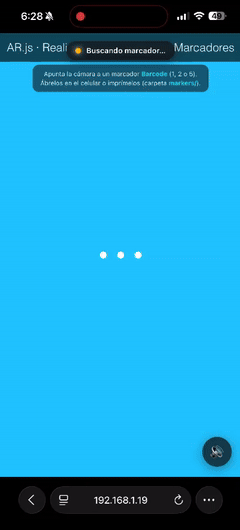
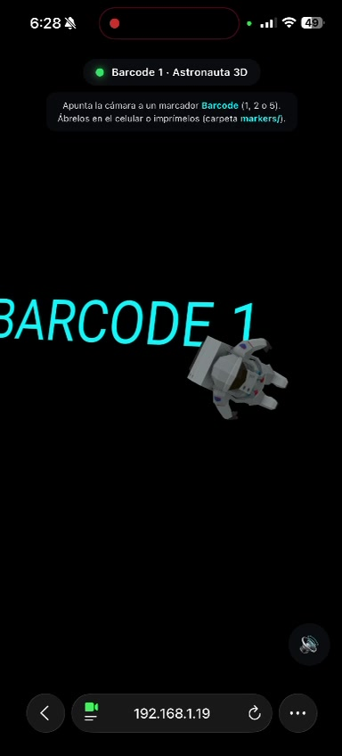
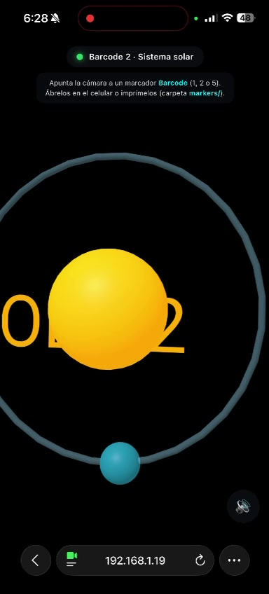
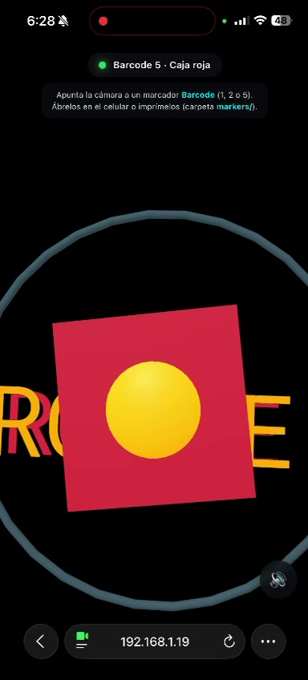

# Taller Arjs Realidad Aumentada Marcadores Web

## Integrantes del grupo

- Juan David Buitrago Salazar
- Juan David Cárdenas Galvis
- Nicolás Rodríguez Pirabán
- Camilo Andrés Medina Sánchez
- Juan Felipe Fajardo Garzón

## Fecha de entrega

`2026-06-15`

---

## Descripción breve

Experiencia de **realidad aumentada basada en marcadores** que corre directamente en el
navegador, sin instalar ninguna aplicación. Usando **AR.js** sobre **A-Frame** (que
internamente renderiza con **Three.js**), la cámara del dispositivo detecta marcadores
físicos y proyecta modelos 3D animados sobre ellos en tiempo real.

Se implementaron **tres marcadores** con contenido distinto (un modelo glTF, una escena
de primitivas y una caja interactiva), animaciones, detección de eventos
(`markerFound` / `markerLost`), un HUD de estado y **sonido al detectar** (bonus).

A diferencia del ejemplo del enunciado (marcadores de patrón Hiro/Kanji), se optó por
**marcadores barcode (matriz 3×3)** porque son rejillas de alto contraste mucho más
fiables de detectar: funcionan al mostrarse en pantalla, a distancia y con iluminación no
ideal, donde los patrones de imagen suelen fallar.

---

## ¿Cómo funciona AR.js?

AR.js combina, en cada fotograma de la cámara, cuatro pasos:

1. **Captura de cámara**: obtiene el video del dispositivo vía `getUserMedia` (requiere
   contexto seguro: `https://` o `localhost`).
2. **Detección de marcadores**: analiza la imagen buscando los marcadores conocidos. En
   modo *matrix* lee rejillas barcode de alto contraste y decodifica su `value`.
3. **Estimación de pose**: al encontrar un marcador calcula su posición y orientación 3D
   respecto a la cámara (matriz de transformación).
4. **Render aumentado**: A-Frame / Three.js dibujan el contenido 3D usando esa matriz, de
   modo que el modelo aparece "pegado" al marcador y se mueve con él.

```
Cámara ──► AR.js (detección + pose) ──► A-Frame / Three.js (render 3D) ──► Pantalla
```

Cuando un marcador entra o sale del campo de visión, AR.js dispara `markerFound` y
`markerLost`, eventos que la app aprovecha para actualizar el HUD y reproducir sonido.

---

## Implementaciones

### Three.js / A-Frame + AR.js

Proyecto **HTML + JavaScript estático** (sin build) servido desde una carpeta local. La
escena se declara con A-Frame y el tracking lo aporta AR.js
(`detectionMode: mono_and_matrix; matrixCodeType: 3x3`). Se implementaron tres marcadores
barcode, cada uno con un contenido 3D distinto:

- **Marcador 1 → Modelo glTF (astronauta)** (`index.html`): un modelo `.glb` externo
  cargado con `gltf-model` y animado con rotación continua (`animation`). Cumple el paso
  del taller de reemplazar la primitiva por un modelo 3D personalizado.

- **Marcador 2 → "Sistema solar" de primitivas** (`index.html`): una mini-escena compuesta
  con geometrías de A-Frame (`a-sphere`, `a-torus`) y animaciones anidadas: el conjunto
  orbita y el planeta rota sobre sí mismo. Cumple el bonus de mostrar modelos distintos
  según el marcador.

- **Marcador 5 → Caja interactiva** (`index.html`): una `a-box` roja con animación de giro,
  marcada como `clickable` para interacción.

- **HUD + eventos** (`app.js`): por cada marcador se escuchan `markerFound` / `markerLost`
  para actualizar un badge de estado (ámbar = buscando, verde = detectado) con el nombre
  del marcador detectado.

- **Sonido (bonus)** (`app.js`): al detectar un marcador se reproduce `assets/beep.mp3`,
  con botón de mute y reproducción tolerante a fallos (`try/catch`) para no romper la app
  si el navegador bloquea el autoplay.

- **Servidor HTTPS de desarrollo** (`serve_https.py`): la cámara web exige contexto seguro;
  este script sirve la app por HTTPS con un certificado autofirmado para poder ejecutarla
  desde el celular (apuntando la cámara al marcador mostrado en la pantalla del PC).

---

## Resultados visuales

> Demostración completa grabada desde el celular ejecutando la app por HTTPS, apuntando la
> cámara a los marcadores mostrados en la pantalla del PC.
> **Video:** [`media/ar-marcadores-demo.mp4`](./media/ar-marcadores-demo.mp4) ·
> **GIF:** [`media/ar-marcadores-demo.gif`](./media/ar-marcadores-demo.gif)



*GIF animado del recorrido por los tres marcadores: el HUD pasa a verde al detectar cada
uno y el modelo 3D correspondiente se proyecta y anima sobre el marcador.*

### Marcador 1 — Astronauta 3D (glTF)



*Al detectar el marcador barcode 1, el HUD muestra "Barcode 1 · Astronauta 3D" (punto
verde) y se proyecta el modelo glTF del astronauta, que gira de forma continua sobre el
marcador.*

### Marcador 2 — Sistema solar (primitivas)



*El marcador barcode 2 proyecta la escena de primitivas: un sol emisivo en el centro, una
órbita (`a-torus`) y un planeta que gira sobre sí mismo, todo el conjunto rotando.*

### Marcador 5 — Caja interactiva



*El marcador barcode 5 proyecta una caja roja giratoria sobre el marcador.*

---

## Código relevante

### Configuración de la escena y los marcadores barcode

```html
<a-scene embedded vr-mode-ui="enabled: false"
  renderer="logarithmicDepthBuffer: true; colorManagement: true; antialias: true; alpha: true"
  arjs="sourceType: webcam; detectionMode: mono_and_matrix; matrixCodeType: 3x3;
        sourceWidth: 1280; sourceHeight: 960; displayWidth: 1280; displayHeight: 960;">

  <a-assets timeout="15000">
    <a-asset-item id="astronaut" src="https://modelviewer.dev/shared-assets/models/Astronaut.glb"></a-asset-item>
    <audio id="beep" src="assets/beep.mp3" preload="auto"></audio>
  </a-assets>

  <!-- Marcador 1: modelo glTF animado -->
  <a-marker type="barcode" value="1" emitevents="true">
    <a-entity gltf-model="#astronaut" scale="0.5 0.5 0.5"
      animation="property: rotation; to: 0 360 0; loop: true; dur: 6000; easing: linear"></a-entity>
  </a-marker>
  <!-- ... marcadores 2 y 5 ... -->

  <a-entity camera></a-entity>
</a-scene>
```

**Explicación**: `detectionMode: mono_and_matrix` + `matrixCodeType: 3x3` activan la lectura
de marcadores barcode. Cada `<a-marker type="barcode" value="N">` asocia un id de marcador
a su contenido 3D. El modelo glTF se precarga en `<a-assets>` y se anima de forma declarativa
con el componente `animation`. `alpha: true` mantiene el canvas transparente para que se vea
el video de la cámara de fondo.

### Sistema solar con primitivas (marcador 2)

```html
<a-marker type="barcode" value="2" emitevents="true">
  <a-entity animation="property: rotation; to: 0 360 0; loop: true; dur: 8000; easing: linear">
    <a-sphere position="0 0.6 0" radius="0.35" color="#ffb703"
              material="emissive: #ff9e00; emissiveIntensity: 0.6"></a-sphere>   <!-- sol -->
    <a-torus  position="0 0.6 0" rotation="90 0 0" radius="0.9" color="#8ecae6"></a-torus> <!-- órbita -->
    <a-sphere position="0.9 0.6 0" radius="0.12" color="#219ebc"
              animation="property: rotation; to: 0 -360 0; loop: true; dur: 3000"></a-sphere> <!-- planeta -->
  </a-entity>
</a-marker>
```

**Explicación**: se componen geometrías nativas de A-Frame dentro de un `<a-entity>`
contenedor. La animación del contenedor hace orbitar todo el conjunto, mientras el planeta
tiene su propia animación de rotación sobre sí mismo (animaciones anidadas).

### Detección de eventos y sonido (`app.js`)

```js
const MARKERS = {
  "marker-1": "Barcode 1 · Astronauta 3D",
  "marker-2": "Barcode 2 · Sistema solar",
  "marker-5": "Barcode 5 · Caja roja",
};

Object.keys(MARKERS).forEach(function (id) {
  const marker = document.getElementById(id);
  if (!marker) return;
  marker.addEventListener("markerFound", function () {
    setStatus(MARKERS[id], true);  // HUD → verde
    playBeep();                    // sonido (bonus)
  });
  marker.addEventListener("markerLost", function () {
    setStatus("Buscando marcador…", false);
  });
});
```

**Explicación**: por cada marcador se suscriben los eventos `markerFound` / `markerLost`.
Al detectar, se actualiza el HUD con el nombre del marcador y se reproduce el beep; al
perderlo, el HUD vuelve al estado "Buscando marcador…". `playBeep()` envuelve la reproducción
en `try/catch` y respeta el botón de mute, de modo que la app nunca se rompe por el audio.

---

## Cómo ejecutar

> La cámara web exige **contexto seguro**: la página debe servirse por `https://` o por
> `http://localhost`. Abrir el `index.html` con doble clic (`file://`) **no** activa la cámara.

**Opción A — En el PC (webcam local):**

```bash
cd threejs
python -m http.server 8000
# abrir  http://localhost:8000/
```

**Opción B — En el celular (recomendada): app en el móvil + marcador en la pantalla del PC.**

```bash
# Servir por HTTPS con un certificado autofirmado (incluye el script)
python serve_https.py
# En el celular (misma WiFi):  https://<IP-del-PC>:8443/
# Aceptar la advertencia de certificado (es autofirmado) y permitir la cámara.
```

Luego muestra el marcador a pantalla completa en el PC
(`threejs/markers/marcador-1-astronauta.png`, `-2-sistema-solar.png` o `-5-caja.png`) y
apunta la cámara del celular hacia él.

---

## Prompts utilizados

```
Añade los bonus del taller: sonido al detectar el marcador y mostrar modelos distintos
según el marcador detectado.

La cámara no aparece / no detecta el marcador: diagnostica la causa (versiones de A-Frame
vs AR.js, CSS del video, contexto seguro HTTPS) y propón una solución funcional.

¿Cómo sirvo la app por HTTPS en local con un certificado autofirmado para usar la cámara
del celular?
```

---

## Aprendizajes y dificultades

### Aprendizajes

- **AR 100% web**: AR.js + A-Frame permiten una experiencia de realidad aumentada funcional
  sin apps nativas ni instalación. A-Frame describe la escena 3D de forma declarativa (HTML)
  y por debajo todo es Three.js; las animaciones se logran con el componente `animation` sin
  escribir bucles de render.
- **Eventos de marcador**: `markerFound` / `markerLost` son la base para hacer la experiencia
  interactiva (UI, sonido, lógica condicional por marcador).
- **Marcadores barcode vs patrón**: las rejillas barcode (matriz 3×3) son mucho más robustas
  de detectar que los patrones de imagen Hiro/Kanji, especialmente al mostrarse en pantalla.

### Dificultades

- **La cámara no se veía / pantalla negra**: causado por una incompatibilidad de versiones
  (A-Frame 1.4 con AR.js 3.4) y por CSS que tapaba el video. Se resolvió fijando A-Frame
  1.3.0, activando `alpha: true` en el renderer y simplificando el CSS del video/canvas.
- **El marcador no detectaba**: dos causas combinadas. Primero, los patrones Hiro/Kanji son
  poco fiables en pantalla → se cambió a marcadores **barcode**. Segundo, las imágenes de
  marcador necesitaban un **margen blanco amplio** (*quiet zone*) que se añadió.
- **`navigator.mediaDevices not present`**: la cámara solo funciona en **contexto seguro**.
  Al abrir la app por IP con `http://` (desde el celular) el navegador bloquea el acceso. Se
  resolvió con un **servidor HTTPS local** (`serve_https.py`) y certificado autofirmado.
- **Autoplay de audio**: los navegadores bloquean la reproducción automática hasta la primera
  interacción del usuario; el sonido se maneja con `try/catch` y un botón de mute.

### Reflexión: ¿qué limitaciones tiene el AR basado en marcador y cómo usarlo?

- **Limitaciones**: necesita un **marcador visible** todo el tiempo (si se oculta o sale de
  cuadro, el modelo desaparece); depende de un patrón plano con buen contraste e iluminación;
  no entiende el entorno real (sin oclusión ni colisiones). Es menos inmersivo y robusto que
  el AR *markerless* (SLAM / WebXR), que ancla contenido a superficies reales sin marcador.
- **Educación**: tarjetas o láminas que, al escanearse, muestran un modelo 3D (anatomía,
  moléculas, planetas, piezas mecánicas) para explorar conceptos de forma interactiva;
  libros de texto "aumentados".
- **Arte**: catálogos o cuadros que cobran vida (animaciones, capas ocultas), exposiciones
  donde una obra física despliega contenido digital, o postales/merchandising interactivo.

---

## Estructura del proyecto

```
semana_14_1_arjs_realidad_aumentada_marcadores_web/
├── media/                              # Evidencias visuales
│   ├── ar-marcadores-demo.mp4          # Video de la demostración (celular)
│   ├── ar-marcadores-demo.gif          # GIF animado de la demostración
│   ├── barcode1-astronauta.jpg         # Captura marcador 1 (astronauta)
│   ├── barcode2-sistema-solar.jpg      # Captura marcador 2 (sistema solar)
│   └── barcode5-caja.jpg               # Captura marcador 5 (caja roja)
├── threejs/                            # App AR (HTML + JS estático)
│   ├── assets/
│   │   └── beep.mp3                    # Sonido de detección (bonus)
│   ├── markers/
│   │   ├── marcador-1-astronauta.png   # Marcador barcode 1
│   │   ├── marcador-2-sistema-solar.png# Marcador barcode 2
│   │   ├── marcador-5-caja.png         # Marcador barcode 5
│   │   └── README.md                   # Guía de marcadores
│   ├── index.html                      # Escena AR (a-scene + 3 marcadores)
│   ├── styles.css                      # HUD / overlay y video a pantalla completa
│   └── app.js                          # Eventos de marcador, sonido y estado del HUD
├── serve_https.py                      # Servidor HTTPS local (cámara en el celular)
└── README.md                           # Este archivo
```

---

## Referencias

- [AR.js (AR-js-org)](https://github.com/AR-js-org/AR.js)
- [AR.js Docs — Marker Based](https://ar-js-org.github.io/AR.js-Docs/marker-based/)
- [A-Frame Documentation](https://aframe.io/docs/)
- [Three.js Documentation](https://threejs.org/docs/)
- [MDN — getUserMedia y contextos seguros](https://developer.mozilla.org/es/docs/Web/API/MediaDevices/getUserMedia)
- [Modelo Astronaut.glb (model-viewer)](https://modelviewer.dev/shared-assets/models/Astronaut.glb)
