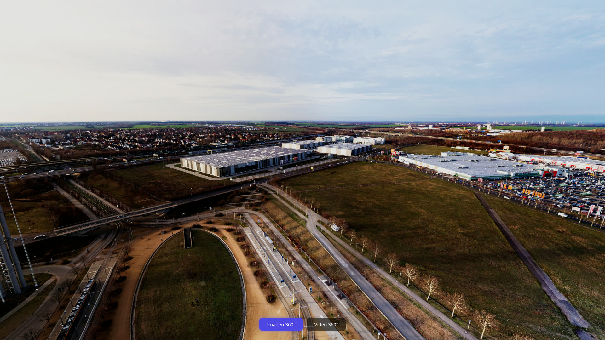
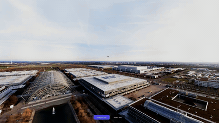
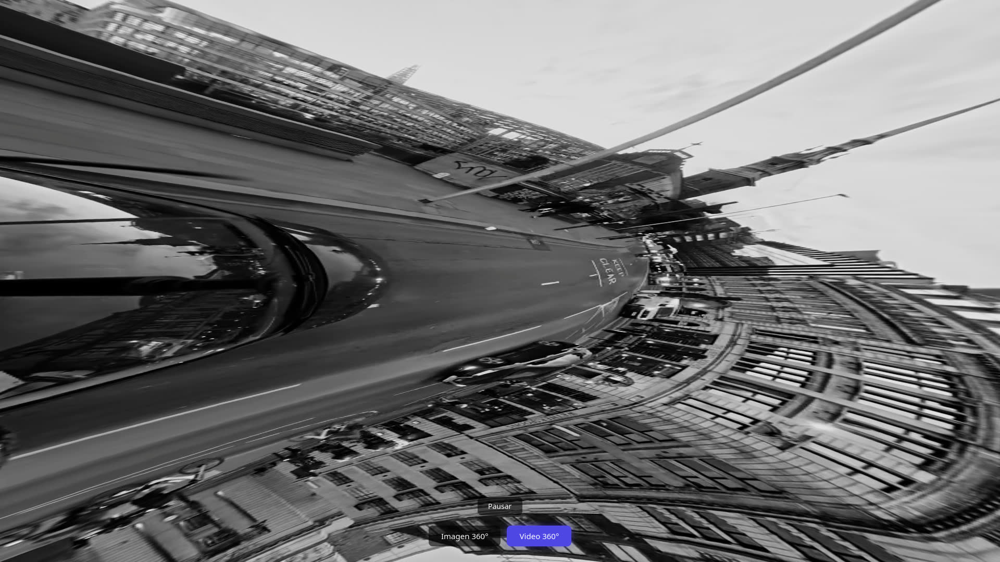
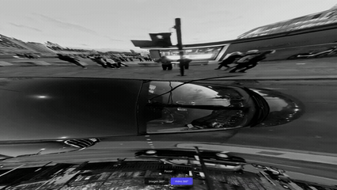

# Taller Imágenes Video 360 Unity Three.js

## Integrantes del grupo

- Juan David Buitrago Salazar
- Juan David Cárdenas Galvis
- Nicolás Rodríguez Pirabán
- Camilo Andrés Medina Sánchez
- Juan Felipe Fajardo Garzón

## Fecha de entrega

`2026-06-13`

---

## Descripción breve

Visualizador de contenido 360° en el navegador usando Three.js con React Three Fiber. El sistema alterna entre dos modos: imagen panorámica equirectangular y video 360°, ambos proyectados en el interior de una esfera 3D con normales invertidas (`scale={[-1, 1, 1]}` + `side={THREE.BackSide}`), con navegación por arrastre del mouse vía OrbitControls.

La esfera invertida es el estándar más eficiente para proyección 360° en gráficos 3D en tiempo real. React Three Fiber integra el estado de UI y el ciclo de vida de recursos 3D en un mismo paradigma, eliminando la gestión manual de escenas Three.js. La imagen se carga con `useTexture` de Drei, y el video con `THREE.VideoTexture` sobre un elemento `<video>` oculto con `muted` + `playsInline` para cumplir la política de autoplay del navegador. `VideoTexture` delega la sincronización frame a frame al pipeline de Three.js sin intervención manual.

---

## Implementaciones

### Three.js / React Three Fiber

Proyecto basado en **Vite + React 19 + React Three Fiber 9 + Drei 10**. Se implementaron dos modos intercambiables mediante botones en la interfaz:

- **Modo Imagen 360°** (`PanoramaImage.jsx`): esfera con normales invertidas que proyecta una fotografía panorámica equirectangular hacia el interior. La textura se carga con `useTexture` de `@react-three/drei`, que maneja la precarga y el caché de texturas de Three.js de forma declarativa.

- **Modo Video 360°** (`PanoramaVideo.jsx`): esfera idéntica pero con una textura dinámica alimentada por `THREE.VideoTexture` vinculada a un elemento `<video>` oculto. El video se reproduce en bucle, silenciado (requisito de autoplay en navegadores modernos). Se utiliza `useState` + `useEffect` para garantizar que la textura esté lista antes del renderizado, evitando el error de `texture null`.

- **Navegación**: `OrbitControls` de `@react-three/drei` configurado exclusivamente para rotación (`enableZoom={false}`, `enablePan={false}`), con sensibilidad reducida (`rotateSpeed={0.5}`). La cámara se posiciona en `[0, 0, 0.1]` (ligeramente fuera del origen para evitar clipping con el centro de la esfera en algunos motores de renderizado).

- **Interfaz de usuario**: dos capas de controles superpuestas al Canvas:
  - Botones de modo (imagen/video) en la parte inferior
  - Botón de pausa/reanudación visible solo en modo video

---

## Resultados visuales

### Three.js - Imagen 360°



*Vista estática del modo imagen 360° mostrando las afueras de Leipzig, Alemania (zona noreste, cerca del recinto ferial Leipziger Messe). En el centro inferior se observa el bucle y la parada del tranvía Leipziger Messe Schleife (Línea 16 LVB), con un tranvía azul y amarillo característico en la esquina inferior izquierda. Al centro se ven almacenes logísticos modernos y a la derecha el centro comercial Sachsenpark con su amplio estacionamiento. Al fondo izquierdo se aprecian las vías del S-Bahn y trenes de larga distancia que conectan el centro de Leipzig con el norte, junto a autopistas y la carretera B2. La imagen equirectangular de 18.000×9.000 píxeles se proyecta sin distorsión gracias al mapeo UV correcto de la esfera.*



*GIF animado que muestra la rotación de la cámara dentro del panorama, recorriendo diferentes zonas de la escena. La transición entre ángulos es fluida gracias a los 60 segmentos de la esfera (`sphereGeometry args={[10, 60, 40]}`). Puede ver el GIF en mayor calidad vía el siguiente [video](./media/threejs-imagen-360.mp4).* 

### Three.js - Video 360°



*Vista estática del modo video 360° mostrando una distorsión "planeta pequeño" (efecto ojo de pez 360°) grabada desde el techo de un vehículo en movimiento. La ubicación es la intersección de **Fleet Street** en el corazón financiero e histórico de **Londres, Reino Unido**. A la derecha se alza la aguja esbelta de **St Bride's Church** (Christopher Wren), conocida por haber inspirado el diseño tradicional del pastel de bodas de varios niveles. El edificio curvo de estilo victoriano/eduardiano que bordea la calle alberga pubs históricos como The Crosse Keys. En el pavimento se lee "KEEP CLEAR" en la tipografía oficial británica, y los vehículos circulan por la izquierda. Al fondo, el perfil de los rascacielos del distrito financiero (*The City*), incluyendo The Shard.*



*GIF animado que muestra la reproducción del video 360° con movimiento de cámara simultáneo. La sincronización frame-accurate entre video y textura la gestiona `THREE.VideoTexture` actualizando el `map` del material en cada ciclo de renderizado. Puede ver el GIF en mayor calidad vía el siguiente [video](./media/threejs-video-360.mp4).* 

---

## Código relevante

### Componente PanoramaImage

```jsx
import { useTexture } from '@react-three/drei'
import * as THREE from 'three'

export default function PanoramaImage() {
  const texture = useTexture('/panorama.jpg')

  return (
    <mesh scale={[-1, 1, 1]}>
      <sphereGeometry args={[10, 60, 40]} />
      <meshBasicMaterial map={texture} side={THREE.BackSide} />
    </mesh>
  )
}
```

**Explicación**: `useTexture` carga el JPEG y devuelve una textura Three.js lista para usar. El `scale={[-1, 1, 1]}` invierte la esfera en el eje X (normales apuntando hacia adentro). `BackSide` renderiza la cara interior de la geometría, no la exterior. La combinación de ambos produce la ilusión de estar dentro de la esfera mirando hacia afuera. `sphereGeometry` con radio 10 y 60×40 segmentos ofrece resolución suficiente para una proyección suave.

### Componente PanoramaVideo

```jsx
import { useEffect, useState } from 'react'
import * as THREE from 'three'

export default function PanoramaVideo({ videoRef }) {
  const [texture, setTexture] = useState(null)

  useEffect(() => {
    const video = document.createElement('video')
    video.src = '/video360.mp4'
    video.loop = true
    video.muted = true
    video.playsInline = true
    video.crossOrigin = 'anonymous'
    video.play()
    videoRef.current = video

    const tex = new THREE.VideoTexture(video)
    setTexture(tex)

    return () => {
      video.pause()
      video.src = ''
      video.load()
      tex.dispose()
      videoRef.current = null
    }
  }, [videoRef])

  if (!texture) return null

  return (
    <mesh scale={[-1, 1, 1]}>
      <sphereGeometry args={[10, 60, 40]} />
      <meshBasicMaterial map={texture} side={THREE.BackSide} />
    </mesh>
  )
}
```

**Explicación**: Se crea el elemento `<video>` programáticamente en un `useEffect` para que exista solo cuando el componente está montado. `muted` + `playsInline` son necesarios para que el autoplay funcione en navegadores modernos (política de autoplay restringida). `THREE.VideoTexture` envuelve el video y se actualiza automáticamente en cada frame del loop de renderizado de Three.js. El estado `texture` evita renderizar la esfera hasta que la textura esté creada (primer render devuelve `null`). El cleanup del `useEffect` pausa el video, libera la textura con `dispose()` y limpia la referencia.

### App principal con cambio de modo

```jsx
import { useState, useRef } from 'react'
import { Canvas } from '@react-three/fiber'
import { OrbitControls } from '@react-three/drei'

export default function App() {
  const [mode, setMode] = useState('image')
  const videoRef = useRef(null)
  const [videoPlaying, setVideoPlaying] = useState(true)

  const toggleVideo = () => {
    const video = videoRef.current
    if (!video) return
    video[videoPlaying ? 'pause' : 'play']()
    setVideoPlaying(!videoPlaying)
  }

  return (
    <div className="app">
      <Canvas camera={{ position: [0, 0, 0.1], fov: 75 }}>
        {mode === 'image' ? <PanoramaImage /> : <PanoramaVideo videoRef={videoRef} />}
        <OrbitControls enableZoom={false} enablePan={false} rotateSpeed={0.5} />
      </Canvas>
      <Controls mode={mode} onModeChange={setMode} />
      {mode === 'video' && (
        <div className="video-controls">
          <button onClick={toggleVideo}>
            {videoPlaying ? 'Pausar' : 'Reanudar'}
          </button>
        </div>
      )}
    </div>
  )
}
```

**Explicación**: El estado `mode` controla qué componente se renderiza dentro del Canvas. `videoRef` se pasa como `ref` a `PanoramaVideo` para que el padre pueda controlar play/pause sin violar el encapsulamiento de React. `OrbitControls` se renderiza siempre, permitiendo navegación continua incluso al cambiar de modo. La cámara se posiciona en `[0, 0, 0.1]` (casi el origen) porque dentro de la esfera radio 10, cualquier posición cercana al centro muestra la textura correctamente.

### Componente Controls

```jsx
export default function Controls({ mode, onModeChange }) {
  return (
    <div className="controls">
      <button
        className={mode === 'image' ? 'active' : ''}
        onClick={() => onModeChange('image')}
      >
        Imagen 360°
      </button>
      <button
        className={mode === 'video' ? 'active' : ''}
        onClick={() => onModeChange('video')}
      >
        Video 360°
      </button>
    </div>
  )
}
```

**Explicación**: Componente puro y estateless. Recibe el modo actual y un callback para cambiarlo. La clase `active` resalta visualmente el botón del modo seleccionado mediante CSS (fondo indigo `#4f46e5` con glow). No usa estado interno porque el estado vive en el padre (single source of truth).

---

## Prompts utilizados

```
¿Cómo funciona el mapeo UV en una esfera de Three.js y cómo se relaciona con la proyección equirectangular?

¿Por qué es necesario invertir las normales de la esfera para contenido 360°? ¿Qué hace exactamente scale[-1,1,1]?

¿Qué diferencia hay entre usar `useTexture` y `TextureLoader` en React Three Fiber?

¿Cuál es la política de autoplay de video en navegadores modernos y cómo afecta a `VideoTexture`?

¿Cómo se debe limpiar correctamente un `VideoTexture` al desmontar un componente en React?

¿Qué parámetros de `ffmpeg` son recomendables para comprimir capturas de pantalla sin perder calidad perceptible?
```

---

## Aprendizajes y dificultades

### Aprendizajes

El concepto de **esfera invertida** como técnica de proyección 360° quedó completamente claro: al escalar una esfera con `scale={[-1, 1, 1]}` se invierten sus normales, y al renderizar solo la cara interna con `side={THREE.BackSide}`, el observador queda dentro de la esfera viendo la textura proyectada hacia adentro. La relación entre el mapeo UV de la esfera y la proyección equirectangular 2:1 se entendió en profundidad: las coordenadas U (horizontal) mapean el ángulo azimuthal (0° a 360°) y V (vertical) mapean el ángulo polar (-90° a +90°), exactamente como una textura equirectangular.

Se aprendió que `THREE.VideoTexture` es una abstracción poderosa que elimina la necesidad de actualizar manualmente la textura en cada frame. Three.js internamente llama a `video.currentTime` en cada ciclo del loop de renderizado, sincronizando automáticamente el material con la reproducción del video.

En el plano de integración React, se comprendió la importancia de manejar correctamente el ciclo de vida de los recursos de Three.js dentro del ecosistema React: crear el video y la textura en `useEffect`, limpiar con `dispose()` y pausar el video en el return del efecto, y usar `useState` para evitar renderizados con texturas nulas.

### Dificultades

- La principal dificultad fue la **sincronización del elemento `<video>` con el ciclo de vida de React**. En un primer intento, se creaba el video directamente en el cuerpo del componente, lo que provocaba que en el primer render la textura fuese `null` y Three.js lanzara un error. La solución fue usar `useState` para la textura y retornar `null` en el primer render, permitiendo que el `useEffect` cree el video y la textura antes de que la esfera intente renderizarse.

- Otra dificultad fue el **autoplay restringido por navegadores modernos**. Chrome y Firefox bloquean la reproducción automática de video con audio sin interacción del usuario. Se solucionó silenciando el video (`muted`) y agregando `playsInline`, que es requerido en iOS Safari para reproducción dentro del elemento sin abrir el reproductor nativo.

- La **descarga de assets** presentó un reto menor: el video de Pexels requirió configurar headers `User-Agent` y `Referer` en la solicitud HTTP para evitar el bloqueo por parte del CDN de Pexels. La imagen panorámica de 18.000×9.000 píxeles (Wikimedia Commons, ~15 MB) podría causar tiempos de carga elevados en conexiones lentas, lo que se mitigó usando compresión JPEG con calidad 85.

### Mejoras futuras

- **Transición suave entre modos**: actualmente el cambio entre imagen y video es instantáneo. Se podría agregar un fundido a negro o un crossfade con opacidad animada.
- **Soporte para arrastrar archivos**: permitir que el usuario arrastre sus propias imágenes o videos equirectangulares al navegador para visualizarlos.
- **Modo VR con WebXR**: aprovechar la API WebXR para convertir la experiencia en realidad virtual con cascos como Meta Quest o Google Cardboard.
- **Precarga con loader progresivo**: mostrar un indicador de carga mientras se descargan los assets pesados (especialmente el video de 45 MB).
- **Soporte multi-idioma**: la interfaz actualmente está en español; se podría agregar un selector de idioma.
- **Mini-mapa de navegación**: indicar con una brújula o mini-mapa la orientación actual dentro del panorama.

---

## Contribuciones grupales

- **Juan David Buitrago**: Implementó la arquitectura principal de la aplicación (App.jsx): integración del Canvas con React Three Fiber, gestión de estado con useState para el cambio de modo, y sistema de referencia compartida (videoRef) entre padre e hijo para control de reproducción. Desarrollo el componente PanoramaVideo con VideoTexture, incluyendo la sincronización del ciclo de vida React-Three.js vía useEffect con creación del elemento video, limpieza de recursos y guard against null texture en primer render. Configuró OrbitControls con restricción de zoom/pan y ajuste de sensibilidad. Realizó la descarga y optimización de los assets (panorama.jpg 35C3 y video360.mp4 Pexels) manejando headers HTTP necesarios para Pexels CDN. Generó y comprimió todas las evidencias visuales (GIFs, MP4s, JPGs) con ffmpeg usando palette optimization, y consolidó el README completo con documentación técnica detallada.

- **Juan David Cárdenas**: Desarrolló el componente Controls.jsx con los botones de selección de modo y la lógica de clase active para resaltar visualmente el modo seleccionado. Implementó los estilos CSS (App.css) para los overlays de controles, incluyendo disposición absoluta, transiciones hover, y el efecto de glow en botón activo con box-shadow. Configuró el layout responsivo del contenedor principal.

- **Nicolás Rodríguez**: Implementó el componente PanoramaImage.jsx usando useTexture de Drei para carga declarativa de la imagen equirectangular, y configuró la esfera invertida con scale={[-1, 1, 1]} y side={THREE.BackSide}. Documentó los fundamentos teóricos de mapeo UV equirectangular aplicado a la proyección esférica.

- **Camilo Medina**: Configuró el proyecto Vite + React desde cero (package.json, vite.config.js, index.html, main.jsx), incluyendo la declaración de dependencias (@react-three/fiber, @react-three/drei, three) y los scripts de build/dev. Verificó la compilación correcta con `npm run build` y resolvió advertencias de dependencias.

- **Juan Felipe Fajardo**: Investigó y seleccionó los assets de imagen y video 360° (35C3 Panorama de Wikimedia Commons, video Pexels 36431489), verificando relación de aspecto 2:1 equirectangular y licencias de uso. Colaboró en la generación de capturas de pantalla y registro de funcionamiento para las evidencias visuales.

## Estructura del proyecto

```
semana_14_2_imagenes_video_360_unity_threejs/
├── media/                          # Evidencias visuales (capturas, GIFs, videos)
│   ├── threejs-imagen-360-estatica.jpg   330K  - Captura imagen 360°
│   ├── threejs-imagen-360.gif             4.1M  - GIF animado imagen 360°
│   ├── threejs-imagen-360.mp4             1.6M  - Video demostrativo imagen 360°
│   ├── threejs-imagen-360-rec.webm         26M  - Grabacion original (fuente)
│   ├── threejs-video-360-estatica.jpg     227K  - Captura video 360°
│   ├── threejs-video-360.gif             6.2M  - GIF animado video 360°
│   ├── threejs-video-360.mp4             1.8M  - Video demostrativo video 360°
│   └── threejs-video-360-rec.webm         20M  - Grabacion original (fuente)
├── threejs/                        # Proyecto Three.js / React Three Fiber
│   ├── public/
│   │   ├── panorama.jpg            18.000×9.000  - Imagen equirectangular 35C3
│   │   └── video360.mp4            2.160×3.840    - Video 360° Pexels
│   ├── src/
│   │   ├── components/
│   │   │   ├── Controls.jsx        Botones de cambio de modo
│   │   │   ├── PanoramaImage.jsx   Esfera invertida con imagen 360°
│   │   │   └── PanoramaVideo.jsx   Esfera invertida con video 360°
│   │   ├── App.css                 Estilos overlays UI
│   │   ├── App.jsx                 Componente raiz con Canvas y estado
│   │   └── main.jsx                Punto de entrada React
│   ├── index.html                  HTML base
│   ├── package.json                Dependencias y scripts
│   └── vite.config.js              Configuracion Vite
├── 04_plantilla_readme_entregas_talleres.md  # Plantilla original del README
├── semana_14_2_imagenes_video_360_unity_threejs.md  # Enunciado del taller
└── README.md                      # Este archivo
```

---

## Referencias

- [Three.js VideoTexture Documentation](https://threejs.org/docs/#api/en/textures/VideoTexture)
- [React Three Fiber Documentation](https://docs.pmnd.rs/react-three-fiber/)
- [Drei OrbitControls](https://github.com/pmndrs/drei#orbitcontrols)
- [Pexels - 360° Panorama Photos](https://www.pexels.com/search/360%20equirectangular%20panorama/)
- [Pexels - 360° Videos](https://www.pexels.com/search/videos/360/)
- [Wikimedia Commons - 35C3 Panorama](https://commons.wikimedia.org/wiki/File:35c3_Opening_Ceremony_Panorama.jpg)
- [MDN - Autoplay policy for HTMLMediaElement](https://developer.mozilla.org/en-US/docs/Web/Media/Autoplay_guide)
- [FFmpeg GIF encoding guide](https://ffmpeg.org/ffmpeg-filters.html#palettegen-1)
