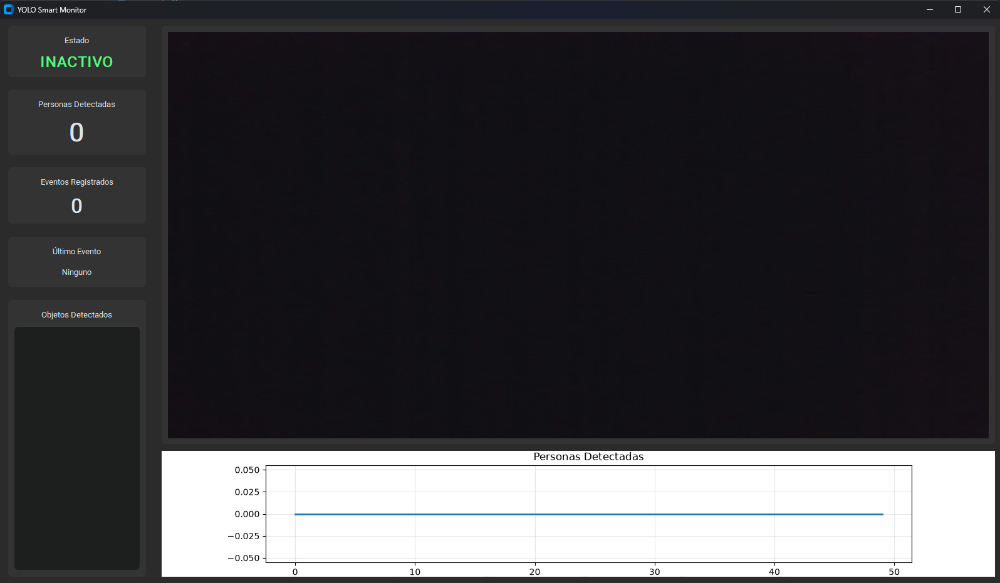
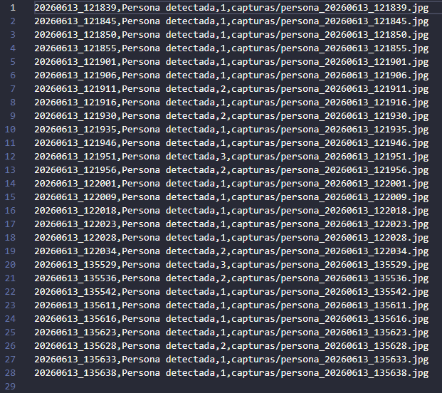

# Sistema Monitoreo Inteligente Vision Dashboard
## Nombres

- Juan David Buitrago Salazar
- Juan David Cardenas Galvis
- Nicolás Rodríguez Piraban
- Camilo Andres Medina Sanchez
- Juan Felipe Fajardo Garzón

## Fecha de Entrega

`2026-06-15`

---

## Descripción Breve

Construcción de un mini-sistema de monitoreo inteligente que integra visión por computador
(detección de personas y objetos con YOLOv8) y un panel visual en tiempo real construido con
CustomTkinter. El sistema detecta objetos desde la webcam, cuenta instancias por tipo,
muestra estadísticas dinámicas y registra automáticamente eventos (capturas + logs en CSV)
cuando se detecta una persona.

---

## Dependencias

Para ejecutar el proyecto se requieren las siguientes librerías de Python:

```
ultralytics>=8.0.0
opencv-python>=4.8.0
customtkinter>=5.2.0
Pillow>=10.0.0
matplotlib>=3.7.0
```

Instalación rápida:

```bash
pip install ultralytics opencv-python customtkinter Pillow matplotlib
```

---

## Implementaciones

### Python

Se desarrolló una aplicación de escritorio con CustomTkinter que integra un pipeline completo
de monitoreo inteligente:

- **Captura de video**: Se accede a la webcam en tiempo real mediante OpenCV.
- **Detección de objetos**: Se utiliza el modelo YOLOv8n pre-entrenado para detectar 80 clases
  del dataset COCO, con especial énfasis en la detección de personas.
- **Panel visual**: Interfaz gráfica con sidebar que muestra estado del sistema (INACTIVO/ALERTA),
  contador de personas, eventos registrados, último evento y lista de objetos detectados.
- **Gráfica en tiempo real**: Gráfico de líneas que muestra la evolución del conteo de personas
  a lo largo del tiempo.
- **Registro de eventos**: Cuando se detecta una persona, se guarda automáticamente una captura
  en la carpeta `capturas/` y se registra un evento en `logs/eventos.csv` con timestamp,
  tipo de evento, cantidad de personas y ruta de la imagen.
- **Cooldown de alertas**: Se implementa un periodo de 5 segundos entre alertas consecutivas
  para evitar la generación excesiva de logs.

---

## Resultados visuales

### Python - Implementación



Captura de la interfaz principal del sistema de monitoreo. Se observa el panel lateral izquierdo
con las estadísticas (estado, personas detectadas, eventos registrados, último evento y objetos
detectados), el feed de video en tiempo real con las bounding boxes de YOLO, y la gráfica
de tendencia de personas en la parte inferior.


GIF que muestra el sistema funcionando en tiempo real. Se puede observar cómo el modelo
YOLOv8 detecta personas y otros objetos, dibuja las cajas de delimitación sobre el feed
de video y actualiza las estadísticas del panel de forma dinámica.



Evidencia del sistema de logging automático. Cuando se detecta una persona, se genera
una captura en la carpeta `capturas/` y se registra el evento en el archivo CSV
`logs/eventos.csv` con timestamp, tipo de evento, cantidad de personas y ruta de la imagen.

---

## Código relevante

### Ejemplo de código Python - Detección y conteo de objetos

```python
results = self.model.predict(frame, imgsz=640, verbose=False)
rendered = results[0].plot()
boxes = results[0].boxes
class_ids = boxes.cls.cpu().numpy().astype(int) if len(boxes) > 0 else []

names = self.model.names
detected = [names[i] for i in class_ids]
counter = Counter(detected)
people_count = counter.get("person", 0)
```

Este fragmento ejecuta la inferencia con YOLOv8 sobre cada frame, extrae las clases detectadas
y usa `Counter` para contar instancias por tipo de objeto.

### Ejemplo de código Python - Registro automático de eventos

```python
def save_event(self, frame, people_count):
    timestamp = datetime.now().strftime("%Y%m%d_%H%M%S")
    image_path = f"capturas/persona_{timestamp}.jpg"
    cv2.imwrite(image_path, frame)

    with open(CSV_FILE, "a", newline="", encoding="utf-8") as f:
        writer = csv.writer(f)
        writer.writerow([timestamp, "Persona detectada", people_count, image_path])
```

Este fragmento guarda la captura del frame actual como imagen JPEG y registra el evento
en el archivo CSV con toda la información relevante.

---

## Prompts utilizados

```
Crea un script en Python usando ultralytics (YOLOv8), opencv, customtkinter y matplotlib
que acceda a la webcam, detecte personas y objetos en tiempo real, muestre un panel visual
con estadísticas (estado, conteo de personas, eventos, objetos detectados), una gráfica
de tendencia en tiempo real, y que guarde automáticamente capturas y logs en CSV cuando
se detecte una persona.
```

---

## Aprendizajes y dificultades

En este taller se logró integrar modelos de detección de objetos pre-entrenados (YOLOv8)
con una interfaz gráfica de escritorio en tiempo real. Se manejó el pipeline completo
de captura, inferencia, visualización y persistencia de datos.

Una parte difícil fue el manejo del hilo de ejecución para mantener la interfaz fluida
mientras se procesaban los frames de la webcam. También resultó retador el diseño del layout
de la interfaz con CustomTkinter para que se adaptara correctamente al redimensionar la ventana.

En general se obtuvieron buenos resultados. El sistema cumple con todos los objetivos:
detecta objetos en tiempo real, muestra un panel visual completo y registra eventos
automáticamente con capturas y logs.
